# Архитектура Auth-Portal

Этот документ описывает архитектуру системы auth-portal, включая компоненты, потоки данных и взаимодействие между модулями.

## Содержание

- [Обзор архитектуры](#обзор-архитектуры)
- [Компоненты системы](#компоненты-системы)
- [Потоки аутентификации](#потоки-аутентификации)
- [Интеграция с nginx](#интеграция-с-nginx)
- [Session Management](#session-management)
- [Конфигурация](#конфигурация)

---

## Обзор архитектуры

Auth-portal представляет собой OIDC-совместимый портал аутентификации, который работает в связке с nginx для защиты backend-сервисов.

### Общая архитектура компонентов

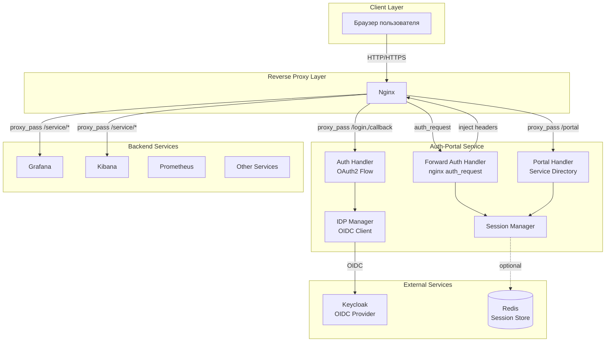

### Режимы работы

Auth-portal поддерживает два режима работы:

**Portal Mode (mode: portal)**
- После аутентификации показывается портал с доступными сервисами
- Пользователь выбирает сервис из списка
- Каждый сервис может иметь свои права доступа

**Single-Service Mode (mode: single-service)**
- После аутентификации происходит редирект на целевой сервис
- Упрощенный вариант для случая одного backend-сервиса

---

## Компоненты системы

### 1. Auth Handler

Отвечает за OAuth2/OIDC аутентификацию:

- **Инициация OAuth2 flow** — генерация authorization URL с state/nonce
- **Обработка callback** — обмен code на токены
- **Social login** — поддержка kc_idp_hint для social провайдеров
- **Logout** — завершение сессии и редирект на logout endpoint Keycloak
- **Dev mode** — mock-аутентификация с профилями пользователей

### 2. Portal Handler

Управляет сервисным порталом:

- **Service directory** — отображение списка доступных сервисов
- **Service redirect** — переход на выбранный сервис
- **User context** — передача информации о пользователе в UI

### 3. Forward Auth Handler

Реализует nginx auth_request интеграцию:

- **Валидация сессии** — проверка активной сессии пользователя
- **Token refresh** — автоматическое обновление токенов при необходимости
- **User headers** — установка заголовков с user context для backend
- **Introspection** — проверка валидности токена через Keycloak

Передаваемые заголовки:
```
X-Auth-Request-User: user-id
X-Auth-Request-Email: user@example.com
X-Auth-Request-Roles: ["admin", "user"]
X-Auth-Request-Groups: ["developers"]
X-Auth-Request-Access-Token: eyJhbGc...
```

### 4. Session Manager

Управляет пользовательскими сессиями:

**Поддерживаемые storage backends:**

- **Cookie Store** (stateless)
  - Зашифрованные AES-256 cookie
  - Максимальный размер ~4KB
  - Не требует внешних зависимостей

- **JWT Store** (stateless)
  - Подписанные JWT токены в cookie
  - Поддержка HS256/RS256
  - Больший размер токена, чем cookie

- **Redis Store** (stateful)
  - Централизованное хранение
  - Поддержка Redis Cluster/Sentinel
  - Масштабируемость и распределенность

### 5. IDP Manager

Интеграция с OIDC провайдерами:

- **Discovery** — автоматическое получение OIDC endpoints
- **Token exchange** — обмен authorization code на токены
- **Token refresh** — обновление access token через refresh token
- **UserInfo** — получение информации о пользователе
- **Token verification** — валидация JWT подписи и claims

### 6. Nginx Generator

Генерация конфигурации nginx:

- **Template-based** — использует Go templates
- **Service locations** — автоматическое создание location блоков
- **Auth_request integration** — настройка forward auth
- **Headers injection** — передача user context в backend
- **URL rewriting** — поддержка path rewriting

---

## Потоки аутентификации

### OAuth2/OIDC Authentication Flow

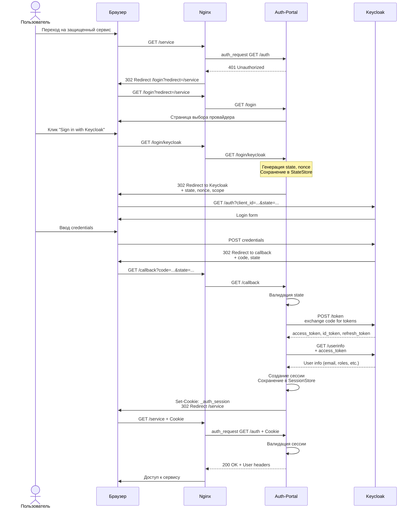

### Social Login Flow

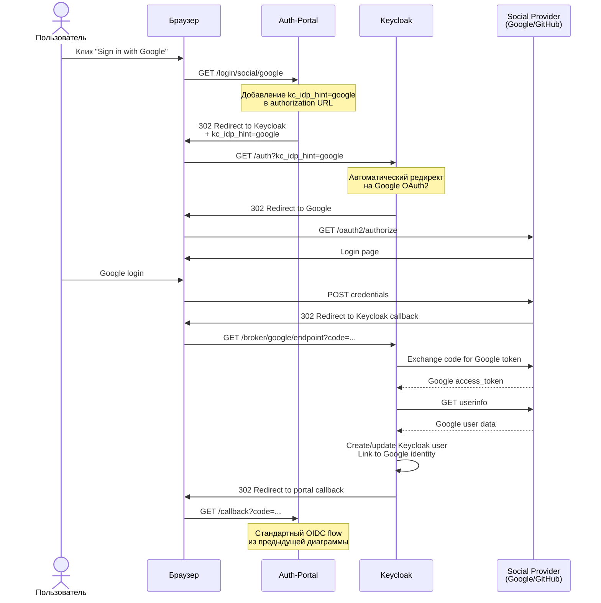

### Forward Auth Flow (nginx auth_request)

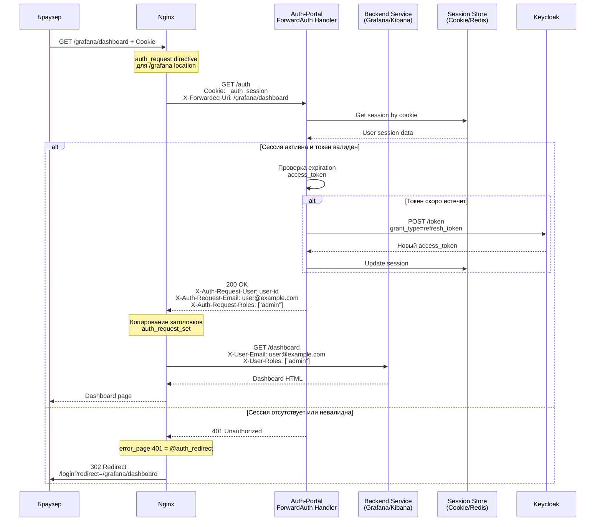

### Token Refresh Flow

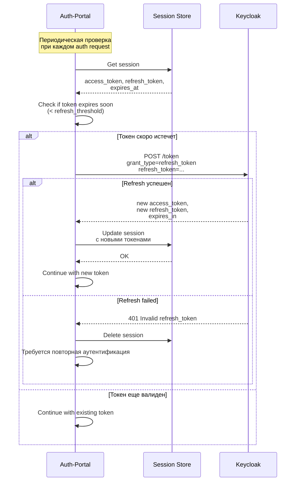

---

## Интеграция с nginx

### Архитектура nginx интеграции

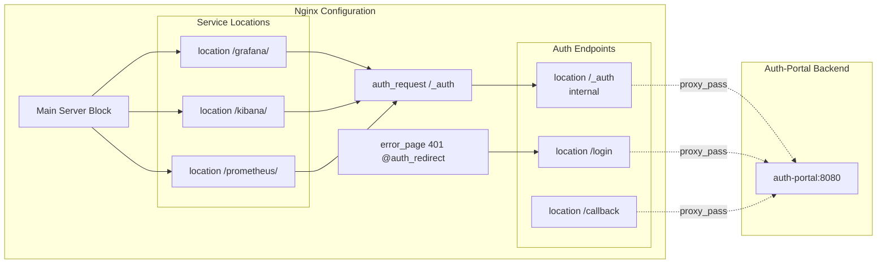

### Генерация nginx.conf

Auth-portal автоматически генерирует конфигурацию nginx на основе `config.yaml`:

**Процесс генерации:**

1. **Загрузка конфигурации** — чтение `config.yaml`
2. **Template processing** — обработка `nginx.conf.tmpl`
3. **Service locations** — генерация блоков для каждого сервиса
4. **Auth_request setup** — настройка forward auth
5. **Headers mapping** — конфигурация передачи заголовков
6. **Validation** — проверка синтаксиса (если nginx установлен)

**Пример генерации location для сервиса:**

Из конфигурации:
```yaml
services:
  - name: grafana
    display_name: "Grafana"
    location: /grafana/
    upstream: http://grafana:3000
    auth_required: true
    rewrite: "^/grafana/(.*) /$1 break"
    headers:
      add:
        X-User-Email: "{{.User.Email}}"
        X-User-Roles: "{{.User.Roles | join \",\"}}"
      remove:
        - Authorization
```

Генерируется nginx location:
```nginx
# Service: grafana
location /grafana/ {
    # Authentication required
    auth_request /_auth;
    auth_request_set $auth_user $upstream_http_x_auth_request_user;
    auth_request_set $auth_email $upstream_http_x_auth_request_email;
    auth_request_set $auth_roles $upstream_http_x_auth_request_roles;

    error_page 401 = @auth_redirect;

    # URL rewrite
    rewrite ^/grafana/(.*) /$1 break;

    proxy_pass http://grafana_backend;
    proxy_set_header X-User-Email $auth_email;
    proxy_set_header X-User-Roles $auth_roles;
    # Remove Authorization header
    proxy_set_header Authorization "";
}
```

### User Context Headers

Auth-portal устанавливает следующие заголовки через `auth_request_set`:

| Заголовок | Описание | Пример |
|-----------|----------|--------|
| `X-Auth-Request-User` | User ID из OIDC | `123e4567-e89b-12d3-a456-426614174000` |
| `X-Auth-Request-Email` | Email пользователя | `user@example.com` |
| `X-Auth-Request-Roles` | Список ролей (JSON array) | `["admin","user"]` |
| `X-Auth-Request-Groups` | Список групп (JSON array) | `["developers","ops"]` |
| `X-Auth-Request-Tenant` | Tenant ID (если есть) | `acme-corp` |
| `X-Auth-Request-Access-Token` | JWT access token | `eyJhbGciOiJSUzI1NiIs...` |

Backend-сервисы могут использовать эти заголовки для:
- Идентификации пользователя
- Авторизации на уровне приложения
- Аудита действий пользователя
- Интеграции с внутренними системами

---

## Session Management

### Архитектура Session Store

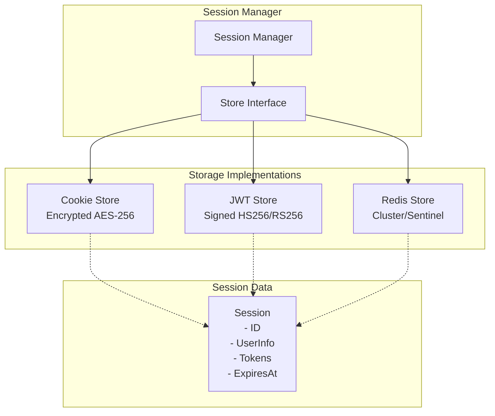

### Cookie Store (stateless)

**Особенности:**
- Все данные хранятся в зашифрованном cookie
- AES-256-GCM encryption
- Ограничение размера ~4KB (browser limit)
- Не требует внешних зависимостей

**Структура cookie:**
```
_auth_session = encrypt(
  session_id,
  user_id,
  email,
  access_token,
  refresh_token,
  expires_at
)
```

**Конфигурация:**
```yaml
session:
  store: cookie
  encryption:
    enabled: true
    key: ${ENCRYPTION_KEY}  # 32 bytes
  cookie:
    max_size: 4096
```

### JWT Store (stateless)

**Особенности:**
- Подписанный JWT токен в cookie
- Поддержка HS256 (symmetric) и RS256 (asymmetric)
- Больший размер, чем cookie store
- Токен можно валидировать без обращения к auth-portal

**JWT Claims:**
```json
{
  "sub": "user-id",
  "email": "user@example.com",
  "roles": ["admin", "user"],
  "groups": ["developers"],
  "access_token": "...",
  "refresh_token": "...",
  "exp": 1234567890,
  "iat": 1234567890
}
```

**Конфигурация:**
```yaml
session:
  store: jwt
  jwt:
    algorithm: HS256
    signing_key: ${JWT_SIGNING_KEY}
    # Или для RS256:
    # algorithm: RS256
    # private_key: /certs/jwt-private.pem
    # public_key: /certs/jwt-public.pem
```

### Redis Store (stateful)

**Особенности:**
- Централизованное хранение
- Поддержка Redis Cluster для масштабирования
- Поддержка Redis Sentinel для HA
- Только session ID хранится в cookie
- TLS support для production

**Архитектура с Redis:**
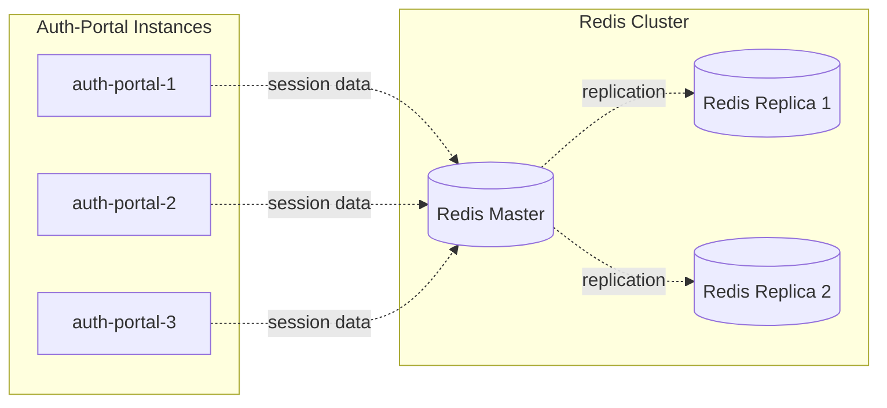

**Структура данных в Redis:**
```
Key: authportal:session:{session-id}
Value: {
  "user_id": "...",
  "email": "...",
  "access_token": "...",
  "refresh_token": "...",
  "expires_at": "2024-01-01T00:00:00Z"
}
TTL: 24h (configurable)
```

**Конфигурация:**
```yaml
session:
  store: redis
  redis:
    enabled: true
    addresses:
      - redis-1:6379
      - redis-2:6379
      - redis-3:6379
    password: ${REDIS_PASSWORD}
    db: 0
    master_name: mymaster  # для Sentinel
    pool_size: 10
    key_prefix: "authportal:session:"
    tls:
      enabled: true
      cert: /certs/redis-client.crt
      key: /certs/redis-client.key
      ca: /certs/redis-ca.crt
```

---

## Конфигурация

### Структура конфигурации

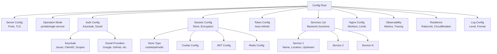

### Приоритет конфигурации

Параметры загружаются в следующем порядке (последний перезаписывает предыдущий):

1. **Defaults** — встроенные значения по умолчанию
2. **Config file** — `config.yaml`
3. **Environment variables** — `${VAR_NAME}` или `${VAR_NAME:-default}`
4. **CLI flags** — `--dev`, `--config`, etc.

### Environment Variables

Все секретные параметры должны передаваться через переменные окружения:

```bash
# Обязательные
KC_CLIENT_SECRET=your-keycloak-secret
ENCRYPTION_KEY=your-32-byte-encryption-key!!

# Опциональные
KC_ISSUER_URL=https://keycloak.example.com/realms/main
KC_CLIENT_ID=auth-portal
KC_REDIRECT_URL=http://localhost:8080/callback
JWT_SIGNING_KEY=your-jwt-key
REDIS_PASSWORD=redis-password
LOG_LEVEL=info
```

### Валидация конфигурации

Auth-portal выполняет валидацию при старте:

**Проверки:**
- Обязательные поля заполнены
- URL корректные (scheme, host)
- Encryption key имеет правильную длину (32 bytes)
- Session store правильно сконфигурирован
- Service upstreams валидные URLs
- Nginx параметры в допустимых диапазонах

**JSON Schema:**
```bash
# Генерация schema для валидации
auth-portal --schema --schema-output config-schema.json

# Использование для валидации в CI/CD
jsonschema -i config.yaml config-schema.json
```

---

## Observability

### Компоненты observability

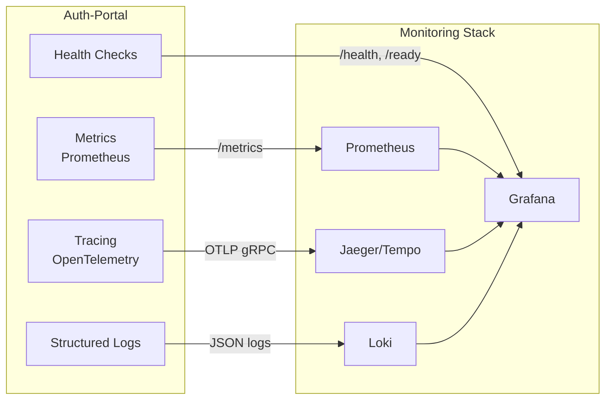

### Метрики

**Доступные метрики:**

```
# HTTP запросы
auth_portal_requests_total{method, path, status}
auth_portal_request_duration_seconds{method, path}

# Сессии
auth_portal_sessions_active
auth_portal_sessions_created_total
auth_portal_sessions_expired_total

# Аутентификация
auth_portal_auth_attempts_total{provider, result}
auth_portal_auth_failures_total{reason}
auth_portal_token_refresh_total{result}

# Circuit Breaker
auth_portal_circuit_breaker_state{service, state}
auth_portal_circuit_breaker_failures_total{service}

# Rate Limiter
auth_portal_rate_limit_exceeded_total{endpoint}
```

### Distributed Tracing

Auth-portal поддерживает OpenTelemetry tracing:

**Trace spans:**
- HTTP request processing
- OAuth2 authorization flow
- Token exchange/refresh
- Session operations
- Upstream service calls

**Конфигурация:**
```yaml
observability:
  tracing:
    enabled: true
    endpoint: jaeger:4317
    protocol: grpc
    insecure: true
    sampling_ratio: 0.1  # 10% sampling
```

---

## Resilience Patterns

### Rate Limiting

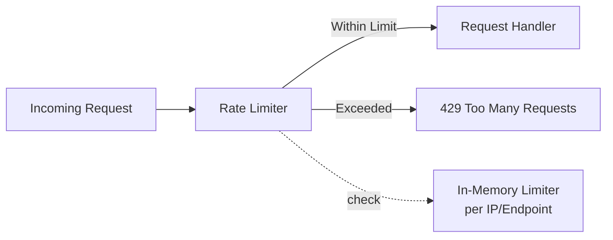

**Возможности:**
- Per-IP rate limiting
- Per-endpoint rate limiting
- Configurable burst
- Custom exclude paths
- Rate limit headers в ответе

### Circuit Breaker

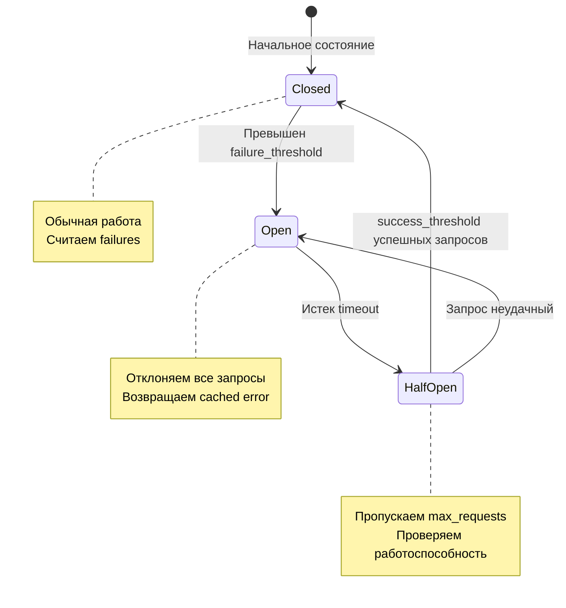

**Конфигурация per-service:**
```yaml
resilience:
  circuit_breaker:
    enabled: true
    services:
      keycloak:
        failure_threshold: 3      # Откроем после 3 ошибок
        timeout: 10s              # Перейдем в half-open через 10s
        max_requests: 3           # 3 запроса в half-open
        success_threshold: 2      # Закроем после 2 успехов
```

---

## Безопасность

### Security Headers

Nginx автоматически добавляет security headers:

```nginx
X-Frame-Options: SAMEORIGIN
X-Content-Type-Options: nosniff
X-XSS-Protection: 1; mode=block
```

### Cookie Security

```yaml
session:
  secure: true           # HTTPS only (production)
  same_site: lax         # CSRF protection
  encryption:
    enabled: true        # AES-256-GCM encryption
```

### TLS Configuration

```yaml
server:
  tls:
    enabled: true
    cert: /certs/server.crt
    key: /certs/server.key
    # Или Let's Encrypt
    auto_cert:
      enabled: true
      email: admin@example.com
      domains:
        - auth.example.com
```

---

## Deployment Patterns

### Standalone Deployment

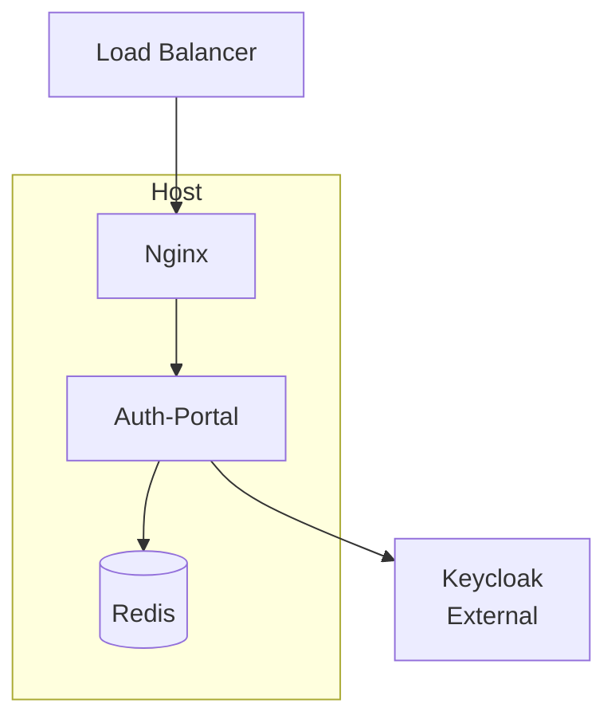

### Distributed Deployment

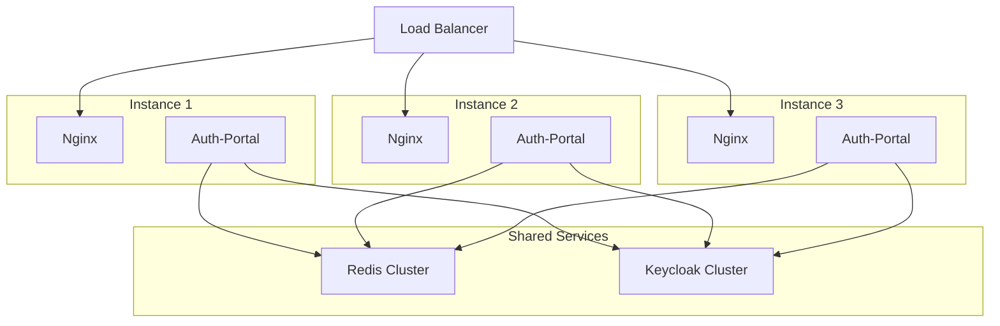

### Kubernetes Deployment

```yaml
apiVersion: apps/v1
kind: Deployment
metadata:
  name: auth-portal
spec:
  replicas: 3
  template:
    spec:
      containers:
      - name: auth-portal
        image: auth-portal:latest
        ports:
        - containerPort: 8080
        livenessProbe:
          httpGet:
            path: /health
            port: 8080
        readinessProbe:
          httpGet:
            path: /ready
            port: 8080
```

---

## Заключение

Auth-portal предоставляет гибкую и масштабируемую архитектуру для централизованной аутентификации и авторизации с интеграцией nginx. Модульная структура позволяет адаптировать систему под различные сценарии использования от простого single-service до сложных multi-tenant порталов.

Для детальной настройки и эксплуатации см. [Руководство администратора](admin-guide.md).
