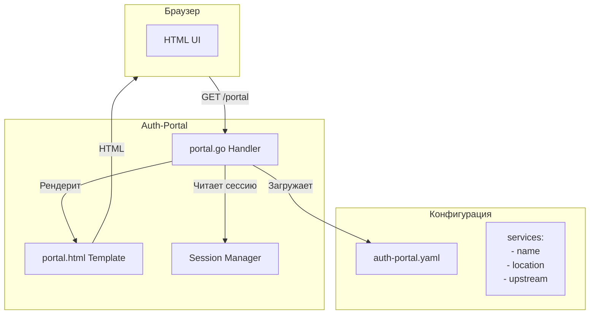
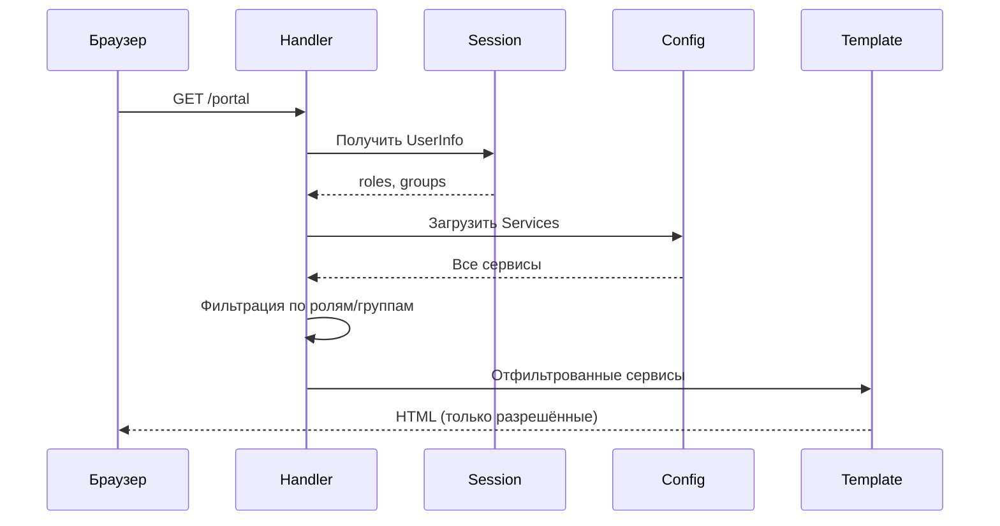
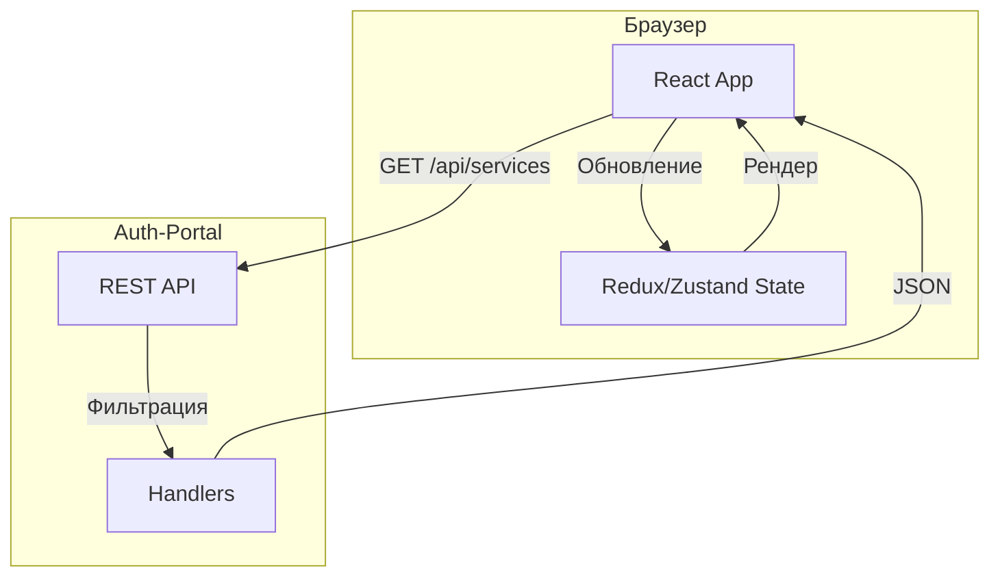
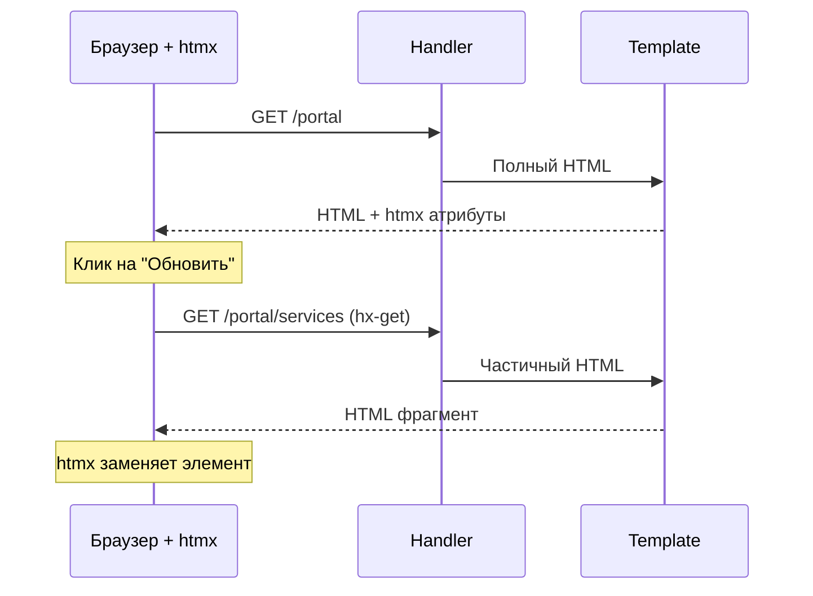
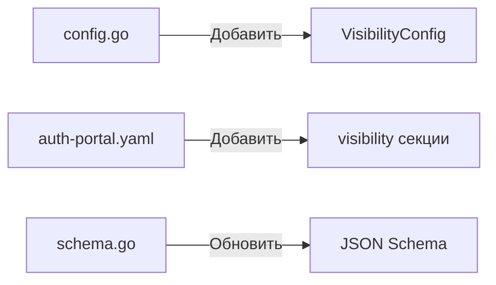
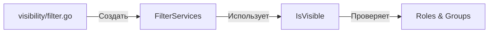

# Исследование: RBAC-управление видимостью элементов портала

**Дата:** 2025-12-22
**Ветка:** feature/portal-rbac-visibility
**Статус:** Исследование завершено

## Содержание

1. [Постановка задачи](#постановка-задачи)
2. [Анализ текущей реализации](#анализ-текущей-реализации)
3. [Варианты решения](#варианты-решения)
   - [Вариант A: Server-side Go templates](#вариант-a-server-side-go-templates)
   - [Вариант B: React SPA](#вариант-b-react-spa)
   - [Вариант C: htmx + Go templates](#вариант-c-htmx--go-templates)
   - [Вариант D: Web Components](#вариант-d-web-components)
4. [Сравнительная таблица](#сравнительная-таблица)
5. [Рекомендация](#рекомендация)
6. [План реализации](#план-реализации)

---

## Постановка задачи

Реализовать возможность показа/скрытия элементов портала (сервисов, ссылок, разделов) в зависимости от:
- **Ролей пользователя** (roles из JWT токена)
- **Групп пользователя** (groups из JWT токена)
- **Произвольных условий** (claims, атрибуты)

### Требования

1. Администратор должен иметь возможность настраивать видимость через конфигурацию
2. Пользователь видит только те элементы, к которым у него есть доступ
3. Решение должно быть безопасным (скрытие на сервере, а не только на клиенте)
4. Минимальные изменения в существующей архитектуре

---

## Анализ текущей реализации

### Текущая архитектура портала



### Текущая структура ServiceConfig

```go
// internal/config/config.go
type ServiceConfig struct {
    Name         string            `yaml:"name"`
    DisplayName  string            `yaml:"display_name"`
    Location     string            `yaml:"location"`
    Upstream     string            `yaml:"upstream"`
    AuthRequired bool              `yaml:"auth_required"`
    Headers      map[string]string `yaml:"headers"`
    Rewrite      string            `yaml:"rewrite"`
}
```

### Текущий шаблон портала

```html
<!-- internal/ui/templates/portal.html -->
{{range .Services}}
<a href="{{.Location}}" class="service-card">
    <h3>{{.DisplayName}}</h3>
</a>
{{end}}
```

### Данные пользователя в сессии

```go
// internal/model/user.go
type UserInfo struct {
    Subject  string   `json:"sub"`
    Email    string   `json:"email"`
    Name     string   `json:"name"`
    Roles    []string `json:"roles"`
    Groups   []string `json:"groups"`
}
```

---

## Варианты решения

### Вариант A: Server-side Go templates

**Описание:** Расширить конфигурацию сервисов полями для RBAC и фильтровать список на сервере.



#### Изменения в конфигурации

```yaml
services:
  - name: admin-dashboard
    display_name: "Панель администратора"
    location: /admin/
    upstream: http://admin-service:8080
    auth_required: true
    visibility:
      roles:
        - admin
        - super-admin
      groups:
        - /administrators
      mode: any  # any | all

  - name: user-profile
    display_name: "Профиль пользователя"
    location: /profile/
    upstream: http://user-service:8080
    auth_required: true
    visibility:
      roles:
        - user
        - admin
      mode: any

  - name: public-docs
    display_name: "Документация"
    location: /docs/
    upstream: http://docs-service:8080
    auth_required: false
    # visibility не указано = виден всем
```

#### Изменения в коде

```go
// internal/config/config.go
type VisibilityConfig struct {
    Roles  []string `yaml:"roles"`
    Groups []string `yaml:"groups"`
    Mode   string   `yaml:"mode"` // "any" (OR) или "all" (AND)
}

type ServiceConfig struct {
    // ... существующие поля
    Visibility *VisibilityConfig `yaml:"visibility,omitempty"`
}

// internal/service/visibility/filter.go
func FilterServices(services []config.ServiceConfig, user *model.UserInfo) []config.ServiceConfig {
    var visible []config.ServiceConfig
    for _, svc := range services {
        if IsVisible(svc, user) {
            visible = append(visible, svc)
        }
    }
    return visible
}

func IsVisible(svc config.ServiceConfig, user *model.UserInfo) bool {
    if svc.Visibility == nil {
        return true // нет ограничений
    }

    v := svc.Visibility
    if v.Mode == "all" {
        return hasAllRoles(user.Roles, v.Roles) &&
               hasAllGroups(user.Groups, v.Groups)
    }
    // mode: any (по умолчанию)
    return hasAnyRole(user.Roles, v.Roles) ||
           hasAnyGroup(user.Groups, v.Groups)
}
```

#### Плюсы
- Минимальные изменения в архитектуре
- Безопасность: фильтрация на сервере
- Простая конфигурация через YAML
- Нет JavaScript зависимостей
- Кэширование на уровне сессии

#### Минусы
- Требуется перезагрузка страницы для обновления
- Нет динамического UI

---

### Вариант B: React SPA

**Описание:** Полная переработка фронтенда на React с API-driven подходом.



#### Структура проекта

```
auth-portal/
├── cmd/auth-portal/
├── internal/
│   ├── api/
│   │   ├── services.go      # GET /api/services
│   │   └── user.go          # GET /api/user
│   └── ...
└── web/
    ├── src/
    │   ├── components/
    │   │   ├── Portal.tsx
    │   │   ├── ServiceCard.tsx
    │   │   └── ServiceGrid.tsx
    │   ├── hooks/
    │   │   └── useServices.ts
    │   ├── stores/
    │   │   └── authStore.ts
    │   └── App.tsx
    ├── package.json
    └── vite.config.ts
```

#### API Endpoints

```go
// GET /api/services
type ServiceResponse struct {
    Services []ServiceDTO `json:"services"`
}

type ServiceDTO struct {
    Name        string `json:"name"`
    DisplayName string `json:"displayName"`
    Location    string `json:"location"`
    Icon        string `json:"icon,omitempty"`
}
```

#### React компоненты

```tsx
// web/src/components/Portal.tsx
import { useServices } from '../hooks/useServices';

export const Portal: React.FC = () => {
  const { services, isLoading, error } = useServices();

  if (isLoading) return <Spinner />;
  if (error) return <ErrorMessage error={error} />;

  return (
    <div className="portal">
      <h1>Доступные сервисы</h1>
      <ServiceGrid services={services} />
    </div>
  );
};

// web/src/hooks/useServices.ts
export const useServices = () => {
  const [services, setServices] = useState<Service[]>([]);
  const [isLoading, setIsLoading] = useState(true);

  useEffect(() => {
    fetch('/api/services')
      .then(res => res.json())
      .then(data => {
        setServices(data.services);
        setIsLoading(false);
      });
  }, []);

  return { services, isLoading };
};
```

#### Плюсы
- Современный UI/UX
- Динамические обновления без перезагрузки
- Богатые возможности для будущего развития
- Компонентная архитектура

#### Минусы
- Значительные изменения в архитектуре
- Дополнительные зависимости (Node.js, npm)
- Увеличение сложности сборки
- Больше кода для поддержки
- Время на переработку

---

### Вариант C: htmx + Go templates

**Описание:** Гибридный подход — серверные шаблоны с динамическими обновлениями через htmx.



#### Шаблон с htmx

```html
<!-- internal/ui/templates/portal.html -->
<!DOCTYPE html>
<html>
<head>
    <script src="https://unpkg.com/htmx.org@1.9.10"></script>
</head>
<body>
    <div id="services"
         hx-get="/portal/services"
         hx-trigger="load, every 30s"
         hx-swap="innerHTML">
        {{template "service-list" .}}
    </div>
</body>
</html>

<!-- internal/ui/templates/partials/service-list.html -->
{{define "service-list"}}
{{range .Services}}
<a href="{{.Location}}" class="service-card">
    <h3>{{.DisplayName}}</h3>
</a>
{{end}}
{{end}}
```

#### Плюсы
- Минимальный JavaScript (только htmx)
- Сохранение серверного рендеринга
- Динамические обновления
- Простая интеграция

#### Минусы
- Дополнительная зависимость (htmx)
- Частичные обновления сложнее отлаживать
- Ограниченные возможности по сравнению с React

---

### Вариант D: Web Components

**Описание:** Использование нативных Web Components для инкапсуляции UI.

```mermaid
flowchart LR
    subgraph Browser["Браузер"]
        Portal[portal-app]
        ServiceCard[service-card]
        UserMenu[user-menu]
    end

    subgraph API["API"]
        Services[/api/services]
        User[/api/user]
    end

    Portal -->|fetch| Services
    Portal -->|создаёт| ServiceCard
    Portal -->|fetch| User
    Portal -->|создаёт| UserMenu
```

#### Web Component

```javascript
// static/js/components/service-card.js
class ServiceCard extends HTMLElement {
  constructor() {
    super();
    this.attachShadow({ mode: 'open' });
  }

  connectedCallback() {
    const name = this.getAttribute('name');
    const location = this.getAttribute('location');

    this.shadowRoot.innerHTML = `
      <style>
        .card { /* стили */ }
      </style>
      <a href="${location}" class="card">
        <h3>${name}</h3>
      </a>
    `;
  }
}

customElements.define('service-card', ServiceCard);
```

#### Плюсы
- Нативный браузерный API
- Инкапсуляция стилей
- Переиспользуемые компоненты
- Нет внешних зависимостей

#### Минусы
- Сложнее в разработке
- Ограниченная экосистема
- Меньше ready-to-use решений
- Требует глубокого понимания API

---

## Сравнительная таблица

| Критерий | A: Go templates | B: React | C: htmx | D: Web Components |
|----------|----------------|----------|---------|-------------------|
| **Сложность реализации** | Низкая | Высокая | Средняя | Средняя |
| **Изменения в архитектуре** | Минимальные | Значительные | Небольшие | Небольшие |
| **Зависимости** | Нет | Node.js, npm | htmx (~14KB) | Нет |
| **Безопасность** | Высокая | Высокая | Высокая | Средняя* |
| **Динамичность UI** | Нет | Полная | Частичная | Полная |
| **Время разработки** | 2-3 дня | 2-3 недели | 1 неделя | 1-2 недели |
| **Поддержка** | Простая | Сложная | Средняя | Средняя |
| **Масштабируемость** | Хорошая | Отличная | Хорошая | Хорошая |
| **SEO** | Отлично | Требует SSR | Отлично | Хорошо |

*\* Web Components требуют дополнительных мер для предотвращения манипуляций на клиенте*

---

## Рекомендация

### Рекомендуемый вариант: A (Server-side Go templates)

**Обоснование:**

1. **Минимальные изменения** — расширение существующей конфигурации и добавление функции фильтрации
2. **Безопасность** — вся логика на сервере, клиент получает только разрешённые данные
3. **Простота** — нет дополнительных зависимостей и сложности сборки
4. **Соответствие архитектуре** — auth-portal уже использует Go templates

### Альтернативный вариант: C (htmx)

Если в будущем потребуется больше динамики (real-time обновления, интерактивные элементы), можно эволюционировать к варианту C, добавив htmx поверх существующих шаблонов.

---

## План реализации

### Этап 1: Расширение конфигурации (1 день)



**Задачи:**
1. Добавить `VisibilityConfig` struct в `internal/config/config.go`
2. Обновить `ServiceConfig` с полем `Visibility`
3. Добавить валидацию (mode: "any" | "all")
4. Обновить JSON Schema

### Этап 2: Логика фильтрации (1 день)



**Задачи:**
1. Создать пакет `internal/service/visibility`
2. Реализовать `FilterServices()` и `IsVisible()`
3. Написать unit-тесты

### Этап 3: Интеграция в Handler (0.5 дня)

**Задачи:**
1. Обновить `portal.go` Handler
2. Вызывать `FilterServices()` перед рендерингом
3. Добавить логирование скрытых сервисов

### Этап 4: Тестирование (0.5 дня)

**Задачи:**
1. Добавить тестовые роли/группы в Keycloak
2. Протестировать с разными пользователями
3. Проверить edge cases (пустые роли, несуществующие группы)

### Пример конечного результата

```yaml
# auth-portal.yaml
services:
  # Виден всем
  - name: public-docs
    display_name: "Документация"
    location: /docs/
    upstream: http://docs:8080

  # Виден только пользователям с ролью user или admin
  - name: user-service
    display_name: "Мой профиль"
    location: /profile/
    upstream: http://user-service:8080
    auth_required: true
    visibility:
      roles: [user, admin]
      mode: any

  # Виден только администраторам
  - name: admin-panel
    display_name: "Администрирование"
    location: /admin/
    upstream: http://admin-service:8080
    auth_required: true
    visibility:
      roles: [admin]
      groups: [/administrators]
      mode: any

  # Виден только если есть ОБЕ роли
  - name: super-admin
    display_name: "Супер-админ"
    location: /super/
    upstream: http://super-admin:8080
    auth_required: true
    visibility:
      roles: [admin, super-user]
      mode: all
```

---

## Заключение

Рекомендуется начать с **Варианта A (Server-side Go templates)** как наиболее простого и безопасного решения. При необходимости усложнения UI в будущем можно эволюционировать к **Варианту C (htmx)** без значительной переработки.

React (Вариант B) рекомендуется рассматривать только если планируется значительное расширение функциональности портала с богатым интерактивным UI.
