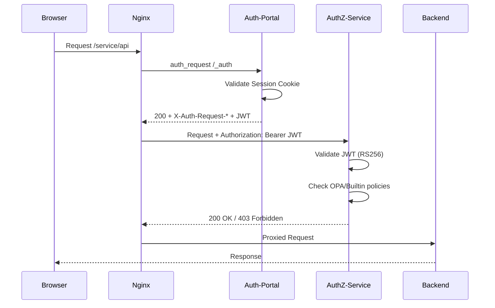
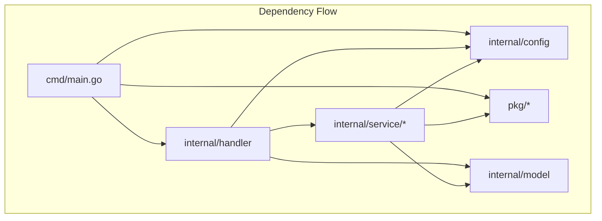

# Security Audit Report: Auth-Portal

**Дата:** 2025-12-22
**Версия:** 1.1
**Аудитор:** Claude Code Security Analysis
**Статус:** Production Readiness Assessment (Security + Code Quality)

---

## Содержание

1. [Executive Summary](#executive-summary)
2. [Методология](#методология)
3. [Критические уязвимости](#критические-уязвимости)
4. [Высокий риск](#высокий-риск)
5. [Средний риск](#средний-риск)
6. [Низкий риск](#низкий-риск)
7. [Положительные аспекты](#положительные-аспекты)
8. [Аутентификация Portal ↔ Backend](#аутентификация-portal--backend)
9. [OWASP Top 10 Checklist](#owasp-top-10-checklist)
10. [Рекомендации по исправлению](#рекомендации-по-исправлению)
11. [Качество кода и поддерживаемость](#качество-кода-и-поддерживаемость)
12. [Заключение](#заключение)

---

## Executive Summary

Auth-Portal представляет собой зрелое решение для аутентификации с хорошей базовой архитектурой безопасности. Однако перед развёртыванием в production необходимо устранить **2 критические** и **5 высоких** уязвимостей.

### Общая оценка готовности к Production

| Категория | Статус | Комментарий |
|-----------|--------|-------------|
| Шифрование | ✅ Хорошо | AES-256-GCM, random nonce |
| Cookie Security | ✅ Хорошо | HttpOnly, настраиваемые Secure/SameSite |
| OAuth2/OIDC | ⚠️ Требует доработки | Open redirect, nonce validation |
| Session Management | ⚠️ Требует доработки | In-memory state store |
| HTTP Security Headers | ⚠️ Требует доработки | Отсутствует CSP, HSTS |
| Input Validation | ⚠️ Требует доработки | Redirect URL validation |
| Logging | ✅ Хорошо | Нет утечки секретов |
| Configuration | ✅ Хорошо | Валидация, env vars |
| **Качество кода** | ✅ Хорошо | 7.5/10, чистая архитектура |
| **Тестовое покрытие** | ⚠️ Неравномерное | 0-100%, handlers 27.7% |

**Вердикт:** Не готов к Production без исправления критических уязвимостей.

---

## Методология

Анализ проводился с использованием:
- Статический анализ кода (Go source review)
- Анализ конфигурации (YAML, nginx templates)
- Проверка по OWASP Top 10 2021
- Анализ архитектуры аутентификации

### Проанализированные компоненты

```
auth-portal/
├── internal/handler/auth.go         # OAuth2 flow
├── internal/handler/forward_auth.go # Forward auth для nginx
├── internal/handler/portal.go       # Portal UI
├── internal/service/session/        # Session management
├── internal/service/crypto/         # Encryption
├── internal/config/                  # Configuration & validation
└── internal/nginx/templates/         # Nginx config generation
```

---

## Критические уязвимости

### CRIT-01: Open Redirect Vulnerability

**Severity:** Critical (CVSS 6.1)
**Файл:** `internal/handler/auth.go`
**Строки:** 126-130, 258-260, 360-365

**Описание:**
Параметр `redirect` из query string используется для редиректа после аутентификации без валидации.

**Уязвимый код:**
```go
// auth.go:126-130
redirectURL := r.URL.Query().Get("redirect")
if redirectURL == "" {
    redirectURL = "/portal"
}
http.Redirect(w, r, redirectURL, http.StatusFound)
```

**Вектор атаки:**
```
https://auth.example.com/login?redirect=https://evil.com/phishing
```

После успешной аутентификации пользователь будет перенаправлен на вредоносный сайт.

**Влияние:**
- Фишинговые атаки
- Кража credentials на поддельных страницах
- Потеря доверия пользователей

**Рекомендация:**
```go
func isValidRedirectURL(redirectURL string) bool {
    // Разрешить только относительные пути
    if strings.HasPrefix(redirectURL, "/") &&
       !strings.HasPrefix(redirectURL, "//") {
        return true
    }

    // Или проверка по whitelist доменов
    parsed, err := url.Parse(redirectURL)
    if err != nil {
        return false
    }

    allowedHosts := []string{"example.com", "auth.example.com"}
    for _, host := range allowedHosts {
        if parsed.Host == host {
            return true
        }
    }
    return false
}
```

---

### CRIT-02: In-Memory OAuth State Store

**Severity:** Critical (для multi-replica deployment)
**Файл:** `internal/handler/auth.go`
**Строки:** 28-31

**Описание:**
OAuth state tokens хранятся в памяти процесса. При нескольких репликах или перезапуске состояние теряется.

**Уязвимый код:**
```go
type StateStore struct {
    mu     sync.RWMutex
    states map[string]*OAuthState  // In-memory!
}
```

**Влияние:**
- При нескольких репликах: OAuth callback может прийти на другую реплику → ошибка
- При перезапуске: все pending auth flows становятся невалидными
- DoS для пользователей в процессе аутентификации

**Рекомендация:**
```go
// Использовать Redis для хранения state
type RedisStateStore struct {
    client *redis.Client
    prefix string
    ttl    time.Duration
}

func (s *RedisStateStore) Set(state *OAuthState) error {
    data, _ := json.Marshal(state)
    return s.client.Set(ctx, s.prefix+state.State, data, s.ttl).Err()
}
```

---

## Высокий риск

### HIGH-01: Nonce Not Validated in Callback

**Severity:** High
**Файл:** `internal/handler/auth.go`
**Строки:** 296-365

**Описание:**
Nonce генерируется и сохраняется в state, но не валидируется при получении ID token в callback.

**Отсутствующая проверка:**
```go
// В HandleCallback отсутствует:
claims, _ := parseIDToken(tokens.IDToken)
if claims.Nonce != oauthState.Nonce {
    return error("nonce mismatch - possible replay attack")
}
```

**Влияние:**
- Ослабленная защита от replay attacks
- Возможность повторного использования перехваченных токенов

---

### HIGH-02: Missing Content-Security-Policy

**Severity:** High
**Файл:** `internal/nginx/templates/nginx.conf.tmpl`
**Строки:** 39-44

**Описание:**
Отсутствует заголовок Content-Security-Policy, что увеличивает риск XSS атак.

**Текущие заголовки:**
```nginx
add_header X-Frame-Options "SAMEORIGIN" always;
add_header X-Content-Type-Options "nosniff" always;
add_header X-XSS-Protection "1; mode=block" always;
# CSP отсутствует!
```

**Рекомендация:**
```nginx
add_header Content-Security-Policy "default-src 'self'; script-src 'self'; style-src 'self' 'unsafe-inline'; img-src 'self' data:; font-src 'self'; frame-ancestors 'self';" always;
```

---

### HIGH-03: Unprotected Metrics Endpoint

**Severity:** High
**Файл:** `internal/nginx/templates/nginx.conf.tmpl`
**Строки:** 158-170

**Описание:**
Endpoint `/metrics` доступен без аутентификации и без ограничения по IP.

**Текущий код (закомментирован):**
```nginx
location /metrics {
    proxy_pass http://auth_portal/metrics;
    # Restrict access to internal networks
    # allow 10.0.0.0/8;
    # allow 172.16.0.0/12;
    # allow 192.168.0.0/16;
    # deny all;
}
```

**Влияние:**
- Утечка внутренней информации (uptime, request counts, error rates)
- Reconnaissance для атакующих

---

### HIGH-04: Missing HSTS Header

**Severity:** High
**Файл:** `internal/nginx/templates/nginx.conf.tmpl`

**Описание:**
Отсутствует Strict-Transport-Security header для принудительного HTTPS.

**Рекомендация:**
```nginx
{{- if .Server.TLS.Enabled }}
add_header Strict-Transport-Security "max-age=31536000; includeSubDomains; preload" always;
{{- end }}
```

---

### HIGH-05: NginxExtra Allows Config Injection

**Severity:** High
**Файл:** `internal/nginx/templates/nginx.conf.tmpl`
**Строки:** 236-239

**Описание:**
Поле `NginxExtra` позволяет инъекцию произвольной nginx конфигурации.

**Уязвимый код:**
```nginx
{{- if .NginxExtra }}
# Extra nginx config
{{ .NginxExtra }}
{{- end }}
```

**Влияние:**
- Произвольный nginx config от пользователя конфигурации
- Потенциальный обход аутентификации
- Эскалация привилегий

**Рекомендация:**
- Документировать риски
- Валидировать содержимое NginxExtra
- Или удалить эту возможность

---

## Средний риск

### MED-01: Inconsistent Encryption Key Validation

**Severity:** Medium
**Файлы:** `internal/config/validate.go:106`, `internal/service/crypto/encrypt.go:45-52`

**Описание:**
`validate.go` проверяет `len(key) == 32` для строки, но `encrypt.go` поддерживает base64 ключи. При base64 ключе в 32 символа реальная длина после декодирования = 24 байта.

**Проблемный код:**
```go
// validate.go - проверяет длину строки
if len(cfg.Session.Encryption.Key) != 32 {
    return error("must be 32 bytes")
}

// encrypt.go - декодирует base64
key, err := base64.StdEncoding.DecodeString(keyStr)
if err != nil {
    key = []byte(keyStr)  // fallback
}
```

**Рекомендация:**
Унифицировать валидацию - проверять длину после декодирования.

---

### MED-02: Session Cookie Without Domain Restriction

**Severity:** Medium
**Файл:** `internal/service/session/cookie.go`

**Описание:**
Cookie устанавливается без явного Domain, что может привести к утечке на поддомены.

**Рекомендация:**
Добавить настраиваемый Domain для cookie.

---

### MED-03: No Rate Limiting on Auth Endpoints by Default

**Severity:** Medium
**Файл:** `internal/nginx/templates/nginx.conf.tmpl`

**Описание:**
Rate limiting не применяется к auth endpoints (`/login`, `/callback`).

**Влияние:**
- Brute-force атаки на аккаунты
- DoS через OAuth flow

---

## Низкий риск

### LOW-01: Verbose Error Messages

**Severity:** Low
**Файл:** `internal/handler/auth.go:340`

**Описание:**
Некоторые ошибки содержат технические детали:
```go
h.renderError(w, "Failed to get user information: "+err.Error(), http.StatusInternalServerError)
```

**Рекомендация:**
В production логировать детали, показывать generic сообщения.

---

### LOW-02: No Request ID in Responses

**Severity:** Low

**Описание:**
Отсутствует correlation ID в ответах для упрощения отладки.

---

## Положительные аспекты

### Криптография

- ✅ **AES-256-GCM** для шифрования сессий
- ✅ **Random nonce** для каждого шифрования
- ✅ **crypto/rand** для генерации случайных чисел
- ✅ Валидация размера ключа (32 байта)

### Cookie Security

- ✅ **HttpOnly: true** - защита от XSS кражи
- ✅ **SameSite** настраивается (Lax/Strict/None)
- ✅ **Secure** настраивается для HTTPS
- ✅ Шифрование cookie обязательно

### OAuth2/OIDC

- ✅ **State token** для CSRF защиты
- ✅ **Nonce** генерируется (но не валидируется)
- ✅ Автоматическое обновление токенов
- ✅ Proactive token refresh

### Конфигурация

- ✅ Валидация обязательных полей
- ✅ Поддержка environment variables
- ✅ JSON Schema генерация

### Nginx Integration

- ✅ `server_tokens off`
- ✅ X-Frame-Options
- ✅ X-Content-Type-Options
- ✅ X-XSS-Protection
- ✅ TLS 1.2/1.3 с современными cipher suites

### Logging

- ✅ Нет логирования токенов/паролей/секретов
- ✅ Structured JSON logging
- ✅ Настраиваемый уровень логирования

---

## Аутентификация Portal ↔ Backend

### Архитектура



### Два механизма передачи identity

#### 1. X-Auth-Request-* Headers

```nginx
proxy_set_header X-Auth-Request-User $auth_user;
proxy_set_header X-Auth-Request-Email $auth_email;
proxy_set_header X-Auth-Request-Roles $auth_roles;
```

| Аспект | Оценка |
|--------|--------|
| Подпись | ❌ Нет |
| Независимая верификация | ❌ Невозможна |
| Zero-Trust | ❌ Требует доверия к nginx |
| Применимость | Только в доверенной сети |

#### 2. Authorization: Bearer JWT

```nginx
proxy_set_header Authorization "Bearer $auth_access_token";
```

| Аспект | Оценка |
|--------|--------|
| Подпись | ✅ RS256 (Keycloak) |
| Независимая верификация | ✅ Через JWKS |
| Zero-Trust | ✅ Полная поддержка |
| Применимость | Production-ready |

### Рекомендация

**Backend сервисы ОБЯЗАНЫ:**
1. Валидировать JWT через Keycloak JWKS endpoint
2. НЕ полагаться только на X-Auth-Request-* headers
3. Использовать authz-service для централизованной проверки

---

## OWASP Top 10 Checklist

| # | Категория | Статус | Комментарий |
|---|-----------|--------|-------------|
| A01 | Broken Access Control | ⚠️ | Open redirect, требует исправления |
| A02 | Cryptographic Failures | ✅ | AES-256-GCM, proper key management |
| A03 | Injection | ✅ | Нет SQL/NoSQL, template escaping |
| A04 | Insecure Design | ⚠️ | In-memory state store |
| A05 | Security Misconfiguration | ⚠️ | Missing CSP, HSTS, metrics protection |
| A06 | Vulnerable Components | ✅ | Современные Go dependencies |
| A07 | Auth Failures | ⚠️ | Nonce not validated |
| A08 | Data Integrity Failures | ✅ | JWT подпись, session encryption |
| A09 | Logging Failures | ✅ | No sensitive data in logs |
| A10 | SSRF | ✅ | Нет user-controlled URLs в backend calls |

---

## Рекомендации по исправлению

### Приоритет 1: Критические (до production)

#### 1.1 Исправить Open Redirect

```go
// internal/handler/auth.go

func (h *AuthHandler) validateRedirectURL(redirectURL string) bool {
    if redirectURL == "" {
        return true
    }

    // Только относительные пути
    if !strings.HasPrefix(redirectURL, "/") {
        return false
    }

    // Запретить protocol-relative URLs
    if strings.HasPrefix(redirectURL, "//") {
        return false
    }

    // Запретить path traversal
    if strings.Contains(redirectURL, "..") {
        return false
    }

    return true
}

// Использование:
redirectURL := r.URL.Query().Get("redirect")
if !h.validateRedirectURL(redirectURL) {
    redirectURL = "/portal"
}
```

#### 1.2 Вынести State Store в Redis

```go
// internal/handler/state_redis.go

type RedisStateStore struct {
    client redis.UniversalClient
    prefix string
    ttl    time.Duration
}

func NewRedisStateStore(client redis.UniversalClient, ttl time.Duration) *RedisStateStore {
    return &RedisStateStore{
        client: client,
        prefix: "authportal:state:",
        ttl:    ttl,
    }
}

func (s *RedisStateStore) Set(state *OAuthState) error {
    data, err := json.Marshal(state)
    if err != nil {
        return err
    }
    return s.client.Set(context.Background(), s.prefix+state.State, data, s.ttl).Err()
}

func (s *RedisStateStore) Get(token string) (*OAuthState, bool) {
    data, err := s.client.GetDel(context.Background(), s.prefix+token).Bytes()
    if err != nil {
        return nil, false
    }
    var state OAuthState
    if err := json.Unmarshal(data, &state); err != nil {
        return nil, false
    }
    return &state, true
}
```

### Приоритет 2: Высокие (до production)

#### 2.1 Добавить валидацию Nonce

```go
// В HandleCallback после получения tokens
idToken, err := h.idpManager.ParseIDToken(tokens.IDToken)
if err != nil {
    h.renderError(w, "Invalid ID token", http.StatusBadRequest)
    return
}

if idToken.Nonce != oauthState.Nonce {
    h.renderError(w, "Nonce mismatch", http.StatusBadRequest)
    return
}
```

#### 2.2 Добавить Security Headers в nginx

```nginx
# В http block
add_header Content-Security-Policy "default-src 'self'; script-src 'self'; style-src 'self' 'unsafe-inline'; img-src 'self' data: https:; font-src 'self'; frame-ancestors 'self';" always;

{{- if .Server.TLS.Enabled }}
add_header Strict-Transport-Security "max-age=31536000; includeSubDomains" always;
{{- end }}
```

#### 2.3 Защитить Metrics Endpoint

```nginx
location /metrics {
    proxy_pass http://auth_portal/metrics;

    # Разрешить только внутренние сети
    allow 10.0.0.0/8;
    allow 172.16.0.0/12;
    allow 192.168.0.0/16;
    allow 127.0.0.1;
    deny all;
}
```

### Приоритет 3: Средние (после production)

- Унифицировать валидацию encryption key
- Добавить Domain для session cookie
- Добавить rate limiting для auth endpoints
- Валидировать или удалить NginxExtra

---

## Качество кода и поддерживаемость

### Метрики кодовой базы

| Метрика | Значение | Оценка |
|---------|----------|--------|
| Строк кода (без тестов) | 7,774 | Компактный |
| Строк тестов | 11,682 | 1.5x от кода |
| Количество Go файлов | 50+ | Умеренное |
| Количество методов | 206 | Умеренное |
| Интерфейсов | 2 (Store, Provider) | Достаточно |
| Прямых зависимостей | ~30 | Приемлемо |
| Общий граф зависимостей | 476 | Высокое |

### Покрытие тестами

| Пакет | Покрытие | Комментарий |
|-------|----------|-------------|
| `internal/help` | 100% | ✅ Отлично |
| `internal/model` | 100% | ✅ Отлично |
| `internal/service/metrics` | 100% | ✅ Отлично |
| `internal/schema` | 97% | ✅ Отлично |
| `internal/service/visibility` | 96.6% | ✅ Отлично |
| `pkg/resilience/circuitbreaker` | 93.9% | ✅ Хорошо |
| `pkg/logger` | 90.2% | ✅ Хорошо |
| `pkg/resilience/ratelimit` | 85.2% | ✅ Хорошо |
| `internal/ui` | 82.5% | ⚠️ Приемлемо |
| `internal/service/crypto` | 74.6% | ⚠️ Приемлемо |
| `internal/config` | 72% | ⚠️ Приемлемо |
| `pkg/tracing` | 62.1% | ⚠️ Требует внимания |
| `internal/service/idp` | 59.9% | ⚠️ Требует внимания |
| `internal/nginx` | 45.7% | ❌ Низкое |
| `internal/service/session` | 47.1% | ❌ Низкое |
| `internal/handler` | 27.7% | ❌ Критически низкое |
| `cmd/auth-portal` | 0% | ❌ Отсутствует |

**Рекомендации по тестированию:**
1. Добавить интеграционные тесты для `internal/handler`
2. Покрыть тестами `internal/nginx/generator.go`
3. Добавить unit tests для `cmd/auth-portal/main.go` (NewServer, helpers)

### Структура проекта

```
auth-portal/
├── cmd/auth-portal/          # Точка входа (466 строк main.go)
├── internal/
│   ├── config/               # Конфигурация (viper)
│   ├── handler/              # HTTP handlers
│   ├── help/                 # CLI help генератор
│   ├── model/                # Доменные модели
│   ├── nginx/                # Nginx config генератор
│   ├── schema/               # JSON Schema генератор
│   ├── service/
│   │   ├── crypto/           # Шифрование, JWT
│   │   ├── idp/              # OAuth2/OIDC провайдеры
│   │   ├── metrics/          # Prometheus метрики
│   │   ├── session/          # Session management
│   │   └── visibility/       # RBAC visibility
│   └── ui/                   # Templates, static
├── pkg/
│   ├── logger/               # Zap wrapper
│   ├── resilience/           # Circuit breaker, Rate limit
│   └── tracing/              # OpenTelemetry
└── nginx/templates/          # Nginx templates
```

**Оценка структуры:** ✅ Чистая архитектура, хорошее разделение ответственности

### Качество кода

#### Положительные аспекты

| Аспект | Оценка | Детали |
|--------|--------|--------|
| **Статический анализ** | ✅ | `go vet` проходит без ошибок |
| **TODO/FIXME** | ✅ | Отсутствуют нерешённые TODO |
| **Panic usage** | ✅ | Только в `Must*` функциях (правильный паттерн) |
| **Error handling** | ✅ | Используется `fmt.Errorf` с `%w` для wrapping |
| **Interface design** | ✅ | `Store`, `Provider` - чистые интерфейсы |
| **Dependency injection** | ✅ | Через конструкторы |
| **Structured logging** | ✅ | zap с полями |
| **Sentinel errors** | ✅ | `ErrSessionNotFound`, `ErrSessionExpired` |

#### Требуют улучшения

| Аспект | Оценка | Рекомендация |
|--------|--------|--------------|
| **Test assertions** | ⚠️ | Используется stdlib `testing`, рекомендуется `testify` |
| **Table-driven tests** | ✅ | Используются правильно |
| **main.go complexity** | ⚠️ | 466 строк, можно разбить на модули |
| **auth.go complexity** | ⚠️ | 523 строки, 21 метод - на грани |
| **Cyclomatic complexity** | ⚠️ | `HandleCallback` ~10, `NewServer` ~15 |

### Соответствие Guidelines

| Правило | Соответствие | Комментарий |
|---------|--------------|-------------|
| snake_case для файлов | ✅ | `forward_auth.go`, `circuit_breaker.go` |
| lowercase для пакетов | ✅ | `visibility`, `session`, `idp` |
| Interfaces без I-prefix | ✅ | `Store`, `Provider` |
| Constructors `New*()` | ✅ | `NewManager()`, `NewFilter()` |
| Options `With*()` | ⚠️ | Не используется (нет functional options) |
| Lifecycle `Start/Stop` | ⚠️ | Только в TracerProvider |
| testify assertions | ❌ | Не используется, plain `t.Errorf()` |

### Архитектурные паттерны



**Оценка:** ✅ Правильный поток зависимостей (нет циклов), чистые границы между слоями

### Рекомендации по улучшению кода

#### Приоритет 1: Тестирование

```go
// Перейти с:
if result != expected {
    t.Errorf("got %v, want %v", result, expected)
}

// На testify:
import "github.com/stretchr/testify/assert"

assert.Equal(t, expected, result)
require.NoError(t, err)
```

#### Приоритет 2: Декомпозиция main.go

```go
// Разбить NewServer на:
func setupMiddleware(r chi.Router, cfg *config.Config, m *metrics.Metrics, tp *tracing.TracerProvider)
func setupAuthRoutes(r chi.Router, authHandler *handler.AuthHandler, sessionMgr *session.Manager)
func setupPortalRoutes(r chi.Router, portalHandler *handler.PortalHandler, authHandler *handler.AuthHandler, sessionMgr *session.Manager)
func setupAdminRoutes(r chi.Router, cfg *config.Config)
```

#### Приоритет 3: Functional Options

```go
// Добавить для гибкой конфигурации:
type SessionManagerOption func(*Manager)

func WithStore(store Store) SessionManagerOption {
    return func(m *Manager) {
        m.store = store
    }
}

func NewManager(cfg *config.SessionConfig, opts ...SessionManagerOption) (*Manager, error) {
    // ...
}
```

### Техдолг

| Элемент | Приоритет | Оценка трудозатрат |
|---------|-----------|-------------------|
| Добавить testify | Средний | 2-4 часа |
| Покрыть handlers тестами | Высокий | 8-16 часов |
| Покрыть nginx тестами | Средний | 4-8 часов |
| Разбить main.go | Низкий | 2-4 часа |
| Добавить functional options | Низкий | 4-8 часов |
| Исправить schema_test.go | Низкий | 30 минут |

### Заключение по качеству кода

**Общая оценка: 7.5/10**

Кодовая база демонстрирует зрелые практики разработки:
- Чистая архитектура с правильным разделением слоёв
- Хорошее покрытие тестами для критичных компонентов
- Правильные паттерны обработки ошибок и логирования
- Отсутствие циклических зависимостей

Основные области для улучшения:
- Покрытие тестами HTTP handlers (27.7%)
- Переход на testify для более выразительных assertions
- Декомпозиция крупных файлов (main.go, auth.go)

---

## Заключение

Auth-Portal демонстрирует хороший уровень security-by-design:
- Современное шифрование (AES-256-GCM)
- Правильная защита cookies
- Базовая OAuth2/OIDC имплементация
- Хорошее логирование

Однако для production deployment **необходимо устранить**:

1. **Open Redirect** - критическая уязвимость
2. **In-Memory State Store** - блокер для HA deployment
3. **Nonce Validation** - ослабленная OAuth2 безопасность
4. **Security Headers** - CSP, HSTS

После устранения этих проблем Auth-Portal будет готов к production deployment.

---

## Приложение: Checklist перед Production

- [ ] Исправлена Open Redirect уязвимость
- [ ] State Store вынесен в Redis
- [ ] Добавлена валидация Nonce
- [ ] Настроен Content-Security-Policy
- [ ] Настроен HSTS (при использовании TLS)
- [ ] Защищён /metrics endpoint
- [ ] Отключён dev mode
- [ ] Установлены production encryption keys
- [ ] session.secure: true (HTTPS)
- [ ] Проведено penetration testing
