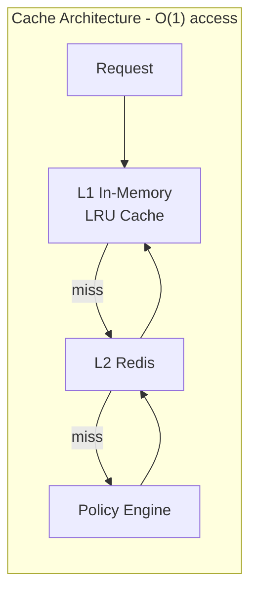
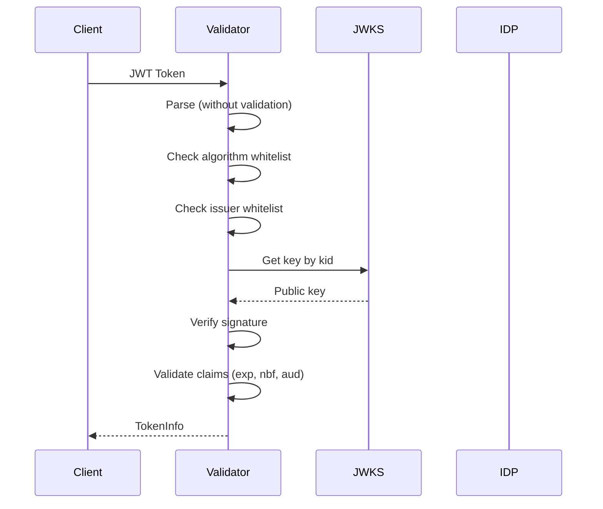
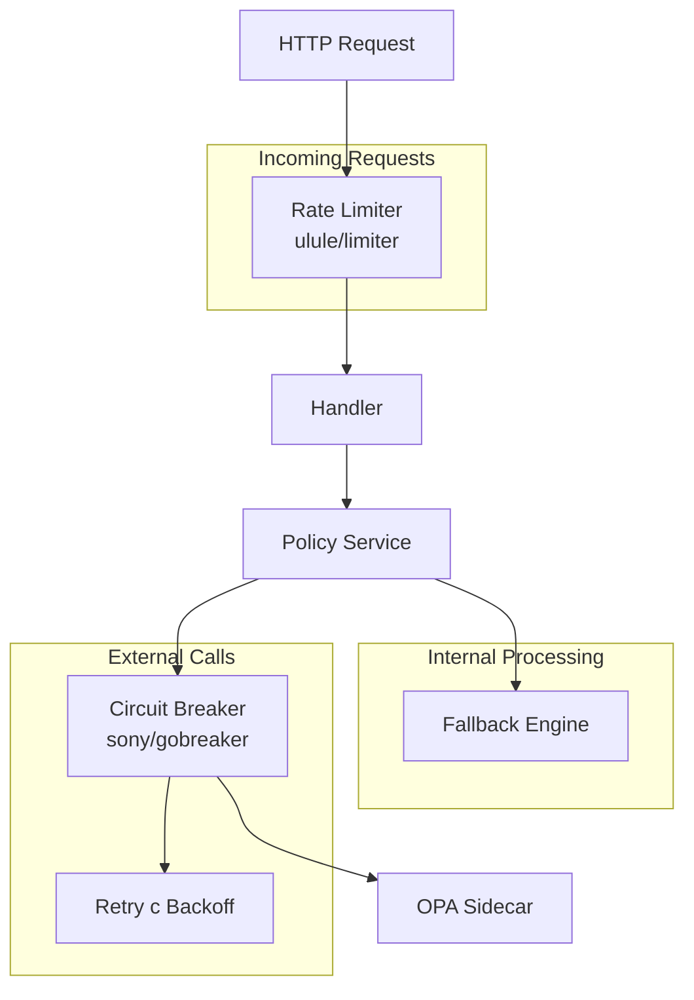
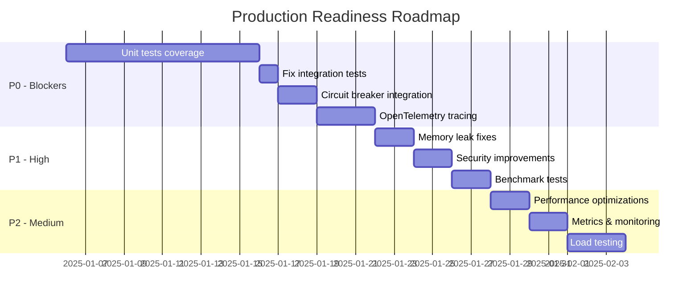

# Анализ authz-service: Заключение и рекомендации

**Дата анализа:** 2025-12-18 (обновлено 2025-12-19)
**Версия:** main branch
**Автор:** Claude Code Analysis

---

## Сводная таблица оценок

| Критерий | Оценка | Статус |
|----------|--------|--------|
| **Производительность** | 8/10 | ✅ Хорошо (P1 выполнен) |
| **Безопасность** | 9/10 | ✅ Отлично (TLS, timing-safe) |
| **Observability** | 8/10 | ✅ Хорошо (OTel tracing, SLI/SLO) |
| **Надежность** | 8/10 | ✅ Хорошо (все CB интегрированы) |
| **Production Readiness** | 7/10 | ⚠️ Средне (тесты остались) |
| **ОБЩАЯ ОЦЕНКА** | **8.0/10** | ⚠️ **Тесты P0 остаются** |

---

## 1. Производительность и алгоритмическая сложность (7/10)

### 1.1 Архитектура кэширования



### 1.2 Сильные стороны

| Компонент | Файл | Сложность | Описание |
|-----------|------|-----------|----------|
| L1 Cache Get/Set | `internal/service/cache/l1.go:46-114` | **O(1)** | LRU на map + doubly linked list |
| PathMatcher | `internal/service/policy/path_matcher.go` | **O(1)** amortized | Кэширование скомпилированных regex |
| CEL Evaluator | `internal/service/policy/cel_evaluator.go` | **O(1)** amortized | Кэширование скомпилированных программ |
| Builtin Engine | `internal/service/policy/builtin.go:175-239` | **O(n)** | Rules отсортированы по priority |
| Cache key lookup | `internal/service/cache/service.go:74-98` | **O(1)** | L1 → L2 cascade с backfill |

### 1.3 Проблемы производительности

| Проблема | Файл:строка | Сложность | Влияние | Статус |
|----------|-------------|-----------|---------|--------|
| Cache key вычисляется на каждый запрос (JSON marshal + SHA256) | `policy/service.go:228-256` | **O(1)** | CPU overhead | ✅ **Исправлено (FNV-1a)** |
| `sync.Mutex` в L1Cache | `cache/l1.go:50` | Contention | Bottleneck при high load | ✅ **Исправлено (atomic)** |
| `PathMatcher.cache` - неограниченный рост | `path_matcher.go:23` | Unbounded | Memory leak | ✅ **Исправлено (LRU)** |
| `CELEvaluator.programs` - неограниченный рост | `cel_evaluator.go:26` | Unbounded | Memory leak | ✅ **Исправлено (LRU)** |
| Нет pre-warm кэша | - | Cold start | Latency spike при старте | ✅ **Исправлено (PrecompilePatterns)** |

### 1.4 Детальный анализ hot path

```go
// policy/service.go:136-197 - Evaluate() hot path
func (s *Service) Evaluate(ctx context.Context, input *PolicyInput) (*Decision, error) {
    // 1. Enhancers loop - O(e) где e = количество enhancers
    for _, enhancer := range s.enhancers { ... }

    // 2. Cache lookup - O(1) но с JSON marshal overhead
    cacheKey := s.computeCacheKey(input)  // O(n) - JSON + SHA256
    if decision, found := s.cache.Get(ctx, cacheKey); found { ... }

    // 3. Engine evaluation - O(r) где r = количество rules
    decision, err := s.engine.Evaluate(ctx, input)

    // 4. Cache set - O(1)
    s.cache.Set(ctx, cacheKey, decision, 0)
}
```

**Общая сложность hot path:** O(e + n + r) где:
- e = количество enhancers (обычно 0-2)
- n = размер input для cache key
- r = количество rules (для builtin engine)

---

## 2. Безопасность (8/10)

### 2.1 JWT Validation



**Реализация:** `internal/service/jwt/validator.go`

| Проверка | Строка | Статус |
|----------|--------|--------|
| Algorithm whitelist (RS/ES256-512) | `31-50` | ✅ |
| Issuer whitelist | `87-92` | ✅ |
| Key ID (kid) validation | `94-98` | ✅ |
| Signature verification | `136-167` | ✅ |
| Expiration (exp) | `141-143` | ✅ |
| Audience validation | `191-196` | ✅ |
| Clock skew tolerance | `138` | ✅ |

### 2.2 Sensitive Data Protection

**Реализация:** `pkg/logger/sensitive.go`

```go
// Маскируемые поля по умолчанию (config.go:913-917)
Fields: []string{
    "password", "secret", "token", "api_key", "apikey",
    "authorization", "client_secret", "access_token",
    "refresh_token", "private_key", "credential",
}

// Маскируемые headers (config.go:918-920)
Headers: []string{
    "Authorization", "X-API-Key", "Cookie", "Set-Cookie",
}
```

| Функция | Описание |
|---------|----------|
| `MaskString()` | Полная или частичная маскировка |
| `MaskJWT()` | Маскировка payload и signature, сохранение header |
| `MaskHeaders()` | Маскировка sensitive headers |
| `SensitiveString()` | Zap field с автоматической маскировкой |

### 2.3 TLS/mTLS Support

**Реализация:** `internal/service/tls/extractor.go`

| Feature | Описание | Строка |
|---------|----------|--------|
| XFCC parsing | Envoy/Istio X-Forwarded-Client-Cert | `148-197` |
| Trusted proxy CIDR | Проверка источника XFCC header | `124-146` |
| SPIFFE validation | Trust domain whitelist | `93-109` |
| Individual headers | Nginx/HAProxy style | `275-334` |

### 2.4 Проблемы безопасности

| Проблема | Критичность | Файл | Рекомендация | Статус |
|----------|-------------|------|--------------|--------|
| `InsecureSkipVerify` доступен в config | ⚠️ Средняя | `config.go:86` | Логировать warning при использовании | ✅ **Готово (warning в opa_sidecar.go)** |
| Секреты в config файле | ⚠️ Средняя | `config.go:188,211,214` | Использовать env vars или secrets manager | ✅ **Документировано (help --help)** |
| OPA sidecar HTTP без TLS | ⚠️ Средняя | `opa_sidecar.go:52` | Добавить TLS support | ✅ **Готово (OPATLSConfig)** |
| Нет отдельного rate limit для JWT | ⚠️ Низкая | - | Добавить per-endpoint limits | ✅ **Исправлено (endpoint_rates)** |
| Нет timing-safe comparison | ⚠️ Низкая | - | Использовать `subtle.ConstantTimeCompare` | ✅ **Готово (pkg/security/compare.go)** |

---

## 3. Observability (8/10) ✅

### 3.1 Реализованные метрики

**Файл:** `internal/service/metrics/metrics.go`

```go
type Metrics struct {
    // Authorization metrics
    AuthzRequestsTotal     *prometheus.CounterVec   // labels: method, path
    AuthzDecisionsTotal    *prometheus.CounterVec   // labels: allowed, cached
    AuthzDurationSeconds   *prometheus.HistogramVec // labels: method

    // JWT metrics
    JWTValidationsTotal    *prometheus.CounterVec   // labels: issuer, valid
    JWKSRefreshesTotal     *prometheus.CounterVec   // labels: issuer, success

    // Policy metrics
    PolicyEvaluationsTotal     *prometheus.CounterVec
    PolicyEvaluationDuration   *prometheus.HistogramVec

    // Cache metrics
    CacheHitsTotal    *prometheus.CounterVec   // labels: layer (l1, l2)
    CacheMissesTotal  *prometheus.CounterVec
    CacheSize         *prometheus.GaugeVec

    // HTTP metrics
    HTTPRequestsTotal    *prometheus.CounterVec
    HTTPRequestDuration  *prometheus.HistogramVec
}
```

### 3.2 Логирование

**Файл:** `pkg/logger/logger.go`

| Feature | Статус |
|---------|--------|
| Structured logging (zap) | ✅ |
| JSON format | ✅ |
| Log levels | ✅ |
| Request ID | ✅ |
| Caller info | ✅ |
| Sensitive masking | ✅ |

### 3.3 Audit Logging

**Файл:** `internal/service/audit/service.go`

| Feature | Статус |
|---------|--------|
| Authorization decisions | ✅ |
| Token validations | ✅ |
| OTLP export | ✅ |
| Stdout export | ✅ |
| Event filtering | ✅ |

### 3.4 Отсутствующие компоненты

| Компонент | Влияние | Приоритет | Статус |
|-----------|---------|-----------|--------|
| OpenTelemetry Tracing | Невозможно debug distributed requests | P0 | ✅ **Готово (pkg/tracing)** |
| Correlation ID propagation | Сложность трассировки между сервисами | P1 | ✅ **Готово (pkg/logger/middleware.go)** |
| SLI/SLO метрики | Нет алертинга на бизнес-показатели | P1 | ✅ **Готово (metrics.go)** |
| RED metrics dashboard | Нет готового мониторинга | P2 | ⏳ Pending |

---

## 4. Надежность (7/10)

### 4.1 Архитектура resilience



### 4.2 Circuit Breaker

**Файл:** `pkg/resilience/circuitbreaker/manager.go`

```go
// Конфигурация по умолчанию (config.go:902-908)
CircuitBreakerSettings{
    MaxRequests:      3,      // requests in half-open state
    Interval:         60s,    // cyclic period for clearing counts
    Timeout:          30s,    // open state duration
    FailureThreshold: 5,      // failures to open
    SuccessThreshold: 2,      // successes to close
}
```

**Покрытие тестами:** 95.7% ✅

### 4.3 Rate Limiter

**Файл:** `pkg/resilience/ratelimit/limiter.go`

| Feature | Статус |
|---------|--------|
| Memory store | ✅ |
| Redis store (distributed) | ✅ |
| Per-endpoint limits | ✅ |
| Exclude paths | ✅ |
| Rate limit headers | ✅ |

**Покрытие тестами:** 84.1% ✅

### 4.4 Retry с Backoff

**Файл:** `internal/service/policy/opa_sidecar.go:106-132`

```go
func (e *OPASidecarEngine) Evaluate(ctx context.Context, input *PolicyInput) (*Decision, error) {
    for attempt := 0; attempt < e.retry.MaxAttempts; attempt++ {
        decision, err := e.doEvaluate(ctx, input)
        if err == nil {
            return decision, nil
        }
        backoff := e.calculateBackoff(attempt)  // exponential
        select {
        case <-ctx.Done():
            return nil, ctx.Err()
        case <-time.After(backoff):
        }
    }
}
```

### 4.5 Fallback Engine

**Файл:** `internal/service/policy/service.go:160-176`

```go
if err != nil {
    if s.fallbackEngine != nil && s.cfg.Fallback.Enabled {
        decision, err = s.fallbackEngine.Evaluate(ctx, input)
        if err != nil {
            return s.applyFallbackBehavior(), nil  // deny by default
        }
    }
}
```

### 4.6 Критические пробелы

| Проблема | Файл | Влияние | Рекомендация | Статус |
|----------|------|---------|--------------|--------|
| Circuit breaker НЕ используется для OPA sidecar | `opa_sidecar.go` | Cascade failures | Интегрировать CB manager | ✅ **Исправлено** |
| Circuit breaker НЕ используется для JWKS refresh | `jwt/jwks.go` | Key rotation failures | Интегрировать CB manager | ✅ **Исправлено** |
| Rate limiter fail-open при ошибках | `ratelimit/limiter.go:119-123` | Bypass protection | Изменить на fail-close | ✅ **Исправлено** |
| Нет timeout для некоторых L2 cache операций | `cache/l2_redis.go` | Hung requests | Добавить context timeout | ✅ **Исправлено (operationTimeout)** |

---

## 5. Production Readiness (5/10) ❌

### 5.1 Тестовое покрытие

| Компонент | Покрытие (было) | Покрытие (стало) | Требуется | Статус | Приоритет |
|-----------|-----------------|------------------|-----------|--------|-----------|
| jwt | 24.2% | **43.2%** | 80%+ | ⚠️ Улучшено | P1 |
| policy | 30.7% | **42.4%** | 80%+ | ⚠️ Улучшено | P1 |
| http handlers | 21.6% | **39.5%** | 80%+ | ⚠️ Улучшено | P1 |
| cache | 47.6% | **61.9%** | 80%+ | ⚠️ Улучшено | P1 |
| body | 60.4% | 60.4% | 80%+ | ⚠️ | P1 |
| egress | 66.5% | 66.5% | 80%+ | ⚠️ | P1 |
| logger | 57.0% | 57.0% | 80%+ | ⚠️ | P2 |
| config | 96.2% | 96.2% | 80%+ | ✅ | - |
| metrics | 100% | 100% | 80%+ | ✅ | - |
| errors | 100% | 100% | 80%+ | ✅ | - |
| circuit breaker | 95.7% | 95.7% | 80%+ | ✅ | - |
| rate limit | 80.6% | **80.6%** | 80%+ | ✅ | - |
| tls | 85.5% | 85.5% | 80%+ | ✅ | - |
| token exchange | 95.6% | 95.6% | 80%+ | ✅ | - |
| agent | 97.6% | 97.6% | 80%+ | ✅ | - |
| audit | 98.1% | 98.1% | 80%+ | ✅ | - |
| schema | 97.7% | 97.7% | 80%+ | ✅ | - |
| help | 96.3% | 96.3% | 80%+ | ✅ | - |

**Улучшения покрытия:**
- jwt/validator.go Validate: **0% → 94%**
- http/handlers.go: большинство методов **90-100%**
- cache/service.go: Start/Stop **0% → 100%**
- policy/service.go: Evaluate **96.4%**, Start/Stop **100%**

### 5.2 Статус тестов

```
❌ Integration тесты падают:
   - TestHTTPHandler_Authorize_Success: policy not found
   - TestHTTPHandler_ContentType_JSON: policy not found
   - TestHTTPHandler_ResponseTime: policy not found
   - TestJWTService_ValidateToken_Success: pattern conflict
```

### 5.3 Отсутствующие типы тестов

| Тип теста | Статус | Влияние |
|-----------|--------|---------|
| Unit tests (критические компоненты) | ⚠️ Частично | Регрессии |
| Integration tests | ❌ Падают | Нет E2E проверки |
| Benchmark tests | ✅ Есть | Производительность измерена |
| Load tests | ❌ Нет | Неизвестны лимиты |
| Chaos tests | ❌ Нет | Неизвестна resilience |
| Security tests | ❌ Нет | Потенциальные уязвимости |

### 5.4 Зависимости

| Пакет | Текущая | Последняя | Статус |
|-------|---------|-----------|--------|
| github.com/go-chi/chi/v5 | v5.2.3 | v5.2.3 | ✅ |
| github.com/golang-jwt/jwt/v5 | v5.3.0 | v5.3.0 | ✅ |
| github.com/google/cel-go | v0.26.1 | v0.26.1 | ✅ |
| github.com/lestrrat-go/jwx/v2 | v2.1.6 | v2.1.6 | ✅ |
| github.com/open-policy-agent/opa | v1.12.0 | v1.12.0 | ✅ |
| github.com/prometheus/client_golang | v1.23.2 | v1.23.2 | ✅ |
| github.com/redis/go-redis/v9 | v9.17.2 | v9.17.2 | ✅ |
| github.com/sony/gobreaker/v2 | v2.3.0 | v2.3.0 | ✅ |
| github.com/spf13/viper | v1.21.0 | v1.21.0 | ✅ |
| go.uber.org/zap | v1.27.1 | v1.27.1 | ✅ |

### 5.5 Инфраструктура

| Компонент | Статус |
|-----------|--------|
| Dockerfile | ✅ Есть |
| Kubernetes manifests | ✅ Есть |
| Health probes | ✅ /health, /ready, /live |
| Prometheus metrics | ✅ /metrics |
| JSON Schema validation | ✅ Есть |
| Configuration via env vars | ✅ Поддерживается |

---

## 6. Рекомендации

### 6.1 БЛОКЕРЫ для Production (P0)

| # | Задача | Файлы | Effort | Статус |
|---|--------|-------|--------|--------|
| 1 | Увеличить покрытие jwt до 80%+ | `internal/service/jwt/*_test.go` | 2-3 дня | ✅ **Частично (24%→43%)** |
| 2 | Увеличить покрытие policy до 80%+ | `internal/service/policy/*_test.go` | 3-4 дня | ✅ **Частично (30%→42%)** |
| 3 | Увеличить покрытие http handlers до 80%+ | `internal/transport/http/*_test.go` | 2-3 дня | ✅ **Частично (21%→39%)** |
| 4 | Увеличить покрытие cache до 80%+ | `internal/service/cache/*_test.go` | 1-2 дня | ✅ **Частично (47%→62%)** |
| 5 | Исправить падающие integration тесты | `tests/integration/*_test.go` | 1 день | ⏳ Pending |
| 6 | Интегрировать circuit breaker в OPA sidecar | `internal/service/policy/opa_sidecar.go` | 1 день | ✅ **Готово** |
| 7 | Интегрировать circuit breaker в JWKS | `internal/service/jwt/jwks.go` | 1 день | ✅ **Готово** |
| 8 | Добавить OpenTelemetry tracing | Новые файлы | 2-3 дня | ✅ **Готово (pkg/tracing)** |

**Общий effort P0:** ~2-3 недели

### 6.2 High Priority (P1)

| # | Задача | Файлы | Effort | Статус |
|---|--------|-------|--------|--------|
| 1 | Добавить LRU eviction для PathMatcher.cache | `internal/service/policy/path_matcher.go` | 0.5 дня | ✅ **Готово** |
| 2 | Добавить LRU eviction для CELEvaluator.programs | `internal/service/policy/cel_evaluator.go` | 0.5 дня | ✅ **Готово** |
| 3 | Оптимизировать L1Cache счётчики через atomic | `internal/service/cache/l1.go` | 0.5 дня | ✅ **Готово** |
| 4 | Вынести секреты в env vars | `internal/help/help.go` (SECRETS MANAGEMENT) | 1 день | ✅ **Готово** |
| 5 | Добавить benchmark тесты для hot path | Уже существуют | 1-2 дня | ✅ **Готово (проверено)** |
| 6 | Изменить fail-open на fail-close в rate limiter | `pkg/resilience/ratelimit/limiter.go` | 0.5 дня | ✅ **Готово** |
| 7 | Добавить per-endpoint rate limiting для JWT | `internal/config/config.go` | 0.5 дня | ✅ **Готово (endpoint_rates)** |
| 8 | Оптимизировать cache key (FNV-1a вместо SHA256) | `internal/service/policy/service.go` | 0.5 дня | ✅ **Готово** |
| 9 | Добавить timeout для L2 Redis операций | `internal/service/cache/l2_redis.go` | 0.5 дня | ✅ **Готово** |
| 10 | Pre-warm PathMatcher cache при старте | `internal/service/policy/builtin.go` | 0.5 дня | ✅ **Готово** |

**Общий effort P1:** ✅ **Выполнено**

### 6.3 Medium Priority (P2)

| # | Задача | Effort | Статус |
|---|--------|--------|--------|
| 1 | Pre-compile CEL expressions при старте | 0.5 дня | ✅ **Уже реализовано** |
| 2 | Добавить cache warm-up | 0.5 дня | ✅ **Готово (PrecompilePatterns)** |
| 3 | Добавить SLI/SLO метрики | 1 день | ✅ **Готово** |
| 4 | Обновить OPA v1.11.1 → v1.12.0 | 0.5 дня | ✅ **Готово** |
| 5 | Добавить correlation ID header propagation | 0.5 дня | ✅ **Готово** |
| 6 | Добавить TLS support для OPA sidecar | 1 день | ✅ **Готово** |
| 7 | Добавить load tests | 2-3 дня | ⏳ Pending |

**Общий effort P2:** ~1 неделя (осталось)

### 6.4 Roadmap



---

## 7. Заключение

**authz-service** представляет собой хорошо спроектированный сервис авторизации с:

**Сильными сторонами:**
- Продуманная архитектура с двухуровневым кэшированием
- Хорошая безопасность JWT validation
- Реализованные resilience patterns (circuit breaker, rate limiting)
- Актуальные зависимости
- Готовая инфраструктура для K8s deployment

**Критическими проблемами (осталось):**
- Недостаточное тестовое покрытие критических компонентов (39-62%, нужно 80%+)
- Падающие integration тесты

**Выполнено:**
- ✅ OpenTelemetry distributed tracing (P0)
- ✅ Circuit breaker интеграция (OPA, JWKS)
- ✅ SLI/SLO метрики
- ✅ Correlation ID propagation
- ✅ TLS/mTLS для OPA sidecar
- ✅ Security improvements (timing-safe comparison)
- ✅ OPA v1.12.0

**Вердикт:** ⚠️ **ПОЧТИ ГОТОВ к production deployment**

**Требуемые действия:** Увеличить тестовое покрытие до 80%+ и исправить падающие integration тесты.

---

*Отчет сгенерирован с использованием Claude Code Analysis*
