# Архитектура тестирования: Диаграммы

Все диаграммы в формате Mermaid.

---

## 1. Тестируемый компонент

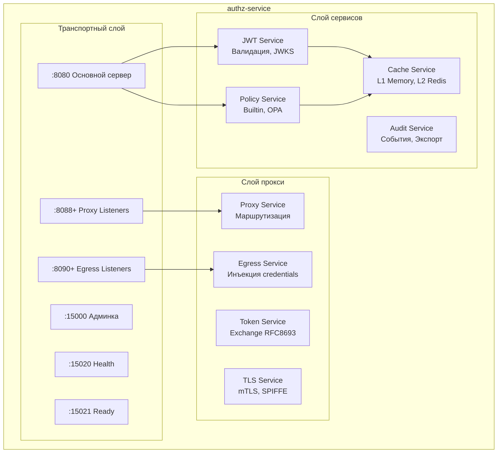
```mermaid
graph TB
    subgraph "authz-service"
        subgraph "Слой сервисов"
            JWT[JWT Service<br/>Валидация, JWKS]
            Policy[Policy Service<br/>Builtin, OPA]
            Cache[Cache Service<br/>L1 Memory, L2 Redis]
            Audit[Audit Service<br/>События, Экспорт]
        end

        subgraph "Слой прокси"
            Proxy[Proxy Service<br/>Маршрутизация]
            Egress[Egress Service<br/>Инъекция credentials]
            Token[Token Service<br/>Exchange RFC8693]
            TLS[TLS Service<br/>mTLS, SPIFFE]
        end

        subgraph "Транспортный слой"
            Main[":8080 Основной сервер"]
            ProxyPort[":8088+ Proxy Listeners"]
            EgressPort[":8090+ Egress Listeners"]
            Admin[":15000 Админка"]
            Health[":15020 Health"]
            Ready[":15021 Ready"]
        end
    end

    Main --> JWT
    Main --> Policy
    ProxyPort --> Proxy
    EgressPort --> Egress
    JWT --> Cache
    Policy --> Cache
```

---

## 2. Внешние зависимости

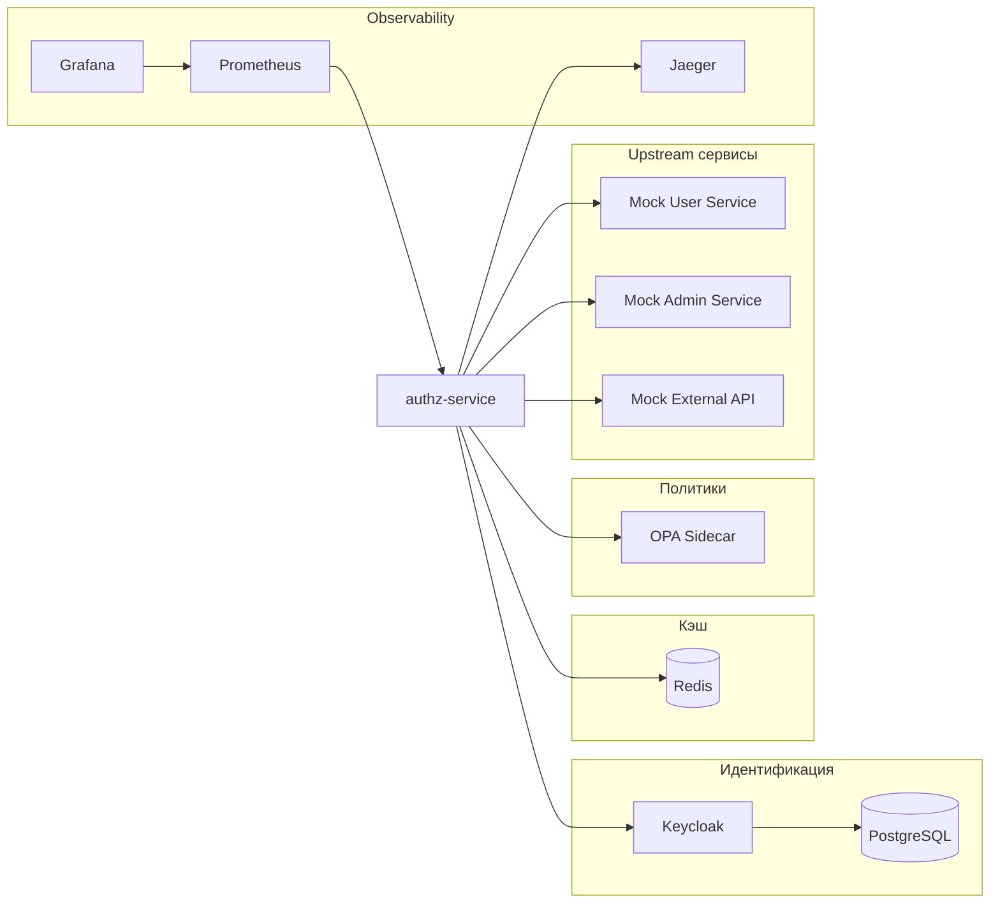
```mermaid
graph LR
    subgraph "Идентификация"
        KC[Keycloak]
        PG[(PostgreSQL)]
        KC --> PG
    end

    subgraph "Кэш"
        Redis[(Redis)]
    end

    subgraph "Политики"
        OPA[OPA Sidecar]
    end

    subgraph "Upstream сервисы"
        Mock1[Mock User Service]
        Mock2[Mock Admin Service]
        Mock3[Mock External API]
    end

    subgraph "Observability"
        Jaeger[Jaeger]
        Prom[Prometheus]
        Grafana[Grafana]
    end

    SUT[authz-service]

    SUT --> KC
    SUT --> Redis
    SUT --> OPA
    SUT --> Mock1
    SUT --> Mock2
    SUT --> Mock3
    SUT --> Jaeger
    Prom --> SUT
    Grafana --> Prom
```

---

## 3. Пирамида тестирования

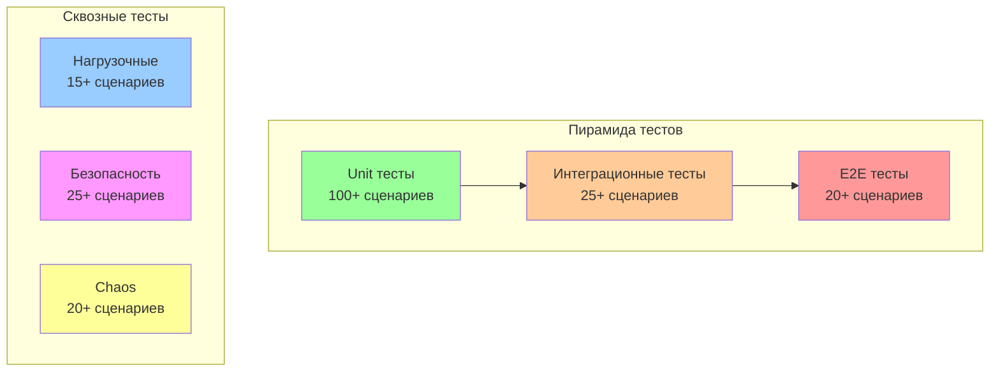
```mermaid
graph TB
    subgraph "Пирамида тестов"
        E2E[E2E тесты<br/>20+ сценариев]
        INT[Интеграционные тесты<br/>25+ сценариев]
        UNIT[Unit тесты<br/>100+ сценариев]
    end

    subgraph "Сквозные тесты"
        LOAD[Нагрузочные<br/>15+ сценариев]
        SEC[Безопасность<br/>25+ сценариев]
        CHAOS[Chaos<br/>20+ сценариев]
    end

    UNIT --> INT --> E2E

    style E2E fill:#ff9999
    style INT fill:#ffcc99
    style UNIT fill:#99ff99
    style LOAD fill:#99ccff
    style SEC fill:#ff99ff
    style CHAOS fill:#ffff99
```

---

## 4. Поток валидации JWT

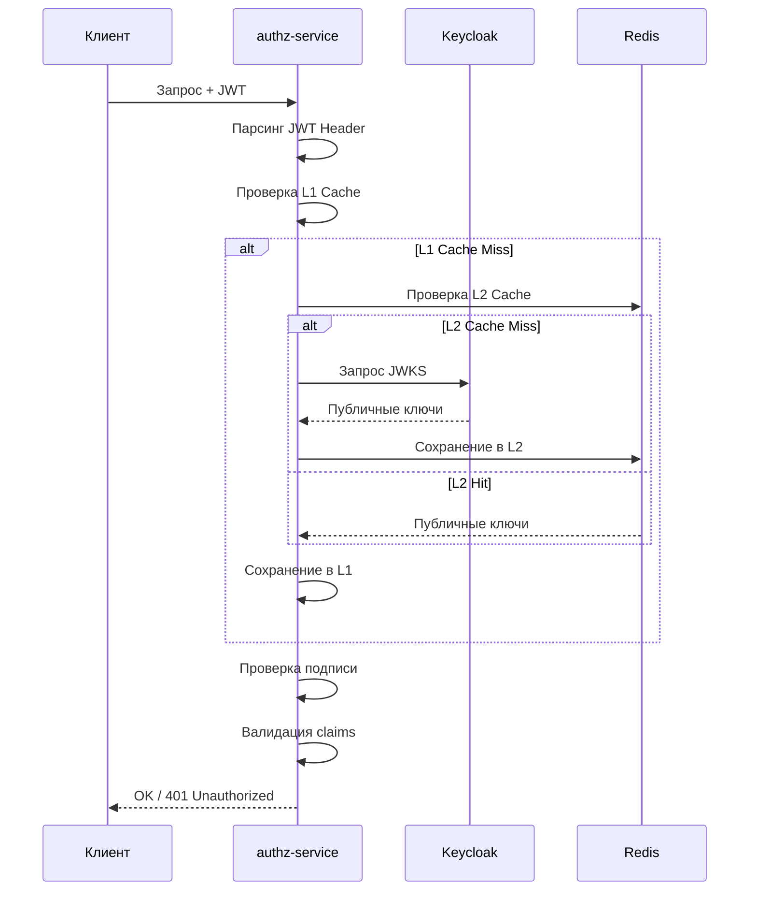
```mermaid
sequenceDiagram
    participant C as Клиент
    participant A as authz-service
    participant K as Keycloak
    participant R as Redis

    C->>A: Запрос + JWT
    A->>A: Парсинг JWT Header
    A->>A: Проверка L1 Cache

    alt L1 Cache Miss
        A->>R: Проверка L2 Cache
        alt L2 Cache Miss
            A->>K: Запрос JWKS
            K-->>A: Публичные ключи
            A->>R: Сохранение в L2
        else L2 Hit
            R-->>A: Публичные ключи
        end
        A->>A: Сохранение в L1
    end

    A->>A: Проверка подписи
    A->>A: Валидация claims
    A-->>C: OK / 401 Unauthorized
```

---

## 5. Поток оценки политик

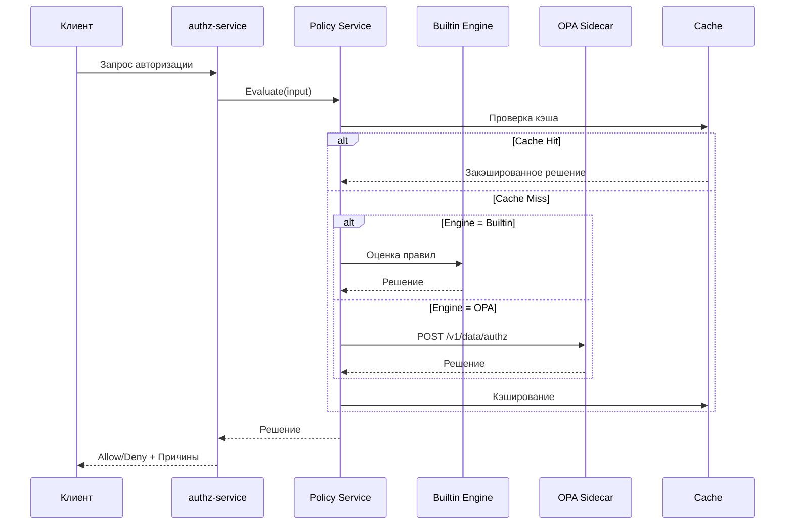
```mermaid
sequenceDiagram
    participant C as Клиент
    participant A as authz-service
    participant P as Policy Service
    participant B as Builtin Engine
    participant O as OPA Sidecar
    participant Ca as Cache

    C->>A: Запрос авторизации
    A->>P: Evaluate(input)
    P->>Ca: Проверка кэша

    alt Cache Hit
        Ca-->>P: Закэшированное решение
    else Cache Miss
        alt Engine = Builtin
            P->>B: Оценка правил
            B-->>P: Решение
        else Engine = OPA
            P->>O: POST /v1/data/authz
            O-->>P: Решение
        end
        P->>Ca: Кэширование
    end

    P-->>A: Решение
    A-->>C: Allow/Deny + Причины
```

---

## 6. Поток запроса через прокси

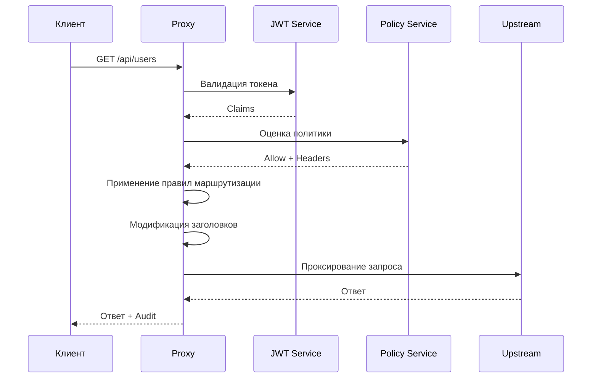
```mermaid
sequenceDiagram
    participant C as Клиент
    participant P as Proxy
    participant J as JWT Service
    participant Po as Policy Service
    participant U as Upstream

    C->>P: GET /api/users
    P->>J: Валидация токена
    J-->>P: Claims
    P->>Po: Оценка политики
    Po-->>P: Allow + Headers
    P->>P: Применение правил маршрутизации
    P->>P: Модификация заголовков
    P->>U: Проксирование запроса
    U-->>P: Ответ
    P-->>C: Ответ + Audit
```

---

## 7. Service-to-Service (mTLS + JWT)

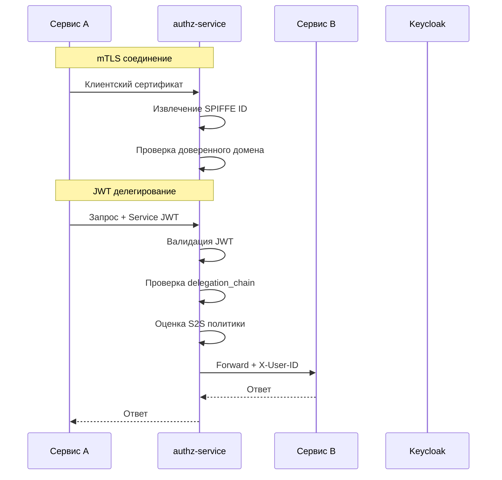
```mermaid
sequenceDiagram
    participant SA as Сервис A
    participant A as authz-service
    participant SB as Сервис B
    participant KC as Keycloak

    Note over SA,A: mTLS соединение
    SA->>A: Клиентский сертификат
    A->>A: Извлечение SPIFFE ID
    A->>A: Проверка доверенного домена

    Note over SA,A: JWT делегирование
    SA->>A: Запрос + Service JWT
    A->>A: Валидация JWT
    A->>A: Проверка delegation_chain
    A->>A: Оценка S2S политики

    A->>SB: Forward + X-User-ID
    SB-->>A: Ответ
    A-->>SA: Ответ
```

---

## 8. Egress с OAuth2

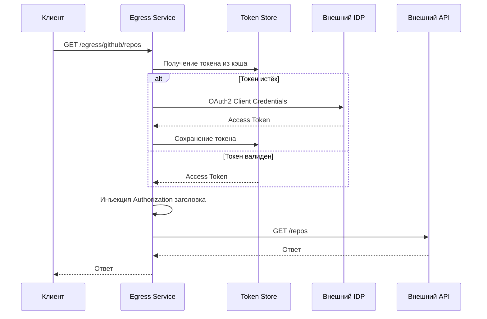
```mermaid
sequenceDiagram
    participant C as Клиент
    participant E as Egress Service
    participant TS as Token Store
    participant IDP as Внешний IDP
    participant API as Внешний API

    C->>E: GET /egress/github/repos
    E->>TS: Получение токена из кэша

    alt Токен истёк
        E->>IDP: OAuth2 Client Credentials
        IDP-->>E: Access Token
        E->>TS: Сохранение токена
    else Токен валиден
        TS-->>E: Access Token
    end

    E->>E: Инъекция Authorization заголовка
    E->>API: GET /repos
    API-->>E: Ответ
    E-->>C: Ответ
```

---

## 9. Сценарии Chaos Engineering

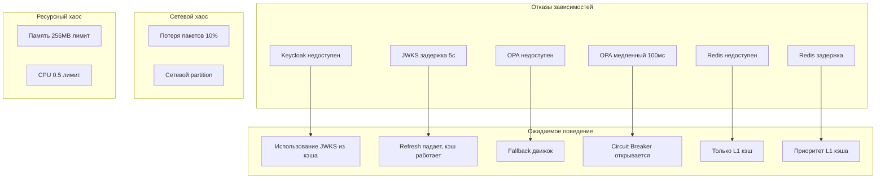
```mermaid
flowchart TD
    subgraph "Отказы зависимостей"
        CF1[Keycloak недоступен]
        CF2[JWKS задержка 5с]
        CF3[OPA недоступен]
        CF4[OPA медленный 100мс]
        CF5[Redis недоступен]
        CF6[Redis задержка]
    end

    subgraph "Ожидаемое поведение"
        R1[Использование JWKS из кэша]
        R2[Refresh падает, кэш работает]
        R3[Fallback движок]
        R4[Circuit Breaker открывается]
        R5[Только L1 кэш]
        R6[Приоритет L1 кэша]
    end

    CF1 --> R1
    CF2 --> R2
    CF3 --> R3
    CF4 --> R4
    CF5 --> R5
    CF6 --> R6

    subgraph "Сетевой хаос"
        NC1[Потеря пакетов 10%]
        NC2[Сетевой partition]
    end

    subgraph "Ресурсный хаос"
        RC1[Память 256MB лимит]
        RC2[CPU 0.5 лимит]
    end
```

---

## 10. Уровни тестовых окружений

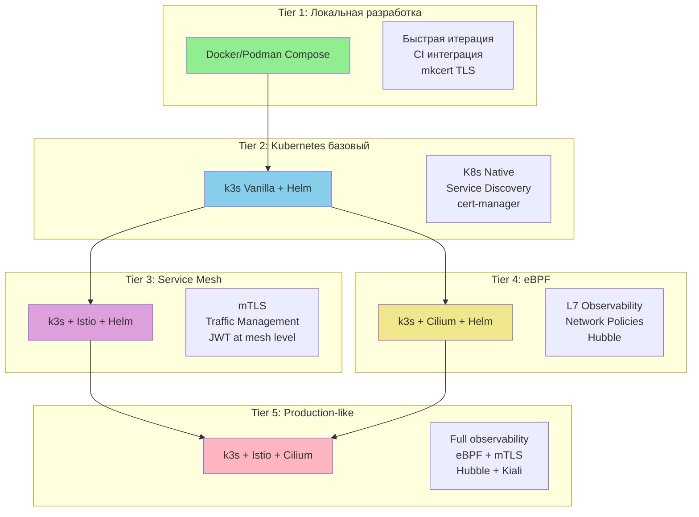
```mermaid
graph TB
    subgraph "Tier 1: Локальная разработка"
        T1[Docker/Podman Compose]
        T1C[Быстрая итерация<br/>CI интеграция<br/>mkcert TLS]
    end

    subgraph "Tier 2: Kubernetes базовый"
        T2[k3s Vanilla + Helm]
        T2C[K8s Native<br/>Service Discovery<br/>cert-manager]
    end

    subgraph "Tier 3: Service Mesh"
        T3[k3s + Istio + Helm]
        T3C[mTLS<br/>Traffic Management<br/>JWT at mesh level]
    end

    subgraph "Tier 4: eBPF"
        T4[k3s + Cilium + Helm]
        T4C[L7 Observability<br/>Network Policies<br/>Hubble]
    end

    subgraph "Tier 5: Production-like"
        T5[k3s + Istio + Cilium]
        T5C[Full observability<br/>eBPF + mTLS<br/>Hubble + Kiali]
    end

    T1 --> T2 --> T3
    T2 --> T4
    T3 --> T5
    T4 --> T5

    style T1 fill:#90EE90
    style T2 fill:#87CEEB
    style T3 fill:#DDA0DD
    style T4 fill:#F0E68C
    style T5 fill:#FFB6C1
```

---

## 11. CI/CD Pipeline

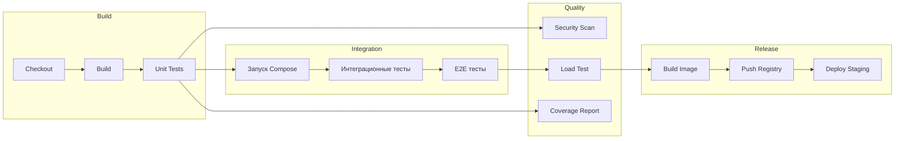
```mermaid
flowchart LR
    subgraph "Build"
        B1[Checkout]
        B2[Build]
        B3[Unit Tests]
    end

    subgraph "Integration"
        I1[Запуск Compose]
        I2[Интеграционные тесты]
        I3[E2E тесты]
    end

    subgraph "Quality"
        Q1[Security Scan]
        Q2[Load Test]
        Q3[Coverage Report]
    end

    subgraph "Release"
        R1[Build Image]
        R2[Push Registry]
        R3[Deploy Staging]
    end

    B1 --> B2 --> B3 --> I1
    I1 --> I2 --> I3
    B3 --> Q1
    I3 --> Q2
    B3 --> Q3
    Q2 --> R1 --> R2 --> R3
```

---

## 12. Иерархия кэша

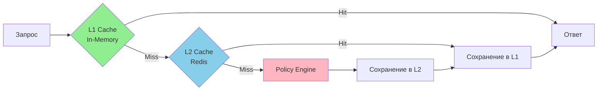
```mermaid
graph LR
    Request[Запрос] --> L1{L1 Cache<br/>In-Memory}

    L1 -->|Hit| Response[Ответ]
    L1 -->|Miss| L2{L2 Cache<br/>Redis}

    L2 -->|Hit| L1Store[Сохранение в L1]
    L2 -->|Miss| Engine[Policy Engine]

    Engine --> L2Store[Сохранение в L2]
    L2Store --> L1Store
    L1Store --> Response

    style L1 fill:#90EE90
    style L2 fill:#87CEEB
    style Engine fill:#FFB6C1
```

---

## 13. Rate Limiting и Circuit Breaker

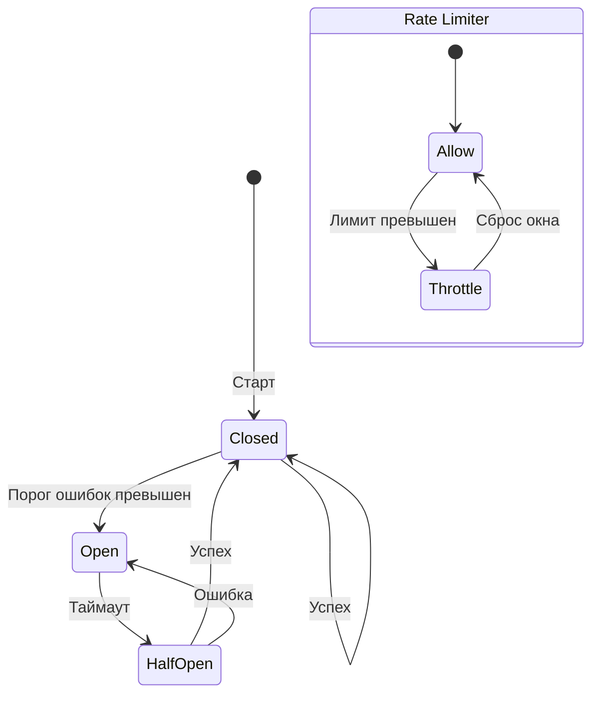
```mermaid
stateDiagram-v2
    [*] --> Closed: Старт

    Closed --> Open: Порог ошибок превышен
    Closed --> Closed: Успех

    Open --> HalfOpen: Таймаут

    HalfOpen --> Closed: Успех
    HalfOpen --> Open: Ошибка

    state "Rate Limiter" as RL {
        [*] --> Allow
        Allow --> Throttle: Лимит превышен
        Throttle --> Allow: Сброс окна
    }
```

---

## 14. Multi-Listener архитектура

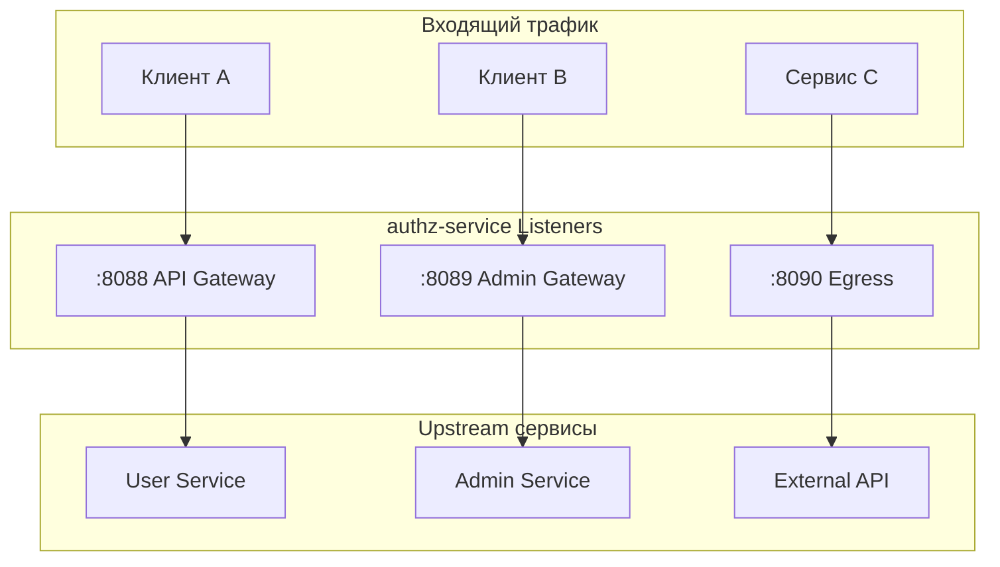
```mermaid
graph TB
    subgraph "Входящий трафик"
        C1[Клиент A]
        C2[Клиент B]
        C3[Сервис C]
    end

    subgraph "authz-service Listeners"
        L1[":8088 API Gateway"]
        L2[":8089 Admin Gateway"]
        L3[":8090 Egress"]
    end

    subgraph "Upstream сервисы"
        U1[User Service]
        U2[Admin Service]
        U3[External API]
    end

    C1 --> L1
    C2 --> L2
    C3 --> L3

    L1 --> U1
    L2 --> U2
    L3 --> U3
```

---

## 15. Helm Deployment архитектура

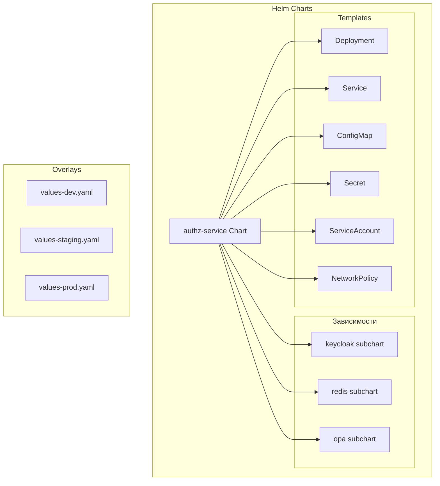
```mermaid
graph TB
    subgraph "Helm Charts"
        HC[authz-service Chart]

        subgraph "Зависимости"
            D1[keycloak subchart]
            D2[redis subchart]
            D3[opa subchart]
        end

        subgraph "Templates"
            T1[Deployment]
            T2[Service]
            T3[ConfigMap]
            T4[Secret]
            T5[ServiceAccount]
            T6[NetworkPolicy]
        end
    end

    HC --> D1
    HC --> D2
    HC --> D3
    HC --> T1
    HC --> T2
    HC --> T3
    HC --> T4
    HC --> T5
    HC --> T6

    subgraph "Overlays"
        O1[values-dev.yaml]
        O2[values-staging.yaml]
        O3[values-prod.yaml]
    end
```

---

## 16. Egress authz-to-authz (mTLS + JWT)

Сценарий интеграции с внешней системой, защищённой своим authz-service.

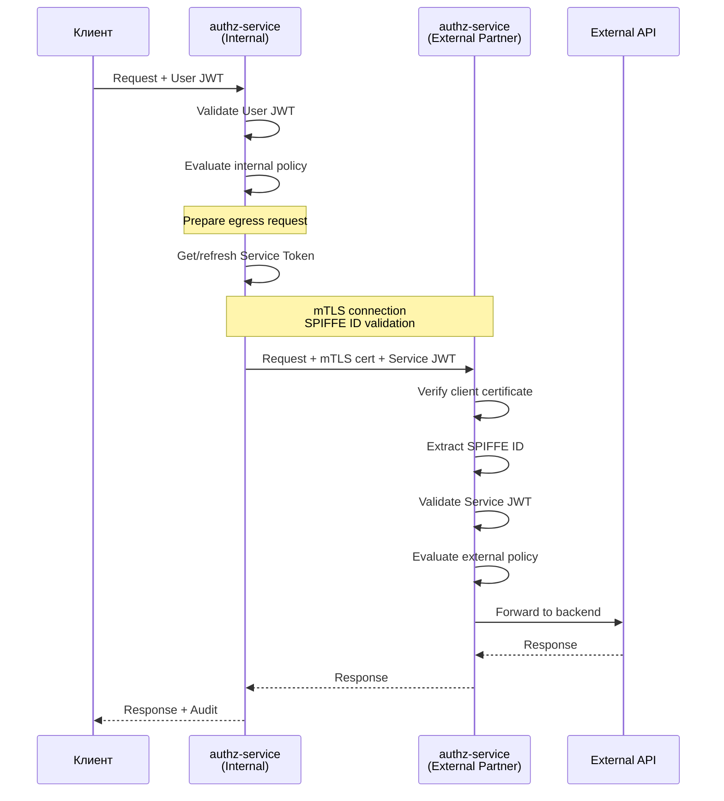
```mermaid
sequenceDiagram
    participant C as Клиент
    participant AI as authz-service<br/>(Internal)
    participant AE as authz-service<br/>(External Partner)
    participant API as External API

    C->>AI: Request + User JWT
    AI->>AI: Validate User JWT
    AI->>AI: Evaluate internal policy

    Note over AI: Prepare egress request

    AI->>AI: Get/refresh Service Token

    Note over AI,AE: mTLS connection<br/>SPIFFE ID validation

    AI->>AE: Request + mTLS cert + Service JWT
    AE->>AE: Verify client certificate
    AE->>AE: Extract SPIFFE ID
    AE->>AE: Validate Service JWT
    AE->>AE: Evaluate external policy

    AE->>API: Forward to backend
    API-->>AE: Response
    AE-->>AI: Response
    AI-->>C: Response + Audit
```

---

## 17. Token Exchange (RFC 8693)

Обмен токенов для делегирования полномочий между сервисами.

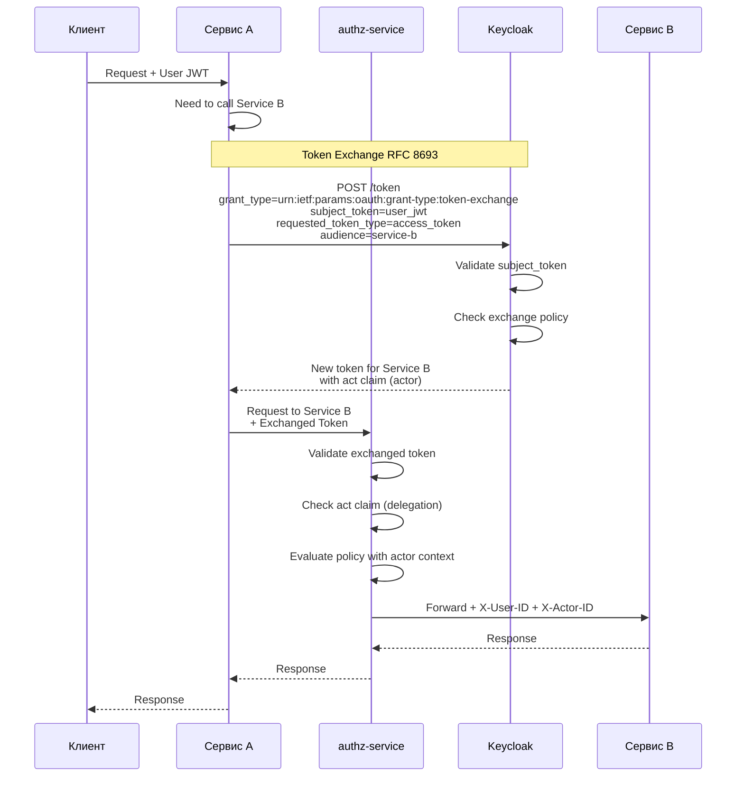
```mermaid
sequenceDiagram
    participant C as Клиент
    participant SA as Сервис A
    participant A as authz-service
    participant KC as Keycloak
    participant SB as Сервис B

    C->>SA: Request + User JWT
    SA->>SA: Need to call Service B

    Note over SA,KC: Token Exchange RFC 8693

    SA->>KC: POST /token<br/>grant_type=urn:ietf:params:oauth:grant-type:token-exchange<br/>subject_token=user_jwt<br/>requested_token_type=access_token<br/>audience=service-b

    KC->>KC: Validate subject_token
    KC->>KC: Check exchange policy
    KC-->>SA: New token for Service B<br/>with act claim (actor)

    SA->>A: Request to Service B<br/>+ Exchanged Token

    A->>A: Validate exchanged token
    A->>A: Check act claim (delegation)
    A->>A: Evaluate policy with actor context

    A->>SB: Forward + X-User-ID + X-Actor-ID
    SB-->>A: Response
    A-->>SA: Response
    SA-->>C: Response
```

---

## 18. Agent Delegation Chain (LLM Agents)

Цепочка делегирования для AI/LLM агентов.

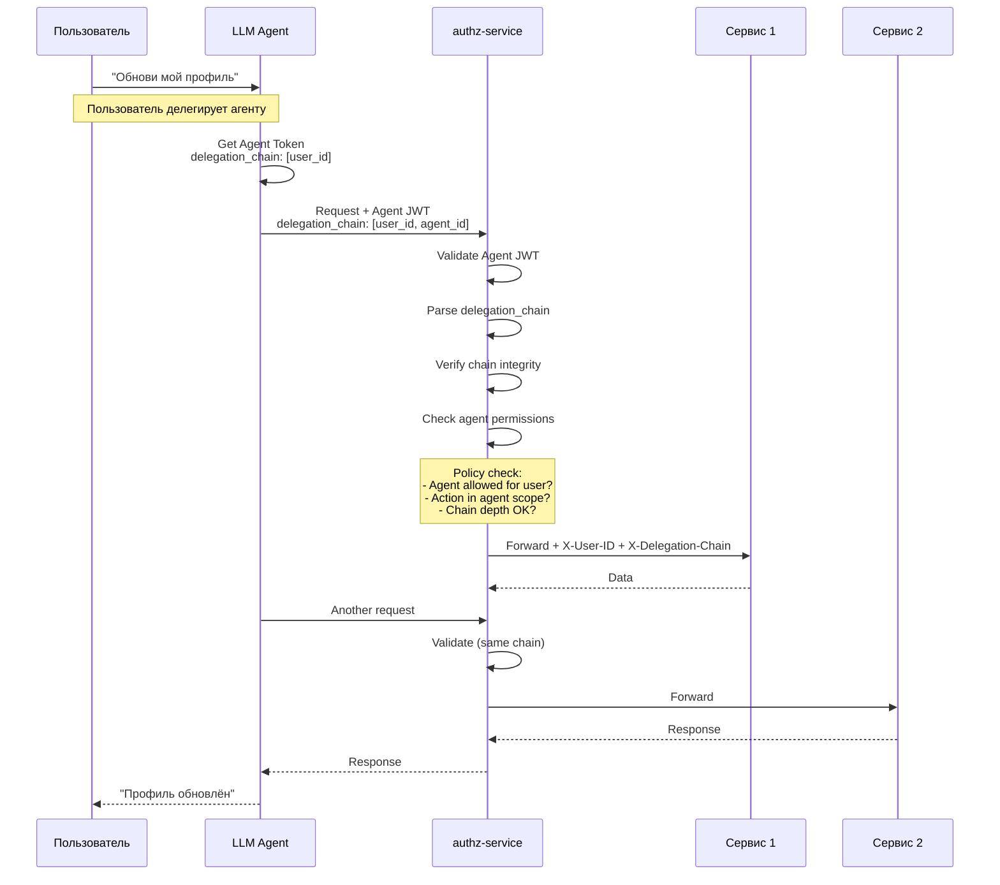
```mermaid
sequenceDiagram
    participant U as Пользователь
    participant LLM as LLM Agent
    participant A as authz-service
    participant S1 as Сервис 1
    participant S2 as Сервис 2

    U->>LLM: "Обнови мой профиль"

    Note over U,LLM: Пользователь делегирует агенту

    LLM->>LLM: Get Agent Token<br/>delegation_chain: [user_id]

    LLM->>A: Request + Agent JWT<br/>delegation_chain: [user_id, agent_id]

    A->>A: Validate Agent JWT
    A->>A: Parse delegation_chain
    A->>A: Verify chain integrity
    A->>A: Check agent permissions

    Note over A: Policy check:<br/>- Agent allowed for user?<br/>- Action in agent scope?<br/>- Chain depth OK?

    A->>S1: Forward + X-User-ID + X-Delegation-Chain
    S1-->>A: Data

    LLM->>A: Another request
    A->>A: Validate (same chain)
    A->>S2: Forward
    S2-->>A: Response
    A-->>LLM: Response

    LLM-->>U: "Профиль обновлён"
```

### Структура delegation_chain

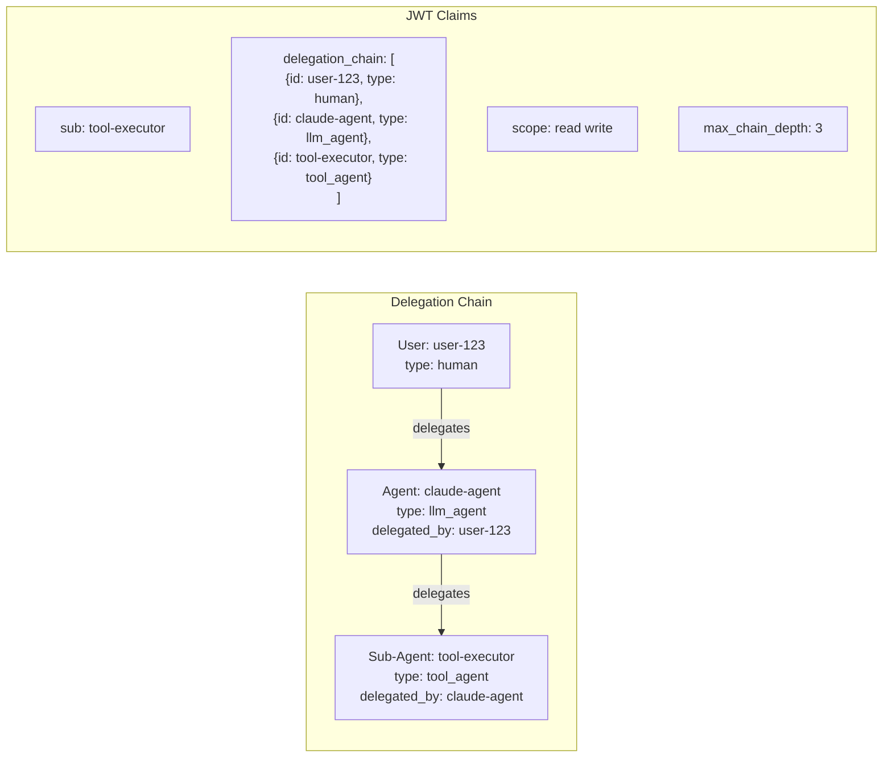
```mermaid
graph LR
    subgraph "Delegation Chain"
        U[User: user-123<br/>type: human]
        A1[Agent: claude-agent<br/>type: llm_agent<br/>delegated_by: user-123]
        A2[Sub-Agent: tool-executor<br/>type: tool_agent<br/>delegated_by: claude-agent]
    end

    U -->|delegates| A1
    A1 -->|delegates| A2

    subgraph "JWT Claims"
        C1["sub: tool-executor"]
        C2["delegation_chain: [<br/>  {id: user-123, type: human},<br/>  {id: claude-agent, type: llm_agent},<br/>  {id: tool-executor, type: tool_agent}<br/>]"]
        C3["scope: read write"]
        C4["max_chain_depth: 3"]
    end
```

---

## 19. Multi-Issuer JWT

Поддержка токенов от нескольких Identity Providers.

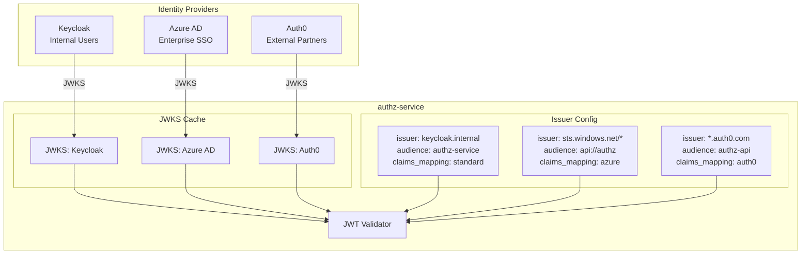
```mermaid
graph TB
    subgraph "Identity Providers"
        KC1[Keycloak<br/>Internal Users]
        KC2[Azure AD<br/>Enterprise SSO]
        KC3[Auth0<br/>External Partners]
    end

    subgraph "authz-service"
        JV[JWT Validator]

        subgraph "JWKS Cache"
            J1[JWKS: Keycloak]
            J2[JWKS: Azure AD]
            J3[JWKS: Auth0]
        end

        subgraph "Issuer Config"
            I1["issuer: keycloak.internal<br/>audience: authz-service<br/>claims_mapping: standard"]
            I2["issuer: sts.windows.net/*<br/>audience: api://authz<br/>claims_mapping: azure"]
            I3["issuer: *.auth0.com<br/>audience: authz-api<br/>claims_mapping: auth0"]
        end
    end

    KC1 -->|JWKS| J1
    KC2 -->|JWKS| J2
    KC3 -->|JWKS| J3

    J1 --> JV
    J2 --> JV
    J3 --> JV

    I1 --> JV
    I2 --> JV
    I3 --> JV
```

### Поток валидации Multi-Issuer

```mermaid
sequenceDiagram
    participant C as Client
    participant A as authz-service
    participant R as Redis Cache

    C->>A: Request + JWT

    A->>A: Parse JWT header
    A->>A: Extract "iss" claim

    alt Issuer = Keycloak
        A->>A: Use Keycloak JWKS
        A->>A: Apply standard claims mapping
    else Issuer = Azure AD
        A->>A: Use Azure AD JWKS
        A->>A: Apply Azure claims mapping<br/>(oid → sub, roles → realm_roles)
    else Issuer = Auth0
        A->>A: Use Auth0 JWKS
        A->>A: Apply Auth0 claims mapping<br/>(permissions → scopes)
    else Unknown Issuer
        A-->>C: 401 Unknown issuer
    end

    A->>A: Validate signature
    A->>A: Check audience
    A->>A: Normalize claims
    A->>A: Evaluate policy

    A-->>C: Allow/Deny
```

---

## 20. Внешние зависимости (расширенная)

```mermaid
graph LR
    subgraph "Идентификация"
        KC[Keycloak<br/>Internal]
        KC2[Keycloak<br/>Partner]
        PG[(PostgreSQL)]
        KC --> PG
        KC2 --> PG
    end

    subgraph "Кэш"
        Redis[(Redis)]
    end

    subgraph "Политики"
        OPA[OPA Sidecar]
    end

    subgraph "Upstream сервисы"
        Mock1[Mock User Service<br/>allow: all users]
        Mock2[Mock Admin Service<br/>allow: admins only]
    end

    subgraph "External Partner"
        AE[authz-service<br/>External]
        Mock3[Mock External API]
        AE --> Mock3
    end

    subgraph "Observability"
        Jaeger[Jaeger]
        Prom[Prometheus]
        Grafana[Grafana]
        Hubble[Hubble<br/>Tier 4-5]
        Kiali[Kiali<br/>Tier 3,5]
    end

    subgraph "TLS"
        MC[mkcert<br/>Tier 1]
        CM[cert-manager<br/>Tier 2-5]
    end

    SUT[authz-service<br/>Internal]

    SUT --> KC
    SUT --> Redis
    SUT --> OPA
    SUT --> Mock1
    SUT --> Mock2
    SUT -->|mTLS + JWT| AE
    SUT --> Jaeger
    Prom --> SUT
    Grafana --> Prom
```

---

## 21. Матрица сценариев тестирования

```mermaid
graph TB
    subgraph "User Flows"
        UF1[Login → API Access]
        UF2[Token Refresh]
        UF3[Role-Based Access]
        UF4[Scope-Based Access]
        UF5[Token Expiration]
    end

    subgraph "S2S Flows"
        S2S1[mTLS Authentication]
        S2S2[JWT Delegation]
        S2S3[SPIFFE Validation]
        S2S4[Agent Delegation Chain]
        S2S5[Token Exchange RFC 8693]
    end

    subgraph "Egress Flows"
        EG1[OAuth2 Token Injection]
        EG2[API Key Injection]
        EG3[mTLS Client Cert]
        EG4[authz-to-authz]
    end

    subgraph "Advanced"
        ADV1[Multi-Issuer JWT]
        ADV2[Hot Config Reload]
        ADV3[HA / Scaling]
        ADV4[Circuit Breaker]
    end

    subgraph "Tiers"
        T1[Tier 1: Compose]
        T2[Tier 2: k3s]
        T3[Tier 3: Istio]
        T4[Tier 4: Cilium]
        T5[Tier 5: Both]
    end

    UF1 --> T1
    UF1 --> T2
    S2S1 --> T3
    S2S1 --> T5
    EG4 --> T1
    EG4 --> T3
    EG4 --> T5
    ADV1 --> T1
    ADV1 --> T2
```
