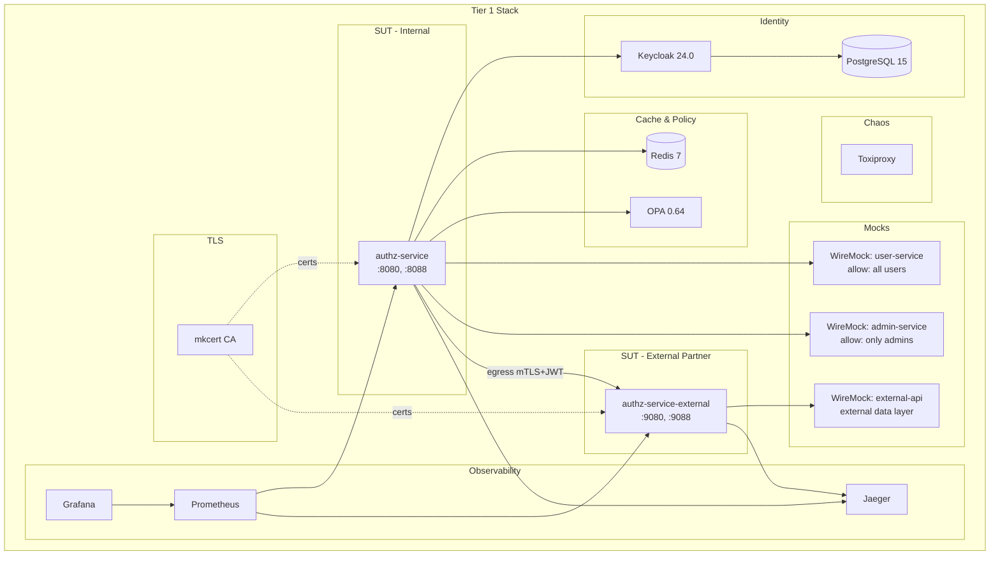
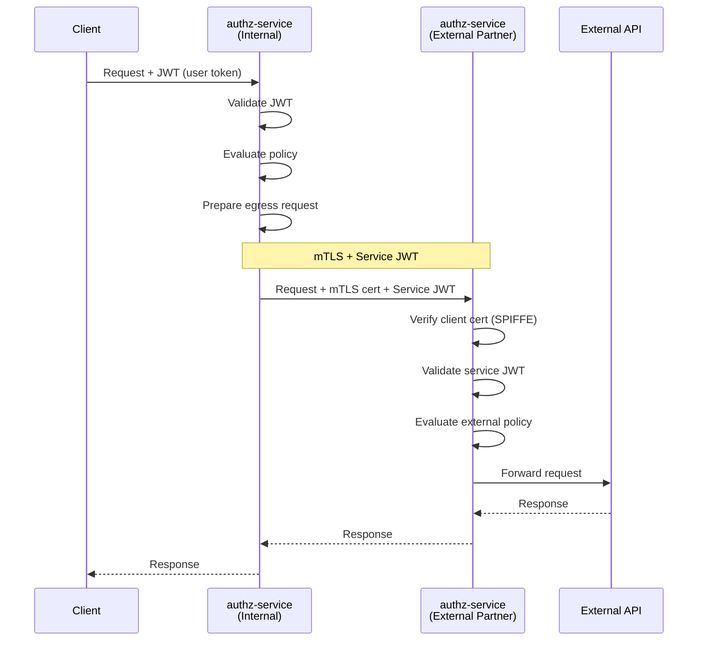

# Tier 1: Docker/Podman Compose (Локальная разработка)

## Назначение

Быстрая локальная разработка и интеграция с CI. Минимальные требования к ресурсам.

---

## Компоненты стека



---

## Инструменты и обоснование выбора

| Инструмент | Версия | Назначение | Почему выбран |
|------------|--------|------------|---------------|
| **Docker Compose** | 2.x | Оркестрация контейнеров (primary) | Стандарт индустрии, широкая поддержка |
| **Podman Compose** | 4.x | Оркестрация контейнеров (fallback) | Rootless безопасность, совместим с Docker |
| **mkcert** | latest | TLS сертификаты | Простой CA для dev, доверен системой |
| **Keycloak** | 24.0 | Identity Provider | Полнофункциональный OIDC/OAuth2, SAML |
| **PostgreSQL** | 15 | БД для Keycloak | Надёжность, production-ready |
| **Redis** | 7 | L2 кэш | Быстрый in-memory store, TTL, Cluster |
| **OPA** | 0.64 | Policy engine | Rego политики, стандарт индустрии |
| **WireMock** | 3.5.4 | Mock сервисы | HTTP stubbing, templating, recording |
| **Toxiproxy** | 2.9.0 | Chaos engineering | Latency, packet loss, connection reset |
| **Jaeger** | 1.55 | Tracing | OTLP support, UI для spans |
| **Prometheus** | 2.51 | Метрики | Pull-based, PromQL |
| **Grafana** | 10.4 | Дашборды | Интеграция Prometheus/Jaeger |

---

## Автоматизация развёртывания

### Выбор runtime (Docker vs Podman)

```bash
#!/bin/bash
# tests/scripts/detect-runtime.sh

# Автоопределение Docker или Podman
if command -v docker &> /dev/null && docker info &> /dev/null; then
    export COMPOSE_CMD="docker compose"
    export CONTAINER_CMD="docker"
    echo "Using Docker"
elif command -v podman-compose &> /dev/null; then
    export COMPOSE_CMD="podman-compose"
    export CONTAINER_CMD="podman"
    echo "Using Podman"
else
    echo "Error: Neither Docker nor Podman found"
    exit 1
fi
```

### Makefile команды

```makefile
# tests/Makefile

.PHONY: tier1-up tier1-down tier1-logs tier1-clean tier1-certs

COMPOSE_FILE := compose/docker-compose.yml

# Автоопределение runtime
COMPOSE_CMD := $(shell if command -v docker >/dev/null 2>&1 && docker info >/dev/null 2>&1; then echo "docker compose"; elif command -v podman-compose >/dev/null 2>&1; then echo "podman-compose"; else echo "docker compose"; fi)
CONTAINER_CMD := $(shell if command -v docker >/dev/null 2>&1 && docker info >/dev/null 2>&1; then echo "docker"; else echo "podman"; fi)

# TLS сертификаты с mkcert
tier1-certs:
	@echo "Генерация TLS сертификатов с mkcert..."
	./scripts/setup-certs.sh

tier1-up: tier1-certs
	$(COMPOSE_CMD) -f $(COMPOSE_FILE) up -d
	@echo "Ожидание готовности сервисов..."
	./scripts/wait-for-services.sh

tier1-down:
	$(COMPOSE_CMD) -f $(COMPOSE_FILE) down

tier1-logs:
	$(COMPOSE_CMD) -f $(COMPOSE_FILE) logs -f

tier1-clean:
	$(COMPOSE_CMD) -f $(COMPOSE_FILE) down -v --rmi local
	rm -rf ./certs/*

tier1-restart:
	$(MAKE) tier1-down
	$(MAKE) tier1-up

tier1-token:
	./scripts/get-test-token.sh
```

### Скрипт генерации сертификатов (mkcert)

```bash
#!/bin/bash
# tests/scripts/setup-certs.sh

set -e

CERTS_DIR="./certs"
mkdir -p "$CERTS_DIR"

# Проверка mkcert
if ! command -v mkcert &> /dev/null; then
    echo "mkcert не найден. Установка..."

    if [[ "$OSTYPE" == "linux-gnu"* ]]; then
        # Linux
        curl -JLO "https://dl.filippo.io/mkcert/latest?for=linux/amd64"
        chmod +x mkcert-v*-linux-amd64
        sudo mv mkcert-v*-linux-amd64 /usr/local/bin/mkcert
    elif [[ "$OSTYPE" == "darwin"* ]]; then
        # macOS
        brew install mkcert
    fi
fi

# Установка локального CA (один раз)
mkcert -install

# Генерация сертификатов для сервисов
echo "Генерация сертификатов..."

# authz-service (internal)
mkcert -cert-file "$CERTS_DIR/authz-service.crt" \
       -key-file "$CERTS_DIR/authz-service.key" \
       authz-service localhost 127.0.0.1

# authz-service-external (partner)
mkcert -cert-file "$CERTS_DIR/authz-external.crt" \
       -key-file "$CERTS_DIR/authz-external.key" \
       authz-service-external localhost 127.0.0.1

# Клиентские сертификаты для mTLS
mkcert -client \
       -cert-file "$CERTS_DIR/client-internal.crt" \
       -key-file "$CERTS_DIR/client-internal.key" \
       "internal-service"

mkcert -client \
       -cert-file "$CERTS_DIR/client-external.crt" \
       -key-file "$CERTS_DIR/client-external.key" \
       "external-partner"

# Копирование CA
cp "$(mkcert -CAROOT)/rootCA.pem" "$CERTS_DIR/ca.crt"

echo "Сертификаты созданы в $CERTS_DIR/"
ls -la "$CERTS_DIR/"
```

### Скрипт ожидания сервисов

```bash
#!/bin/bash
# tests/scripts/wait-for-services.sh

set -e

# Автоопределение runtime
if command -v docker &> /dev/null && docker info &> /dev/null; then
    CONTAINER_CMD="docker"
else
    CONTAINER_CMD="podman"
fi

echo "Ожидание PostgreSQL..."
until $CONTAINER_CMD exec postgres pg_isready -U keycloak; do sleep 2; done

echo "Ожидание Keycloak..."
until curl -sf http://localhost:8180/health/ready > /dev/null; do sleep 5; done

echo "Ожидание Redis..."
until $CONTAINER_CMD exec redis redis-cli ping | grep -q PONG; do sleep 2; done

echo "Ожидание OPA..."
until curl -sf http://localhost:8181/health > /dev/null; do sleep 2; done

echo "Ожидание authz-service..."
until curl -sf http://localhost:15020/healthz/ready > /dev/null; do sleep 2; done

echo "Ожидание authz-service-external..."
until curl -sf http://localhost:25020/healthz/ready > /dev/null; do sleep 2; done

echo "Все сервисы готовы!"
```

### Скрипт получения токена

```bash
#!/bin/bash
# tests/scripts/get-test-token.sh

set -e

KEYCLOAK_URL="${KEYCLOAK_URL:-http://localhost:8180}"
REALM="${REALM:-test}"
CLIENT_ID="${CLIENT_ID:-authz-service}"
CLIENT_SECRET="${CLIENT_SECRET:-authz-secret}"
USERNAME="${USERNAME:-testuser}"
PASSWORD="${PASSWORD:-testpass}"

# Получение токена через Resource Owner Password Grant
TOKEN_RESPONSE=$(curl -s -X POST \
    "${KEYCLOAK_URL}/realms/${REALM}/protocol/openid-connect/token" \
    -H "Content-Type: application/x-www-form-urlencoded" \
    -d "grant_type=password" \
    -d "client_id=${CLIENT_ID}" \
    -d "client_secret=${CLIENT_SECRET}" \
    -d "username=${USERNAME}" \
    -d "password=${PASSWORD}")

ACCESS_TOKEN=$(echo "$TOKEN_RESPONSE" | jq -r '.access_token')

if [ "$ACCESS_TOKEN" == "null" ] || [ -z "$ACCESS_TOKEN" ]; then
    echo "Error: Failed to get token" >&2
    echo "$TOKEN_RESPONSE" >&2
    exit 1
fi

echo "$ACCESS_TOKEN"
```

---

## Docker Compose конфигурация

```yaml
# tests/compose/docker-compose.yml

version: "3.9"

services:
  # ============== Identity Provider ==============
  keycloak:
    image: quay.io/keycloak/keycloak:24.0
    container_name: keycloak
    command: start-dev --import-realm
    environment:
      KEYCLOAK_ADMIN: admin
      KEYCLOAK_ADMIN_PASSWORD: admin
      KC_DB: postgres
      KC_DB_URL: jdbc:postgresql://postgres:5432/keycloak
      KC_DB_USERNAME: keycloak
      KC_DB_PASSWORD: keycloak
      KC_HEALTH_ENABLED: "true"
    ports:
      - "8180:8080"
    volumes:
      - ./keycloak/realm-export.json:/opt/keycloak/data/import/realm.json:ro
    depends_on:
      postgres:
        condition: service_healthy
    networks:
      - backend
    healthcheck:
      test: ["CMD-SHELL", "exec 3<>/dev/tcp/localhost/8080 && echo -e 'GET /health/ready HTTP/1.1\\r\\nHost: localhost\\r\\n\\r\\n' >&3 && cat <&3 | grep -q '200'"]
      interval: 10s
      timeout: 5s
      retries: 15
      start_period: 30s

  postgres:
    image: postgres:15-alpine
    container_name: postgres
    environment:
      POSTGRES_DB: keycloak
      POSTGRES_USER: keycloak
      POSTGRES_PASSWORD: keycloak
    volumes:
      - postgres_data:/var/lib/postgresql/data
    networks:
      - backend
    healthcheck:
      test: ["CMD-SHELL", "pg_isready -U keycloak"]
      interval: 5s
      timeout: 3s
      retries: 5

  # ============== Cache ==============
  redis:
    image: redis:7-alpine
    container_name: redis
    command: redis-server --appendonly yes --maxmemory 256mb --maxmemory-policy allkeys-lru
    ports:
      - "6379:6379"
    volumes:
      - redis_data:/data
    networks:
      - backend
    healthcheck:
      test: ["CMD", "redis-cli", "ping"]
      interval: 5s
      timeout: 3s
      retries: 5

  # ============== Policy Engine ==============
  opa:
    image: openpolicyagent/opa:0.64.0
    container_name: opa
    command:
      - run
      - --server
      - --addr=0.0.0.0:8181
      - --log-level=info
      - /policies
    ports:
      - "8181:8181"
    volumes:
      - ./opa/policies:/policies:ro
    networks:
      - backend
    healthcheck:
      test: ["CMD", "wget", "-q", "--spider", "http://localhost:8181/health"]
      interval: 5s
      timeout: 3s
      retries: 5

  # ============== System Under Test (Internal) ==============
  authz-service:
    build:
      context: ../../
      dockerfile: Dockerfile
    container_name: authz-service
    environment:
      AUTHZ_ENV_NAME: test-internal
      AUTHZ_SERVER_HTTP_ADDR: ":8080"
      AUTHZ_LOGGING_LEVEL: debug
      AUTHZ_LOGGING_FORMAT: json
      # JWT Configuration
      AUTHZ_JWT_ISSUERS_0_NAME: keycloak
      AUTHZ_JWT_ISSUERS_0_ISSUER_URL: "http://keycloak:8080/realms/test"
      AUTHZ_JWT_ISSUERS_0_AUDIENCE_0: "authz-service"
      # Cache
      AUTHZ_CACHE_L1_ENABLED: "true"
      AUTHZ_CACHE_L2_ENABLED: "true"
      AUTHZ_CACHE_L2_REDIS_ADDRESSES_0: "redis:6379"
      # Policy
      AUTHZ_POLICY_ENGINE: "opa_sidecar"
      AUTHZ_POLICY_OPA_URL: "http://opa:8181"
      # Tracing
      AUTHZ_TRACING_ENABLED: "true"
      AUTHZ_TRACING_OTLP_ENDPOINT: "jaeger:4317"
      # TLS for egress to external partner
      AUTHZ_TLS_ENABLED: "true"
      AUTHZ_TLS_CERT_FILE: "/certs/authz-service.crt"
      AUTHZ_TLS_KEY_FILE: "/certs/authz-service.key"
      AUTHZ_TLS_CA_FILE: "/certs/ca.crt"
    ports:
      - "8080:8080"
      - "8088:8088"
      - "8443:8443"
      - "15000:15000"
      - "15020:15020"
      - "15021:15021"
    volumes:
      - ./configs:/etc/authz:ro
      - ./certs:/certs:ro
    depends_on:
      keycloak:
        condition: service_healthy
      redis:
        condition: service_healthy
      opa:
        condition: service_healthy
    networks:
      - frontend
      - backend
      - partner
    healthcheck:
      test: ["CMD", "curl", "-sf", "http://localhost:15020/healthz/ready"]
      interval: 5s
      timeout: 3s
      retries: 10

  # ============== System Under Test (External Partner) ==============
  # Второй экземпляр authz-service для тестирования egress authz-to-authz
  authz-service-external:
    build:
      context: ../../
      dockerfile: Dockerfile
    container_name: authz-service-external
    environment:
      AUTHZ_ENV_NAME: test-external
      AUTHZ_SERVER_HTTP_ADDR: ":8080"
      AUTHZ_LOGGING_LEVEL: debug
      AUTHZ_LOGGING_FORMAT: json
      # JWT - тот же Keycloak для упрощения, в реальности будет другой IDP
      AUTHZ_JWT_ISSUERS_0_NAME: keycloak
      AUTHZ_JWT_ISSUERS_0_ISSUER_URL: "http://keycloak:8080/realms/test"
      AUTHZ_JWT_ISSUERS_0_AUDIENCE_0: "external-service"
      # Cache (свой Redis в production, здесь shared)
      AUTHZ_CACHE_L1_ENABLED: "true"
      AUTHZ_CACHE_L2_ENABLED: "true"
      AUTHZ_CACHE_L2_REDIS_ADDRESSES_0: "redis:6379"
      # Policy
      AUTHZ_POLICY_ENGINE: "builtin"
      # Tracing
      AUTHZ_TRACING_ENABLED: "true"
      AUTHZ_TRACING_OTLP_ENDPOINT: "jaeger:4317"
      # TLS - принимаем mTLS от internal authz
      AUTHZ_TLS_ENABLED: "true"
      AUTHZ_TLS_CERT_FILE: "/certs/authz-external.crt"
      AUTHZ_TLS_KEY_FILE: "/certs/authz-external.key"
      AUTHZ_TLS_CA_FILE: "/certs/ca.crt"
      AUTHZ_TLS_CLIENT_CERT_ENABLED: "true"
    ports:
      - "9080:8080"
      - "9088:8088"
      - "9443:8443"
      - "25000:15000"
      - "25020:15020"
      - "25021:15021"
    volumes:
      - ./configs-external:/etc/authz:ro
      - ./certs:/certs:ro
    depends_on:
      keycloak:
        condition: service_healthy
      redis:
        condition: service_healthy
    networks:
      - partner
      - external
    healthcheck:
      test: ["CMD", "curl", "-sf", "http://localhost:15020/healthz/ready"]
      interval: 5s
      timeout: 3s
      retries: 10

  # ============== Mock Upstream Services ==============
  mock-user-service:
    image: wiremock/wiremock:3.5.4
    container_name: mock-user-service
    command: --verbose --global-response-templating
    ports:
      - "8081:8080"
    volumes:
      - ./wiremock/user-service:/home/wiremock:ro
    networks:
      - backend

  mock-admin-service:
    image: wiremock/wiremock:3.5.4
    container_name: mock-admin-service
    command: --verbose --global-response-templating
    ports:
      - "8082:8080"
    volumes:
      - ./wiremock/admin-service:/home/wiremock:ro
    networks:
      - backend

  mock-external-api:
    image: wiremock/wiremock:3.5.4
    container_name: mock-external-api
    command: --verbose --global-response-templating
    ports:
      - "8083:8080"
    volumes:
      - ./wiremock/external-api:/home/wiremock:ro
    networks:
      - external

  # ============== Chaos Engineering ==============
  toxiproxy:
    image: ghcr.io/shopify/toxiproxy:2.9.0
    container_name: toxiproxy
    ports:
      - "8474:8474"   # API
      - "18080:18080" # keycloak proxy
      - "16379:16379" # redis proxy
      - "18181:18181" # opa proxy
      - "19080:19080" # authz-external proxy
    networks:
      - backend
      - partner

  # ============== Observability ==============
  jaeger:
    image: jaegertracing/all-in-one:1.55
    container_name: jaeger
    environment:
      COLLECTOR_OTLP_ENABLED: "true"
    ports:
      - "16686:16686"  # UI
      - "4317:4317"    # OTLP gRPC
      - "4318:4318"    # OTLP HTTP
    networks:
      - backend

  prometheus:
    image: prom/prometheus:v2.51.0
    container_name: prometheus
    ports:
      - "9090:9090"
    volumes:
      - ./prometheus/prometheus.yml:/etc/prometheus/prometheus.yml:ro
    command:
      - '--config.file=/etc/prometheus/prometheus.yml'
      - '--storage.tsdb.retention.time=1d'
    networks:
      - backend

  grafana:
    image: grafana/grafana:10.4.0
    container_name: grafana
    ports:
      - "3000:3000"
    environment:
      GF_SECURITY_ADMIN_PASSWORD: admin
      GF_AUTH_ANONYMOUS_ENABLED: "true"
      GF_AUTH_ANONYMOUS_ORG_ROLE: Viewer
    volumes:
      - ./grafana/provisioning:/etc/grafana/provisioning:ro
      - ./grafana/dashboards:/var/lib/grafana/dashboards:ro
    networks:
      - backend

networks:
  frontend:
    driver: bridge
  backend:
    driver: bridge
  partner:
    driver: bridge
    # Сеть между internal и external authz
  external:
    driver: bridge
    # Сеть для внешних API

volumes:
  postgres_data:
  redis_data:
```

---

## Сценарий: Egress authz-to-authz (mTLS + JWT)



### Конфигурация egress для internal authz

```yaml
# tests/compose/configs/services.yaml

egress:
  listeners:
    - name: external-partner
      port: 8090
      routes:
        - path_prefix: "/partner"
          target:
            url: "https://authz-service-external:8443"
            tls:
              enabled: true
              cert_file: "/certs/client-internal.crt"
              key_file: "/certs/client-internal.key"
              ca_file: "/certs/ca.crt"
          auth:
            type: oauth2
            oauth2:
              token_url: "http://keycloak:8080/realms/test/protocol/openid-connect/token"
              client_id: "internal-service"
              client_secret: "internal-secret"
              scopes: ["partner:read", "partner:write"]
```

---

## Конфигурационные файлы

### Keycloak Realm (расширенный)

```json
{
  "realm": "test",
  "enabled": true,
  "sslRequired": "none",
  "roles": {
    "realm": [
      {"name": "user"},
      {"name": "admin"},
      {"name": "operator"},
      {"name": "service"}
    ]
  },
  "users": [
    {
      "username": "testuser",
      "enabled": true,
      "email": "testuser@example.com",
      "credentials": [{"type": "password", "value": "testpass"}],
      "realmRoles": ["user"]
    },
    {
      "username": "adminuser",
      "enabled": true,
      "email": "admin@example.com",
      "credentials": [{"type": "password", "value": "adminpass"}],
      "realmRoles": ["user", "admin"]
    },
    {
      "username": "operator",
      "enabled": true,
      "email": "operator@example.com",
      "credentials": [{"type": "password", "value": "operpass"}],
      "realmRoles": ["user", "operator"]
    }
  ],
  "clients": [
    {
      "clientId": "authz-service",
      "enabled": true,
      "publicClient": false,
      "secret": "authz-secret",
      "standardFlowEnabled": true,
      "serviceAccountsEnabled": true,
      "directAccessGrantsEnabled": true,
      "defaultClientScopes": ["openid", "profile", "email"]
    },
    {
      "clientId": "internal-service",
      "enabled": true,
      "publicClient": false,
      "secret": "internal-secret",
      "serviceAccountsEnabled": true,
      "standardFlowEnabled": false,
      "directAccessGrantsEnabled": false,
      "defaultClientScopes": ["partner:read", "partner:write"]
    },
    {
      "clientId": "external-service",
      "enabled": true,
      "publicClient": false,
      "secret": "external-secret",
      "serviceAccountsEnabled": true,
      "standardFlowEnabled": false
    }
  ],
  "clientScopes": [
    {
      "name": "partner:read",
      "protocol": "openid-connect"
    },
    {
      "name": "partner:write",
      "protocol": "openid-connect"
    }
  ]
}
```

### Prometheus (расширенный)

```yaml
# tests/compose/prometheus/prometheus.yml

global:
  scrape_interval: 15s
  evaluation_interval: 15s

scrape_configs:
  - job_name: 'authz-service-internal'
    static_configs:
      - targets: ['authz-service:8080']
    metrics_path: /metrics

  - job_name: 'authz-service-external'
    static_configs:
      - targets: ['authz-service-external:8080']
    metrics_path: /metrics

  - job_name: 'redis'
    static_configs:
      - targets: ['redis:6379']

  - job_name: 'opa'
    static_configs:
      - targets: ['opa:8181']
    metrics_path: /metrics
```

---

## Порты

| Сервис | Порт | Описание |
|--------|------|----------|
| **authz-service (internal)** | 8080 | Main HTTP API |
| | 8088 | Proxy listener |
| | 8443 | HTTPS/mTLS |
| | 15000 | Admin |
| | 15020 | Health |
| | 15021 | Ready |
| **authz-service (external)** | 9080 | Main HTTP API |
| | 9088 | Proxy listener |
| | 9443 | HTTPS/mTLS |
| | 25000 | Admin |
| | 25020 | Health |
| | 25021 | Ready |
| **Keycloak** | 8180 | Admin Console & OIDC |
| **Redis** | 6379 | Cache |
| **OPA** | 8181 | Policy API |
| **Jaeger UI** | 16686 | Tracing UI |
| **Prometheus** | 9090 | Metrics |
| **Grafana** | 3000 | Dashboards |
| **Toxiproxy API** | 8474 | Chaos control |
| **WireMock user** | 8081 | Mock user-service |
| **WireMock admin** | 8082 | Mock admin-service |
| **WireMock external** | 8083 | Mock external-api |

---

## Ресурсные требования

| Ресурс | Минимум | Рекомендуется |
|--------|---------|---------------|
| CPU | 4 cores | 8 cores |
| RAM | 8 GB | 16 GB |
| Disk | 10 GB | 20 GB |

---

## Типичное использование

```bash
# Запуск стека
cd tests
make tier1-up

# Получение тестового токена (user)
export TOKEN=$(./scripts/get-test-token.sh)

# Получение токена admin
export ADMIN_TOKEN=$(USERNAME=adminuser PASSWORD=adminpass ./scripts/get-test-token.sh)

# Проверка internal authz
curl -H "Authorization: Bearer $TOKEN" http://localhost:8080/health

# Проверка external authz
curl -H "Authorization: Bearer $TOKEN" http://localhost:9080/health

# Тест egress authz-to-authz
curl -H "Authorization: Bearer $TOKEN" http://localhost:8080/egress/partner/api/data

# Запуск интеграционных тестов
go test ./integration/... -v -tags=integration

# Запуск E2E тестов
go test ./e2e/... -v -tags=e2e

# Просмотр логов
make tier1-logs

# Остановка
make tier1-down

# Полная очистка
make tier1-clean
```

---

## Troubleshooting

### Docker vs Podman

```bash
# Проверка какой runtime используется
make tier1-up 2>&1 | head -1

# Принудительно использовать Docker
COMPOSE_CMD="docker compose" make tier1-up

# Принудительно использовать Podman
COMPOSE_CMD="podman-compose" make tier1-up
```

### Проблемы с сертификатами

```bash
# Пересоздать сертификаты
rm -rf ./certs/*
make tier1-certs

# Проверить CA установлен
mkcert -CAROOT

# Проверить сертификат
openssl x509 -in ./certs/authz-service.crt -text -noout
```

### Проблемы с Keycloak

```bash
# Логи Keycloak
docker logs keycloak

# Ручной импорт realm
docker exec keycloak /opt/keycloak/bin/kcadm.sh config credentials \
    --server http://localhost:8080 --realm master --user admin --password admin
docker exec keycloak /opt/keycloak/bin/kcadm.sh create realms \
    -f /opt/keycloak/data/import/realm.json
```
