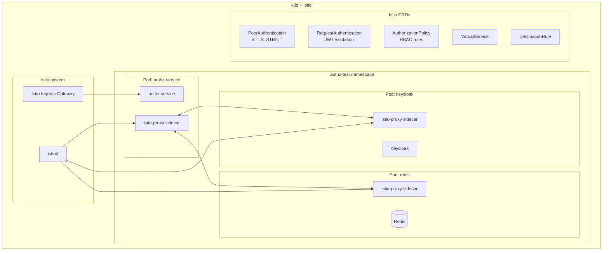
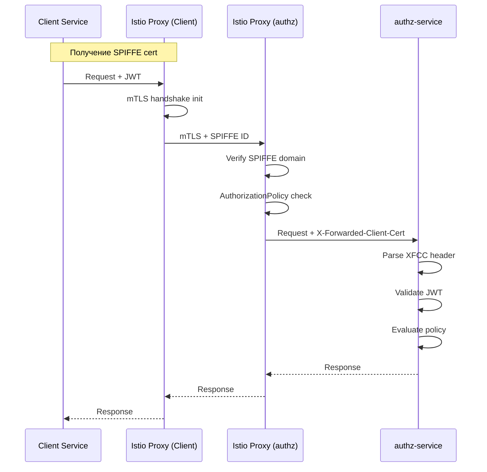

# Tier 3: k3s + Istio + Helm

## Назначение

Service mesh тестирование: mTLS между сервисами, traffic management, advanced observability, AuthorizationPolicy.

---

## Компоненты стека



---

## Инструменты и обоснование выбора

| Инструмент | Версия | Назначение | Почему выбран |
|------------|--------|------------|---------------|
| **Istio** | 1.21+ | Service mesh | mTLS, traffic management, observability, WASM extensions |
| **istioctl** | 1.21+ | CLI | Установка, диагностика, proxy debug |
| **Kiali** | 1.80+ | Service graph | Визуализация mesh, трассировка |
| **cert-manager** | 1.14+ | Сертификаты | Автоматическая ротация TLS |

---

## Автоматизация развёртывания

### Установка Istio

```bash
#!/bin/bash
# tests/scripts/setup-istio.sh

set -e

ISTIO_VERSION="1.21.0"

# Загрузка istioctl
curl -L https://istio.io/downloadIstio | ISTIO_VERSION=$ISTIO_VERSION sh -
export PATH=$PWD/istio-$ISTIO_VERSION/bin:$PATH

# Установка Istio с demo profile
istioctl install --set profile=demo -y

# Включение sidecar injection для namespace
kubectl label namespace authz-test istio-injection=enabled --overwrite

# Ожидание готовности
kubectl wait --for=condition=ready pod -l app=istiod -n istio-system --timeout=300s

echo "Istio готов!"
```

### Makefile

```makefile
# tests/Makefile

.PHONY: tier3-setup tier3-deploy tier3-destroy tier3-mtls-test

NAMESPACE := authz-test

tier3-setup: tier2-setup
	./scripts/setup-istio.sh
	kubectl apply -f ./k8s/istio/peer-authentication.yaml
	kubectl apply -f ./k8s/istio/request-authentication.yaml
	kubectl apply -f ./k8s/istio/authorization-policy.yaml

tier3-deploy: tier2-deploy
	kubectl apply -f ./k8s/istio/virtual-service.yaml
	kubectl apply -f ./k8s/istio/destination-rule.yaml

tier3-mtls-test:
	@echo "Проверка mTLS..."
	istioctl authn tls-check authz-service.$(NAMESPACE).svc.cluster.local

tier3-proxy-debug:
	istioctl proxy-status
	istioctl analyze -n $(NAMESPACE)
```

---

## Istio конфигурация

### PeerAuthentication (mTLS)

```yaml
# tests/k8s/istio/peer-authentication.yaml

apiVersion: security.istio.io/v1
kind: PeerAuthentication
metadata:
  name: default
  namespace: authz-test
spec:
  mtls:
    mode: STRICT
---
# Исключение для Redis (если не поддерживает mTLS)
apiVersion: security.istio.io/v1
kind: PeerAuthentication
metadata:
  name: redis-permissive
  namespace: authz-test
spec:
  selector:
    matchLabels:
      app: redis
  mtls:
    mode: PERMISSIVE
```

### RequestAuthentication (JWT)

```yaml
# tests/k8s/istio/request-authentication.yaml

apiVersion: security.istio.io/v1
kind: RequestAuthentication
metadata:
  name: authz-jwt-auth
  namespace: authz-test
spec:
  selector:
    matchLabels:
      app: authz-service
  jwtRules:
    - issuer: "http://keycloak.authz-test.svc.cluster.local:8080/realms/test"
      jwksUri: "http://keycloak.authz-test.svc.cluster.local:8080/realms/test/protocol/openid-connect/certs"
      forwardOriginalToken: true
      outputPayloadToHeader: x-jwt-payload
```

### AuthorizationPolicy (RBAC)

```yaml
# tests/k8s/istio/authorization-policy.yaml

apiVersion: security.istio.io/v1
kind: AuthorizationPolicy
metadata:
  name: authz-service-policy
  namespace: authz-test
spec:
  selector:
    matchLabels:
      app: authz-service
  rules:
    # Разрешить health checks без авторизации
    - to:
        - operation:
            paths: ["/health*", "/ready*", "/live*", "/metrics"]
            methods: ["GET"]

    # Разрешить S2S с SPIFFE identity
    - from:
        - source:
            principals:
              - "cluster.local/ns/authz-test/sa/client-service"
              - "cluster.local/ns/authz-test/sa/backend-service"
      to:
        - operation:
            methods: ["POST"]
            paths: ["/authorize", "/authorize/batch"]

    # Разрешить с валидным JWT
    - from:
        - source:
            requestPrincipals: ["*"]
      to:
        - operation:
            methods: ["GET", "POST"]
            paths: ["/api/*"]

---
# Deny all по умолчанию для остальных сервисов
apiVersion: security.istio.io/v1
kind: AuthorizationPolicy
metadata:
  name: deny-all
  namespace: authz-test
spec:
  {}  # Пустой spec = deny all
```

### DestinationRule (Circuit Breaker)

```yaml
# tests/k8s/istio/destination-rule.yaml

apiVersion: networking.istio.io/v1
kind: DestinationRule
metadata:
  name: authz-service
  namespace: authz-test
spec:
  host: authz-service
  trafficPolicy:
    connectionPool:
      tcp:
        maxConnections: 100
      http:
        h2UpgradePolicy: UPGRADE
        http1MaxPendingRequests: 100
        http2MaxRequests: 1000
        maxRequestsPerConnection: 100
    outlierDetection:
      consecutive5xxErrors: 5
      interval: 30s
      baseEjectionTime: 30s
      maxEjectionPercent: 50
    tls:
      mode: ISTIO_MUTUAL
```

### VirtualService (Traffic Management)

```yaml
# tests/k8s/istio/virtual-service.yaml

apiVersion: networking.istio.io/v1
kind: VirtualService
metadata:
  name: authz-service
  namespace: authz-test
spec:
  hosts:
    - authz-service
  http:
    - match:
        - uri:
            prefix: /api
      route:
        - destination:
            host: authz-service
            port:
              number: 8080
      timeout: 30s
      retries:
        attempts: 3
        perTryTimeout: 10s
        retryOn: gateway-error,connect-failure,refused-stream
    - route:
        - destination:
            host: authz-service
            port:
              number: 8080
```

---

## Helm values для Istio

```yaml
# tests/helm/authz-service/values-istio.yaml

# Наследует от values-test.yaml

podAnnotations:
  sidecar.istio.io/inject: "true"
  proxy.istio.io/config: |
    holdApplicationUntilProxyStarts: true
    proxyMetadata:
      ISTIO_META_DNS_CAPTURE: "true"

serviceAccount:
  annotations:
    # SPIFFE identity
    spiffe.io/spiffeId: "spiffe://cluster.local/ns/authz-test/sa/authz-service"

# Istio-specific environment
env:
  AUTHZ_TLS_CLIENT_CERT_ENABLED: "true"
  AUTHZ_TLS_CLIENT_CERT_SOURCES_XFCC_ENABLED: "true"
  AUTHZ_TLS_CLIENT_CERT_TRUSTED_SPIFFE_DOMAINS_0: "cluster.local"
```

---

## mTLS + JWT тестовые сценарии



---

## Диагностика

```bash
# Статус mTLS
istioctl authn tls-check authz-service.authz-test.svc.cluster.local

# Анализ конфигурации
istioctl analyze -n authz-test

# Proxy config
istioctl proxy-config listener authz-service-xxx -n authz-test
istioctl proxy-config route authz-service-xxx -n authz-test

# Debug логи
kubectl logs -l app=authz-service -c istio-proxy -n authz-test

# Kiali dashboard
istioctl dashboard kiali
```

---

## Ресурсные требования

| Ресурс | Минимум | Рекомендуется |
|--------|---------|---------------|
| CPU | 4 cores | 8 cores |
| RAM | 8 GB | 16 GB |
| Disk | 40 GB | 80 GB |
| Nodes | 1 | 3 |

---

## Типичное использование

```bash
# Установка k3s + Istio
make tier3-setup

# Деплой с Istio
make tier3-deploy

# Проверка mTLS
make tier3-mtls-test

# Запуск S2S тестов
go test ./e2e/... -v -tags=e2e,istio,mtls

# Диагностика
make tier3-proxy-debug
```
