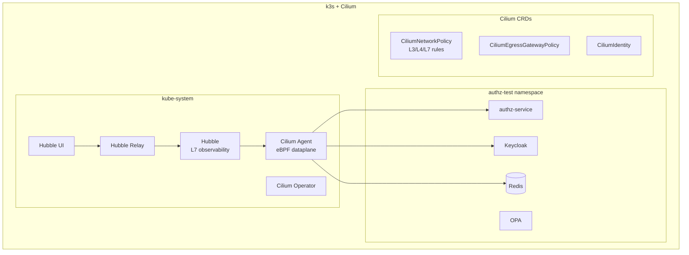
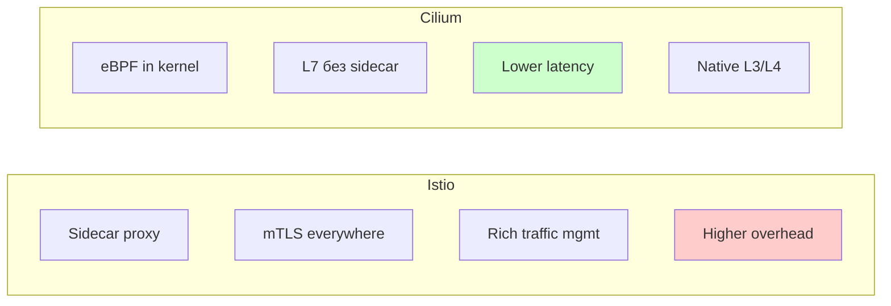

# Tier 4: k3s + Cilium + Helm

## Назначение

eBPF-based networking, L7 visibility, advanced network policies, Hubble observability.

---

## Компоненты стека



---

## Инструменты и обоснование выбора

| Инструмент | Версия | Назначение | Почему выбран |
|------------|--------|------------|---------------|
| **Cilium** | 1.15+ | CNI + Network Policy | eBPF производительность, L7 policies, service mesh без sidecar |
| **Hubble** | встроен | Network observability | Real-time L7 visibility, flow logs |
| **cilium CLI** | 0.16+ | CLI | Диагностика, connectivity tests |

---

## Автоматизация развёртывания

### Установка Cilium

```bash
#!/bin/bash
# tests/scripts/setup-cilium.sh

set -e

CILIUM_VERSION="1.15.0"

# Установка k3s без flannel
curl -sfL https://get.k3s.io | INSTALL_K3S_EXEC="--flannel-backend=none --disable-network-policy" sh -

# Установка Cilium CLI
CILIUM_CLI_VERSION=$(curl -s https://raw.githubusercontent.com/cilium/cilium-cli/main/stable.txt)
curl -L --fail --remote-name-all https://github.com/cilium/cilium-cli/releases/download/${CILIUM_CLI_VERSION}/cilium-linux-amd64.tar.gz
sudo tar xzvfC cilium-linux-amd64.tar.gz /usr/local/bin

# Установка Cilium
cilium install --version $CILIUM_VERSION \
    --set hubble.enabled=true \
    --set hubble.relay.enabled=true \
    --set hubble.ui.enabled=true \
    --set kubeProxyReplacement=true \
    --set k8sServiceHost=$(hostname -I | awk '{print $1}') \
    --set k8sServicePort=6443

# Ожидание готовности
cilium status --wait

# Проверка connectivity
cilium connectivity test

echo "Cilium готов!"
```

### Makefile

```makefile
# tests/Makefile

.PHONY: tier4-setup tier4-deploy tier4-destroy tier4-hubble

NAMESPACE := authz-test

tier4-setup:
	./scripts/setup-cilium.sh
	kubectl create namespace $(NAMESPACE) --dry-run=client -o yaml | kubectl apply -f -

tier4-deploy:
	helm upgrade --install authz ./helm/authz-service \
		-n $(NAMESPACE) \
		-f ./helm/authz-service/values-cilium.yaml \
		--wait
	kubectl apply -f ./k8s/cilium/network-policy.yaml

tier4-hubble:
	cilium hubble ui &
	@echo "Hubble UI: http://localhost:12000"

tier4-flows:
	hubble observe -n $(NAMESPACE) --follow

tier4-connectivity-test:
	cilium connectivity test --test egress-l7
```

---

## Cilium Network Policy

### L3/L4/L7 Policy

```yaml
# tests/k8s/cilium/network-policy.yaml

apiVersion: cilium.io/v2
kind: CiliumNetworkPolicy
metadata:
  name: authz-service-policy
  namespace: authz-test
spec:
  description: "L7 policy for authz-service"
  endpointSelector:
    matchLabels:
      app: authz-service
  ingress:
    # Health checks от kubelet
    - fromEntities:
        - host
      toPorts:
        - ports:
            - port: "15020"
              protocol: TCP
            - port: "15021"
              protocol: TCP

    # API calls от клиентских сервисов
    - fromEndpoints:
        - matchLabels:
            app: client-service
        - matchLabels:
            app: backend-service
      toPorts:
        - ports:
            - port: "8080"
              protocol: TCP
          rules:
            http:
              - method: POST
                path: "/authorize"
              - method: POST
                path: "/authorize/batch"
              - method: GET
                path: "/health"
              - method: GET
                path: "/ready"

    # Prometheus scraping
    - fromEndpoints:
        - matchLabels:
            app: prometheus
      toPorts:
        - ports:
            - port: "8080"
              protocol: TCP
          rules:
            http:
              - method: GET
                path: "/metrics"

  egress:
    # К Keycloak для JWKS
    - toEndpoints:
        - matchLabels:
            app: keycloak
      toPorts:
        - ports:
            - port: "8080"
              protocol: TCP
          rules:
            http:
              - method: GET
                path: "/realms/.*/protocol/openid-connect/certs"
              - method: GET
                path: "/realms/.*/\\.well-known/openid-configuration"

    # К Redis для кэша
    - toEndpoints:
        - matchLabels:
            app: redis
      toPorts:
        - ports:
            - port: "6379"
              protocol: TCP

    # К OPA для политик
    - toEndpoints:
        - matchLabels:
            app: opa
      toPorts:
        - ports:
            - port: "8181"
              protocol: TCP
          rules:
            http:
              - method: POST
                path: "/v1/data/.*"

    # DNS
    - toEndpoints:
        - matchLabels:
            k8s:io.kubernetes.pod.namespace: kube-system
            k8s-app: kube-dns
      toPorts:
        - ports:
            - port: "53"
              protocol: UDP
          rules:
            dns:
              - matchPattern: "*"

---
# Deny all для остальных
apiVersion: cilium.io/v2
kind: CiliumNetworkPolicy
metadata:
  name: default-deny
  namespace: authz-test
spec:
  endpointSelector: {}
  ingress:
    - fromEndpoints:
        - {}
  egress:
    - toEndpoints:
        - {}
```

### Cluster-wide Policy

```yaml
# tests/k8s/cilium/cluster-policy.yaml

apiVersion: cilium.io/v2
kind: CiliumClusterwideNetworkPolicy
metadata:
  name: external-lockdown
spec:
  description: "Block external traffic except allowed"
  endpointSelector:
    matchLabels:
      io.cilium.k8s.policy.cluster: default
  egressDeny:
    - toEntities:
        - world
    - toCIDR:
        - 0.0.0.0/0
  egress:
    # Разрешить только internal
    - toEntities:
        - cluster
```

---

## Helm values для Cilium

```yaml
# tests/helm/authz-service/values-cilium.yaml

# Наследует от values-test.yaml

podAnnotations:
  # Cilium visibility annotations
  policy.cilium.io/proxy-visibility: "<Egress/8080/TCP/HTTP>,<Ingress/8080/TCP/HTTP>"

podLabels:
  # Identity labels для Cilium
  app.kubernetes.io/part-of: authz-system

# Cilium-specific environment
env:
  AUTHZ_LOGGING_LEVEL: info
  # Cilium не требует sidecar для mTLS
  AUTHZ_TLS_CLIENT_CERT_ENABLED: "false"
```

---

## Hubble Observability

### Просмотр flows

```bash
# Все flows в namespace
hubble observe -n authz-test --follow

# HTTP flows
hubble observe -n authz-test --protocol http --follow

# Denied flows
hubble observe -n authz-test --verdict DROPPED --follow

# Flows к конкретному сервису
hubble observe -n authz-test --to-pod authz-service --follow

# L7 HTTP детали
hubble observe -n authz-test --http-method POST --http-path /authorize
```

### Экспорт метрик

```yaml
# Prometheus scrape config для Hubble
- job_name: 'hubble'
  static_configs:
    - targets: ['hubble-metrics.kube-system.svc:9965']
```

---

## Сравнение с Istio



| Аспект | Istio | Cilium |
|--------|-------|--------|
| Dataplane | Envoy sidecar | eBPF |
| Latency overhead | ~1-5ms | ~0.1-0.5ms |
| Memory per pod | +50-100MB | ~0 |
| mTLS | Встроен | Через Cilium mTLS |
| L7 policies | Full | HTTP, Kafka, DNS |
| Traffic management | Rich | Basic |
| Best for | Complex policies | Performance |

---

## Диагностика

```bash
# Статус Cilium
cilium status

# Endpoint list
cilium endpoint list

# Policy enforcement
cilium policy get -n authz-test

# BPF maps
cilium bpf policy get --all

# Connectivity test
cilium connectivity test

# Monitor (live)
cilium monitor -n authz-test
```

---

## Ресурсные требования

| Ресурс | Минимум | Рекомендуется |
|--------|---------|---------------|
| CPU | 4 cores | 8 cores |
| RAM | 8 GB | 16 GB |
| Disk | 40 GB | 80 GB |
| Kernel | 5.4+ | 5.15+ |
| Nodes | 1 | 3 |

---

## Типичное использование

```bash
# Установка k3s + Cilium
make tier4-setup

# Деплой с Cilium policies
make tier4-deploy

# Hubble UI
make tier4-hubble

# Просмотр flows
make tier4-flows

# Connectivity test
make tier4-connectivity-test

# Запуск тестов
go test ./e2e/... -v -tags=e2e,cilium
```
