# Open Policy Agent (OPA) — Интеграция в проект

## Содержание

1. [Обзор OPA](#1-обзор-opa)
2. [Опциональность OPA](#2-опциональность-opa)
3. [Варианты развертывания](#3-варианты-развертывания)
4. [Архитектурные паттерны](#4-архитектурные-паттерны)
5. [Примеры Flow](#5-примеры-flow)
6. [Конфигурация](#6-конфигурация)
7. [Rego Policies](#7-rego-policies)
8. [Интеграция с Go](#8-интеграция-с-go)
9. [Мониторинг и отладка](#9-мониторинг-и-отладка)
10. [Рекомендации](#10-рекомендации)

---

## 1. Обзор OPA

### Что такое OPA

**Open Policy Agent (OPA)** — универсальный policy engine, который отделяет логику принятия решений от бизнес-логики приложений.

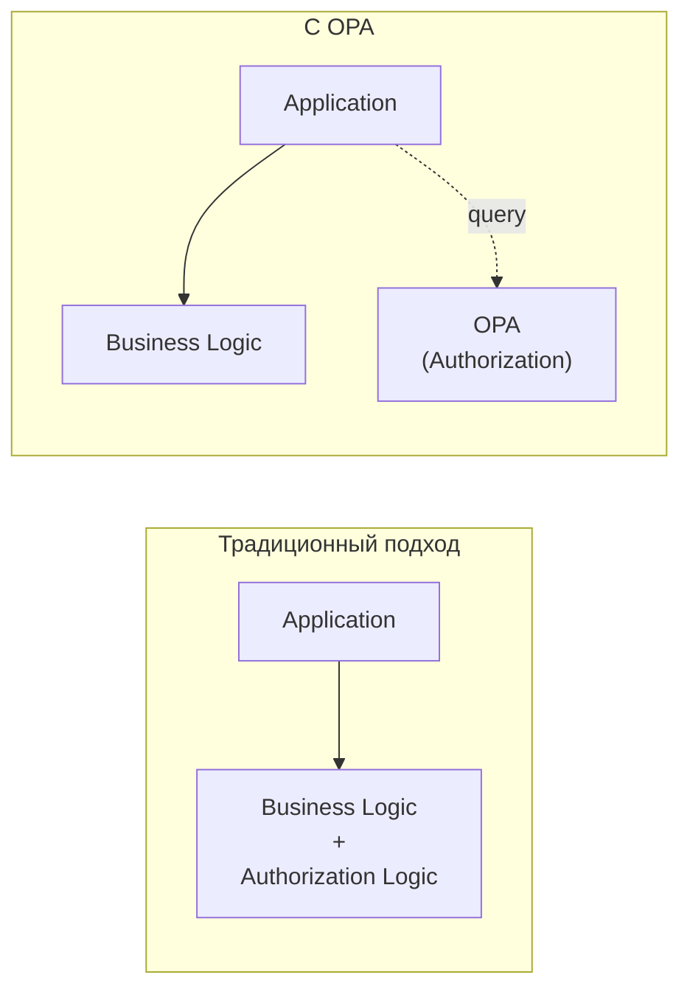

### Ключевые концепции

| Концепция | Описание |
|-----------|----------|
| **Policy** | Набор правил на языке Rego |
| **Data** | Внешние данные для принятия решений (roles, permissions, etc.) |
| **Input** | Данные запроса (method, path, user, etc.) |
| **Decision** | Результат evaluation (allow/deny + metadata) |

### Преимущества OPA

| Преимущество | Описание |
|--------------|----------|
| **Decoupling** | Политики отделены от кода |
| **Declarative** | Rego — декларативный язык |
| **Unified** | Единый engine для всех сервисов |
| **Testable** | Политики можно тестировать отдельно |
| **Auditable** | История изменений в Git |
| **Hot reload** | Обновление без редеплоя |

---

## 2. Опциональность OPA

### Можно ли сделать OPA опциональным?

**Да, OPA может быть опциональным компонентом.** Это достигается через абстракцию Policy Decision Point (PDP) в Go AuthZ Service.

### Архитектура с опциональным OPA

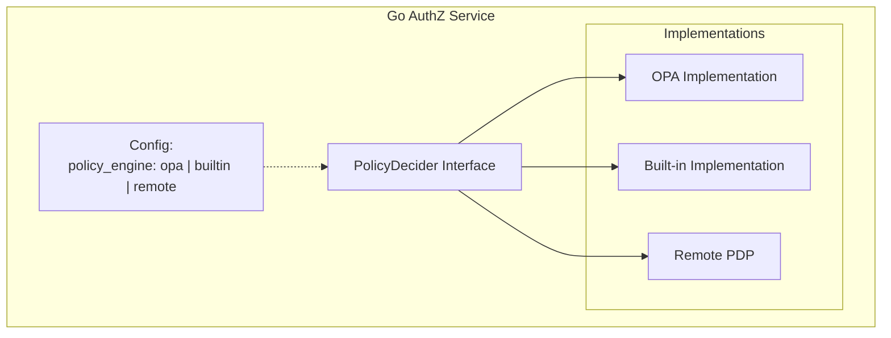

### Режимы работы

| Режим | Описание | Когда использовать |
|-------|----------|-------------------|
| **`builtin`** | Встроенные правила в Go | MVP, простые сценарии |
| **`opa-sidecar`** | OPA как отдельный процесс | Production, Kubernetes |
| **`opa-embedded`** | OPA как Go library | Минимальная latency |
| **`remote`** | Внешний PDP (OPA/Cerbos/etc.) | Централизованное управление |

### Конфигурация опциональности

```yaml
# authz-config.yaml
authorization:
  # Выбор policy engine: builtin | opa-sidecar | opa-embedded | remote
  policy_engine: opa-sidecar

  # Fallback при недоступности OPA
  fallback:
    enabled: true
    engine: builtin
    behavior: deny  # deny | allow | cached

  # Built-in engine config (если policy_engine: builtin)
  builtin:
    rules_path: /etc/authz/rules.yaml

  # OPA sidecar config (если policy_engine: opa-sidecar)
  opa_sidecar:
    url: http://localhost:8181
    policy_path: /v1/data/authz/allow
    timeout: 10ms

  # OPA embedded config (если policy_engine: opa-embedded)
  opa_embedded:
    bundle_path: /etc/opa/bundle.tar.gz
    decision_path: authz/allow

  # Remote PDP config (если policy_engine: remote)
  remote:
    url: https://pdp.example.com
    protocol: grpc  # grpc | http
    timeout: 50ms
```

### Сценарии использования

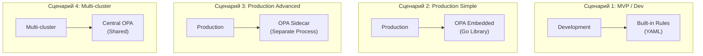

---

## 3. Варианты развертывания

### 3.1. OPA как Sidecar (Рекомендуется для Kubernetes)

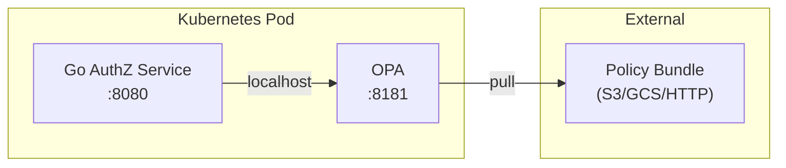

**Kubernetes Deployment:**

```yaml
apiVersion: apps/v1
kind: Deployment
metadata:
  name: authz-service
spec:
  template:
    spec:
      containers:
        # Main application
        - name: authz-service
          image: authz-service:latest
          ports:
            - containerPort: 8080
          env:
            - name: OPA_URL
              value: "http://localhost:8181"

        # OPA Sidecar
        - name: opa
          image: openpolicyagent/opa:0.60.0
          ports:
            - containerPort: 8181
          args:
            - "run"
            - "--server"
            - "--addr=0.0.0.0:8181"
            - "--config-file=/etc/opa/config.yaml"
          volumeMounts:
            - name: opa-config
              mountPath: /etc/opa
            - name: opa-policies
              mountPath: /policies

          resources:
            requests:
              memory: "64Mi"
              cpu: "100m"
            limits:
              memory: "256Mi"
              cpu: "500m"

          livenessProbe:
            httpGet:
              path: /health
              port: 8181
            initialDelaySeconds: 5

          readinessProbe:
            httpGet:
              path: /health?bundle=true
              port: 8181
            initialDelaySeconds: 5

      volumes:
        - name: opa-config
          configMap:
            name: opa-config
        - name: opa-policies
          configMap:
            name: opa-policies
```

**OPA Config (ConfigMap):**

```yaml
apiVersion: v1
kind: ConfigMap
metadata:
  name: opa-config
data:
  config.yaml: |
    services:
      bundle-server:
        url: https://bundle-server.example.com
        credentials:
          bearer:
            token: "${BUNDLE_TOKEN}"

    bundles:
      authz:
        service: bundle-server
        resource: bundles/authz.tar.gz
        polling:
          min_delay_seconds: 10
          max_delay_seconds: 30

    decision_logs:
      console: true
      reporting:
        min_delay_seconds: 5
        max_delay_seconds: 10

    status:
      console: true
```

### 3.2. OPA как Embedded Library (Go)

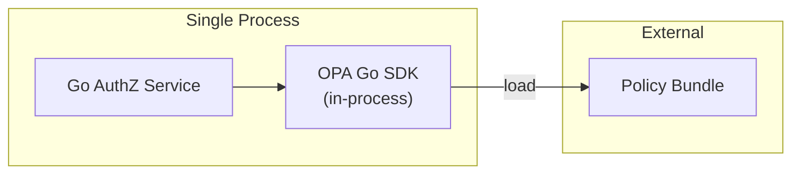

**Преимущества:**
- Минимальная latency (< 100μs)
- Нет сетевых вызовов
- Проще deployment

**Недостатки:**
- Увеличивает memory footprint приложения
- Reload требует механизма hot-reload

### 3.3. OPA как DaemonSet (один на ноду)

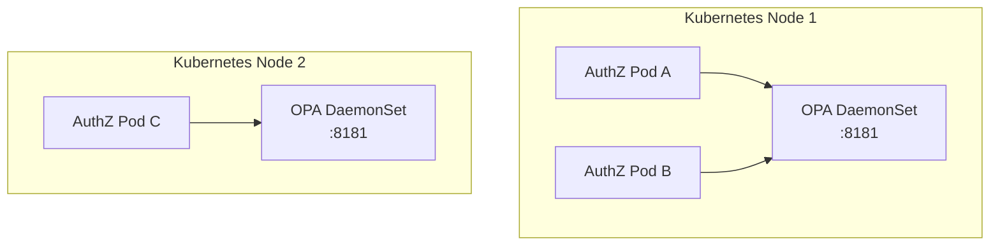

**Когда использовать:**
- Много pods на ноде
- Экономия ресурсов
- Единый policy cache на ноду

### 3.4. Centralized OPA (отдельный Deployment)

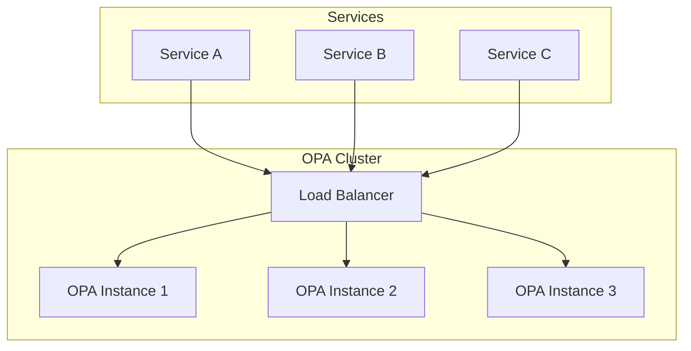

**Когда использовать:**
- Централизованное управление политиками
- Единый audit log
- Сложные политики с большими данными

### 3.5. Сравнение вариантов

| Критерий | Sidecar | Embedded | DaemonSet | Centralized |
|----------|---------|----------|-----------|-------------|
| **Latency** | ~1-5ms | <0.1ms | ~1-5ms | ~5-20ms |
| **Isolation** | Pod-level | In-process | Node-level | Cluster-level |
| **Resources** | Per-pod | Shared | Per-node | Dedicated |
| **Complexity** | Medium | Low | Medium | High |
| **Fault isolation** | High | Low | Medium | Low |
| **Policy sync** | Per-pod | Per-process | Per-node | Central |
| **Best for** | Production K8s | Simple/Edge | Resource saving | Multi-tenant |

---

## 4. Архитектурные паттерны

### 4.1. Паттерн: Policy Decision Abstraction

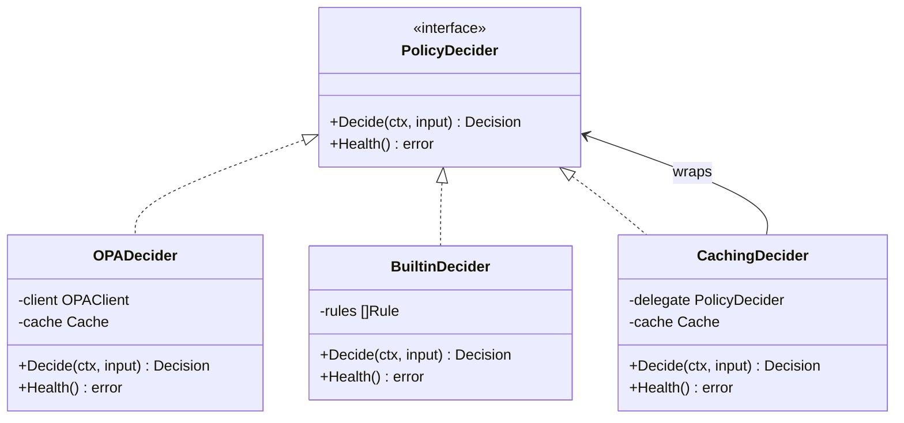

### 4.2. Паттерн: Envoy External Authorization

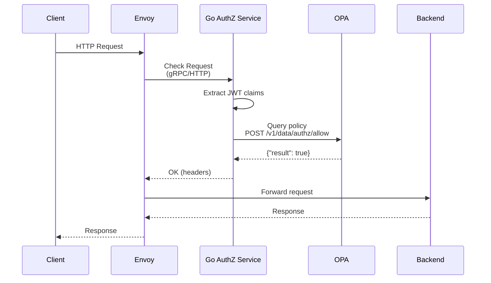

### 4.3. Паттерн: Bundle-based Policy Distribution

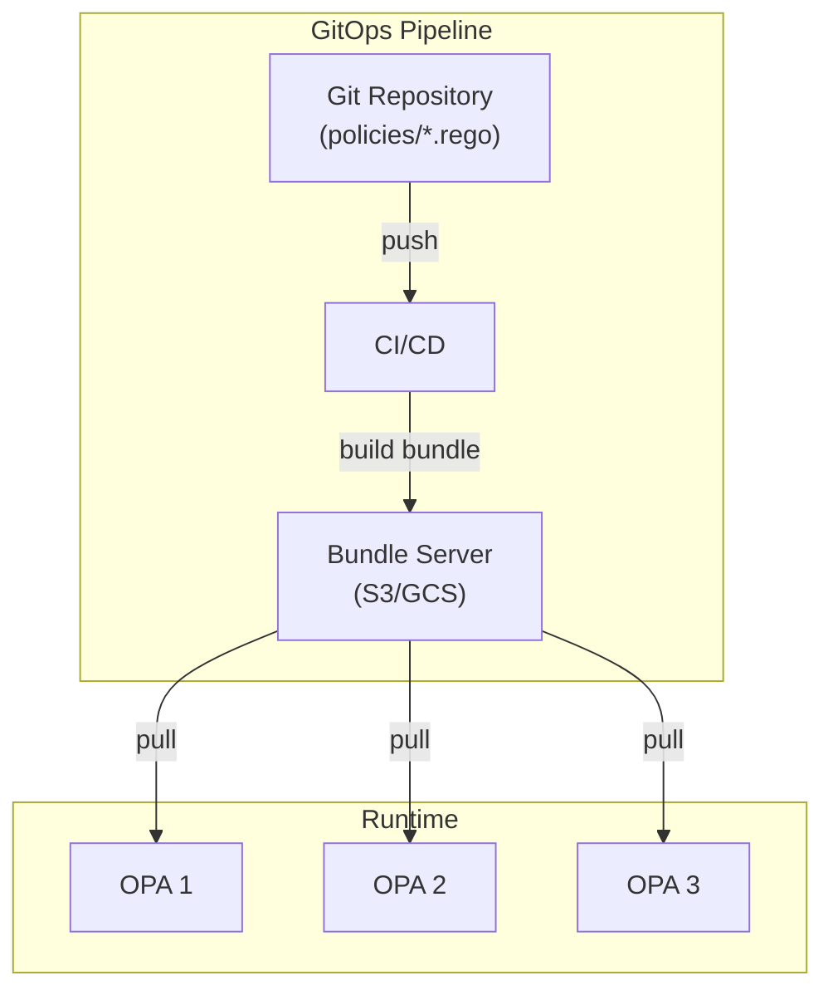

---

## 5. Примеры Flow

### 5.1. User Request Authorization

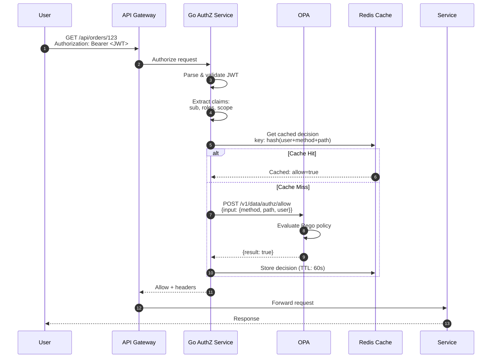

### 5.2. Service-to-Service Authorization

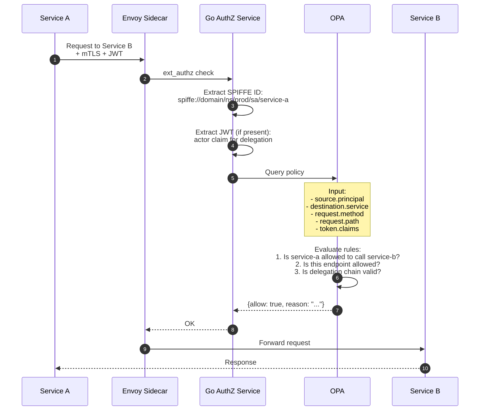

### 5.3. Token Exchange Authorization

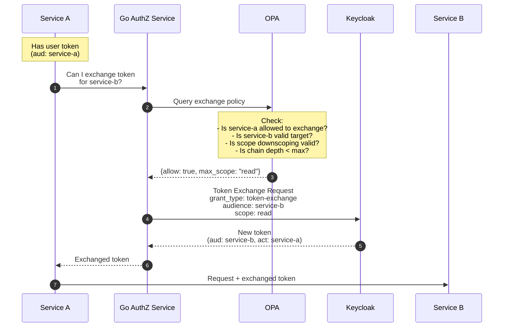

### 5.4. Batch Authorization (Multiple Resources)

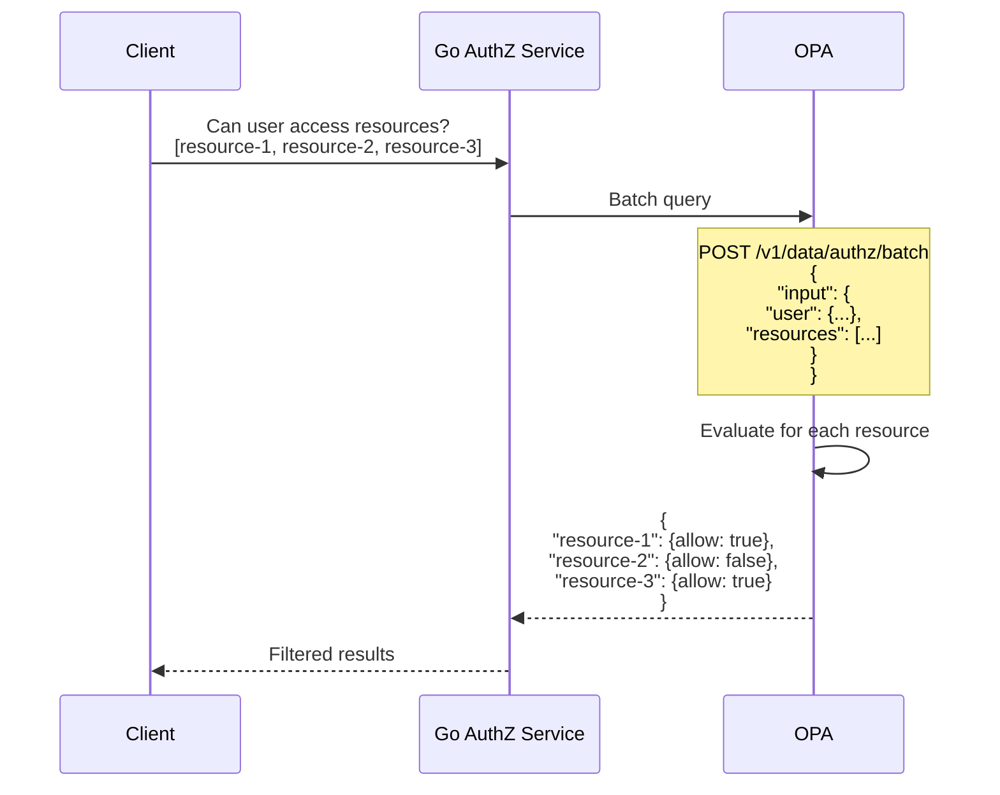

---

## 6. Конфигурация

### 6.1. OPA Server Configuration

```yaml
# opa-config.yaml

# REST API server
addr: ":8181"

# Diagnostic endpoints (health, metrics)
diagnostic_addr: ":8282"

# Decision logging
decision_logs:
  console: true
  plugin: decision_logger
  reporting:
    min_delay_seconds: 1
    max_delay_seconds: 5

# Status reporting
status:
  console: true
  plugin: status_reporter

# Bundle configuration
bundles:
  authz:
    service: bundle-service
    resource: /bundles/authz/bundle.tar.gz
    persist: true
    polling:
      min_delay_seconds: 10
      max_delay_seconds: 30
    signing:
      keyid: global_key
      scope: write

# External services
services:
  bundle-service:
    url: https://bundles.example.com
    credentials:
      bearer:
        token: "${BUNDLE_TOKEN}"
    headers:
      X-Custom-Header: value

# Caching
caching:
  inter_query_builtin_cache:
    max_size_bytes: 104857600  # 100MB

# Server configuration
server:
  encoding:
    gzip:
      min_length: 1024
      compression_level: 9

# Distributed tracing
distributed_tracing:
  type: grpc
  address: otel-collector:4317
  service_name: opa
  sample_percentage: 100

# Keys for bundle signing verification
keys:
  global_key:
    algorithm: RS256
    key: "${SIGNING_PUBLIC_KEY}"
```

### 6.2. Go AuthZ Service Configuration

```yaml
# authz-service-config.yaml

server:
  http:
    addr: ":8080"
    read_timeout: 10s
    write_timeout: 10s
  grpc:
    addr: ":9090"

# Authorization configuration
authorization:
  # Policy engine selection
  policy_engine: opa-sidecar  # builtin | opa-sidecar | opa-embedded

  # OPA Sidecar configuration
  opa:
    url: http://localhost:8181
    policy_path: /v1/data/authz/allow
    health_path: /health
    timeout: 10ms
    retry:
      max_attempts: 3
      initial_backoff: 1ms
      max_backoff: 10ms

  # Caching configuration
  cache:
    enabled: true
    backend: redis
    redis:
      addresses:
        - redis:6379
      password: "${REDIS_PASSWORD}"
      db: 0
    ttl:
      default: 60s
      max: 300s
      negative: 30s
    key_prefix: "authz:"

  # Fallback configuration
  fallback:
    enabled: true
    engine: builtin
    behavior: deny  # deny | allow | cached

  # Built-in rules (for builtin engine or fallback)
  builtin:
    rules:
      # Public endpoints (no auth required)
      - path: "/health"
        methods: ["GET"]
        allow: true

      - path: "/metrics"
        methods: ["GET"]
        allow: true

      # Admin endpoints
      - path: "/admin/*"
        methods: ["*"]
        require_roles: ["admin"]

      # User endpoints
      - path: "/api/v1/users/{id}"
        methods: ["GET"]
        require_roles: ["user", "admin"]
        conditions:
          - "user.id == path.id OR 'admin' in user.roles"

# JWT validation
jwt:
  issuer: https://keycloak.example.com/realms/corp
  audience: authz-service
  jwks_url: https://keycloak.example.com/realms/corp/protocol/openid-connect/certs
  jwks_refresh_interval: 1h
  clock_skew: 30s

# Observability
observability:
  metrics:
    enabled: true
    path: /metrics
  tracing:
    enabled: true
    exporter: otlp
    endpoint: otel-collector:4317
    sample_rate: 1.0
  logging:
    level: info
    format: json
```

### 6.3. Envoy ext_authz Configuration

```yaml
# envoy-config.yaml

static_resources:
  listeners:
    - name: listener_0
      address:
        socket_address:
          address: 0.0.0.0
          port_value: 8080
      filter_chains:
        - filters:
            - name: envoy.filters.network.http_connection_manager
              typed_config:
                "@type": type.googleapis.com/envoy.extensions.filters.network.http_connection_manager.v3.HttpConnectionManager
                stat_prefix: ingress_http
                route_config:
                  name: local_route
                  virtual_hosts:
                    - name: backend
                      domains: ["*"]
                      routes:
                        - match:
                            prefix: "/"
                          route:
                            cluster: backend_service
                http_filters:
                  # External Authorization filter
                  - name: envoy.filters.http.ext_authz
                    typed_config:
                      "@type": type.googleapis.com/envoy.extensions.filters.http.ext_authz.v3.ExtAuthz
                      transport_api_version: V3

                      # gRPC configuration (recommended)
                      grpc_service:
                        envoy_grpc:
                          cluster_name: authz_service
                        timeout: 0.1s

                      # What to send to authz service
                      with_request_body:
                        max_request_bytes: 8192
                        allow_partial_message: true

                      # Failure mode
                      failure_mode_allow: false

                      # Status on error
                      status_on_error:
                        code: 503

                      # Headers to include
                      allowed_headers:
                        patterns:
                          - exact: authorization
                          - exact: x-request-id
                          - prefix: x-custom-

                      # Clear route cache on authz response
                      clear_route_cache: true

                  - name: envoy.filters.http.router
                    typed_config:
                      "@type": type.googleapis.com/envoy.extensions.filters.http.router.v3.Router

  clusters:
    - name: authz_service
      type: STRICT_DNS
      lb_policy: ROUND_ROBIN
      http2_protocol_options: {}
      load_assignment:
        cluster_name: authz_service
        endpoints:
          - lb_endpoints:
              - endpoint:
                  address:
                    socket_address:
                      address: authz-service
                      port_value: 9090

    - name: backend_service
      type: STRICT_DNS
      lb_policy: ROUND_ROBIN
      load_assignment:
        cluster_name: backend_service
        endpoints:
          - lb_endpoints:
              - endpoint:
                  address:
                    socket_address:
                      address: backend
                      port_value: 8080
```

### 6.4. Istio AuthorizationPolicy with OPA

```yaml
# istio-authz-policy.yaml
apiVersion: security.istio.io/v1
kind: AuthorizationPolicy
metadata:
  name: ext-authz
  namespace: prod
spec:
  selector:
    matchLabels:
      app: my-service
  action: CUSTOM
  provider:
    name: opa-ext-authz
  rules:
    - to:
        - operation:
            paths: ["/api/*"]
---
# Istio mesh config for ext-authz provider
apiVersion: install.istio.io/v1alpha1
kind: IstioOperator
spec:
  meshConfig:
    extensionProviders:
      - name: opa-ext-authz
        envoyExtAuthzGrpc:
          service: authz-service.prod.svc.cluster.local
          port: 9090
          timeout: 100ms
          failOpen: false
```

---

## 7. Rego Policies

### 7.1. Базовая структура политики

```rego
# policy/authz.rego
package authz

import rego.v1

# Default deny
default allow := false

# Default empty reasons
default reasons := []

# Main decision
allow if {
    # At least one allow rule must match
    some rule in allow_rules
    rule
}

# Collect denial reasons
reasons := r if {
    not allow
    r := [reason | some check in deny_checks; reason := check]
}
```

### 7.2. HTTP Authorization Policy

```rego
# policy/http_authz.rego
package authz

import rego.v1

# Allow public endpoints
allow if {
    public_endpoint
}

# Allow authenticated users to their allowed resources
allow if {
    valid_token
    user_has_permission
}

# Public endpoints definition
public_endpoint if {
    input.request.method == "GET"
    input.request.path in ["/health", "/metrics", "/ready"]
}

# Token validation
valid_token if {
    input.token.valid == true
    token_not_expired
    token_issuer_valid
    token_audience_valid
}

token_not_expired if {
    now := time.now_ns() / 1e9
    input.token.payload.exp > now
}

token_issuer_valid if {
    input.token.payload.iss == data.config.trusted_issuer
}

token_audience_valid if {
    input.token.payload.aud[_] == data.config.service_audience
}

# Permission check
user_has_permission if {
    # Get user roles
    roles := input.token.payload.realm_access.roles

    # Get required roles for this endpoint
    required := required_roles[input.request.method][input.request.path]

    # Check if user has any required role
    roles[_] == required[_]
}

# Role requirements per endpoint
required_roles := {
    "GET": {
        "/api/v1/users": ["user", "admin"],
        "/api/v1/users/*": ["user", "admin"],
        "/api/v1/admin/*": ["admin"],
    },
    "POST": {
        "/api/v1/users": ["admin"],
        "/api/v1/orders": ["user", "admin"],
    },
    "DELETE": {
        "/api/v1/users/*": ["admin"],
    },
}
```

### 7.3. Service-to-Service Authorization

```rego
# policy/service_authz.rego
package authz.service

import rego.v1

default allow := false

# Allow if service is in allowed list
allow if {
    source_service := input.source.principal
    dest_service := input.destination.service

    # Check service-to-service allowlist
    allowed_targets := data.service_mesh.allowlist[source_service]
    dest_service in allowed_targets
}

# Allow if endpoint is specifically permitted
allow if {
    source_service := input.source.principal
    method := input.request.method
    path := input.request.path

    # Check endpoint-level permissions
    permission := data.service_mesh.permissions[source_service][_]
    permission.method == method
    glob.match(permission.path_pattern, ["/"], path)
}

# Service allowlist data example:
# data.service_mesh.allowlist:
#   "spiffe://domain/ns/prod/sa/service-a":
#     - "service-b"
#     - "service-c"
#   "spiffe://domain/ns/prod/sa/service-b":
#     - "service-c"
```

### 7.4. Token Exchange Authorization

```rego
# policy/token_exchange.rego
package authz.exchange

import rego.v1

default allow := false

# Maximum delegation chain depth
max_chain_depth := 3

allow if {
    valid_exchange_request
    chain_depth_ok
    audience_allowed
    scope_valid
}

valid_exchange_request if {
    input.grant_type == "urn:ietf:params:oauth:grant-type:token-exchange"
    input.subject_token != ""
    input.audience != ""
}

# Check delegation chain depth
chain_depth_ok if {
    # Count actors in chain
    actors := input.token.payload.act
    chain_length := count_chain(actors)
    chain_length < max_chain_depth
}

count_chain(act) := 1 if {
    not act.act
} else := 1 + count_chain(act.act)

# Check if target audience is allowed for this service
audience_allowed if {
    requester := input.client_id
    target := input.audience

    allowed := data.exchange.allowed_audiences[requester]
    target in allowed
}

# Check scope downscoping
scope_valid if {
    requested_scopes := split(input.scope, " ")
    original_scopes := split(input.token.payload.scope, " ")

    # All requested scopes must be in original
    every scope in requested_scopes {
        scope in original_scopes
    }
}
```

### 7.5. ABAC Policy (Attribute-Based)

```rego
# policy/abac.rego
package authz.abac

import rego.v1

default allow := false

# Complex ABAC rule
allow if {
    # Time-based: only during business hours
    business_hours

    # Location-based: from allowed countries
    allowed_country

    # Department-based: user's department matches resource
    department_match

    # Classification: user clearance >= resource classification
    clearance_sufficient
}

business_hours if {
    now := time.now_ns()
    hour := time.clock([now, "Europe/Moscow"])[0]
    hour >= 9
    hour < 18
}

allowed_country if {
    input.context.geo_country in data.config.allowed_countries
}

department_match if {
    input.user.department == input.resource.department
}

clearance_sufficient if {
    clearance_levels := {"public": 0, "internal": 1, "confidential": 2, "secret": 3}
    user_level := clearance_levels[input.user.clearance]
    resource_level := clearance_levels[input.resource.classification]
    user_level >= resource_level
}
```

### 7.6. Policy Testing

```rego
# policy/authz_test.rego
package authz_test

import rego.v1

import data.authz

# Test: public endpoint should be allowed
test_public_endpoint_allowed if {
    authz.allow with input as {
        "request": {
            "method": "GET",
            "path": "/health"
        }
    }
}

# Test: missing token should be denied
test_missing_token_denied if {
    not authz.allow with input as {
        "request": {
            "method": "GET",
            "path": "/api/v1/users"
        },
        "token": {
            "valid": false
        }
    }
}

# Test: admin can delete users
test_admin_can_delete_users if {
    authz.allow with input as {
        "request": {
            "method": "DELETE",
            "path": "/api/v1/users/123"
        },
        "token": {
            "valid": true,
            "payload": {
                "exp": 9999999999,
                "iss": "https://keycloak.example.com/realms/corp",
                "aud": ["authz-service"],
                "realm_access": {
                    "roles": ["admin"]
                }
            }
        }
    }
}

# Test: regular user cannot delete users
test_user_cannot_delete_users if {
    not authz.allow with input as {
        "request": {
            "method": "DELETE",
            "path": "/api/v1/users/123"
        },
        "token": {
            "valid": true,
            "payload": {
                "exp": 9999999999,
                "iss": "https://keycloak.example.com/realms/corp",
                "aud": ["authz-service"],
                "realm_access": {
                    "roles": ["user"]
                }
            }
        }
    }
}
```

---

## 8. Интеграция с Go

### 8.1. Policy Decider Interface

```go
// pkg/authz/decider.go
package authz

import (
    "context"
)

// Decision represents authorization decision
type Decision struct {
    Allow   bool              `json:"allow"`
    Reasons []string          `json:"reasons,omitempty"`
    Headers map[string]string `json:"headers,omitempty"`
}

// Input represents authorization input
type Input struct {
    Request     RequestInfo     `json:"request"`
    Source      SourceInfo      `json:"source,omitempty"`
    Destination DestinationInfo `json:"destination,omitempty"`
    Token       TokenInfo       `json:"token,omitempty"`
    Context     ContextInfo     `json:"context,omitempty"`
}

type RequestInfo struct {
    Method  string            `json:"method"`
    Path    string            `json:"path"`
    Headers map[string]string `json:"headers,omitempty"`
}

type SourceInfo struct {
    Principal string `json:"principal"`
    Namespace string `json:"namespace,omitempty"`
}

type DestinationInfo struct {
    Service   string `json:"service"`
    Namespace string `json:"namespace,omitempty"`
}

type TokenInfo struct {
    Valid   bool                   `json:"valid"`
    Payload map[string]interface{} `json:"payload,omitempty"`
}

type ContextInfo struct {
    Time       string `json:"time,omitempty"`
    GeoCountry string `json:"geo_country,omitempty"`
    ClientIP   string `json:"client_ip,omitempty"`
}

// PolicyDecider interface for authorization decisions
type PolicyDecider interface {
    // Decide makes authorization decision
    Decide(ctx context.Context, input *Input) (*Decision, error)

    // Health checks if decider is healthy
    Health(ctx context.Context) error

    // Close releases resources
    Close() error
}
```

### 8.2. OPA Client Implementation

```go
// pkg/authz/opa/client.go
package opa

import (
    "bytes"
    "context"
    "encoding/json"
    "fmt"
    "net/http"
    "time"

    "github.com/your-org/authz-service/pkg/authz"
)

type Client struct {
    httpClient *http.Client
    baseURL    string
    policyPath string
}

type Config struct {
    URL        string
    PolicyPath string
    Timeout    time.Duration
}

func NewClient(cfg Config) *Client {
    return &Client{
        httpClient: &http.Client{
            Timeout: cfg.Timeout,
        },
        baseURL:    cfg.URL,
        policyPath: cfg.PolicyPath,
    }
}

type opaRequest struct {
    Input *authz.Input `json:"input"`
}

type opaResponse struct {
    Result bool `json:"result"`
}

func (c *Client) Decide(ctx context.Context, input *authz.Input) (*authz.Decision, error) {
    reqBody := opaRequest{Input: input}

    body, err := json.Marshal(reqBody)
    if err != nil {
        return nil, fmt.Errorf("marshal request: %w", err)
    }

    url := fmt.Sprintf("%s%s", c.baseURL, c.policyPath)
    req, err := http.NewRequestWithContext(ctx, http.MethodPost, url, bytes.NewReader(body))
    if err != nil {
        return nil, fmt.Errorf("create request: %w", err)
    }
    req.Header.Set("Content-Type", "application/json")

    resp, err := c.httpClient.Do(req)
    if err != nil {
        return nil, fmt.Errorf("execute request: %w", err)
    }
    defer resp.Body.Close()

    if resp.StatusCode != http.StatusOK {
        return nil, fmt.Errorf("unexpected status: %d", resp.StatusCode)
    }

    var opaResp opaResponse
    if err := json.NewDecoder(resp.Body).Decode(&opaResp); err != nil {
        return nil, fmt.Errorf("decode response: %w", err)
    }

    return &authz.Decision{
        Allow: opaResp.Result,
    }, nil
}

func (c *Client) Health(ctx context.Context) error {
    url := fmt.Sprintf("%s/health", c.baseURL)
    req, err := http.NewRequestWithContext(ctx, http.MethodGet, url, nil)
    if err != nil {
        return err
    }

    resp, err := c.httpClient.Do(req)
    if err != nil {
        return err
    }
    defer resp.Body.Close()

    if resp.StatusCode != http.StatusOK {
        return fmt.Errorf("unhealthy: %d", resp.StatusCode)
    }

    return nil
}

func (c *Client) Close() error {
    c.httpClient.CloseIdleConnections()
    return nil
}
```

### 8.3. OPA Embedded Implementation

```go
// pkg/authz/opa/embedded.go
package opa

import (
    "context"
    "fmt"

    "github.com/open-policy-agent/opa/rego"
    "github.com/open-policy-agent/opa/storage/inmem"

    "github.com/your-org/authz-service/pkg/authz"
)

type EmbeddedOPA struct {
    query rego.PreparedEvalQuery
    store *inmem.Store
}

type EmbeddedConfig struct {
    PolicyPath   string
    DataPath     string
    DecisionPath string // e.g., "data.authz.allow"
}

func NewEmbedded(cfg EmbeddedConfig) (*EmbeddedOPA, error) {
    // Create in-memory store for data
    store := inmem.New()

    // Prepare the query
    query, err := rego.New(
        rego.Query(cfg.DecisionPath),
        rego.Load([]string{cfg.PolicyPath}, nil),
        rego.Store(store),
    ).PrepareForEval(context.Background())

    if err != nil {
        return nil, fmt.Errorf("prepare query: %w", err)
    }

    return &EmbeddedOPA{
        query: query,
        store: store,
    }, nil
}

func (e *EmbeddedOPA) Decide(ctx context.Context, input *authz.Input) (*authz.Decision, error) {
    results, err := e.query.Eval(ctx, rego.EvalInput(input))
    if err != nil {
        return nil, fmt.Errorf("eval: %w", err)
    }

    if len(results) == 0 {
        return &authz.Decision{Allow: false}, nil
    }

    allowed, ok := results[0].Expressions[0].Value.(bool)
    if !ok {
        return nil, fmt.Errorf("unexpected result type")
    }

    return &authz.Decision{Allow: allowed}, nil
}

func (e *EmbeddedOPA) Health(ctx context.Context) error {
    return nil // Embedded is always healthy if initialized
}

func (e *EmbeddedOPA) Close() error {
    return nil
}
```

### 8.4. Caching Decorator

```go
// pkg/authz/cache/caching_decider.go
package cache

import (
    "context"
    "crypto/sha256"
    "encoding/hex"
    "encoding/json"
    "fmt"
    "time"

    "github.com/redis/go-redis/v9"

    "github.com/your-org/authz-service/pkg/authz"
)

type CachingDecider struct {
    delegate authz.PolicyDecider
    redis    *redis.Client
    ttl      time.Duration
    prefix   string
}

type CachingConfig struct {
    TTL    time.Duration
    Prefix string
}

func NewCachingDecider(
    delegate authz.PolicyDecider,
    redisClient *redis.Client,
    cfg CachingConfig,
) *CachingDecider {
    return &CachingDecider{
        delegate: delegate,
        redis:    redisClient,
        ttl:      cfg.TTL,
        prefix:   cfg.Prefix,
    }
}

func (c *CachingDecider) Decide(ctx context.Context, input *authz.Input) (*authz.Decision, error) {
    // Generate cache key
    key := c.cacheKey(input)

    // Try cache first
    cached, err := c.redis.Get(ctx, key).Bytes()
    if err == nil {
        var decision authz.Decision
        if err := json.Unmarshal(cached, &decision); err == nil {
            return &decision, nil
        }
    }

    // Cache miss - call delegate
    decision, err := c.delegate.Decide(ctx, input)
    if err != nil {
        return nil, err
    }

    // Cache the result
    if data, err := json.Marshal(decision); err == nil {
        c.redis.Set(ctx, key, data, c.ttl)
    }

    return decision, nil
}

func (c *CachingDecider) cacheKey(input *authz.Input) string {
    // Create deterministic key from input
    data, _ := json.Marshal(input)
    hash := sha256.Sum256(data)
    return fmt.Sprintf("%s%s", c.prefix, hex.EncodeToString(hash[:16]))
}

func (c *CachingDecider) Health(ctx context.Context) error {
    return c.delegate.Health(ctx)
}

func (c *CachingDecider) Close() error {
    return c.delegate.Close()
}
```

### 8.5. Factory for Policy Decider

```go
// pkg/authz/factory.go
package authz

import (
    "fmt"

    "github.com/redis/go-redis/v9"

    "github.com/your-org/authz-service/pkg/authz/builtin"
    "github.com/your-org/authz-service/pkg/authz/cache"
    "github.com/your-org/authz-service/pkg/authz/opa"
)

type Config struct {
    Engine       string // "builtin", "opa-sidecar", "opa-embedded"
    OPA          opa.Config
    OPAEmbedded  opa.EmbeddedConfig
    Builtin      builtin.Config
    Cache        cache.CachingConfig
    CacheEnabled bool
}

func NewPolicyDecider(cfg Config, redisClient *redis.Client) (PolicyDecider, error) {
    var decider PolicyDecider
    var err error

    switch cfg.Engine {
    case "builtin":
        decider, err = builtin.New(cfg.Builtin)
    case "opa-sidecar":
        decider = opa.NewClient(cfg.OPA)
    case "opa-embedded":
        decider, err = opa.NewEmbedded(cfg.OPAEmbedded)
    default:
        return nil, fmt.Errorf("unknown engine: %s", cfg.Engine)
    }

    if err != nil {
        return nil, err
    }

    // Wrap with caching if enabled
    if cfg.CacheEnabled && redisClient != nil {
        decider = cache.NewCachingDecider(decider, redisClient, cfg.Cache)
    }

    return decider, nil
}
```

---

## 9. Мониторинг и отладка

### 9.1. OPA Metrics

OPA экспортирует Prometheus метрики на `/metrics`:

| Метрика | Тип | Описание |
|---------|-----|----------|
| `opa_decision_duration_seconds` | Histogram | Время принятия решения |
| `opa_decision_total` | Counter | Количество решений |
| `opa_bundle_loaded_total` | Counter | Количество загрузок bundle |
| `opa_bundle_last_successful_download` | Gauge | Timestamp последней загрузки |
| `opa_errors_total` | Counter | Количество ошибок |

### 9.2. Custom Metrics

```go
// pkg/authz/metrics/metrics.go
package metrics

import (
    "github.com/prometheus/client_golang/prometheus"
    "github.com/prometheus/client_golang/prometheus/promauto"
)

var (
    AuthzDecisions = promauto.NewCounterVec(
        prometheus.CounterOpts{
            Name: "authz_decisions_total",
            Help: "Total authorization decisions",
        },
        []string{"engine", "decision", "cached"},
    )

    AuthzLatency = promauto.NewHistogramVec(
        prometheus.HistogramOpts{
            Name:    "authz_decision_duration_seconds",
            Help:    "Authorization decision latency",
            Buckets: []float64{.0001, .0005, .001, .005, .01, .05, .1},
        },
        []string{"engine"},
    )

    CacheHits = promauto.NewCounterVec(
        prometheus.CounterOpts{
            Name: "authz_cache_hits_total",
            Help: "Cache hits",
        },
        []string{"type"},
    )
)
```

### 9.3. Decision Logging

```json
{
  "timestamp": "2024-12-17T10:30:00Z",
  "decision_id": "d8e8fca2-dc0f-40c5-a1d2-b2e3f4a5b6c7",
  "input": {
    "request": {
      "method": "GET",
      "path": "/api/v1/users/123"
    },
    "token": {
      "payload": {
        "sub": "user-456",
        "roles": ["user"]
      }
    }
  },
  "result": {
    "allow": true
  },
  "metrics": {
    "timer_rego_query_eval_ns": 125000,
    "counter_regovm_eval_instructions": 450
  }
}
```

### 9.4. Debugging with OPA REPL

```bash
# Start OPA REPL with policies
opa run -s ./policies/

# In another terminal, test policy
curl -X POST http://localhost:8181/v1/data/authz/allow \
  -H "Content-Type: application/json" \
  -d '{
    "input": {
      "request": {"method": "GET", "path": "/api/v1/users"},
      "token": {"valid": true, "payload": {"roles": ["user"]}}
    }
  }'

# Or use opa eval for local testing
opa eval -i input.json -d policies/ "data.authz.allow"
```

---

## 10. Рекомендации

### 10.1. Выбор режима развертывания

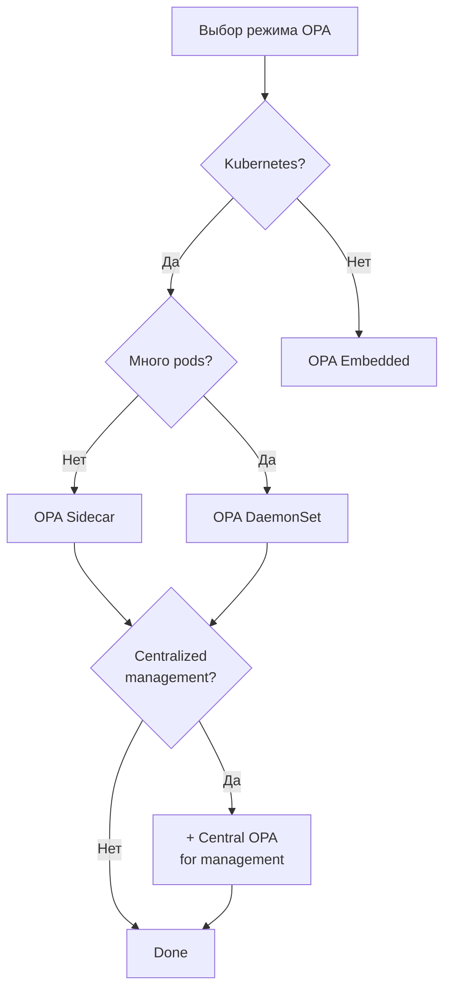

### 10.2. Когда использовать каждый режим

| Сценарий | Рекомендация |
|----------|--------------|
| MVP / Development | `builtin` или `opa-embedded` |
| Production Kubernetes | `opa-sidecar` |
| Edge / IoT | `opa-embedded` |
| Multi-tenant | `opa-sidecar` + central management |
| High-throughput (>10k RPS) | `opa-embedded` с caching |

### 10.3. Best Practices

1. **Политики в Git** — версионирование, review, audit trail
2. **Policy testing** — обязательные тесты для всех политик
3. **Bundle signing** — криптографическая подпись bundles
4. **Graceful degradation** — fallback при недоступности OPA
5. **Caching** — кешировать решения для частых запросов
6. **Monitoring** — метрики latency, decision rate, errors
7. **Decision logging** — audit log всех решений

### 10.4. Миграция к OPA

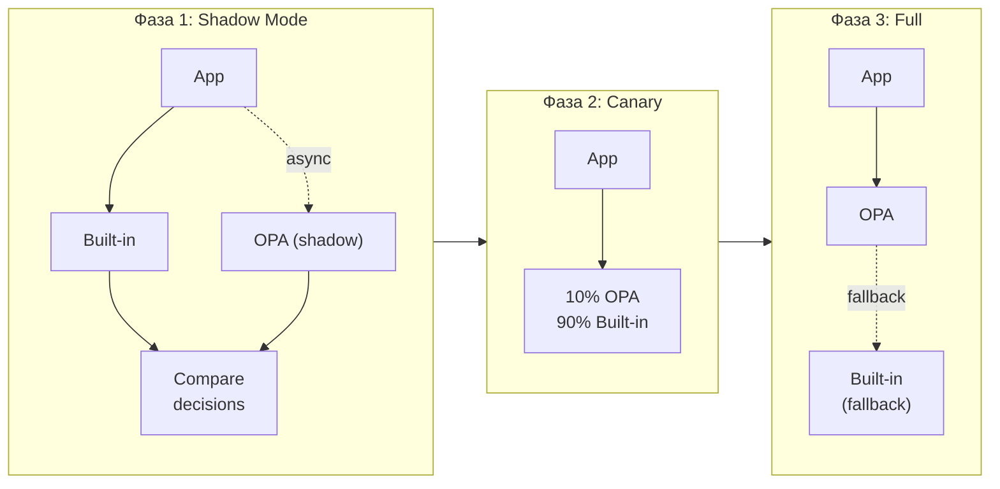

---

## Резюме

OPA **может и должен быть опциональным** компонентом в архитектуре. Это достигается через:

1. **Абстракцию PolicyDecider** — единый интерфейс для разных engines
2. **Конфигурируемый выбор** — через YAML config
3. **Fallback механизм** — graceful degradation
4. **Поэтапную миграцию** — shadow mode → canary → full

Рекомендуемый путь:
- **Dev/MVP**: `builtin` rules
- **Production**: `opa-sidecar` с bundle-based distribution
- **High-scale**: `opa-embedded` с aggressive caching
