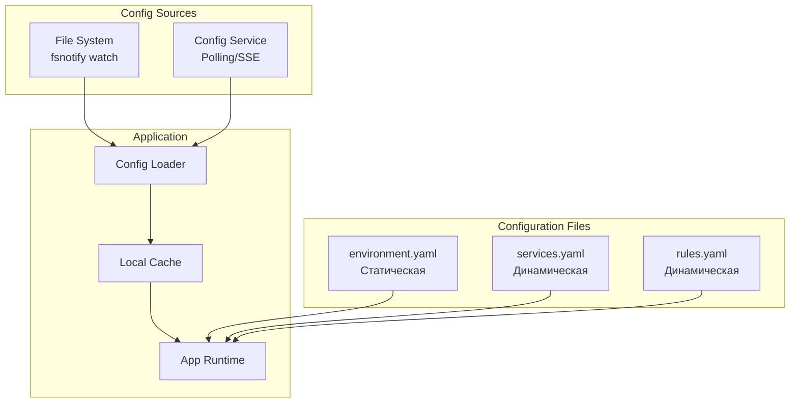
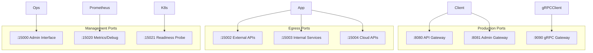
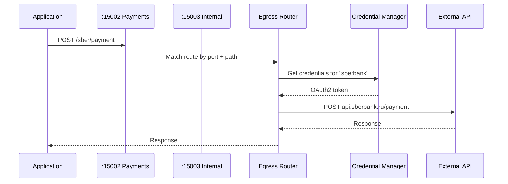

# План рефакторинга authz-service

## Статус выполнения

> **Последнее обновление:** 2025-12-19

| Фаза | Статус | Прогресс |
|------|--------|----------|
| Фаза 1: Реструктуризация конфигурации | ✅ Завершена | 100% |
| Фаза 2: Multi-Port Architecture | ⏳ Не начата | 0% |
| Фаза 3: Egress с маршрутизацией | ⏳ Не начата | 0% |
| Фаза 4: Admin API (Istio-style) | 🔄 Частично | 20% |
| Фаза 5: Runtime Configuration | ✅ Завершена | 100% |
| Фаза 6: Graceful Operations | ⏳ Не начата | 0% |

**Легенда:** ✅ Завершено | 🔄 В процессе | ⏳ Не начато | ❌ Заблокировано

---

## Обзор изменений

Данный документ описывает план рефакторинга authz-service с целью:
1. Разделения конфигурации на 3 логические части
2. Реализации runtime-обновления параметров
3. Поддержки pull-модели загрузки конфигурации из внешнего сервиса
4. Разделения портов на production и management
5. Реализации admin endpoints в стиле Istio sidecar
6. Рефакторинга egress с маршрутизацией по входящим портам
7. Поддержки множества proxy listeners на разных портах

---

## Фаза 1: Реструктуризация конфигурации ✅

> **Статус:** Завершена
> **Файлы:** `internal/config/types.go`, `internal/config/source.go`, `internal/config/loader.go`

### 1.1 Разделение на 3 файла конфигурации ✅

**Реализовано:**
- `environment.yaml` — статическая конфигурация (EnvironmentConfig)
- `services.yaml` — динамическая конфигурация сервисов (ServicesConfig)
- `rules.yaml` — правила авторизации (RulesConfig)



#### environment.yaml (Статическая, требует перезапуск)

```yaml
# Базовые настройки окружения
env:
  name: production
  region: eu-west-1
  cluster: authz-cluster
  version: "1.0.0"

# Настройки серверов (порты статичны)
server:
  http:
    enabled: true
    addr: ":8080"
    read_timeout: 10s
    write_timeout: 30s
    idle_timeout: 120s
    max_header_bytes: 1048576
  management:
    enabled: true
    addr: ":15000"
  health:
    enabled: true
    addr: ":15021"
  grpc:
    enabled: false
    addr: ":9090"

# Настройки логирования
logging:
  level: info
  format: json
  output: stdout

# Настройки трейсинга
tracing:
  enabled: true
  endpoint: "jaeger:4317"
  service_name: "authz-service"

# Источники конфигурации
config_source:
  type: "hybrid"  # file | remote | hybrid

  file:
    services_path: "/etc/authz/services.yaml"
    rules_path: "/etc/authz/rules.yaml"
    watch_enabled: true

  remote:
    endpoint: "https://config-service.internal:8443"
    auth:
      type: "mtls"
      client_cert: "/etc/ssl/client.crt"
      client_key: "/etc/ssl/client.key"
    paths:
      services: "/api/v1/configs/authz/services"
      rules: "/api/v1/configs/authz/rules"
    polling:
      enabled: true
      interval: 30s
      timeout: 10s
    push:
      enabled: true
      type: "sse"

  fallback:
    enabled: true
    cache_path: "/var/cache/authz/"
    max_age: 1h
```

#### services.yaml (Динамическая, runtime-обновляемая)

```yaml
version: "1.0.0"

# Настройки JWT
jwt:
  issuers:
    - name: keycloak
      issuer_url: "http://keycloak:8180/realms/master"
      audience: ["account"]
      algorithms: [RS256, RS384, RS512]
  jwks_cache:
    refresh_interval: 1h
    min_refresh_interval: 5m

# Настройки кеширования
cache:
  l1:
    enabled: true
    max_size: 10000
    ttl: 10s
  l2:
    enabled: false
    backend: redis
    redis:
      addresses: ["localhost:6379"]

# Resilience настройки
resilience:
  rate_limit:
    enabled: true
    rate: 1000
  circuit_breaker:
    enabled: true

# Proxy listeners (множество на разных портах)
proxy:
  listeners:
    - name: api-gateway
      port: 8080
      mode: reverse_proxy
      upstreams:
        api-service:
          url: "http://api-service:8080"
          timeout: 30s
        user-service:
          url: "http://user-service:8080"
          timeout: 15s
      routes:
        - path_prefix: "/api/users"
          upstream: user-service
          methods: [GET, POST, PUT, DELETE]
        - path_prefix: "/api"
          upstream: api-service
      headers:
        add:
          X-Gateway: "main"
        add_user_info: true

    - name: admin-gateway
      port: 8081
      mode: reverse_proxy
      bind: "127.0.0.1"
      upstreams:
        admin-panel:
          url: "http://admin-panel:8080"
      routes:
        - path_prefix: "/"
          upstream: admin-panel

# Egress listeners (маршрутизация по входящим портам)
egress:
  listeners:
    - name: external-payments
      port: 15002
      bind: "0.0.0.0"
      targets:
        sberbank:
          url: "https://api.sberbank.ru"
          auth:
            type: oauth2
            token_url: "https://auth.sberbank.ru/token"
            client_id: "${SBER_CLIENT_ID}"
            client_secret: "${SBER_CLIENT_SECRET}"
        tinkoff:
          url: "https://api.tinkoff.ru"
          auth:
            type: api_key
            header: "X-API-Key"
            key: "${TINKOFF_API_KEY}"
      routes:
        - path_prefix: "/sber"
          target: sberbank
          strip_prefix: true
        - path_prefix: "/tinkoff"
          target: tinkoff
          strip_prefix: true
      default_target: sberbank

    - name: internal-services
      port: 15003
      bind: "127.0.0.1"
      targets:
        user-service:
          url: "http://user-service.svc:8080"
        order-service:
          url: "http://order-service.svc:8080"
      routes:
        - path_prefix: "/users"
          target: user-service
        - path_prefix: "/orders"
          target: order-service

    - name: cloud-apis
      port: 15004
      targets:
        aws:
          url: "https://api.amazonaws.com"
          auth:
            type: aws_sigv4
            role_arn: "${AWS_ROLE_ARN}"
            region: "eu-west-1"
        gcp:
          url: "https://api.googleapis.com"
          auth:
            type: gcp_service_account
            credentials_file: "/etc/gcp/sa.json"
      routes:
        - path_prefix: "/aws"
          target: aws
        - path_prefix: "/gcp"
          target: gcp
```

#### rules.yaml (Динамическая, hot reload)

```yaml
version: "v1.0.0"
description: "Authorization rules"
default_deny: true

rules:
  - name: allow-health-endpoints
    priority: 1000
    enabled: true
    conditions:
      paths: ["/health", "/ready", "/live", "/metrics"]
      methods: [GET]
    effect: allow

  - name: api-admin-access
    priority: 100
    enabled: true
    conditions:
      paths: ["/api/*"]
      roles: [admin, realm-admin]
    effect: allow
```

### 1.2 Config Source Provider ✅

**Реализовано в:** `internal/config/source.go`

| Компонент | Статус | Описание |
|-----------|--------|----------|
| `ConfigSource` interface | ✅ | Load, Watch, Close, GetVersion |
| `FileConfigSource` | ✅ | fsnotify watcher, hot reload |
| `RemoteConfigSource` | ⏳ | HTTP polling, SSE — не реализовано |
| `HybridConfigSource` | ⏳ | Комбинированный источник — не реализовано |

```go
// internal/config/source.go

type ConfigSource interface {
    // Load загружает конфигурацию
    Load(ctx context.Context) (*Config, error)

    // Watch возвращает канал с обновлениями
    Watch(ctx context.Context) (<-chan ConfigUpdate, error)

    // Close освобождает ресурсы
    Close() error
}

type ConfigUpdate struct {
    Type      ConfigType  // environment, services, rules
    Version   string
    Config    any
    Timestamp time.Time
}

// Реализации
type FileConfigSource struct { ... }
type RemoteConfigSource struct { ... }
type HybridConfigSource struct { ... }
```

### 1.3 JSON Schema с x-runtime-updatable ✅

**Реализовано в:** `internal/schema/schema.go`, `internal/config/types.go`

Все конфигурационные структуры помечены тегом `jsonschema_extras:"x-runtime-updatable=true|false"`

```json
{
  "$schema": "http://json-schema.org/draft-07/schema#",
  "title": "Services Configuration",
  "x-config-type": "services",
  "properties": {
    "proxy": {
      "x-runtime-updatable": true,
      "x-runtime-update-scope": "full",
      "properties": {
        "listeners": {
          "x-runtime-updatable": true,
          "x-runtime-update-operations": ["add", "remove", "modify-routes"],
          "items": {
            "properties": {
              "name": {
                "x-runtime-updatable": false,
                "description": "Immutable listener identifier"
              },
              "port": {
                "x-runtime-updatable": "add-only",
                "x-runtime-update-note": "Port can be set on new listeners only"
              },
              "routes": {
                "x-runtime-updatable": true
              }
            }
          }
        }
      }
    }
  }
}
```

---

## Фаза 2: Multi-Port Architecture ⏳

> **Статус:** Не начата
> **Зависимости:** Требуется реализация ListenerManager

### 2.1 Listener Manager ⏳

```go
// internal/transport/listener_manager.go

type ListenerManager struct {
    listeners map[string]*ManagedListener
    mu        sync.RWMutex
    log       *zap.Logger
}

type ManagedListener struct {
    Name     string
    Type     ListenerType  // proxy, egress, management
    Address  string
    Server   *http.Server
    Listener net.Listener
    Handler  http.Handler
    Status   ListenerStatus
}

func (m *ListenerManager) AddListener(ctx context.Context, cfg ListenerConfig) error
func (m *ListenerManager) RemoveListener(ctx context.Context, name string) error
func (m *ListenerManager) UpdateRoutes(name string, routes []RouteConfig) error
func (m *ListenerManager) GetListeners() []ListenerInfo
func (m *ListenerManager) Shutdown(ctx context.Context) error
```

### 2.2 Архитектура портов



---

## Фаза 3: Egress с маршрутизацией по портам ⏳

> **Статус:** Не начата
> **Зависимости:** Требуется Фаза 2 (ListenerManager)
> **Примечание:** Модуль egress пока не реализован

### 3.1 Новая архитектура Egress ⏳



### 3.2 Конфигурация Egress Listener

```go
type EgressListenerConfig struct {
    Name          string                     `yaml:"name"`
    Port          int                        `yaml:"port"`
    Bind          string                     `yaml:"bind"`
    Targets       map[string]EgressTarget    `yaml:"targets"`
    Routes        []EgressRoute              `yaml:"routes"`
    DefaultTarget string                     `yaml:"default_target"`
    Timeout       time.Duration              `yaml:"timeout"`
    Retry         RetryConfig                `yaml:"retry"`
}

type EgressTarget struct {
    URL     string           `yaml:"url"`
    Auth    EgressAuthConfig `yaml:"auth"`
    TLS     TLSConfig        `yaml:"tls"`
    Timeout time.Duration    `yaml:"timeout"`
}
```

---

## Фаза 4: Admin API в стиле Istio 🔄

> **Статус:** Частично реализовано (20%)
> **Реализовано:**
> - Конфигурация портов :15000, :15020, :15021 в `EnvironmentConfig`
> - Defaults в loader.go
>
> **Не реализовано:**
> - HTTP серверы на management портах
> - Admin endpoints (config_dump, listeners, clusters и др.)

### 4.1 Management Port (:15000) ⏳

| Endpoint | Method | Описание |
|----------|--------|----------|
| `/` | GET | HTML dashboard |
| `/help` | GET | Список endpoints |
| `/server_info` | GET | Версия, uptime, build info |
| `/config_dump` | GET | Полный дамп конфигурации |
| `/config_dump?resource=services` | GET | Только services |
| `/config_dump?resource=rules` | GET | Только rules |
| `/listeners` | GET | Активные listeners |
| `/clusters` | GET | Upstreams/targets health |
| `/routes` | GET | Маршруты proxy + egress |
| `/stats` | GET | Статистика key-value |
| `/stats/prometheus` | GET | Prometheus format |
| `/logging` | GET/POST | Уровень логирования |
| `/runtime` | GET | Runtime параметры |
| `/runtime_modify` | POST | Изменение runtime |
| `/healthcheck/fail` | POST | Force unhealthy |
| `/healthcheck/ok` | POST | Restore healthy |
| `/drain` | POST | Graceful drain |
| `/quitquitquit` | POST | Graceful shutdown |

### 4.2 Health Aggregation Port (:15020)

| Endpoint | Method | Описание |
|----------|--------|----------|
| `/stats/prometheus` | GET | Aggregated metrics |
| `/healthz/ready` | GET | Readiness check |
| `/app-health/*` | GET | Per-component health |
| `/debug/pprof/*` | GET | Go profiling |

### 4.3 Readiness Port (:15021)

| Endpoint | Method | Описание |
|----------|--------|----------|
| `/healthz/ready` | GET | Lightweight readiness |

---

## Фаза 5: Runtime Configuration ✅

> **Статус:** Завершена
> **Файлы:** `internal/config/loader.go`, `internal/config/source.go`
>
> **Реализовано:**
> - `Loader` с atomic.Pointer для thread-safe обновлений
> - `Subscribe()` для подписки на изменения конфигурации
> - `StartWatching()` для запуска hot reload
> - `handleUpdate()` для применения изменений
> - `setEnvironmentDefaults()` и `setServicesDefaults()`

### 5.1 Config Watcher ✅

```go
type ConfigWatcher struct {
    source     ConfigSource
    current    *atomic.Pointer[Config]
    subscribers []chan ConfigUpdate
    mu         sync.RWMutex
}

func (w *ConfigWatcher) Start(ctx context.Context) error {
    updates, err := w.source.Watch(ctx)
    if err != nil {
        return err
    }

    go func() {
        for update := range updates {
            if err := w.applyUpdate(update); err != nil {
                w.log.Error("failed to apply config update",
                    zap.Error(err),
                    zap.String("type", string(update.Type)))
                continue
            }
            w.notifySubscribers(update)
        }
    }()

    return nil
}
```

### 5.2 Atomic Update Pattern ✅

```go
type AtomicConfig[T any] struct {
    current atomic.Pointer[T]
    log     *zap.Logger
}

func (c *AtomicConfig[T]) Update(new *T) error {
    // Validate before apply
    if err := validate(new); err != nil {
        return fmt.Errorf("validation failed: %w", err)
    }

    old := c.current.Swap(new)

    c.log.Info("config updated",
        zap.Any("old_version", getVersion(old)),
        zap.Any("new_version", getVersion(new)))

    return nil
}

func (c *AtomicConfig[T]) Get() *T {
    return c.current.Load()
}
```

### 5.3 Runtime Update Matrix ✅

| Параметр | Runtime Update | Примечание |
|----------|----------------|------------|
| `proxy.listeners[].routes` | ✅ Да | Атомарная замена |
| `proxy.listeners[].upstreams` | ✅ Да | Recreate HTTP clients |
| `egress.listeners[].targets` | ✅ Да | Recreate credential managers |
| `egress.listeners[].routes` | ✅ Да | Атомарная замена |
| `jwt.issuers` | ✅ Да | JWKS cache refresh |
| `cache.l1.*` | ✅ Да | Cache invalidation |
| `resilience.*` | ✅ Да | Immediate effect |
| `rules.*` | ✅ Да | Hot reload |
| Добавить новый listener | ✅ Да | Динамически |
| Удалить listener | ✅ Да | Graceful shutdown |
| Изменить port listener | ❌ Нет | Требует add+remove |
| Изменить bind address | ❌ Нет | Требует restart |
| `server.*` | ❌ Нет | Требует restart |
| `logging.format` | ❌ Нет | Требует restart |

---

## Фаза 6: Graceful Operations ⏳

> **Статус:** Не начата
> **Зависимости:** Требуется Фаза 2 (ListenerManager)

### 6.1 Drain Mode ⏳

```go
type DrainController struct {
    draining  atomic.Bool
    activeReq atomic.Int64
    done      chan struct{}
}

func (d *DrainController) StartDrain(ctx context.Context) error {
    d.draining.Store(true)

    // Wait for active requests to complete
    ticker := time.NewTicker(100 * time.Millisecond)
    defer ticker.Stop()

    for {
        select {
        case <-ctx.Done():
            return ctx.Err()
        case <-ticker.C:
            if d.activeReq.Load() == 0 {
                close(d.done)
                return nil
            }
        }
    }
}
```

### 6.2 Hot Add Listener ⏳

```go
func (m *ListenerManager) AddListener(ctx context.Context, cfg ListenerConfig) error {
    m.mu.Lock()
    defer m.mu.Unlock()

    if _, exists := m.listeners[cfg.Name]; exists {
        return fmt.Errorf("listener %s already exists", cfg.Name)
    }

    ln, err := net.Listen("tcp", cfg.Address)
    if err != nil {
        return fmt.Errorf("failed to listen on %s: %w", cfg.Address, err)
    }

    server := &http.Server{
        Handler:      cfg.Handler,
        ReadTimeout:  cfg.ReadTimeout,
        WriteTimeout: cfg.WriteTimeout,
    }

    managed := &ManagedListener{
        Name:     cfg.Name,
        Address:  cfg.Address,
        Server:   server,
        Listener: ln,
        Status:   ListenerStatusStarting,
    }

    go func() {
        managed.Status = ListenerStatusRunning
        if err := server.Serve(ln); err != http.ErrServerClosed {
            m.log.Error("listener error",
                zap.String("name", cfg.Name),
                zap.Error(err))
        }
    }()

    m.listeners[cfg.Name] = managed
    m.log.Info("listener added",
        zap.String("name", cfg.Name),
        zap.String("address", cfg.Address))

    return nil
}
```

---

## Порядок реализации

### Этап 1: Базовая инфраструктура ✅
1. ✅ Реализовать ConfigSource интерфейс
2. ✅ Реализовать FileConfigSource
3. ✅ Разделить config.yaml на 3 файла
4. ✅ Обновить загрузчик конфигурации

### Этап 2: Config Watcher ✅
1. ✅ Реализовать fsnotify watcher
2. ✅ Реализовать atomic config update
3. ✅ Добавить валидацию конфигурации
4. ✅ Тесты hot reload

### Этап 3: Remote Config Source ⏳
1. ⏳ Реализовать HTTP client для Config Service
2. ⏳ Polling механизм
3. ⏳ SSE/long-polling для push updates
4. ⏳ Fallback и local cache

### Этап 4: Listener Manager ⏳
1. ⏳ Абстракция над http.Server
2. ⏳ Динамическое добавление/удаление listeners
3. ⏳ Graceful shutdown per listener
4. ⏳ Метрики per listener

### Этап 5: Multi-Port Proxy ⏳
1. ⏳ Рефакторинг proxy для multi-listener
2. ⏳ Per-listener routes и upstreams
3. ⏳ Shared auth vs per-listener auth
4. ⏳ Тесты

### Этап 6: Multi-Port Egress ⏳
1. ⏳ Рефакторинг egress для multi-listener
2. ⏳ Port-based routing
3. ⏳ Per-listener credential managers
4. ⏳ Тесты

### Этап 7: Admin API ⏳
1. ⏳ Management server на :15000
2. ⏳ Endpoints: config_dump, listeners, clusters
3. ⏳ Health aggregation на :15020
4. ⏳ Readiness на :15021

### Этап 8: JSON Schema ✅
1. ✅ Добавить x-runtime-updatable
2. ✅ Генерация документации
3. ⏳ Валидация с учетом runtime constraints

### Этап 9: Graceful Operations ⏳
1. ⏳ Drain mode
2. ⏳ Hot add/remove listeners
3. ⏳ Health check integration
4. ⏳ E2E тесты

---

## Источники

- [Istio Component Ports](https://tetrate.io/blog/istio-component-ports-and-functions-in-detail)
- [Envoy Admin API](https://www.envoyproxy.io/docs/envoy/latest/operations/admin)
- [Cloudflare Graceful Upgrades in Go](https://blog.cloudflare.com/graceful-upgrades-in-go/)
- [SO_REUSEPORT in Go](https://github.com/kavu/go_reuseport)
- [Seamless Zero-Downtime Deploy](https://github.com/rs/seamless)
