# План исследования: Keycloak + SberID

## Цель исследования

Изучить возможность использования Keycloak с интеграцией SberID как внешнего аутентификатора для назначения ролей пользователям.

**Варианты развертывания:** VM (bare metal), Kubernetes

**База данных:** PostgreSQL (выделенный экземпляр для dev и prod)

---

## Собранная информация

### Keycloak - ключевые факты

| Аспект | Информация |
|--------|------------|
| **Версия** | 26.x (актуальная) |
| **Развертывание** | VM (bare metal), Kubernetes (с Operator) |
| **База данных** | PostgreSQL (рекомендуется для всех сред) |
| **Identity Brokering** | Поддерживает OIDC, SAML, Social Providers |
| **UI** | Admin Console, Account Console, Login Pages |
| **Масштабирование** | Горизонтальное (кластер с Infinispan) |
| **Документация** | [keycloak.org/docs](https://www.keycloak.org/docs/latest/server_admin/) |

### SberID - ключевые факты

| Аспект | Информация |
|--------|------------|
| **Протокол** | OAuth 2.0 / OpenID Connect |
| **Authorization URL** | `https://id.sber.ru/CSAFront/oidc/authorize.do` |
| **Token URL** | `https://api.sberbank.ru/ru/prod/tokens/v2/oidc` |
| **UserInfo URL** | `https://api.sberbank.ru/ru/prod/sberbankid/v2.1/userinfo` |
| **Безопасность** | Требуется mTLS (двусторонний TLS) |
| **Документация** | [developers.sber.ru/docs/ru/sberid](https://developers.sber.ru/docs/ru/sberid/service/overview) |

### SberID Scopes и Claims

**Доступные Scopes:**
- `openid` - обязательный, базовый scope
- `name` - ФИО пользователя
- `email` - email адрес
- `mobile` - номер телефона

**Claims для физических лиц:**
- `sub` - уникальный идентификатор пользователя
- `family_name` - фамилия
- `given_name` - имя
- `birthdate` - дата рождения
- `email` - email
- `inn` - ИНН

**Claims для юридических лиц:**
- `sub`, `inn`, `orgKpp`, `orgOgrn`
- `OrgName`, `orgFullName`
- `userPosition` - должность
- `phone_number`, `email`

---

## Простой тестовый стенд (Quick Start)

> **Назначение:** Быстрый запуск для изучения Keycloak и тестирования интеграции с SberID

### Запуск в Dev Mode (самый простой способ)

Dev Mode — это режим разработки, который автоматически настраивает Keycloak с минимальными требованиями.

#### Требования

- Java 17+ (рекомендуется OpenJDK 21)
- 2 GB RAM минимум
- PostgreSQL (для тестового стенда можно с H2, но лучше сразу PostgreSQL)

#### Шаг 1: Скачивание Keycloak

```bash
# Создание рабочей директории
mkdir ~/keycloak-test && cd ~/keycloak-test

# Скачивание Keycloak 26.0
wget https://github.com/keycloak/keycloak/releases/download/26.0.0/keycloak-26.0.0.zip

# Распаковка
unzip keycloak-26.0.0.zip
cd keycloak-26.0.0
```

#### Шаг 2: Запуск с встроенной H2 (только для изучения!)

```bash
# Установка учетных данных администратора
export KC_BOOTSTRAP_ADMIN_USERNAME=admin
export KC_BOOTSTRAP_ADMIN_PASSWORD=admin

# Запуск в dev mode (H2 in-memory, HTTP без TLS)
bin/kc.sh start-dev
```

**Keycloak доступен по адресу:** http://localhost:8080

#### Шаг 3: Запуск с PostgreSQL (рекомендуется)

```bash
# Установка переменных окружения
export KC_BOOTSTRAP_ADMIN_USERNAME=admin
export KC_BOOTSTRAP_ADMIN_PASSWORD=admin

# Запуск с PostgreSQL
bin/kc.sh start-dev \
  --db=postgres \
  --db-url=jdbc:postgresql://localhost:5432/keycloak \
  --db-username=keycloak \
  --db-password=keycloak
```

#### Быстрая настройка PostgreSQL для тестов

```bash
# Ubuntu/Debian
sudo apt install postgresql

# Создание БД и пользователя
sudo -u postgres psql -c "CREATE USER keycloak WITH PASSWORD 'keycloak';"
sudo -u postgres psql -c "CREATE DATABASE keycloak OWNER keycloak;"
```

### Первые шаги после запуска

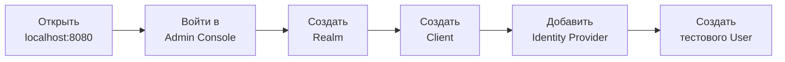

#### 1. Открыть Admin Console

- URL: http://localhost:8080/admin/
- Логин: `admin`
- Пароль: `admin`

#### 2. Создать новый Realm

1. Нажать на выпадающий список "master" в левом верхнем углу
2. Нажать "Create realm"
3. Ввести имя: `test-realm`
4. Нажать "Create"

#### 3. Создать тестового клиента

1. Перейти в **Clients** → **Create client**
2. Client ID: `test-app`
3. Client type: `OpenID Connect`
4. Нажать **Next**
5. Включить **Client authentication** (для confidential client)
6. Нажать **Next**
7. Valid redirect URIs: `http://localhost:3000/*` (или ваш URL)
8. Нажать **Save**
9. Перейти на вкладку **Credentials** → скопировать **Client secret**

#### 4. Создать тестового пользователя

1. Перейти в **Users** → **Add user**
2. Username: `testuser`
3. Email: `test@example.com`
4. Нажать **Create**
5. Перейти на вкладку **Credentials**
6. Нажать **Set password**
7. Ввести пароль, отключить "Temporary"
8. Нажать **Save**

### Полезные URL тестового стенда

| Интерфейс | URL | Описание |
|-----------|-----|----------|
| **Admin Console** | http://localhost:8080/admin/ | Управление Keycloak |
| **Account Console** | http://localhost:8080/realms/test-realm/account/ | Личный кабинет пользователя |
| **Login Page** | http://localhost:8080/realms/test-realm/account/ | Страница входа |
| **OIDC Discovery** | http://localhost:8080/realms/test-realm/.well-known/openid-configuration | Метаданные OIDC |
| **JWKS** | http://localhost:8080/realms/test-realm/protocol/openid-connect/certs | Публичные ключи |

### Тестирование OIDC с curl

```bash
# Получение токена (Resource Owner Password Grant - только для тестов!)
curl -X POST http://localhost:8080/realms/test-realm/protocol/openid-connect/token \
  -H "Content-Type: application/x-www-form-urlencoded" \
  -d "grant_type=password" \
  -d "client_id=test-app" \
  -d "client_secret=YOUR_CLIENT_SECRET" \
  -d "username=testuser" \
  -d "password=YOUR_PASSWORD"

# Проверка токена (Introspection)
curl -X POST http://localhost:8080/realms/test-realm/protocol/openid-connect/token/introspect \
  -H "Content-Type: application/x-www-form-urlencoded" \
  -d "token=YOUR_ACCESS_TOKEN" \
  -d "client_id=test-app" \
  -d "client_secret=YOUR_CLIENT_SECRET"

# Получение информации о пользователе
curl http://localhost:8080/realms/test-realm/protocol/openid-connect/userinfo \
  -H "Authorization: Bearer YOUR_ACCESS_TOKEN"
```

### Остановка и очистка

```bash
# Остановка Keycloak (Ctrl+C в терминале)

# Очистка данных (при использовании H2)
rm -rf ~/keycloak-test/keycloak-26.0.0/data/

# Очистка PostgreSQL
sudo -u postgres psql -c "DROP DATABASE keycloak;"
sudo -u postgres psql -c "DROP USER keycloak;"
```

---

## Keycloak UI - Подробная документация

### Обзор интерфейсов

Keycloak предоставляет несколько веб-интерфейсов из коробки:

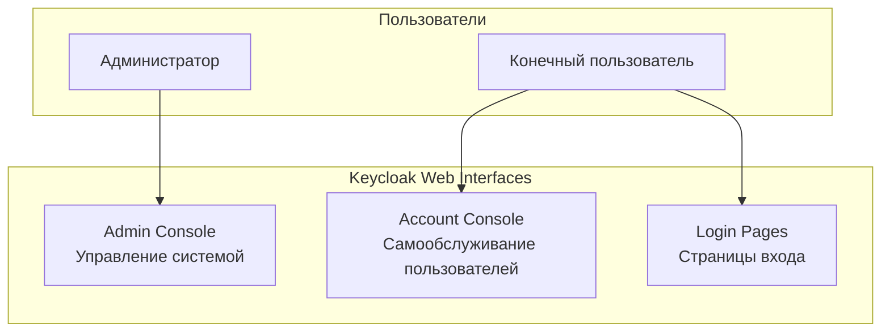

---

### 1. Admin Console (Консоль администратора)

**URL:** `https://<keycloak-host>/admin/`

**Назначение:** Полное управление Keycloak — пользователи, клиенты, роли, Identity Providers и т.д.

#### Структура меню Admin Console

```
┌─────────────────────────────────────────────────────────────────────────┐
│  Keycloak Admin Console                              [Realm: master ▼]  │
├─────────────────────────────────────────────────────────────────────────┤
│                                                                         │
│  MANAGE                          │  MAIN CONTENT AREA                   │
│  ─────────────────────────────   │  ─────────────────────────────────   │
│  ▸ Clients                       │                                      │
│  ▸ Client scopes                 │  [Зависит от выбранного пункта       │
│  ▸ Realm roles                   │   меню - формы, таблицы,             │
│  ▸ Users                         │   настройки]                         │
│  ▸ Groups                        │                                      │
│  ▸ Sessions                      │                                      │
│  ▸ Events                        │                                      │
│                                  │                                      │
│  CONFIGURE                       │                                      │
│  ─────────────────────────────   │                                      │
│  ▸ Realm settings                │                                      │
│  ▸ Authentication                │                                      │
│  ▸ Identity providers  ◀─────── Настройка SberID                       │
│  ▸ User federation               │                                      │
│                                  │                                      │
└─────────────────────────────────────────────────────────────────────────┘
```

#### Ключевые разделы Admin Console

| Раздел | Назначение | Типичные задачи |
|--------|------------|-----------------|
| **Realm settings** | Общие настройки realm | Темы, токены, email, локализация |
| **Clients** | Управление приложениями | Создание OAuth2/OIDC клиентов |
| **Client scopes** | Шаблоны scopes | Настройка claims в токенах |
| **Realm roles** | Глобальные роли | Создание ролей (admin, user, etc.) |
| **Users** | Управление пользователями | Создание, блокировка, сброс пароля |
| **Groups** | Группы пользователей | Иерархия групп, групповые роли |
| **Sessions** | Активные сессии | Просмотр, принудительный logout |
| **Events** | Журнал событий | Логи входов, ошибок, изменений |
| **Authentication** | Потоки аутентификации | Настройка MFA, First Broker Login |
| **Identity providers** | Внешние IdP | SberID, Google, LDAP, SAML |
| **User federation** | Федерация пользователей | LDAP/AD синхронизация |

#### Пошаговое руководство: Настройка Identity Provider

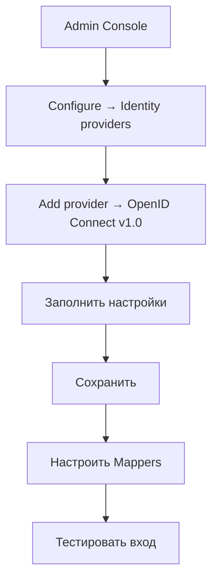

**Шаги:**

1. **Identity providers** → **Add provider** → **OpenID Connect v1.0**

2. **General Settings:**
   - Alias: `sberid` (используется в URL callback)
   - Display name: `Войти через Сбер ID`
   - Enabled: ON

3. **OpenID Connect settings:**
   - Discovery endpoint: (если есть) или ввести вручную
   - Authorization URL: `https://id.sber.ru/CSAFront/oidc/authorize.do`
   - Token URL: `https://api.sberbank.ru/ru/prod/tokens/v2/oidc`
   - Client ID: (от Сбера)
   - Client Secret: (от Сбера)

4. **Advanced settings:**
   - Default Scopes: `openid name email mobile`
   - Sync mode: `force` или `import`

5. **Mappers** → Добавить маппинг атрибутов

---

### 2. Account Console (Личный кабинет пользователя)

**URL:** `https://<keycloak-host>/realms/{realm}/account/`

**Назначение:** Самообслуживание пользователей — управление профилем, паролем, сессиями

#### Структура Account Console

```
┌─────────────────────────────────────────────────────────────────────────┐
│  Account Console                                    [User: john.doe ▼]  │
├─────────────────────────────────────────────────────────────────────────┤
│                                                                         │
│  NAVIGATION                      │  CONTENT                             │
│  ─────────────────────────────   │  ─────────────────────────────────   │
│                                  │                                      │
│  👤 Personal info                │  ┌─────────────────────────────────┐ │
│  🔐 Account security             │  │  Personal info                  │ │
│     ├─ Signing in                │  │                                 │ │
│     └─ Device activity           │  │  First name: [John            ] │ │
│  🔗 Linked accounts              │  │  Last name:  [Doe             ] │ │
│  📋 Applications                 │  │  Email:      [john@example.com] │ │
│  🔔 Groups                       │  │                                 │ │
│                                  │  │  [Save]                         │ │
│                                  │  └─────────────────────────────────┘ │
│                                  │                                      │
└─────────────────────────────────────────────────────────────────────────┘
```

#### Разделы Account Console

| Раздел | Описание | Возможности |
|--------|----------|-------------|
| **Personal info** | Профиль пользователя | Редактирование имени, email |
| **Account security** | Безопасность аккаунта | Смена пароля, OTP настройка |
| **Signing in** | Способы входа | Управление паролем, WebAuthn |
| **Device activity** | Активные устройства | Просмотр сессий, logout |
| **Linked accounts** | Связанные аккаунты | Привязка/отвязка SberID, Google |
| **Applications** | Приложения | Управление согласиями |
| **Groups** | Группы | Просмотр членства в группах |

#### Linked Accounts — интеграция с SberID

После настройки SberID как Identity Provider, пользователи смогут:

1. Войти в Account Console
2. Перейти в **Linked accounts**
3. Нажать **Link account** напротив "Сбер ID"
4. Пройти авторизацию в SberID
5. Аккаунты будут связаны

---

### 3. Login Pages (Страницы входа)

**URL:** Автоматически при обращении к защищённому ресурсу

**Назначение:** Аутентификация пользователей

#### Типы страниц Login

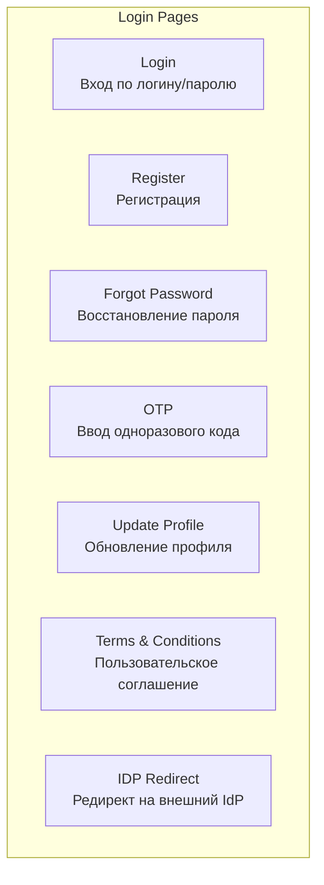

#### Страница входа с SberID

После настройки Identity Provider, страница входа автоматически покажет кнопку SberID:

```
┌─────────────────────────────────────────┐
│              Sign in                     │
├─────────────────────────────────────────┤
│                                         │
│  Username or email                      │
│  ┌─────────────────────────────────┐    │
│  │                                 │    │
│  └─────────────────────────────────┘    │
│                                         │
│  Password                               │
│  ┌─────────────────────────────────┐    │
│  │                                 │    │
│  └─────────────────────────────────┘    │
│                                         │
│  ┌─────────────────────────────────┐    │
│  │         Sign In                 │    │
│  └─────────────────────────────────┘    │
│                                         │
│  ─────────────── or ───────────────     │
│                                         │
│  ┌─────────────────────────────────┐    │
│  │  🟢 Войти через Сбер ID         │    │
│  └─────────────────────────────────┘    │
│                                         │
│  Forgot password?    Register           │
│                                         │
└─────────────────────────────────────────┘
```

---

### 4. Кастомизация UI (Themes)

#### Типы тем

| Тип темы | Описание | Файлы |
|----------|----------|-------|
| `login` | Страницы входа, регистрации | FreeMarker (.ftl), CSS, images |
| `account` | Личный кабинет | React компоненты (v3) |
| `admin` | Консоль администратора | React компоненты |
| `email` | Email-уведомления | FreeMarker (.ftl) |
| `common` | Общие ресурсы | CSS, JS, images |

#### Способы кастомизации

**1. Переопределение темы (простой способ):**

```bash
# Создание директории темы
mkdir -p themes/my-theme/login/resources/css

# Копирование base темы и модификация
cp -r lib/lib/main/org.keycloak.keycloak-themes-*.jar themes/
# Распаковать и модифицировать
```

**2. Keycloakify (рекомендуется для React/Angular/Vue):**

```bash
# Установка
npx create-keycloakify-app my-keycloak-theme

# Разработка
cd my-keycloak-theme
npm run dev

# Сборка
npm run build-keycloak-theme
# Результат: build_keycloak/keycloak-theme.jar
```

**3. npm пакеты (Keycloak 25+):**

```bash
# Для Account Console
npm install @keycloak/keycloak-account-ui

# Для Admin Console
npm install @keycloak/keycloak-admin-ui
```

#### Применение темы

```bash
# В keycloak.conf
spi-theme-default=my-theme

# Или через Admin Console:
# Realm Settings → Themes → Login Theme → my-theme
```

---

### 5. REST API для управления

Keycloak предоставляет полный REST API для автоматизации:

#### Аутентификация в Admin API

```bash
# Получение токена администратора
ACCESS_TOKEN=$(curl -s -X POST \
  "http://localhost:8080/realms/master/protocol/openid-connect/token" \
  -H "Content-Type: application/x-www-form-urlencoded" \
  -d "username=admin" \
  -d "password=admin" \
  -d "grant_type=password" \
  -d "client_id=admin-cli" | jq -r '.access_token')
```

#### Примеры API вызовов

```bash
# Список пользователей
curl -s "http://localhost:8080/admin/realms/test-realm/users" \
  -H "Authorization: Bearer $ACCESS_TOKEN" | jq

# Создание пользователя
curl -s -X POST "http://localhost:8080/admin/realms/test-realm/users" \
  -H "Authorization: Bearer $ACCESS_TOKEN" \
  -H "Content-Type: application/json" \
  -d '{
    "username": "newuser",
    "email": "new@example.com",
    "enabled": true,
    "credentials": [{"type": "password", "value": "password123", "temporary": false}]
  }'

# Список Identity Providers
curl -s "http://localhost:8080/admin/realms/test-realm/identity-provider/instances" \
  -H "Authorization: Bearer $ACCESS_TOKEN" | jq

# Список ролей
curl -s "http://localhost:8080/admin/realms/test-realm/roles" \
  -H "Authorization: Bearer $ACCESS_TOKEN" | jq
```

### Полезные ссылки по UI

- [Server Administration Guide](https://www.keycloak.org/docs/latest/server_admin/index.html) — официальная документация
- [UI Customization Guide](https://www.keycloak.org/ui-customization/introduction) — кастомизация интерфейсов
- [Keycloakify](https://keycloakify.dev) — создание тем на React
- [Keycloak Admin UI npm](https://www.npmjs.com/package/@keycloak/keycloak-admin-ui) — React компоненты
- [Step-by-Step Admin Console Guide](https://www.univention.com/blog-en/2024/10/navigating-the-keycloak-admin-console/) — пошаговое руководство

---

## Варианты развертывания

### Сравнение вариантов

| Критерий | VM (Bare Metal) | Kubernetes + Operator |
|----------|-----------------|----------------------|
| **Сложность настройки** | Средняя | Высокая |
| **Горизонтальное масштабирование** | Ручное | Автоматическое (HPA) |
| **High Availability** | Ручная настройка | Встроенная |
| **Управление конфигурацией** | Файлы/скрипты | Декларативное (CRD) |
| **Обновления** | Ручные | Автоматизированные |
| **Мониторинг** | Настраивается отдельно | Интеграция с Prometheus |
| **Рекомендация** | Небольшие/средние системы | Enterprise, Cloud-native |

---

### Вариант 1: VM (Bare Metal) - Без контейнеризации

#### Архитектура

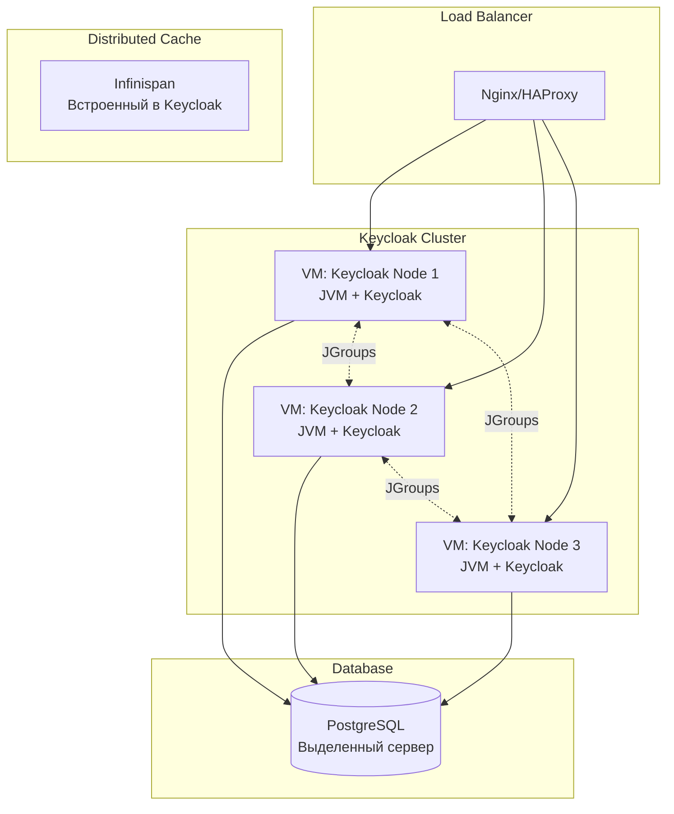

#### Требования к VM

| Компонент | Минимум (Dev) | Рекомендуется (Prod) |
|-----------|---------------|----------------------|
| **CPU** | 2 vCPU | 4+ vCPU |
| **RAM** | 2 GB | 4-8 GB |
| **Disk** | 20 GB SSD | 50+ GB SSD |
| **OS** | Ubuntu 22.04+, RHEL 8+ | Ubuntu 24.04 LTS |
| **Java** | OpenJDK 17+ | OpenJDK 21 (рекомендуется) |

#### Установка на Ubuntu 24.04 LTS

**1. Подготовка системы:**
```bash
# Обновление системы
sudo apt update && sudo apt upgrade -y

# Установка Java 21
sudo apt install -y openjdk-21-jdk

# Проверка версии
java -version
```

**2. Создание пользователя:**
```bash
# Создание системного пользователя keycloak
sudo useradd -r -s /sbin/nologin keycloak

# Создание директорий
sudo mkdir -p /opt/keycloak
sudo mkdir -p /var/log/keycloak
```

**3. Загрузка и установка Keycloak:**
```bash
# Скачивание (версия 26.0)
cd /tmp
wget https://github.com/keycloak/keycloak/releases/download/26.0.0/keycloak-26.0.0.zip

# Распаковка
sudo unzip keycloak-26.0.0.zip -d /opt/
sudo mv /opt/keycloak-26.0.0/* /opt/keycloak/

# Права доступа
sudo chown -R keycloak:keycloak /opt/keycloak
sudo chown -R keycloak:keycloak /var/log/keycloak
```

**4. Конфигурация PostgreSQL:**
```bash
# Файл: /opt/keycloak/conf/keycloak.conf

# Database
db=postgres
db-url=jdbc:postgresql://pg-server.internal:5432/keycloak
db-username=keycloak
db-password=${DB_PASSWORD}
db-pool-initial-size=10
db-pool-min-size=10
db-pool-max-size=50

# HTTP/HTTPS
http-enabled=false
https-port=8443
https-certificate-file=/opt/keycloak/conf/tls/server.crt
https-certificate-key-file=/opt/keycloak/conf/tls/server.key

# Hostname
hostname=keycloak.example.com
hostname-strict=true

# Clustering (для нескольких нод)
cache=ispn
cache-stack=tcp

# Logging
log=console,file
log-file=/var/log/keycloak/keycloak.log
log-level=INFO

# Metrics
metrics-enabled=true
health-enabled=true
```

**5. Сборка оптимизированного Keycloak:**
```bash
# Build (выполняется один раз при изменении конфигурации)
sudo -u keycloak /opt/keycloak/bin/kc.sh build
```

**6. Systemd Unit File:**
```ini
# Файл: /etc/systemd/system/keycloak.service

[Unit]
Description=Keycloak Identity and Access Management
After=network.target postgresql.service
Wants=postgresql.service

[Service]
Type=simple
User=keycloak
Group=keycloak

Environment="JAVA_OPTS=-Xms1024m -Xmx2048m -XX:MetaspaceSize=96m"
Environment="KC_DB_PASSWORD=your-db-password"

ExecStart=/opt/keycloak/bin/kc.sh start --optimized

Restart=on-failure
RestartSec=10

# Security hardening
NoNewPrivileges=true
ProtectSystem=strict
ProtectHome=true
ReadWritePaths=/opt/keycloak /var/log/keycloak

[Install]
WantedBy=multi-user.target
```

**7. Запуск службы:**
```bash
sudo systemctl daemon-reload
sudo systemctl enable keycloak
sudo systemctl start keycloak
sudo systemctl status keycloak
```

**8. Создание начального администратора:**
```bash
# Первый запуск - создание admin пользователя
export KC_BOOTSTRAP_ADMIN_USERNAME=admin
export KC_BOOTSTRAP_ADMIN_PASSWORD=<secure-password>
sudo -u keycloak /opt/keycloak/bin/kc.sh start --optimized
```

#### Кластеризация на VM (Горизонтальное масштабирование)

Для кластера из нескольких VM нужна дополнительная настройка:

**1. Конфигурация JGroups (cache-ispn.xml):**
```xml
<!-- /opt/keycloak/conf/cache-ispn.xml -->
<infinispan>
    <jgroups>
        <stack name="tcp">
            <TCP bind_addr="${jgroups.bind.address:SITE_LOCAL}"
                 bind_port="${jgroups.bind.port:7800}"/>
            <TCPPING initial_hosts="${jgroups.tcpping.initial_hosts}"
                     port_range="0"/>
            <MERGE3/>
            <FD_SOCK/>
            <FD_ALL timeout="30000" interval="5000"/>
            <VERIFY_SUSPECT timeout="1500"/>
            <pbcast.NAKACK2/>
            <UNICAST3/>
            <pbcast.STABLE/>
            <pbcast.GMS/>
            <MFC/>
            <FRAG3/>
        </stack>
    </jgroups>

    <cache-container name="keycloak">
        <transport stack="tcp"/>
        <!-- cache definitions -->
    </cache-container>
</infinispan>
```

**2. Переменные окружения для каждой ноды:**
```bash
# Node 1
JAVA_OPTS="-Djgroups.bind.address=192.168.1.11 \
           -Djgroups.tcpping.initial_hosts=192.168.1.11[7800],192.168.1.12[7800],192.168.1.13[7800]"

# Node 2
JAVA_OPTS="-Djgroups.bind.address=192.168.1.12 \
           -Djgroups.tcpping.initial_hosts=192.168.1.11[7800],192.168.1.12[7800],192.168.1.13[7800]"
```

---

### Вариант 2: Kubernetes с Operator

#### Зачем нужен Keycloak Operator?

**Keycloak Operator** — это Kubernetes controller, который автоматизирует управление Keycloak через Custom Resource Definitions (CRD).

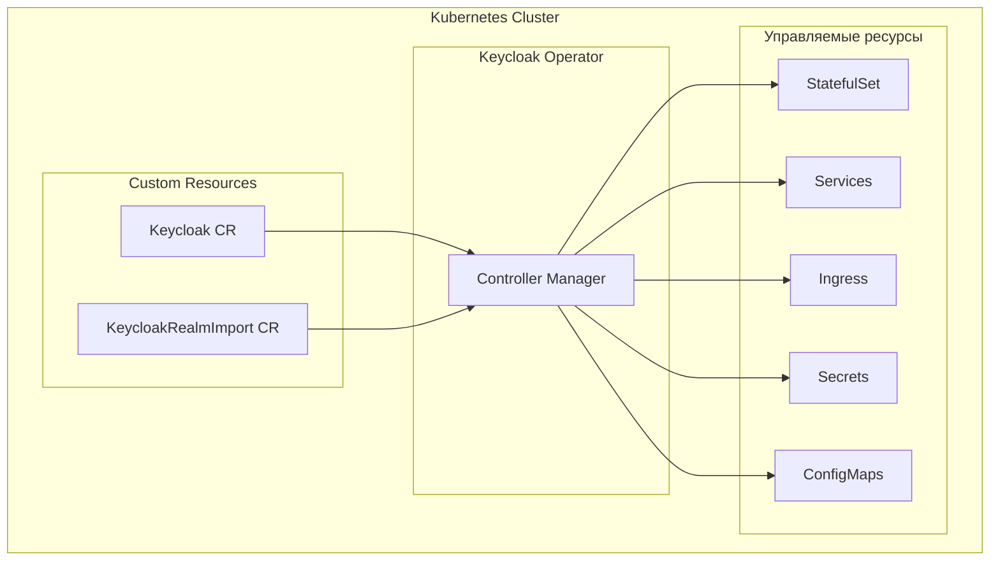

#### Преимущества Operator vs ручное развертывание

| Аспект | Без Operator | С Operator |
|--------|--------------|------------|
| **Развертывание** | Ручное создание Deployment/StatefulSet | Декларативный CR |
| **Масштабирование** | Ручное изменение replicas | `spec.instances: N` + HPA |
| **Обновления** | Ручное обновление image | Автоматический rolling update |
| **Конфигурация** | ConfigMaps, env vars | Единый CR + Secrets |
| **Realm Import** | Ручной или init container | KeycloakRealmImport CR |
| **TLS** | Ручная настройка | `spec.http.tlsSecret` |
| **Health Checks** | Ручная настройка probes | Автоматически |
| **Reconciliation** | Нет | Автоматическое восстановление |

#### Что делает Operator автоматически:

1. **Создаёт и управляет StatefulSet** — поды Keycloak с правильными настройками
2. **Настраивает Services** — ClusterIP, headless для кластеризации
3. **Конфигурирует Ingress** — маршрутизация трафика
4. **Управляет Secrets** — DB credentials, TLS сертификаты
5. **Настраивает JGroups** — автоматическая кластеризация
6. **Импортирует Realms** — через KeycloakRealmImport CR
7. **Мониторинг** — интеграция с Prometheus
8. **Self-healing** — восстановление при сбоях

#### Установка Operator

```bash
# Установка CRDs
kubectl apply -f https://raw.githubusercontent.com/keycloak/keycloak-k8s-resources/26.0.0/kubernetes/keycloaks.k8s.keycloak.org-v1.yml
kubectl apply -f https://raw.githubusercontent.com/keycloak/keycloak-k8s-resources/26.0.0/kubernetes/keycloakrealmimports.k8s.keycloak.org-v1.yml

# Установка Operator
kubectl create namespace keycloak
kubectl apply -f https://raw.githubusercontent.com/keycloak/keycloak-k8s-resources/26.0.0/kubernetes/keycloak-operator.yaml
```

#### Пример Keycloak CR

```yaml
apiVersion: k8s.keycloak.org/v2alpha1
kind: Keycloak
metadata:
  name: keycloak
  namespace: keycloak
spec:
  # Количество реплик (горизонтальное масштабирование)
  instances: 3

  # База данных
  db:
    vendor: postgres
    host: postgres.database.svc.cluster.local
    port: 5432
    database: keycloak
    usernameSecret:
      name: keycloak-db-secret
      key: username
    passwordSecret:
      name: keycloak-db-secret
      key: password
    poolInitialSize: 10
    poolMinSize: 10
    poolMaxSize: 50

  # Hostname
  hostname:
    hostname: keycloak.example.com
    strict: true

  # TLS
  http:
    tlsSecret: keycloak-tls-secret
    httpEnabled: false

  # Включенные features
  features:
    enabled:
      - token-exchange
      - admin-fine-grained-authz

  # Ресурсы
  resources:
    requests:
      cpu: "1"
      memory: "2Gi"
    limits:
      cpu: "2"
      memory: "4Gi"

  # Дополнительные опции
  additionalOptions:
    - name: metrics-enabled
      value: "true"
    - name: health-enabled
      value: "true"
    - name: log-console-output
      value: json
```

#### HorizontalPodAutoscaler для Keycloak

```yaml
apiVersion: autoscaling/v2
kind: HorizontalPodAutoscaler
metadata:
  name: keycloak-hpa
  namespace: keycloak
spec:
  scaleTargetRef:
    apiVersion: k8s.keycloak.org/v2alpha1
    kind: Keycloak
    name: keycloak
  minReplicas: 2
  maxReplicas: 10
  metrics:
    - type: Resource
      resource:
        name: cpu
        target:
          type: Utilization
          averageUtilization: 70
    - type: Resource
      resource:
        name: memory
        target:
          type: Utilization
          averageUtilization: 80
```

---

## Горизонтальное масштабирование

### Как работает кластер Keycloak

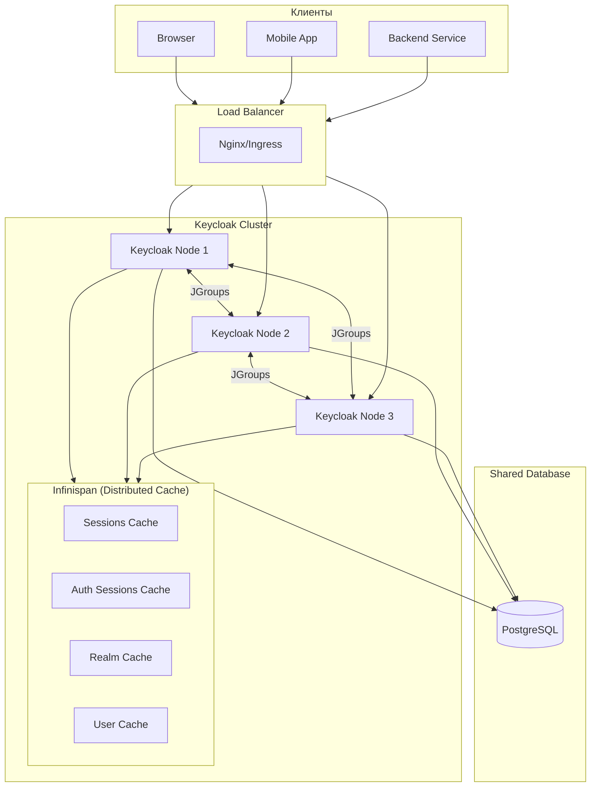

### Компоненты масштабирования

| Компонент | Описание | Масштабирование |
|-----------|----------|-----------------|
| **Keycloak Nodes** | Stateless приложения | Горизонтальное (добавление нод) |
| **PostgreSQL** | Хранение данных | Вертикальное / Read Replicas |
| **Infinispan** | Распределённый кэш | Встроен в каждую ноду |
| **Load Balancer** | Распределение нагрузки | Sticky sessions не обязательны |

### Что кэшируется в Infinispan

| Кэш | Содержимое | Репликация |
|-----|------------|------------|
| `realms` | Конфигурация realm | Полная |
| `users` | Данные пользователей | Полная |
| `sessions` | Активные сессии | Распределённая |
| `authenticationSessions` | Сессии аутентификации | Распределённая |
| `offlineSessions` | Offline токены | Распределённая |
| `clientSessions` | Клиентские сессии | Распределённая |
| `actionTokens` | Action tokens | Распределённая |
| `loginFailures` | Brute-force protection | Распределённая |

### Рекомендации по масштабированию

| Пользователей | Keycloak нод | CPU/нода | RAM/нода | PostgreSQL |
|---------------|--------------|----------|----------|------------|
| До 10,000 | 2 | 2 vCPU | 4 GB | 2 vCPU, 4 GB |
| 10,000 - 100,000 | 3-5 | 4 vCPU | 8 GB | 4 vCPU, 8 GB |
| 100,000 - 1,000,000 | 5-10 | 8 vCPU | 16 GB | 8 vCPU, 32 GB + replicas |
| 1,000,000+ | 10+ | 8+ vCPU | 16+ GB | Managed DB (HA) |

---

## База данных PostgreSQL

### Конфигурация для Dev и Prod

**Требования:**
- PostgreSQL 14+ (рекомендуется 16)
- Выделенный экземпляр (не shared)
- SSL-соединение для Production

#### Создание БД и пользователя

```sql
-- Создание пользователя
CREATE USER keycloak WITH PASSWORD 'secure-password';

-- Создание базы данных
CREATE DATABASE keycloak
    WITH OWNER = keycloak
    ENCODING = 'UTF8'
    LC_COLLATE = 'en_US.UTF-8'
    LC_CTYPE = 'en_US.UTF-8';

-- Права доступа
GRANT ALL PRIVILEGES ON DATABASE keycloak TO keycloak;
```

#### Рекомендуемые настройки PostgreSQL

```ini
# postgresql.conf

# Connections
max_connections = 200
shared_buffers = 2GB  # 25% of RAM

# Write Ahead Log
wal_level = replica
max_wal_senders = 3

# Query tuning
effective_cache_size = 6GB  # 75% of RAM
work_mem = 64MB
maintenance_work_mem = 512MB

# Checkpoints
checkpoint_completion_target = 0.9
wal_buffers = 64MB

# Logging
log_min_duration_statement = 1000  # Log slow queries > 1s
```

#### Connection Pooling (PgBouncer)

Для высоконагруженных систем рекомендуется PgBouncer:

```ini
# pgbouncer.ini
[databases]
keycloak = host=localhost port=5432 dbname=keycloak

[pgbouncer]
listen_addr = 0.0.0.0
listen_port = 6432
auth_type = md5
pool_mode = transaction
max_client_conn = 1000
default_pool_size = 50
```

---

## Архитектура решения

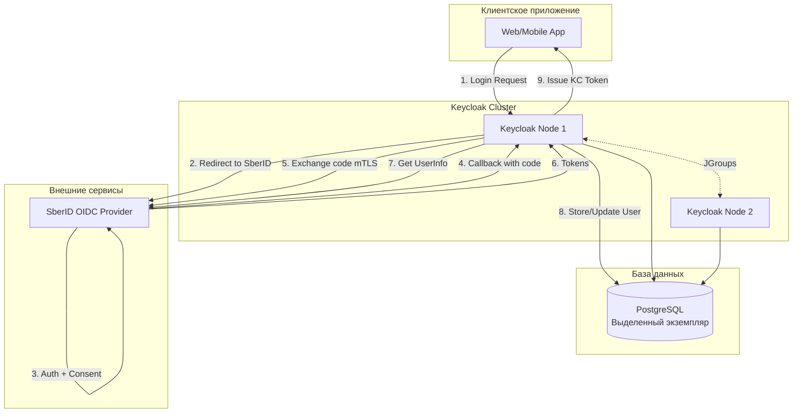

### Flow аутентификации

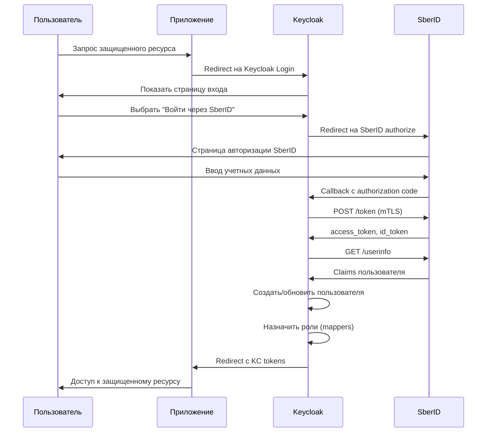

---

## Фазы исследования

### Фаза 1: Инфраструктура Keycloak

#### 1.1 Выбор варианта развертывания

| Вариант | Плюсы | Минусы | Рекомендация |
|---------|-------|--------|--------------|
| **VM (Bare Metal)** | Полный контроль, простота понимания | Ручное масштабирование и HA | Небольшие/средние системы |
| **Kubernetes + Operator** | HA, auto-scaling, GitOps | Сложность настройки | Enterprise, Cloud-native |

#### 1.2 Конфигурация PostgreSQL

**Требования (для обоих сред Dev/Prod):**
- PostgreSQL 14+ (рекомендуется 16)
- Выделенный экземпляр
- Connection pooling (PgBouncer) для HA
- Backup стратегия
- SSL-соединение

#### 1.3 Вопрос персистентности

> **Важно:** Keycloak **НЕ МОЖЕТ** работать без персистентного хранилища.

**Что хранится в БД:**
- Конфигурация Realm
- Пользователи и их атрибуты
- Клиенты (applications)
- Роли и группы
- Identity Provider конфигурации
- Сессии (опционально можно в Infinispan)

---

### Фаза 2: Регистрация в SberID

#### 2.1 Процесс подключения

1. **Отправить заявку** на `sberid@sber.ru`
   - Тема: "Получение доступа к Тестовому стенду Сбер ID"
   - Указать: название компании, описание продукта, контактные данные

2. **Получить от Сбера:**
   - `client_id` - идентификатор приложения
   - `client_secret` - секрет приложения
   - Клиентский сертификат для mTLS
   - Доступ к тестовому стенду

3. **Зарегистрировать callback URLs:**
   - `https://your-keycloak.domain/realms/{realm}/broker/sberid/endpoint`

#### 2.2 Тестовый стенд

| Параметр | Тестовый стенд | Production |
|----------|---------------|------------|
| Authorization | `https://ift.id.sber.ru/CSAFront/oidc/authorize.do` | `https://id.sber.ru/CSAFront/oidc/authorize.do` |
| Token | `https://ift.api.sberbank.ru/...` | `https://api.sberbank.ru/...` |
| UserInfo | `https://ift.api.sberbank.ru/...` | `https://api.sberbank.ru/...` |

---

### Фаза 3: Конфигурация Keycloak

#### 3.1 Создание Realm

```bash
# Через Admin CLI
kcadm.sh create realms -s realm=my-app -s enabled=true
```

#### 3.2 Настройка SberID Identity Provider

**Шаги в Admin Console:**

1. **Identity Providers → Add provider → OpenID Connect v1.0**

2. **Основные настройки:**
   - Alias: `sberid`
   - Display Name: `Сбер ID`
   - Enabled: `ON`

3. **OpenID Connect Config:**
   ```
   Authorization URL: https://id.sber.ru/CSAFront/oidc/authorize.do
   Token URL: https://api.sberbank.ru/ru/prod/tokens/v2/oidc
   User Info URL: https://api.sberbank.ru/ru/prod/sberbankid/v2.1/userinfo
   Client ID: <your-client-id>
   Client Secret: <your-client-secret>
   Client Authentication: Client secret sent as post
   Default Scopes: openid name email mobile
   ```

4. **Advanced Settings:**
   - Store tokens: `ON` (если нужен доступ к SberID API)
   - Trust Email: `ON`
   - Sync Mode: `FORCE` или `IMPORT`

#### 3.3 Конфигурация mTLS

> **Критично:** SberID требует двусторонний TLS для Token endpoint.

**Вариант 1: Java System Properties**
```bash
JAVA_OPTS="-Djavax.net.ssl.keyStore=/opt/keycloak/conf/sberid-client.p12 \
           -Djavax.net.ssl.keyStorePassword=changeit \
           -Djavax.net.ssl.keyStoreType=PKCS12"
```

**Вариант 2: Custom SPI Provider**
Создать кастомный HTTP клиент для SberID с настроенным mTLS.

**Вариант 3: Sidecar Proxy (для Kubernetes)**
Использовать Envoy/Nginx sidecar для терминации mTLS.

#### 3.4 Identity Provider Mappers

**Маппинг атрибутов SberID → Keycloak:**

| SberID Claim | Keycloak Attribute | Mapper Type |
|--------------|-------------------|-------------|
| `sub` | `sberid_sub` | Attribute Importer |
| `given_name` | `firstName` | Attribute Importer |
| `family_name` | `lastName` | Attribute Importer |
| `email` | `email` | Attribute Importer |
| `inn` | `inn` | Attribute Importer |

**Создание mapper через Admin Console:**
1. Identity Providers → sberid → Mappers → Add mapper
2. Тип: `Attribute Importer`
3. Claim: `given_name`
4. User Attribute Name: `firstName`

#### 3.5 First Broker Login Flow

**Рекомендуемый flow:**

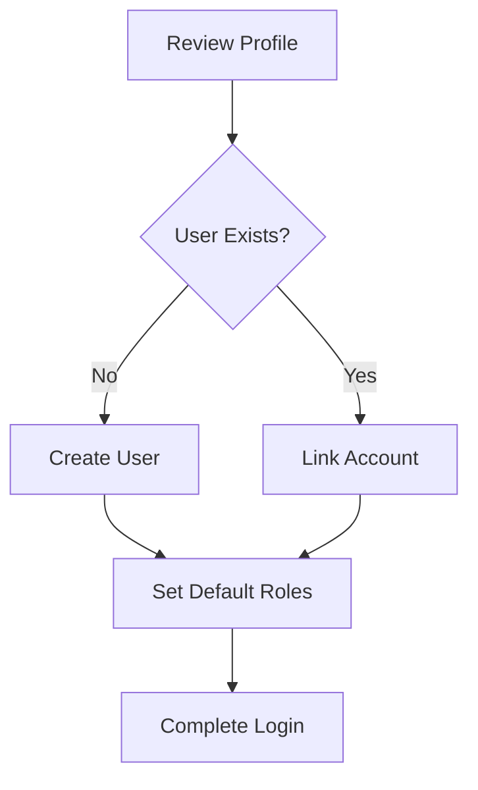

**Настройка:**
1. Authentication → Flows → First Broker Login
2. Добавить/настроить шаги:
   - Review Profile (optional)
   - Create User If Unique
   - Automatically Set Existing User

---

### Фаза 4: Управление ролями

#### 4.1 Стратегии назначения ролей

**Стратегия 1: Default Roles**
- Все пользователи SberID получают базовую роль при регистрации
- Настройка: Realm Settings → Default Roles

**Стратегия 2: Hardcoded Role Mapper**
- Назначение конкретной роли всем пользователям от SberID
- Identity Provider → Mappers → Hardcoded Role

**Стратегия 3: Claim-based Role Mapping**
- Назначение ролей на основе claims (например, по ИНН организации)
- Advanced Claim to Role Mapper

**Стратегия 4: Ручное назначение**
- Администратор назначает роли после регистрации
- Подходит для ограниченного числа пользователей

#### 4.2 Пример конфигурации ролей

```yaml
# Realm Roles
roles:
  - name: user
    description: Базовый пользователь
  - name: premium_user
    description: Премиум пользователь
  - name: organization_admin
    description: Администратор организации

# Default Roles для SberID пользователей
default_roles:
  - user

# Claim-based mapping
claim_mappers:
  - claim: orgOgrn
    claim_value: "*"  # Любое непустое значение
    role: organization_admin
```

#### 4.3 Группы

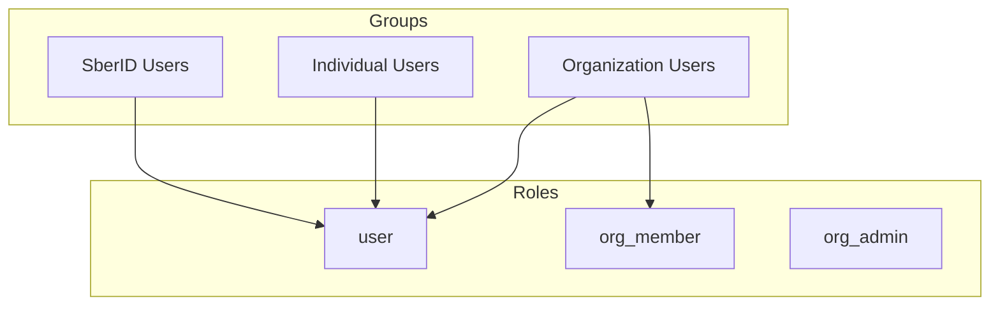

---

### Фаза 5: Тестирование

#### 5.1 Тест-кейсы

| # | Тест-кейс | Ожидаемый результат |
|---|-----------|---------------------|
| 1 | Первый вход физлица через SberID | Пользователь создан, роль `user` назначена |
| 2 | Первый вход юрлица через SberID | Пользователь создан, роли `user`, `org_member` назначены |
| 3 | Повторный вход существующего пользователя | Атрибуты обновлены, роли сохранены |
| 4 | Отзыв согласия в SberID | Вход невозможен, соответствующая ошибка |
| 5 | Получение токена приложением | JWT содержит корректные claims и roles |

#### 5.2 Инструменты тестирования

- **Postman** - тестирование OIDC flows
- **OIDC Debugger** - отладка токенов
- **Keycloak Admin Console** - проверка пользователей

---

## Риски и ограничения

### Технические риски

| Риск | Вероятность | Влияние | Митигация |
|------|-------------|---------|-----------|
| mTLS несовместимость | Средняя | Высокое | Тестирование на раннем этапе, sidecar proxy |
| Изменение API SberID | Низкая | Среднее | Мониторинг changelog, версионирование |
| Лимиты SberID | Средняя | Среднее | Кэширование, rate limiting на стороне Keycloak |

### Организационные риски

| Риск | Вероятность | Влияние | Митигация |
|------|-------------|---------|-----------|
| Долгое согласование с Сбером | Высокая | Среднее | Начать процесс заранее |
| Требования ИБ Сбера | Средняя | Высокое | Изучить требования до начала разработки |

### Ограничения

1. **Персистентное хранилище обязательно** - невозможно использовать Keycloak без БД
2. **mTLS обязателен** - SberID требует клиентский сертификат
3. **Регистрация партнера** - нужно пройти процедуру подключения к SberID
4. **Только определенные scopes** - доступ к данным ограничен

---

## Следующие шаги

1. [ ] Отправить заявку на подключение к тестовому стенду SberID
2. [ ] Развернуть тестовый Keycloak с PostgreSQL (VM или K8s)
3. [ ] Получить client credentials и сертификаты от Сбера
4. [ ] Настроить Identity Provider в Keycloak
5. [ ] Протестировать flow аутентификации
6. [ ] Настроить роли и mappers
7. [ ] Провести security review
8. [ ] Подготовить production deployment

---

## Источники

### Keycloak
- [Keycloak Documentation](https://www.keycloak.org/docs/latest/server_admin/)
- [Keycloak Guides](https://www.keycloak.org/guides)
- [Getting Started with ZIP](https://www.keycloak.org/getting-started/getting-started-zip)
- [Production Configuration](https://www.keycloak.org/server/configuration-production)
- [Identity Brokering](https://docs.redhat.com/en/documentation/red_hat_build_of_keycloak/22.0/html/server_administration_guide/identity_broker)
- [OIDC Providers Configuration](https://wjw465150.gitbooks.io/keycloak-documentation/content/server_admin/topics/identity-broker/oidc.html)
- [Keycloak on Ubuntu 24 LTS VM](https://wiki.stretchpowered.com/books/keycloak/page/how-to-install-keycloak-on-ubuntu-24-lts-vm)
- [Bare Metal Keycloak Install](https://medium.com/@fieryphoenixtech/vanilla-bare-metal-keycloak-install-for-linux-in-dev-mode-25e81a138959)

### SberID
- [Подключение Сбер ID](https://developers.sber.ru/docs/ru/sberid/service/overview)
- [Список доступных данных профиля (Scopes)](https://developers.sber.ru/docs/ru/sberid/service/scopes)
- [Запрос access/id tokens](https://developers.sber.ru/docs/ru/sberid/service/reqdescription/accessidtokens/overview)
- [OAuth спецификация Сбера](https://developers.sber.ru/docs/ru/sber-api/specifications/oauth)
- [Python SDK](https://developers.sber.ru/docs/ru/sberid/sdk/pythonsdk/overview)
- [Java SDK](https://developers.sber.ru/docs/ru/sberid/sdk/javasdk/overview)

### Дополнительно
- [GitHub: SberID](https://github.com/SberID)
- [GitHub: omniauth-sberbank](https://github.com/insales/omniauth-sberbank)
- [Keycloakify](https://keycloakify.dev) - кастомизация UI
