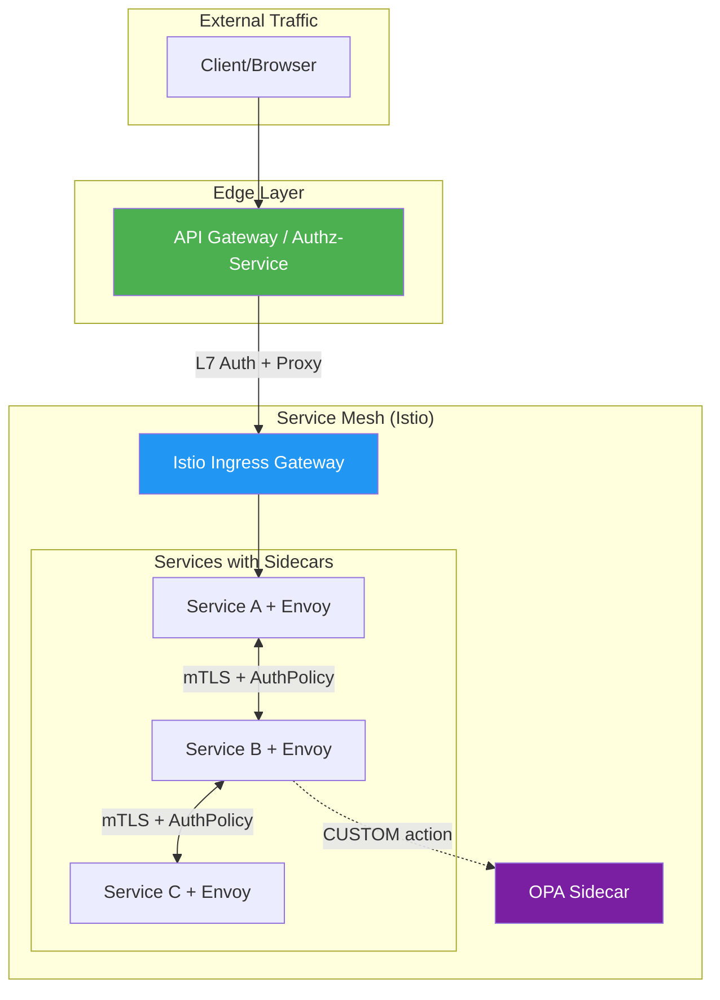
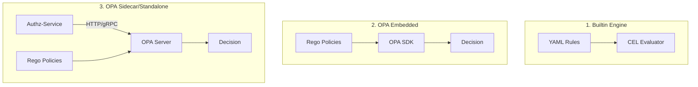
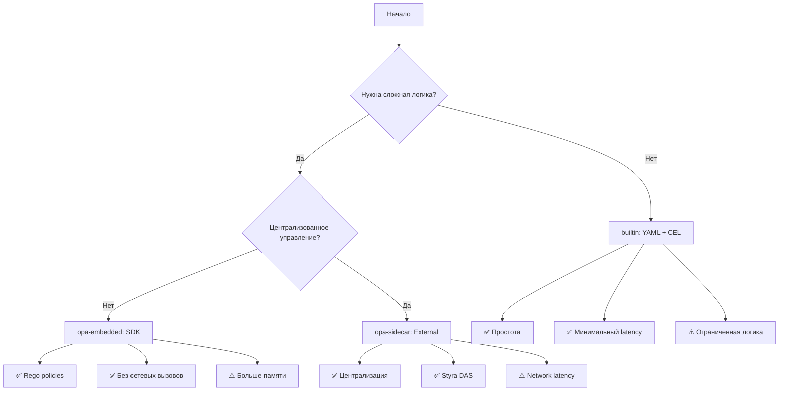
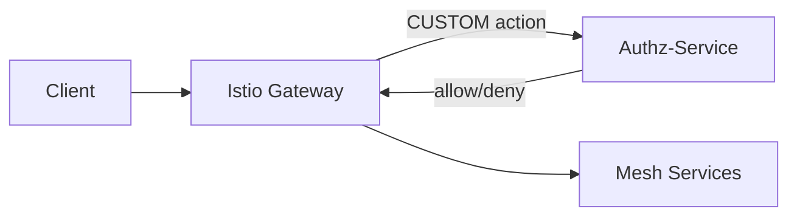
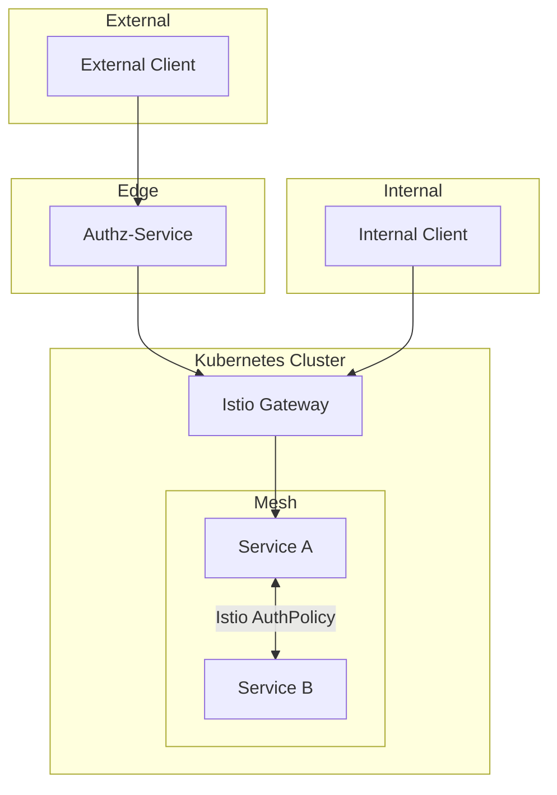
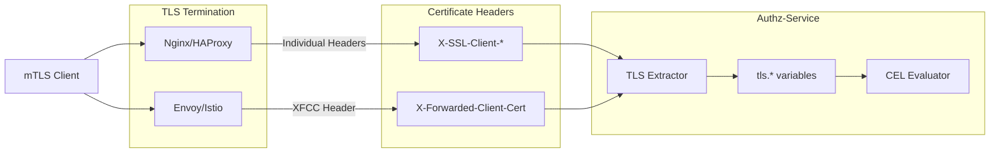
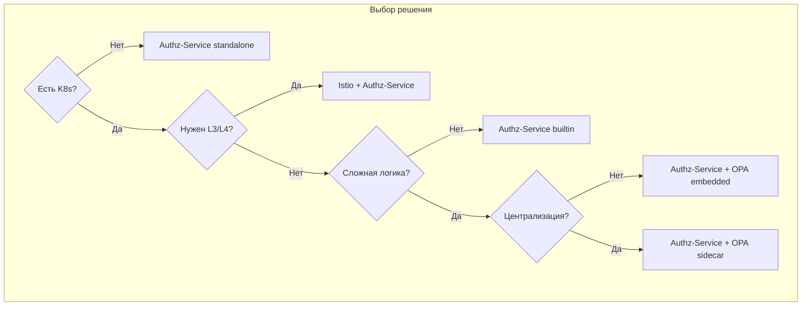

# Сравнение Authz-Service с Istio и OPA

Данный документ анализирует степень пересечения функционала authz-service с решениями на базе Istio.

## Архитектурное позиционирование



**Ключевое различие:**
- **Istio** — service mesh, работает на уровне sidecar proxy между сервисами
- **Authz-Service** — edge/API gateway, работает на входе в систему
- **OPA** — policy engine, может быть добавлен к Istio для сложной логики

## Сравнительная таблица возможностей

| Функция | Authz-Service | Istio AuthPolicy | Istio + OPA |
|---------|:-------------:|:----------------:|:-----------:|
| **Policy Language** | CEL | YAML CRD | Rego |
| **JWT Claims Access** | ✅ Полный | ⚠️ Ограниченный | ✅ Полный |
| **Path Matching** | ✅ `*`, `**`, `:param` | ✅ `{*}`, `{**}` | ✅ Любой |
| **HTTP Headers** | ✅ Полный | ⚠️ Ограниченный | ✅ Полный |
| **Query Parameters** | ✅ | ❌ | ✅ |
| **Request Body** | ❌ | ❌ | ✅ |
| **Regex Matching** | ✅ `matches()` | ❌ | ✅ |
| **mTLS/SPIFFE Identity** | ✅ XFCC + Headers | ✅ | ✅ |
| **L3/L4 Network Rules** | ❌ | ✅ | ✅ |
| **Caching** | ✅ Redis/Memory | ❌ | ⚠️ Manual |
| **External Data** | ❌ | ❌ | ✅ |
| **Environment Context** | ✅ | ❌ | ✅ |
| **Feature Flags** | ✅ Built-in | ❌ | ⚠️ Manual |
| **Rate Limiting** | ✅ Built-in | ❌ Separate | ❌ Separate |
| **Circuit Breaker** | ✅ Built-in | ❌ Separate | ❌ Separate |
| **Audit Trail** | ✅ Kafka/Webhook | ⚠️ AUDIT action | ✅ Decision logs |
| **Requires K8s** | ❌ | ✅ | ✅ |

## Детальное сравнение

### 1. Istio AuthorizationPolicy (без OPA)

**Возможности:**
- Service-to-service авторизация на основе mTLS identity
- Namespace и workload изоляция
- IP whitelisting/blacklisting (ipBlocks, remoteIpBlocks)
- Базовые JWT проверки (issuer, subject)
- Path/method/host matching с wildcards
- L3/L4 сетевые политики

**Ограничения:**
- YAML-based правила без сложной логики
- Нет regex matching
- Нет доступа к query parameters
- Нет кастомных функций
- Ограниченный доступ к JWT claims

**Пример Istio AuthorizationPolicy:**
```yaml
apiVersion: security.istio.io/v1
kind: AuthorizationPolicy
metadata:
  name: httpbin-policy
  namespace: default
spec:
  selector:
    matchLabels:
      app: httpbin
  action: ALLOW
  rules:
  - from:
    - source:
        requestPrincipals: ["*"]
    to:
    - operation:
        methods: ["GET"]
        paths: ["/api/*"]
    when:
    - key: request.auth.claims[groups]
      values: ["admin"]
```

**Эквивалент в Authz-Service:**
```yaml
rules:
  - id: httpbin-policy
    path: /api/*
    methods: [GET]
    condition: '"admin" in token.claims.groups'
    action: allow
```

### 2. Istio + OPA

**Дополнительные возможности OPA:**
- Rego — полноценный policy language
- Доступ к request body
- External data fetching
- Сложная бизнес-логика
- Централизованное управление политиками
- Decision logging

**Пример OPA Rego политики:**
```rego
package istio.authz

default allow = false

allow {
    input.attributes.request.http.method == "GET"
    glob.match("/api/*", [], input.attributes.request.http.path)
    token.payload.groups[_] == "admin"
}

token = {"payload": payload} {
    [_, encoded, _] := split(input.attributes.request.http.headers.authorization, ".")
    payload := json.unmarshal(base64url.decode(encoded))
}
```

**Эквивалент в Authz-Service (CEL):**
```yaml
rules:
  - id: admin-api-access
    path: /api/*
    methods: [GET]
    condition: '"admin" in token.claims.groups'
    action: allow
```

### 3. Authz-Service

**Уникальные возможности:**
- CEL expressions (типобезопасный, компилируемый)
- Встроенное кэширование решений (Redis, in-memory)
- Встроенный rate limiting
- Встроенный circuit breaker
- Environment context (region, cluster, features)
- Feature flags в политиках
- Reverse proxy в одном бинарнике
- Не требует Kubernetes
- **mTLS/SPIFFE identity** через XFCC и individual headers
- **3 режима интеграции с OPA** (builtin, opa-embedded, opa-sidecar)

#### Режимы Policy Engine:



| Режим | Описание | Use Case |
|-------|----------|----------|
| `builtin` | YAML rules + CEL expressions | Простые сценарии, быстрый старт |
| `opa-embedded` | OPA как библиотека (SDK) | Сложная логика без сетевых вызовов |
| `opa-sidecar` | Внешний OPA сервер | Централизованные политики, Styra DAS |

#### mTLS/SPIFFE Support:

Поддерживает два режима извлечения сертификата, работающих параллельно:

1. **XFCC Header** (Envoy/Istio):
   - `X-Forwarded-Client-Cert` header
   - Парсинг Hash, Subject, URI, DNS

2. **Individual Headers** (Nginx/HAProxy):
   - `X-SSL-Client-Subject-DN`
   - `X-SSL-Client-CN`
   - `X-SSL-Client-Verify`
   - и др.

**Каскадная логика:** XFCC проверяется первым, затем headers, с merge недостающих полей.

**CEL переменная `tls`:**
```yaml
rules:
  - id: mtls-service-auth
    path: /api/internal/**
    condition: |
      tls.verified == true &&
      tls.spiffe.trust_domain == "cluster.local" &&
      tls.spiffe.namespace == "production" &&
      tls.spiffe.service_account in ["backend", "worker"]
    action: allow
```

**Пример CEL политики с environment и mTLS:**
```yaml
rules:
  - id: production-admin-only
    path: /admin/**
    condition: |
      env.name == "production" &&
      "admin" in token.roles &&
      env.features["admin_panel_v2"] == true
    action: allow

  - id: mtls-internal-service
    path: /api/internal/**
    condition: |
      tls.verified &&
      tls.spiffe.trust_domain == "cluster.local"
    action: allow
```

## Степень пересечения функционала

### С чистым Istio AuthorizationPolicy: ~75%

**Общее:**
- JWT валидация и claims access
- Path/method matching
- Header checks
- Allow/Deny actions
- mTLS/SPIFFE identity verification
- Service account authorization

**Уникальное для Istio:**
- L3/L4 network rules
- Namespace isolation (K8s native)

**Уникальное для Authz-Service:**
- CEL expressions
- Regex matching
- Query parameters
- Caching (Redis/Memory)
- Rate limiting
- Circuit breaker
- Environment context
- mTLS через XFCC (Envoy) и Headers (Nginx)
- SPIFFE identity parsing с CEL доступом
- Интеграция с OPA (embedded SDK + sidecar/standalone)

### С Istio + OPA: ~85%

**Общее:**
- Сложные policy expressions
- JWT claims access
- Path/method/header matching
- Query parameters
- Environment context
- mTLS/SPIFFE identity
- Service account authorization

**Уникальное для Istio + OPA:**
- L3/L4 rules
- Request body access
- External data fetching
- Rego ecosystem
- Kubernetes native интеграция

**Уникальное для Authz-Service:**
- CEL (проще Rego)
- Built-in caching
- Built-in rate limiting
- Built-in circuit breaker
- Single binary deployment
- No K8s requirement
- Гибкая интеграция с OPA (3 режима)
- Каскадная извлечение mTLS (XFCC → Headers)

## Когда использовать каждое решение

### Выбирайте Istio AuthorizationPolicy когда:

1. **Service-to-service авторизация** — нужна изоляция между сервисами в mesh
2. **Namespace isolation** — разделение по namespace в Kubernetes
3. **mTLS identity** — авторизация на основе SPIFFE identity
4. **IP-based rules** — whitelisting/blacklisting по IP
5. **Уже используете Istio** — минимальный overhead

### Выбирайте Istio + OPA когда:

1. **Сложная бизнес-логика** — правила, которые не выразить в YAML
2. **Request body inspection** — нужен доступ к телу запроса
3. **External data** — решения на основе внешних данных (DB, API)
4. **End-user-to-resource** — fine-grained доступ к ресурсам
5. **Централизованные политики** — управление через Styra DAS или аналоги

### Выбирайте Authz-Service когда:

1. **Edge/API Gateway** — авторизация на входе в систему
2. **Нет Kubernetes** — VM, bare metal, Docker Compose
3. **All-in-one решение** — proxy + auth + rate limit + circuit breaker
4. **CEL предпочтительнее Rego** — типобезопасность, простота
5. **Кэширование решений** — высокая нагрузка, нужен Redis cache
6. **Environment-aware** — canary deployments, regional restrictions
7. **Feature flags** — gradual rollout функционала
8. **Минимальный overhead** — один бинарник без зависимостей
9. **mTLS за прокси** — когда mTLS терминируется на Nginx/HAProxy/Envoy
10. **Гибкость OPA интеграции** — нужен выбор между SDK и внешним сервисом

### Выбор режима Policy Engine в Authz-Service:



| Критерий | builtin | opa-embedded | opa-sidecar |
|----------|---------|--------------|-------------|
| Latency | ~1ms | ~2-5ms | ~5-15ms |
| Сложность правил | Низкая-средняя | Высокая | Высокая |
| Управление | Config file | Local Rego | Centralized |
| Memory | ~50MB | ~100MB | ~50MB + OPA |
| External Data | ❌ | ⚠️ Bundles | ✅ Full |
| Отладка | CEL errors | Rego trace | OPA decision logs |

## Варианты интеграции

### Вариант 1: Authz-Service как Edge Gateway


**Использование:**
- Authz-Service на edge для JWT валидации и rate limiting
- Istio для service-to-service авторизации внутри mesh
- Defense-in-depth архитектура

### Вариант 2: Authz-Service как External Authorizer



**Конфигурация Istio:**
```yaml
apiVersion: security.istio.io/v1
kind: AuthorizationPolicy
metadata:
  name: ext-authz
spec:
  action: CUSTOM
  provider:
    name: authz-service
  rules:
  - to:
    - operation:
        paths: ["/api/*"]
---
apiVersion: networking.istio.io/v1alpha3
kind: EnvoyFilter
metadata:
  name: ext-authz-filter
spec:
  configPatches:
  - applyTo: HTTP_FILTER
    match:
      context: SIDECAR_INBOUND
    patch:
      operation: INSERT_BEFORE
      value:
        name: envoy.filters.http.ext_authz
        typed_config:
          "@type": type.googleapis.com/envoy.extensions.filters.http.ext_authz.v3.ExtAuthz
          grpc_service:
            envoy_grpc:
              cluster_name: authz-service
```

### Вариант 3: Параллельное использование



**Использование:**
- External traffic через Authz-Service (JWT, rate limit, CEL rules)
- Internal traffic напрямую через Istio Gateway
- Service-to-service через Istio AuthorizationPolicy

### Вариант 4: mTLS Integration



**Конфигурация Nginx:**
```nginx
# Nginx mTLS termination with headers
server {
    listen 443 ssl;
    ssl_client_certificate /etc/nginx/ca.crt;
    ssl_verify_client on;

    location / {
        proxy_pass http://authz-service:8080;
        proxy_set_header X-SSL-Client-Subject-DN $ssl_client_s_dn;
        proxy_set_header X-SSL-Client-CN $ssl_client_s_dn_cn;
        proxy_set_header X-SSL-Client-Verify $ssl_client_verify;
        proxy_set_header X-SSL-Client-Fingerprint $ssl_client_fingerprint;
    }
}
```

**Конфигурация Envoy/Istio:**
```yaml
# Istio configures XFCC automatically when mTLS is enabled
apiVersion: security.istio.io/v1beta1
kind: PeerAuthentication
metadata:
  name: default
spec:
  mtls:
    mode: STRICT
```

**CEL правила для mTLS:**
```yaml
rules:
  # SPIFFE identity check
  - id: spiffe-service-auth
    path: /api/internal/**
    condition: |
      tls.verified &&
      tls.spiffe.trust_domain == "cluster.local" &&
      tls.spiffe.namespace in ["production", "staging"]
    action: allow

  # Certificate CN check (for non-SPIFFE certs)
  - id: partner-mtls
    path: /api/partner/**
    condition: |
      tls.verified &&
      tls.common_name.endsWith(".partner.example.com")
    action: allow

  # Combined JWT + mTLS (dual auth)
  - id: high-security
    path: /api/critical/**
    condition: |
      tls.verified &&
      token.valid &&
      "admin" in token.roles &&
      tls.spiffe.service_account == "admin-service"
    action: allow
```

## Сравнение языков политик

### CEL (Authz-Service)

```cel
// Простой и читаемый синтаксис
token.roles.exists(r, r == "admin") &&
request.path.startsWith("/api/v2") &&
env.name == "production"
```

**Преимущества:**
- Типобезопасность на этапе компиляции
- Простой синтаксис, похожий на обычные языки
- Быстрая компиляция и выполнение
- Встроенная поддержка в Google Cloud, Kubernetes

### Rego (OPA)

```rego
// Более мощный, но сложнее
allow {
    some role in input.token.roles
    role == "admin"
    startswith(input.request.path, "/api/v2")
    input.env.name == "production"
}
```

**Преимущества:**
- Полноценный язык с модулями
- Поддержка external data
- Мощная экосистема
- Decision logging из коробки

### YAML (Istio)

```yaml
# Декларативный, но ограниченный
when:
- key: request.auth.claims[roles]
  values: ["admin"]
```

**Преимущества:**
- Простота для базовых случаев
- Нативная интеграция с K8s
- Не требует изучения нового языка

## Производительность

| Метрика | Authz-Service | Istio AuthPolicy | Istio + OPA |
|---------|---------------|------------------|-------------|
| Latency (p50) | ~1-2ms | ~0.5ms | ~2-5ms |
| Latency с cache | ~0.1ms | N/A | ~0.5ms |
| Memory overhead | ~50MB | Envoy sidecar | +50MB per pod |
| CPU overhead | Minimal | Envoy processing | Policy evaluation |

**Примечания:**
- Istio AuthPolicy быстрее за счёт inline evaluation в Envoy
- Authz-Service выигрывает при включённом кэшировании
- OPA добавляет latency на external call

## Заключение

**Authz-Service дополняет Istio** — они работают на разных уровнях и могут использоваться вместе:

- **Istio** оптимален для L3/L4 network policies и namespace isolation
- **Authz-Service** оптимален для edge/API gateway с полной поддержкой mTLS/SPIFFE
- **OPA** может использоваться с обоими решениями

**Ключевые преимущества Authz-Service v2:**

| Возможность | Описание |
|-------------|----------|
| **mTLS/SPIFFE** | Полная поддержка через XFCC и individual headers |
| **CEL `tls.*`** | Гибкие правила на основе сертификата |
| **3 Policy Engines** | builtin, opa-embedded, opa-sidecar |
| **Environment-aware** | env.*, feature flags в правилах |
| **All-in-one** | Proxy + Auth + Rate Limit + Circuit Breaker |

**Рекомендации:**

1. **Без K8s** — Authz-Service (standalone)
2. **K8s простые правила** — Istio AuthPolicy
3. **K8s + сложная логика** — Authz-Service с `opa-embedded` или `opa-sidecar`
4. **mTLS авторизация** — Authz-Service за Nginx/Envoy с CEL `tls.*`
5. **Defense-in-depth** — Authz-Service (edge) + Istio (mesh)
6. **Централизованные политики** — Authz-Service с `opa-sidecar` + Styra DAS



## Ссылки

- [Istio Authorization Policy Reference](https://istio.io/latest/docs/reference/config/security/authorization-policy/)
- [Istio Security Concepts](https://istio.io/latest/docs/concepts/security/)
- [OPA Istio Tutorial](https://www.openpolicyagent.org/docs/latest/envoy-tutorial-istio/)
- [CEL Specification](https://github.com/google/cel-spec)
- [Fine-grained Authorization with Istio and OPA](https://www.solo.io/blog/fine-grained-service-authorizations-istio-opa)
