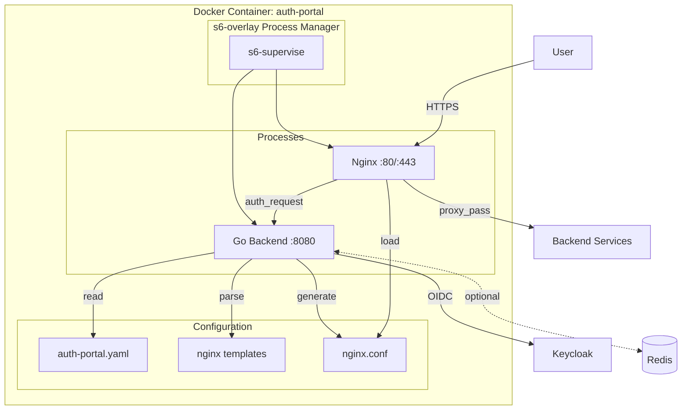
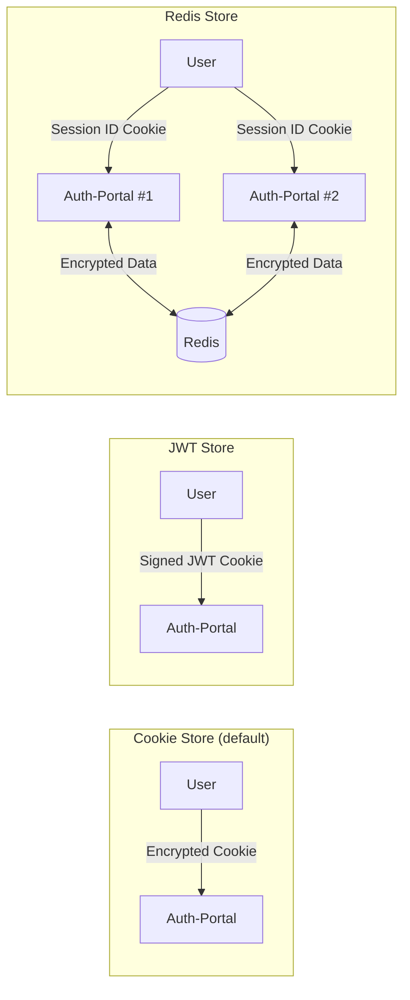
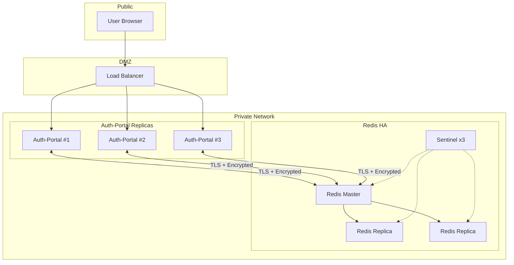
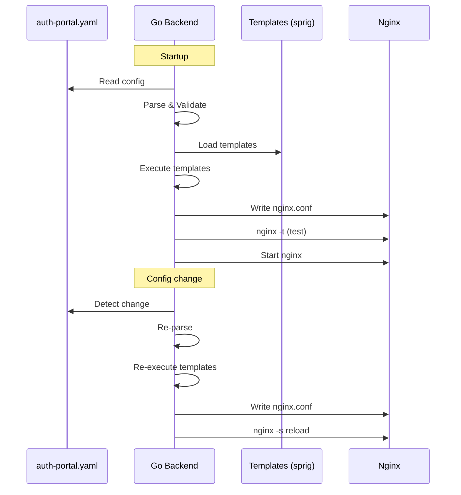
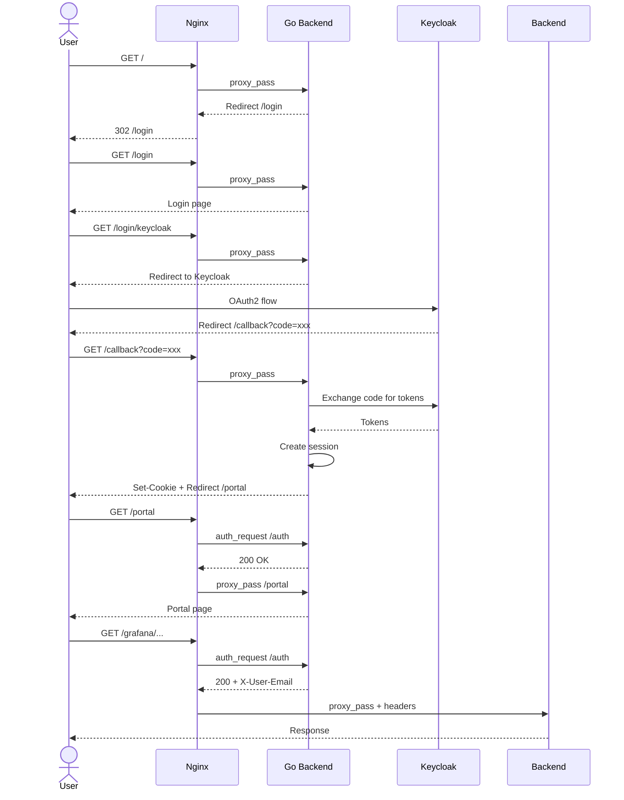
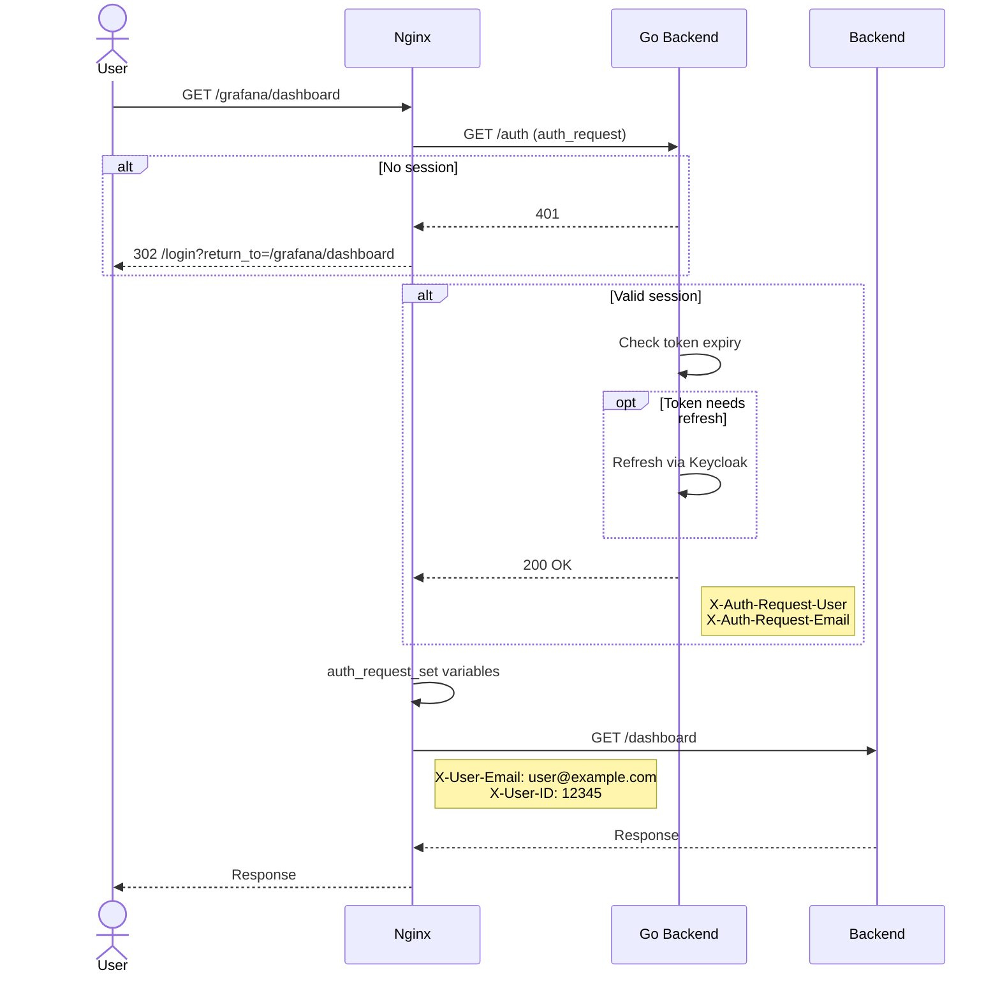

# Архитектура Auth-Portal

## Обзор

Auth-Portal — единый Docker-контейнер, объединяющий Nginx и Go backend под управлением s6-overlay.



---

## Компоненты

### 1. Nginx (Frontend)

**Роль:** TLS termination, reverse proxy, rate limiting

**Конфигурация генерируется из YAML:**
- Locations для каждого сервиса
- auth_request к Go backend
- Per-service headers и rewrites

### 2. Go Backend

**Роль:** Аутентификация, сессии, конфигурация

**Endpoints:**
- `/login`, `/logout`, `/callback` — OIDC flow
- `/portal` — UI списка сервисов
- `/auth` — endpoint для nginx auth_request
- `/health`, `/ready`, `/metrics` — observability

### 3. s6-overlay

**Роль:** Process manager для multi-process container

**Сервисы:**
- `auth-portal` — Go backend (запускается первым)
- `nginx` — Nginx (зависит от auth-portal)
- `config-watcher` — hot reload при изменении конфига

---

## Хранилища сессий

### Сравнение вариантов



| Характеристика | Cookie | JWT | Redis |
|----------------|--------|-----|-------|
| Stateless | Да | Да | Нет |
| Масштабирование | Любое | Любое | Горизонтальное |
| Инвалидация сессии | Нет | Нет | Да |
| Размер данных | До 4KB | До 4KB | Любой |
| Шифрование | AES-256-GCM | Нет (подпись) | AES-256-GCM |
| Доп. инфраструктура | Нет | Нет | Redis |

### Когда что использовать

| Сценарий | Рекомендация |
|----------|--------------|
| MVP / Один инстанс | Cookie Store |
| Stateless / Kubernetes | JWT Store |
| Горизонтальное масштабирование | Redis Store |
| Нужна инвалидация сессий | Redis Store |

---

## Безопасность Redis

### Матрица рисков

| Риск | Вероятность | Импакт | Митигация |
|------|-------------|--------|-----------|
| Неавторизованный доступ | Высокая | Критический | AUTH + ACL + Network isolation |
| Перехват трафика | Средняя | Критический | TLS |
| Кража токенов из памяти | Низкая | Критический | Шифрование данных |
| Утечка через RDB/AOF | Средняя | Высокий | No persistence / Encrypted disk |

### Рекомендуемая конфигурация

```yaml
# auth-portal.yaml
session:
  store: redis

  encryption:
    enabled: true  # ОБЯЗАТЕЛЬНО!
    key: ${SESSION_ENCRYPTION_KEY}

  redis:
    addresses:
      - redis:6379
    password: ${REDIS_PASSWORD}

    tls:
      enabled: true
      cert: /certs/redis-client.crt
      key: /certs/redis-client.key
      ca: /certs/redis-ca.crt
```

```ini
# redis.conf
requirepass ${REDIS_PASSWORD}
bind 127.0.0.1
tls-port 6379
port 0
tls-cert-file /certs/redis.crt
tls-key-file /certs/redis.key
tls-ca-cert-file /certs/ca.crt
tls-auth-clients yes

# Отключить персистентность
save ""
appendonly no
```

### Архитектура с Redis (Production)



### Чеклист безопасности Redis

- [ ] Redis AUTH включён
- [ ] Redis ACL настроен (минимальные права)
- [ ] TLS для соединений
- [ ] mTLS (клиентские сертификаты)
- [ ] Данные зашифрованы на уровне приложения
- [ ] Redis в isolated network
- [ ] Firewall: только Auth-Portal → Redis
- [ ] Персистентность отключена или диск зашифрован
- [ ] Мониторинг подозрительных команд
- [ ] Регулярная ротация credentials

---

## Генерация Nginx конфигурации

### Процесс



### Шаблонизатор: text/template + sprig

**Почему:**
- Стандартный синтаксис Go
- Sprig добавляет 100+ функций
- Совместим с Helm (знакомый DevOps)

**Пример шаблона:**

```nginx
{{/* location.tmpl */}}
{{ range .Services }}
# === SERVICE: {{ .Name }} ===
location {{ .Location }} {
    {{- if .AuthRequired }}
    auth_request /auth;
    auth_request_set $auth_user $upstream_http_x_user_email;
    auth_request_set $auth_id $upstream_http_x_user_id;
    {{- end }}

    {{- range $key, $value := .Headers.Add }}
    proxy_set_header {{ $key }} "{{ $value }}";
    {{- end }}

    {{- range .Headers.Remove }}
    proxy_set_header {{ . }} "";
    {{- end }}

    {{- if .Rewrite }}
    rewrite {{ .Rewrite }};
    {{- end }}

    proxy_pass {{ .Upstream }};

    {{- if .NginxExtra }}
    {{ .NginxExtra | nindent 4 }}
    {{- end }}
}
{{ end }}
```

---

## Потоки данных

### Portal Mode Flow



### Forward Auth Flow



---

## Deployment

### Docker Compose (Development)

```yaml
version: '3.8'

services:
  auth-portal:
    build: .
    ports:
      - "80:80"
      - "443:443"
    volumes:
      - ./configs/auth-portal.yaml:/etc/auth-portal/config.yaml:ro
      - ./certs:/certs:ro
    environment:
      - KC_CLIENT_SECRET=${KC_CLIENT_SECRET}
      - SESSION_ENCRYPTION_KEY=${SESSION_ENCRYPTION_KEY}
    depends_on:
      - keycloak

  keycloak:
    image: quay.io/keycloak/keycloak:24.0
    # ... keycloak config

  # Optional: Redis for session storage
  redis:
    image: redis:7-alpine
    command: >
      redis-server
      --requirepass ${REDIS_PASSWORD}
      --appendonly no
```

### Kubernetes (Production)

```yaml
apiVersion: apps/v1
kind: Deployment
metadata:
  name: auth-portal
spec:
  replicas: 3
  template:
    spec:
      containers:
        - name: auth-portal
          image: auth-portal:latest
          ports:
            - containerPort: 80
            - containerPort: 443
          env:
            - name: KC_CLIENT_SECRET
              valueFrom:
                secretKeyRef:
                  name: auth-portal-secrets
                  key: kc-client-secret
            - name: SESSION_ENCRYPTION_KEY
              valueFrom:
                secretKeyRef:
                  name: auth-portal-secrets
                  key: session-key
          volumeMounts:
            - name: config
              mountPath: /etc/auth-portal
            - name: certs
              mountPath: /certs
      volumes:
        - name: config
          configMap:
            name: auth-portal-config
        - name: certs
          secret:
            secretName: auth-portal-tls
```
