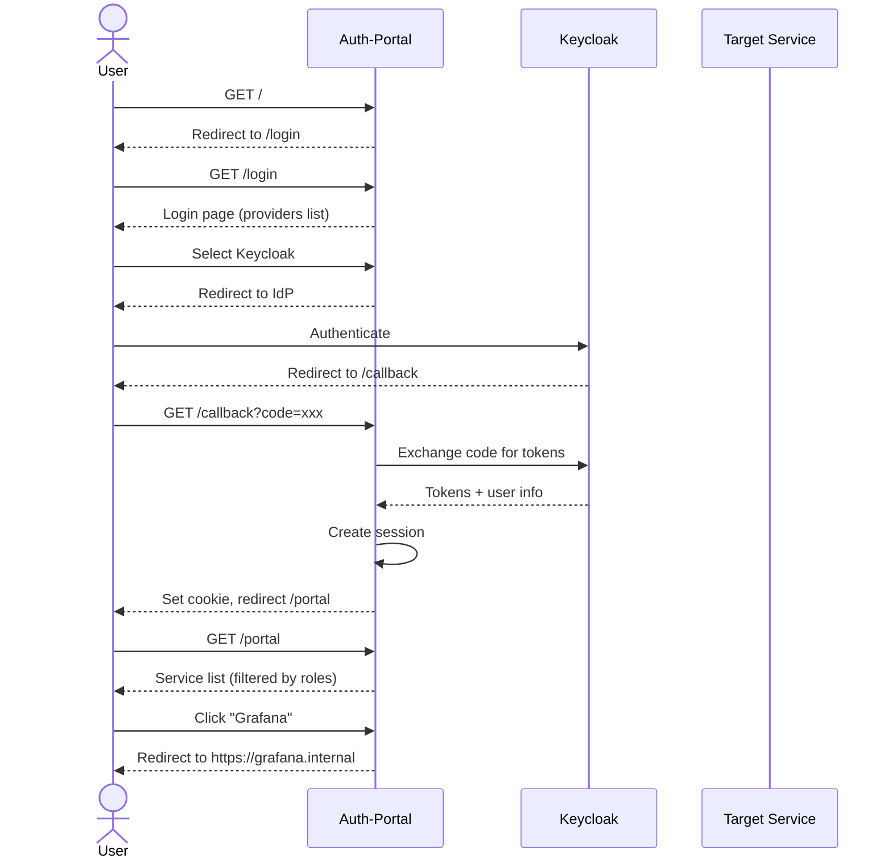
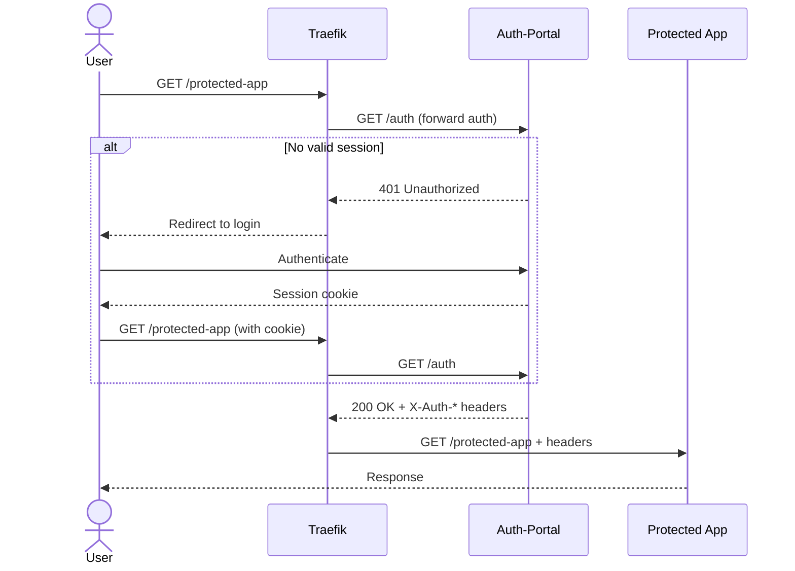
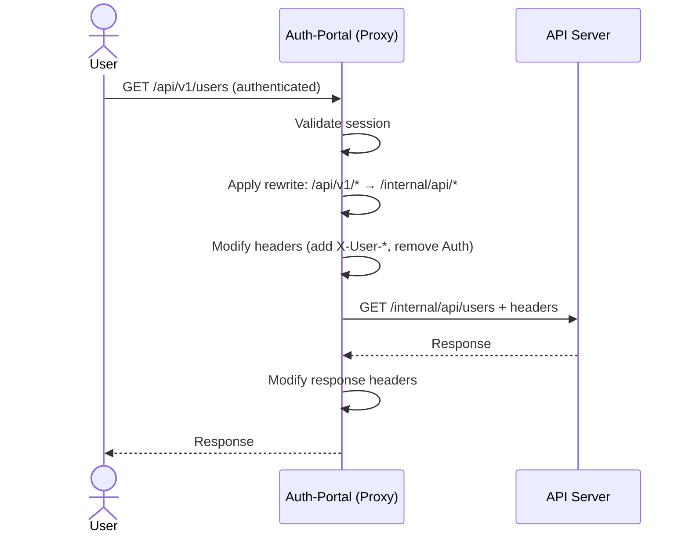

# Auth-Portal Service: Исследование и архитектура

## Обзор

Комплементарный сервис аутентификации пользователей с поддержкой:
- Логин/пароль и альтернативные способы (OIDC, OAuth2)
- Перенаправление или проксирование к целевым сервисам
- Выбор из нескольких сервисов (portal mode) или работа с одним сервисом (single-service mode)
- URL rewrite, header modification и другие манипуляции с запросами
- Гибкая конфигурация через YAML/JSON

---

## Сравнение готовых решений

### Таблица сравнения

| Решение | Portal UI | Forward Auth | URL Rewrite | Headers | Вес | Лицензия |
|---------|-----------|--------------|-------------|---------|-----|----------|
| **Authelia** | Нет | Да | Нет (через proxy) | Да | ~20MB | Apache 2.0 |
| **OAuth2-Proxy** | Нет | Да | Частично | Да | ~15MB | MIT |
| **Pomerium** | Частично | Да | Да | Да | ~50MB | Apache 2.0 |
| **Authentik** | Да | Да | Частично | Да | ~700MB | MIT |
| **Casdoor** | Да | Да | Частично | Да | ~100MB | Apache 2.0 |

### Authelia

**Плюсы:**
- Легковесный (~20MB Docker image, ~30MB RAM)
- Сильная поддержка MFA (TOTP, WebAuthn, Passkeys)
- Простая YAML конфигурация
- Активное сообщество (~25k GitHub stars)
- OpenID Certified

**Минусы:**
- Нет встроенного portal UI с выбором сервисов
- Нет SAML поддержки
- Только один домен на инстанс
- URL rewrite требует внешнего proxy

**Источники:**
- https://github.com/authelia/authelia
- https://www.authelia.com/configuration/methods/files/

### OAuth2-Proxy

**Плюсы:**
- Проверенное решение (fork от bitly)
- Поддержка множества провайдеров (Google, GitHub, Keycloak, OIDC)
- Гибкая интеграция с Nginx/Traefik/Envoy
- Активная разработка

**Минусы:**
- Нет portal UI
- Ограниченные возможности URL rewrite
- Известные уязвимости (auth bypass через skip_auth_routes)

**Источники:**
- https://github.com/oauth2-proxy/oauth2-proxy
- https://oauth2-proxy.github.io/oauth2-proxy/configuration/integration/

### Pomerium

**Плюсы:**
- Zero-trust архитектура
- Context-aware access (device, location, time)
- Встроенный reverse proxy с rewrite
- Поддержка non-HTTP протоколов

**Минусы:**
- Сложнее в настройке
- Нет полноценного portal UI
- Больший размер

**Источники:**
- https://www.pomerium.com/
- https://slashdot.org/software/comparison/Pomerium-vs-authentik/

### Authentik

**Плюсы:**
- Полноценный IdP (OIDC, SAML, LDAP, RADIUS)
- User dashboard с приложениями
- Визуальный flow editor
- SCIM provisioning

**Минусы:**
- Тяжелый (~700MB, требует PostgreSQL)
- Сложнее deployment
- Избыточен для простых случаев

**Источники:**
- https://goauthentik.io/
- https://www.houseoffoss.com/post/authelia-vs-authentik-which-self-hosted-identity-provider-is-better-in-2025

### Casdoor

**Плюсы:**
- UI-first подход
- Поддержка OAuth 2.0, OIDC, SAML, CAS, LDAP
- Централизованный dashboard
- Хорошая документация

**Минусы:**
- Менее зрелый чем Keycloak
- Ограниченная экосистема

**Источники:**
- https://casdoor.org/
- https://github.com/casdoor/casdoor

---

## Архитектурные паттерны

### 1. Forward Auth Pattern

```
┌──────────┐     ┌─────────────┐     ┌──────────────┐     ┌─────────┐
│  Client  │────▶│ Reverse     │────▶│ Auth Service │     │ Backend │
│          │     │ Proxy       │     │ /auth        │     │         │
└──────────┘     │ (Traefik)   │     └──────────────┘     └─────────┘
                 │             │            │                  ▲
                 │             │◀───────────┘                  │
                 │             │  200 OK + headers             │
                 │             │────────────────────────────────┘
                 └─────────────┘
```

**Используется в:** Authelia, OAuth2-Proxy, Traefik OIDC Middleware

**Плюсы:**
- Простая интеграция с существующей инфраструктурой
- Auth сервис отделен от proxy
- Легко масштабировать

**Минусы:**
- Дополнительный network hop
- Зависимость от конфигурации proxy

### 2. Gateway Auth Pattern

```
┌──────────┐     ┌─────────────────────────────┐     ┌─────────┐
│  Client  │────▶│      Auth Gateway           │────▶│ Backend │
│          │     │  (Auth + Proxy в одном)     │     │         │
└──────────┘     └─────────────────────────────┘     └─────────┘
```

**Используется в:** Pomerium, Kong, самописные решения

**Плюсы:**
- Полный контроль над request/response
- Меньше компонентов
- Проще URL rewrite и header modification

**Минусы:**
- Сложнее масштабировать
- Больше ответственности в одном сервисе

### 3. Sidecar Pattern

```
┌─────────────────────────────────────┐
│              Pod                    │
│  ┌───────────┐     ┌─────────────┐  │
│  │  Auth     │────▶│  Backend    │  │
│  │  Sidecar  │     │  Service    │  │
│  └───────────┘     └─────────────┘  │
└─────────────────────────────────────┘
```

**Используется в:** Istio, Linkerd, Envoy

**Плюсы:**
- Децентрализованная аутентификация
- Isolation per service

**Минусы:**
- Overhead на каждый pod
- Сложнее управление

---

## Рекомендация: Самописный Auth-Portal на Go

### Обоснование

1. **Уникальные требования не покрываются готовыми решениями:**
   - Portal UI с выбором сервисов
   - Single-service mode
   - Гибкий URL rewrite и header modification
   - Кастомная YAML конфигурация

2. **Технические преимущества:**
   - Нативная интеграция с существующим authz-service (Go)
   - Полный контроль над функциональностью
   - Лёгкий deployment (один бинарник ~20MB)

3. **Команда уже работает с Go:**
   - Единый технический стек
   - Переиспользование паттернов из authz-service

### Компоненты архитектуры

```
┌─────────────────────────────────────────────────────────────────────────────┐
│                           Auth-Portal Service                                │
├─────────────────────────────────────────────────────────────────────────────┤
│                                                                              │
│  ┌────────────────────────────────────────────────────────────────────────┐ │
│  │                        HTTP Server (chi/echo)                          │ │
│  └────────────────────────────────────────────────────────────────────────┘ │
│                                    │                                         │
│         ┌──────────────────────────┼──────────────────────────┐             │
│         ▼                          ▼                          ▼             │
│  ┌─────────────┐          ┌─────────────┐          ┌─────────────────────┐  │
│  │   Auth UI   │          │   Forward   │          │   Reverse Proxy     │  │
│  │   Handler   │          │   Auth API  │          │   Engine            │  │
│  ├─────────────┤          ├─────────────┤          ├─────────────────────┤  │
│  │ - Login     │          │ GET /auth   │          │ - URL Rewrite       │  │
│  │ - Logout    │          │ Returns:    │          │ - Header Modify     │  │
│  │ - Callback  │          │ 200 + headers│         │ - Request Transform │  │
│  │ - Portal    │          │ 401/302     │          │ - Response Modify   │  │
│  └─────────────┘          └─────────────┘          └─────────────────────┘  │
│         │                          │                          │             │
│         └──────────────────────────┼──────────────────────────┘             │
│                                    ▼                                         │
│  ┌────────────────────────────────────────────────────────────────────────┐ │
│  │                         Core Services                                  │ │
│  ├────────────────┬────────────────┬────────────────┬────────────────────┤ │
│  │ Session Manager│ IdP Adapter    │ Service Registry│ Config Manager    │ │
│  │ (Cookie/Redis) │ (OIDC/Local)   │ (YAML defined)  │ (Hot reload)      │ │
│  └────────────────┴────────────────┴────────────────┴────────────────────┘ │
│                                                                              │
└─────────────────────────────────────────────────────────────────────────────┘
```

### Режимы работы

#### 1. Portal Mode (Multi-Service)

Пользователь после аутентификации видит список доступных сервисов и выбирает куда перейти.

```
User → Login → Portal UI (service list) → Select service → Redirect to service
```

**Use case:** Корпоративный портал с доступом к Grafana, Kibana, Jenkins и др.

#### 2. Single-Service Mode (Персональный)

Сервис настроен на один конкретный backend, после логина сразу redirect.

```
User → Login → Redirect to configured backend
```

**Use case:** Защита одного приложения без UI выбора.

#### 3. Forward Auth Mode

Работа как forward auth endpoint для Nginx/Traefik/Envoy.

```
Proxy → GET /auth → 200 OK + X-Auth-* headers → Proxy forwards to backend
```

**Use case:** Интеграция с существующей инфраструктурой на Traefik.

#### 4. Proxy Mode

Auth-portal сам проксирует запросы к backend с применением rewrite и header modification.

```
User → Auth-Portal (proxy) → URL rewrite → Header modify → Backend
```

**Use case:** Полный контроль над request/response transformation.

---

## Структура проекта

```
auth-portal/
├── cmd/
│   └── auth-portal/
│       └── main.go              # Entry point
├── internal/
│   ├── config/
│   │   ├── config.go            # Configuration structs
│   │   ├── loader.go            # YAML/JSON loader
│   │   └── validator.go         # Config validation
│   │
│   ├── server/
│   │   ├── server.go            # HTTP server setup
│   │   ├── router.go            # Route definitions
│   │   └── middleware.go        # Common middleware
│   │
│   ├── handler/
│   │   ├── auth.go              # Login/Logout/Callback handlers
│   │   ├── portal.go            # Service portal UI
│   │   ├── forward_auth.go      # Forward auth endpoint
│   │   └── health.go            # Health checks
│   │
│   ├── service/
│   │   ├── session/
│   │   │   ├── manager.go       # Session interface
│   │   │   ├── cookie.go        # Cookie-based sessions
│   │   │   └── redis.go         # Redis-backed sessions
│   │   │
│   │   ├── idp/
│   │   │   ├── provider.go      # IdP interface
│   │   │   ├── local.go         # Local users (file-based)
│   │   │   ├── oidc.go          # OIDC provider
│   │   │   └── oauth2.go        # Generic OAuth2
│   │   │
│   │   ├── proxy/
│   │   │   ├── proxy.go         # Reverse proxy engine
│   │   │   ├── rewriter.go      # URL rewrite logic
│   │   │   ├── headers.go       # Header modification
│   │   │   └── transform.go     # Body transformations
│   │   │
│   │   └── registry/
│   │       └── services.go      # Service registry
│   │
│   ├── model/
│   │   ├── user.go              # User model
│   │   ├── session.go           # Session model
│   │   └── service.go           # Service definition
│   │
│   └── ui/
│       ├── templates/           # HTML templates
│       │   ├── login.html
│       │   ├── portal.html
│       │   └── error.html
│       └── static/              # Static assets
│
├── pkg/
│   └── middleware/
│       ├── auth.go              # Auth middleware (exportable)
│       └── logging.go           # Request logging
│
├── configs/
│   ├── auth-portal.yaml         # Main config
│   └── users.yaml               # Local users
│
├── deployments/
│   ├── docker/
│   │   └── Dockerfile
│   └── kubernetes/
│       ├── deployment.yaml
│       └── configmap.yaml
│
├── docs/
│   ├── architecture.md
│   └── configuration.md
│
├── go.mod
├── go.sum
└── Makefile
```

---

## Конфигурация (YAML)

```yaml
# auth-portal.yaml

server:
  host: "0.0.0.0"
  port: 8080
  tls:
    enabled: true
    cert_file: /etc/certs/tls.crt
    key_file: /etc/certs/tls.key

# Режим работы
mode: portal  # portal | single-service | forward-auth

# Identity Providers
identity_providers:
  - name: local
    type: local
    users_file: /etc/auth/users.yaml
    password_policy:
      min_length: 8
      require_uppercase: true

  - name: keycloak
    type: oidc
    issuer_url: https://keycloak.example.com/realms/main
    client_id: auth-portal
    client_secret: ${KEYCLOAK_CLIENT_SECRET}
    scopes: ["openid", "profile", "email", "roles"]
    redirect_url: https://auth.example.com/callback

  - name: github
    type: oauth2
    provider: github
    client_id: ${GITHUB_CLIENT_ID}
    client_secret: ${GITHUB_CLIENT_SECRET}
    scopes: ["user:email", "read:org"]

# Session configuration
session:
  type: cookie  # cookie | redis
  name: "_auth_session"
  secret: ${SESSION_SECRET}
  ttl: 24h
  secure: true
  http_only: true
  same_site: lax
  domain: ".example.com"  # для cross-subdomain SSO
  redis:
    address: redis:6379
    password: ${REDIS_PASSWORD}
    db: 0

# UI Configuration
ui:
  theme: dark
  logo_url: /static/logo.svg
  title: "Service Portal"
  custom_css: /static/custom.css

# Services (для portal mode)
services:
  - name: grafana
    display_name: "Grafana Monitoring"
    description: "Metrics and dashboards"
    url: https://grafana.internal
    icon: grafana
    category: monitoring
    allowed_roles: [admin, developer, ops]
    allowed_groups: [monitoring-users]

  - name: kibana
    display_name: "Kibana Logs"
    url: https://kibana.internal
    icon: kibana
    category: monitoring
    allowed_roles: [admin, ops]

# Single service (для single-service mode)
single_service:
  url: https://app.internal
  auto_redirect: true

# Proxy configuration
proxy:
  enabled: true
  timeout: 30s

  # URL Rewrite rules
  rewrites:
    - match: "^/api/v1/(.*)"
      rewrite: "/internal/api/$1"
    - match: "^/old-path/(.*)"
      rewrite: "/new-path/$1"
    - match: "^/app/(.+)/assets/(.*)"
      rewrite: "/static/$2"

  # Header modifications
  headers:
    request:
      add:
        X-Request-ID: "{{.RequestID}}"
        X-User-Email: "{{.User.Email}}"
        X-User-Roles: "{{.User.Roles | join \",\"}}"
        X-Tenant-ID: "{{.User.TenantID}}"
      remove:
        - "Authorization"
        - "Cookie"
      set:
        X-Forwarded-Proto: "https"

    response:
      add:
        X-Frame-Options: "SAMEORIGIN"
        X-Content-Type-Options: "nosniff"
      remove:
        - "Server"

  # Request/Response transformations
  transforms:
    - path: "/api/*"
      request:
        body:
          add_field:
            authenticated_user: "{{.User.ID}}"
      response:
        body:
          remove_fields: ["internal_id", "debug_info"]

# Forward auth endpoint
forward_auth:
  enabled: true
  path: /auth
  auth_response_headers:
    - X-Auth-Request-User
    - X-Auth-Request-Email
    - X-Auth-Request-Groups
    - X-Auth-Request-Roles

# Access control
access_control:
  default_policy: deny
  rules:
    - path: "/public/*"
      policy: allow
    - path: "/api/health"
      policy: allow
    - path: "/admin/*"
      policy: require_role
      roles: [admin]
    - path: "/*"
      policy: authenticated

# Observability
observability:
  metrics:
    enabled: true
    path: /metrics
  tracing:
    enabled: true
    exporter: otlp
    endpoint: jaeger:4317
  logging:
    level: info
    format: json
```

---

## Ключевые интерфейсы

### Identity Provider

```go
// IdentityProvider defines the interface for authentication providers
type IdentityProvider interface {
    // Name returns the provider name
    Name() string

    // Type returns the provider type (oidc, oauth2, local)
    Type() string

    // Authenticate handles direct authentication (for local provider)
    Authenticate(ctx context.Context, credentials Credentials) (*User, error)

    // GetAuthURL returns the authorization URL for OAuth2/OIDC flow
    GetAuthURL(state string) string

    // HandleCallback processes the OAuth2/OIDC callback
    HandleCallback(ctx context.Context, code string) (*User, error)

    // RefreshToken refreshes the access token
    RefreshToken(ctx context.Context, refreshToken string) (*TokenSet, error)
}
```

### Session Manager

```go
// SessionManager defines the interface for session management
type SessionManager interface {
    // Create creates a new session for the user
    Create(ctx context.Context, user *User) (*Session, error)

    // Get retrieves a session by ID
    Get(ctx context.Context, sessionID string) (*Session, error)

    // Delete removes a session
    Delete(ctx context.Context, sessionID string) error

    // Refresh extends the session TTL
    Refresh(ctx context.Context, sessionID string) error
}
```

### Proxy Engine

```go
// ProxyEngine defines the interface for reverse proxy functionality
type ProxyEngine interface {
    // ServeHTTP handles HTTP requests
    ServeHTTP(w http.ResponseWriter, r *http.Request)

    // AddRewriteRule adds a URL rewrite rule
    AddRewriteRule(rule RewriteRule)

    // AddHeaderModification adds a header modification rule
    AddHeaderModification(mod HeaderMod)

    // AddTransform adds a body transformation rule
    AddTransform(transform BodyTransform)
}
```

---

## Библиотеки Go

| Библиотека | Версия | Назначение |
|------------|--------|------------|
| `github.com/coreos/go-oidc/v3` | v3.x | OIDC клиент |
| `github.com/zitadel/oidc/v3` | v3.x | OIDC (OpenID Certified) |
| `golang.org/x/oauth2` | latest | OAuth2 flows |
| `github.com/go-chi/chi/v5` | v5.x | HTTP router |
| `github.com/gorilla/sessions` | v1.x | Session management |
| `github.com/redis/go-redis/v9` | v9.x | Redis client |
| `gopkg.in/yaml.v3` | v3.x | YAML parsing |
| `github.com/prometheus/client_golang` | v1.x | Metrics |
| `go.opentelemetry.io/otel` | v1.x | Tracing |

---

## Sequence Diagrams

### Portal Mode Flow



### Forward Auth Flow



### Proxy Mode with Rewrite



---

## Источники

### Forward Auth & SSO

- [OAuth2-Proxy Documentation](https://oauth2-proxy.github.io/oauth2-proxy/)
- [OAuth2-Proxy Integration Guide](https://oauth2-proxy.github.io/oauth2-proxy/configuration/integration/)
- [Traefik OIDC Middleware](https://github.com/lukaszraczylo/traefikoidc)
- [Traefik Forward Auth](https://github.com/thomseddon/traefik-forward-auth)
- [Envoy ext_authz Filter](https://www.envoyproxy.io/docs/envoy/latest/configuration/http/http_filters/ext_authz_filter)
- [SSO in Microservices Architecture](https://www.geeksforgeeks.org/system-design/single-sign-on-in-microservice-architecture/)

### Identity Providers

- [Authelia GitHub](https://github.com/authelia/authelia)
- [Authelia vs Authentik 2025](https://www.houseoffoss.com/post/authelia-vs-authentik-which-self-hosted-identity-provider-is-better-in-2025)
- [Authentik Documentation](https://goauthentik.io/)
- [Casdoor Documentation](https://casdoor.org/)
- [Pomerium](https://www.pomerium.com/)

### Keycloak

- [Keycloak Themes](https://www.keycloak.org/ui-customization/themes)
- [Keycloakify](https://www.keycloakify.dev/)
- [Custom Login Page](https://www.baeldung.com/keycloak-custom-login-page)
- [Account Console](https://www.keycloak.org/2020/09/new-account-console.adoc)

### Go Libraries

- [coreos/go-oidc](https://github.com/coreos/go-oidc) - OIDC client
- [zitadel/oidc](https://github.com/zitadel/oidc) - OpenID Certified OIDC library
- [gorilla/sessions](https://github.com/gorilla/sessions) - Session management
- [Session-Based Auth in Go](https://themsaid.com/session-authentication-go)
- [Go Web Examples - Sessions](https://gowebexamples.com/sessions/)

### Comparison Articles

- [Authelia Alternatives](https://alternativeto.net/software/authelia/)
- [Open-source SSO Solutions](https://medevel.com/10-os-sso/)
- [Top IAM Providers 2025](https://blog.logto.io/top-oss-iam-providers-2025)

---

## Следующие шаги

1. **MVP реализация:**
   - Базовая структура проекта
   - OIDC аутентификация через Keycloak
   - Cookie sessions
   - Portal UI с выбором сервисов
   - Простой reverse proxy

2. **Phase 2:**
   - URL rewrite engine
   - Header modification
   - Forward auth endpoint
   - Single-service mode

3. **Phase 3:**
   - Redis sessions
   - Local users support
   - Body transformation
   - Metrics и tracing

4. **Phase 4:**
   - Hot reload конфигурации
   - Admin API
   - Интеграция с authz-service
