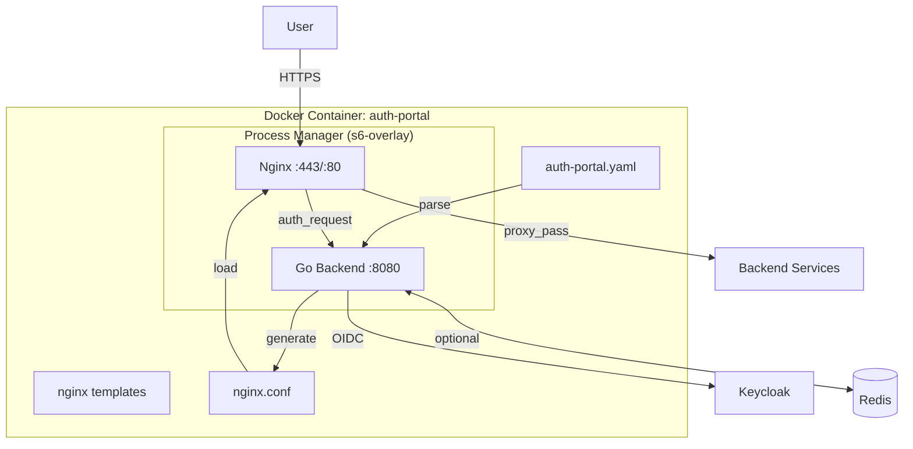
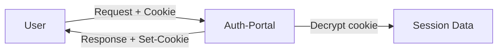
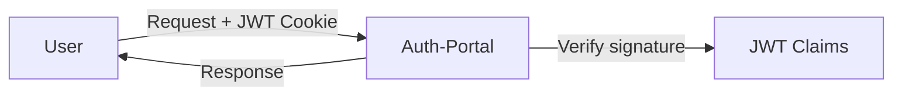
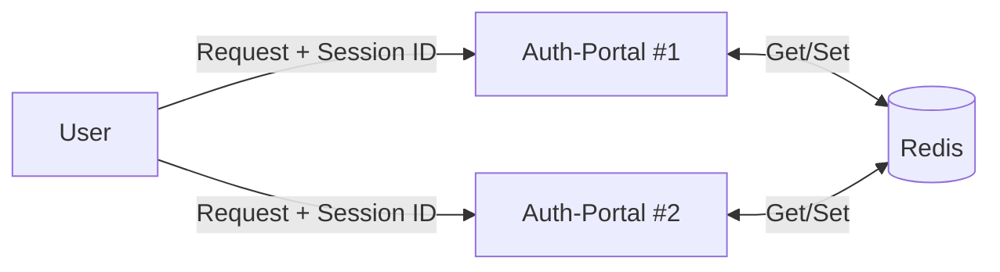
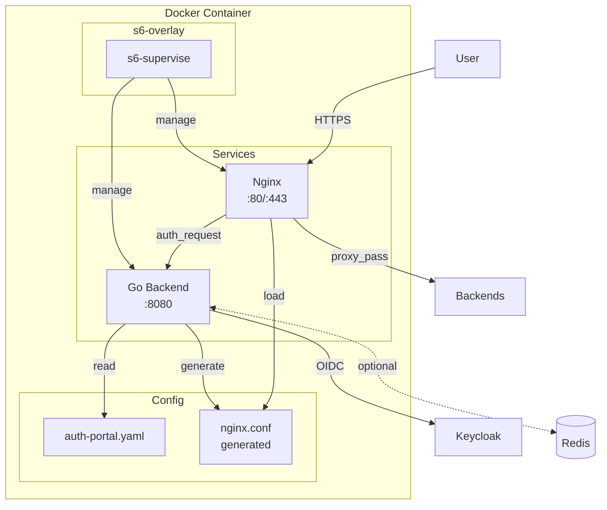
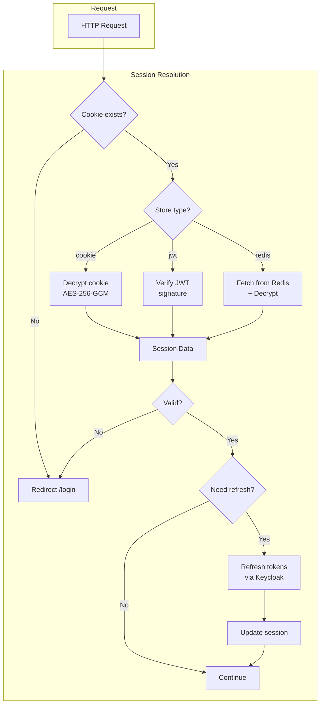

# Auth-Portal Service: Техническое задание (v0.4)

## Назначение

Единый микросервис аутентификации пользователей (Nginx + Go backend) с UI для выбора способа входа и последующим перенаправлением/проксированием к целевым сервисам.

**Ключевые принципы:**
- Только аутентификация, без авторизации (авторизация на стороне целевых сервисов)
- Единый Docker-контейнер (Nginx + Go)
- Единый YAML конфиг для всех компонентов
- Per-service конфигурация манипуляций с запросами

---

## Архитектура



---

## Scope MVP

### 1. Аутентификация

- [ ] Своя login-страница с кнопками провайдеров
- [ ] Keycloak как единственный IdP (OIDC)
- [ ] Поддержка `kc_idp_hint` для social login (Google, GitHub, etc.)

### 2. Режимы работы

- [ ] **Portal mode**: список сервисов после логина → выбор → redirect
- [ ] **Single-service mode**: логин → сразу redirect на один сервис
- [ ] **Forward Auth mode**: endpoint `/auth` для Nginx auth_request

### 3. После аутентификации

- [ ] Redirect на целевой сервис
- [ ] ИЛИ проксирование через Nginx с:
  - URL rewrite (regex-based) — per-service
  - Header modification (add/remove/set) — per-service
  - ~~Body transformation~~ — НЕ в MVP

### 4. Хранение сессий (опционально)

- [ ] **Cookie Store** — encrypted cookie (по умолчанию, stateless)
- [ ] **JWT Store** — stateless, данные в JWT cookie
- [ ] **Redis Store** — для горизонтального масштабирования

### 5. Конфигурация

- [ ] Единый YAML файл
- [ ] Environment variables для секретов (`${VAR}` синтаксис)
- [ ] Шаблонизация nginx.conf из YAML

---

## Решённые вопросы

| Вопрос | Решение |
|--------|---------|
| Авторизация | НЕТ на уровне портала, только аутентификация |
| Forward Auth | Да, endpoint `/auth` для Nginx auth_request |
| Список сервисов | Статически из YAML |
| Локальные пользователи | Нет в MVP, только Keycloak |
| Body transformation | Нет, только headers |
| Headers/Rewrites | Per-service конфигурация (как Junction в Sber IAM) |
| Масштабирование | Опциональный Redis для сессий |
| Архитектура | Единый контейнер (Nginx + Go + s6-overlay) |
| Шаблонизатор | `text/template` + `sprig` |

---

## Технический стек

| Компонент | Технология |
|-----------|------------|
| Язык | Go 1.22+ |
| HTTP Router | chi |
| OIDC Client | coreos/go-oidc + oauth2 |
| Sessions | gorilla/sessions (cookie) / go-redis (optional) |
| Config | gopkg.in/yaml.v3 |
| Templating | text/template + Masterminds/sprig |
| HTML Templates | html/template |
| Web Server | Nginx 1.25+ |
| Process Manager | s6-overlay |
| Container | Alpine Linux |

### Почему `text/template` + `sprig`?

| Альтернатива | Плюсы | Минусы |
|--------------|-------|--------|
| `text/template` (stdlib) | Стандартная библиотека | Мало функций |
| **`text/template` + `sprig`** | Stdlib + 100+ функций, Helm-совместимый | +1 зависимость |
| `pongo2` | Django-like синтаксис | Другой синтаксис |
| `jet` | Type-safe, быстрый | Меньше community |

**Sprig добавляет:** `env`, `default`, `join`, `indent`, `quote`, `b64enc`, `required` и др.

---

## Структура проекта

```
auth-portal/
├── cmd/
│   └── auth-portal/
│       └── main.go
│
├── internal/
│   ├── config/
│   │   ├── config.go           # Структуры конфигурации
│   │   ├── loader.go           # Загрузка YAML + env vars
│   │   └── validate.go         # Валидация конфига
│   │
│   ├── nginx/
│   │   ├── generator.go        # YAML → nginx.conf (sprig templates)
│   │   ├── manager.go          # Запуск/Reload Nginx
│   │   └── templates/
│   │       ├── nginx.conf.tmpl
│   │       ├── server.tmpl
│   │       ├── location.tmpl
│   │       └── upstream.tmpl
│   │
│   ├── handler/
│   │   ├── auth.go             # Login/Logout/Callback
│   │   ├── portal.go           # Portal UI
│   │   ├── authcheck.go        # /auth (для nginx auth_request)
│   │   └── health.go           # Health/Ready/Metrics
│   │
│   ├── service/
│   │   ├── session/
│   │   │   ├── store.go        # Session Store interface
│   │   │   ├── cookie.go       # Encrypted Cookie Store
│   │   │   ├── jwt.go          # JWT Store (stateless)
│   │   │   └── redis.go        # Redis Store (optional)
│   │   │
│   │   ├── idp/
│   │   │   ├── provider.go     # IdP interface
│   │   │   ├── oidc.go         # Keycloak OIDC
│   │   │   └── mock.go         # Dev mode mock
│   │   │
│   │   └── crypto/
│   │       ├── encrypt.go      # AES-GCM encryption
│   │       └── jwt.go          # JWT signing/validation
│   │
│   ├── model/
│   │   ├── user.go             # User model
│   │   ├── session.go          # Session model
│   │   └── service.go          # Service/Junction definition
│   │
│   └── ui/
│       ├── templates/
│       │   ├── base.html
│       │   ├── login.html
│       │   ├── portal.html
│       │   └── error.html
│       └── static/
│           ├── css/
│           └── js/
│
├── nginx/
│   └── templates/              # Nginx config templates
│       ├── nginx.conf.tmpl
│       ├── http.tmpl
│       ├── server.tmpl
│       └── location.tmpl
│
├── s6-rc.d/                    # s6-overlay service definitions
│   ├── auth-portal/
│   │   ├── type
│   │   ├── run
│   │   └── finish
│   ├── nginx/
│   │   ├── type
│   │   ├── run
│   │   └── dependencies.d/
│   │       └── auth-portal
│   └── config-watcher/         # Hot reload on config change
│       ├── type
│       └── run
│
├── configs/
│   ├── auth-portal.yaml        # Main config
│   └── profiles/               # Dev mode profiles
│       ├── developer.yaml
│       └── admin.yaml
│
├── deployments/
│   ├── Dockerfile
│   └── docker-compose.yaml
│
├── go.mod
├── go.sum
├── Makefile
└── README.md
```

---

## Конфигурация

### Полный пример auth-portal.yaml

```yaml
# =============================================================================
# AUTH-PORTAL CONFIGURATION
# =============================================================================

# -----------------------------------------------------------------------------
# Server Settings
# -----------------------------------------------------------------------------
server:
  http_port: 80
  https_port: 443

  tls:
    enabled: true
    cert: /certs/server.crt
    key: /certs/server.key

    # ИЛИ автоматический Let's Encrypt
    auto_cert:
      enabled: false
      email: admin@example.com
      domains:
        - portal.example.com

# -----------------------------------------------------------------------------
# Operation Mode
# -----------------------------------------------------------------------------
mode: portal  # portal | single-service

# Для single-service mode
single_service:
  target_url: https://app.internal

# -----------------------------------------------------------------------------
# Authentication (Keycloak OIDC)
# -----------------------------------------------------------------------------
auth:
  keycloak:
    issuer_url: https://keycloak.example.com/realms/main
    client_id: auth-portal
    client_secret: ${KC_CLIENT_SECRET}
    redirect_url: https://portal.example.com/callback
    scopes:
      - openid
      - profile
      - email

    # Social login через kc_idp_hint
    social_providers:
      - name: google
        display_name: "Google"
        idp_hint: google
        icon: google
      - name: github
        display_name: "GitHub"
        idp_hint: github
        icon: github

# -----------------------------------------------------------------------------
# Session Storage
# -----------------------------------------------------------------------------
session:
  # Тип хранилища: cookie | jwt | redis
  store: cookie

  # Общие настройки
  cookie_name: _auth_session
  ttl: 24h
  secure: true
  same_site: lax

  # Шифрование данных сессии (для cookie и redis)
  encryption:
    enabled: true
    key: ${SESSION_ENCRYPTION_KEY}  # 32 bytes для AES-256-GCM

  # === Cookie Store ===
  cookie:
    max_size: 4096  # Максимальный размер cookie

  # === JWT Store (stateless) ===
  jwt:
    signing_key: ${JWT_SIGNING_KEY}
    algorithm: HS256  # HS256 | RS256
    # Для RS256
    # private_key: /keys/jwt.key
    # public_key: /keys/jwt.pub

  # === Redis Store ===
  redis:
    enabled: false
    addresses:
      - redis:6379
    password: ${REDIS_PASSWORD}
    db: 0

    # TLS (рекомендуется для production)
    tls:
      enabled: false
      cert: /certs/redis-client.crt
      key: /certs/redis-client.key
      ca: /certs/redis-ca.crt

    # Connection pool
    pool_size: 10
    min_idle_conns: 5

    # Key settings
    key_prefix: "authportal:session:"

# -----------------------------------------------------------------------------
# Token Refresh
# -----------------------------------------------------------------------------
token:
  auto_refresh: true
  refresh_threshold: 5m  # Обновить за 5 мин до истечения

# -----------------------------------------------------------------------------
# Services (Junctions)
# -----------------------------------------------------------------------------
services:
  - name: grafana
    display_name: "Grafana Monitoring"
    description: "Система мониторинга и визуализации"
    icon: chart-line

    # Routing
    location: /grafana           # URL path
    upstream: http://grafana:3000

    # Аутентификация
    auth_required: true

    # URL Rewrite (per-service)
    rewrite: "^/grafana/(.*) /$1 break"

    # Headers (per-service)
    headers:
      add:
        X-User-Email: "{{.User.Email}}"
        X-User-ID: "{{.User.ID}}"
        X-Forwarded-User: "{{.User.Email}}"
        X-WEBAUTH-USER: "{{.User.Email}}"
      remove:
        - Authorization

    # Дополнительные nginx директивы
    nginx_extra: |
      proxy_read_timeout 300s;
      proxy_buffering off;

  - name: kibana
    display_name: "Kibana"
    icon: search
    location: /kibana
    upstream: http://kibana:5601
    auth_required: true
    rewrite: "^/kibana/(.*) /$1 break"
    headers:
      add:
        X-Proxy-User: "{{.User.ID}}"
        kbn-xsrf: "true"

  - name: static
    display_name: "Static Files"
    location: /static
    upstream: http://static:80
    auth_required: false  # Публичный доступ

# -----------------------------------------------------------------------------
# Dev Mode (Mock Auth)
# -----------------------------------------------------------------------------
dev_mode:
  enabled: false
  profiles_dir: ./profiles
  default_profile: developer

# -----------------------------------------------------------------------------
# Nginx Tuning
# -----------------------------------------------------------------------------
nginx:
  worker_processes: auto
  worker_connections: 1024
  keepalive_timeout: 65
  client_max_body_size: 100m

  # Rate limiting
  rate_limit:
    enabled: true
    zone_size: 10m
    requests_per_second: 10
    burst: 20

  # Logging
  access_log: /var/log/nginx/access.log
  error_log: /var/log/nginx/error.log
  log_format: |
    $remote_addr - $remote_user [$time_local] "$request"
    $status $body_bytes_sent "$http_referer"
    "$http_user_agent" "$http_x_forwarded_for"

# -----------------------------------------------------------------------------
# Observability
# -----------------------------------------------------------------------------
observability:
  metrics:
    enabled: true
    path: /metrics

  health:
    path: /health

  ready:
    path: /ready
```

---

## Хранилища сессий

### Сравнение

| Store | Stateless | Масштабирование | Инвалидация | Размер данных | Безопасность |
|-------|-----------|-----------------|-------------|---------------|--------------|
| **Cookie** | Да | Любое | Нет (TTL) | До 4KB | Шифрование |
| **JWT** | Да | Любое | Нет (TTL) | До 4KB | Подпись |
| **Redis** | Нет | Горизонтальное | Да | Любой | Шифрование + TLS |

### Cookie Store (по умолчанию)



- Данные зашифрованы AES-256-GCM
- Ключ шифрования из `SESSION_ENCRYPTION_KEY`
- Ограничение: ~4KB данных

### JWT Store (stateless)



- JWT подписан HMAC или RSA
- Данные в claims (не зашифрованы, только подписаны)
- Нельзя инвалидировать до истечения

### Redis Store (масштабирование)



- Session ID в cookie, данные в Redis
- Данные зашифрованы перед записью
- Можно инвалидировать сессию

---

## API Endpoints

### User Authentication

| Endpoint | Method | Описание |
|----------|--------|----------|
| `/` | GET | Redirect на /login или /portal |
| `/login` | GET | Страница входа с кнопками провайдеров |
| `/login/keycloak` | GET | Redirect на Keycloak |
| `/login/social/{provider}` | GET | Redirect на Keycloak с kc_idp_hint |
| `/callback` | GET | OAuth2 callback |
| `/logout` | GET/POST | Logout, очистка сессии |
| `/portal` | GET | Список сервисов (portal mode) |

### Forward Auth

| Endpoint | Method | Описание |
|----------|--------|----------|
| `/auth` | GET | Nginx auth_request endpoint |

**Response Headers (при 200 OK):**
- `X-Auth-Request-User` — email пользователя
- `X-Auth-Request-Email` — email
- `X-Auth-Request-Groups` — группы (comma-separated)

### System

| Endpoint | Method | Описание |
|----------|--------|----------|
| `/health` | GET | Health check |
| `/ready` | GET | Readiness probe |
| `/metrics` | GET | Prometheus metrics |

---

## Диаграммы

### Архитектура единого контейнера



### Session Store Flow



### Nginx Config Generation

```mermaid
flowchart LR
    subgraph "Input"
        YAML[auth-portal.yaml]
        TMPL[nginx templates<br/>+ sprig]
    end

    subgraph "Go Backend"
        PARSE[Parse YAML]
        GEN[Generate config]
        WRITE[Write nginx.conf]
        RELOAD[nginx -s reload]
    end

    subgraph "Output"
        CONF[/etc/nginx/nginx.conf]
    end

    YAML --> PARSE
    PARSE --> GEN
    TMPL --> GEN
    GEN --> WRITE
    WRITE --> CONF
    CONF --> RELOAD
```

---

## Безопасность

### Session Security

| Механизм | Cookie Store | JWT Store | Redis Store |
|----------|--------------|-----------|-------------|
| Шифрование данных | AES-256-GCM | Нет (только подпись) | AES-256-GCM |
| Защита от подделки | AEAD | Подпись (HMAC/RSA) | Session ID |
| Secure cookie | Да | Да | Да |
| HttpOnly | Да | Да | Да |
| SameSite | Lax/Strict | Lax/Strict | Lax/Strict |

### Redis Security (если используется)

- [ ] Redis AUTH + ACL
- [ ] TLS для соединений
- [ ] Данные зашифрованы перед записью
- [ ] Network isolation
- [ ] Короткий TTL сессий

---

## Dockerfile

```dockerfile
FROM golang:1.22-alpine AS builder

WORKDIR /build
COPY go.mod go.sum ./
RUN go mod download
COPY . .
RUN CGO_ENABLED=0 go build -o auth-portal ./cmd/auth-portal

# ---

FROM nginx:1.25-alpine

# s6-overlay
ADD https://github.com/just-containers/s6-overlay/releases/download/v3.1.6.2/s6-overlay-noarch.tar.xz /tmp
ADD https://github.com/just-containers/s6-overlay/releases/download/v3.1.6.2/s6-overlay-x86_64.tar.xz /tmp
RUN tar -C / -Jxpf /tmp/s6-overlay-noarch.tar.xz && \
    tar -C / -Jxpf /tmp/s6-overlay-x86_64.tar.xz && \
    rm /tmp/*.tar.xz

# Go binary
COPY --from=builder /build/auth-portal /usr/local/bin/

# Templates
COPY nginx/templates /etc/auth-portal/nginx-templates
COPY internal/ui/templates /etc/auth-portal/ui-templates
COPY internal/ui/static /etc/auth-portal/static

# s6 services
COPY s6-rc.d /etc/s6-overlay/s6-rc.d

# Default config
COPY configs/auth-portal.yaml /etc/auth-portal/config.yaml

ENV AUTH_PORTAL_CONFIG=/etc/auth-portal/config.yaml

EXPOSE 80 443

ENTRYPOINT ["/init"]
```

---

## Переменные окружения

| Переменная | Обязательная | Описание |
|------------|--------------|----------|
| `AUTH_PORTAL_CONFIG` | Нет | Путь к конфигу (default: /etc/auth-portal/config.yaml) |
| `KC_CLIENT_SECRET` | Да | Keycloak client secret |
| `SESSION_ENCRYPTION_KEY` | Да | 32-byte ключ шифрования сессий |
| `JWT_SIGNING_KEY` | При jwt store | Ключ подписи JWT |
| `REDIS_PASSWORD` | При redis store | Пароль Redis |
