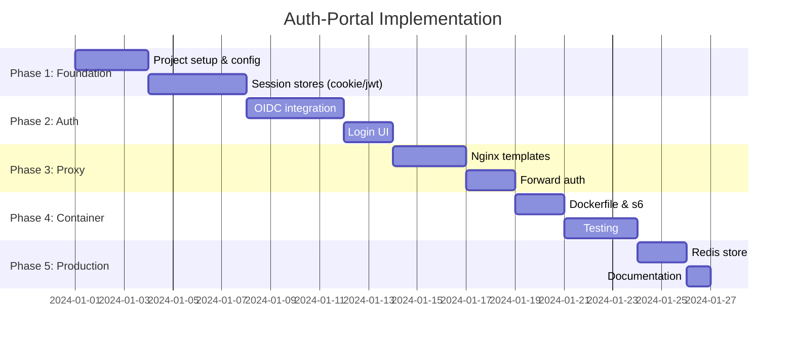

# Auth-Portal: План работ

## Обзор этапов



---

## Phase 1: Фундамент

### 1.1 Инициализация проекта

- [ ] Создать структуру директорий
- [ ] Инициализировать Go module
- [ ] Добавить зависимости в go.mod
- [ ] Создать Makefile

**Зависимости:**
```go
require (
    github.com/go-chi/chi/v5
    github.com/coreos/go-oidc/v3
    golang.org/x/oauth2
    github.com/gorilla/sessions
    github.com/Masterminds/sprig/v3
    gopkg.in/yaml.v3
    github.com/redis/go-redis/v9  // optional
)
```

**Файлы:**
- `go.mod`, `go.sum`
- `Makefile`
- `cmd/auth-portal/main.go`

---

### 1.2 Конфигурация

- [ ] Определить структуры конфигурации
- [ ] Реализовать загрузку YAML
- [ ] Реализовать подстановку env vars (`${VAR}`)
- [ ] Добавить валидацию конфига

**Файлы:**
- `internal/config/config.go` — структуры
- `internal/config/loader.go` — загрузка
- `internal/config/validate.go` — валидация
- `internal/config/env.go` — подстановка env

**Структура конфига:**
```go
type Config struct {
    Server     ServerConfig     `yaml:"server"`
    Mode       string           `yaml:"mode"`
    Auth       AuthConfig       `yaml:"auth"`
    Session    SessionConfig    `yaml:"session"`
    Services   []ServiceConfig  `yaml:"services"`
    DevMode    DevModeConfig    `yaml:"dev_mode"`
    Nginx      NginxConfig      `yaml:"nginx"`
}
```

---

### 1.3 Модели данных

- [ ] User model
- [ ] Session model
- [ ] Service/Junction model

**Файлы:**
- `internal/model/user.go`
- `internal/model/session.go`
- `internal/model/service.go`

---

### 1.4 Криптография

- [ ] AES-256-GCM шифрование/дешифрование
- [ ] JWT signing/verification (HS256, RS256)
- [ ] Генерация случайных ID

**Файлы:**
- `internal/service/crypto/encrypt.go`
- `internal/service/crypto/jwt.go`
- `internal/service/crypto/random.go`

---

## Phase 2: Session Stores

### 2.1 Session Store Interface

- [ ] Определить интерфейс Store
- [ ] Методы: Get, Set, Delete, Refresh

**Файлы:**
- `internal/service/session/store.go`

```go
type Store interface {
    Get(r *http.Request) (*Session, error)
    Set(w http.ResponseWriter, session *Session) error
    Delete(w http.ResponseWriter, r *http.Request) error
}
```

---

### 2.2 Cookie Store (default)

- [ ] Encrypted cookie store
- [ ] AES-GCM шифрование данных
- [ ] Настройки cookie (Secure, HttpOnly, SameSite)

**Файлы:**
- `internal/service/session/cookie.go`

---

### 2.3 JWT Store

- [ ] JWT в cookie
- [ ] Signing с HMAC или RSA
- [ ] Claims: user info, exp, iat

**Файлы:**
- `internal/service/session/jwt.go`

---

### 2.4 Redis Store (optional)

- [ ] Session ID в cookie
- [ ] Данные в Redis (зашифрованные)
- [ ] TLS подключение
- [ ] Connection pooling

**Файлы:**
- `internal/service/session/redis.go`

---

## Phase 3: Аутентификация

### 3.1 IdP Interface

- [ ] Определить интерфейс Provider
- [ ] Методы: AuthURL, Exchange, UserInfo

**Файлы:**
- `internal/service/idp/provider.go`

```go
type Provider interface {
    AuthURL(state string, opts ...oauth2.AuthCodeOption) string
    Exchange(ctx context.Context, code string) (*Tokens, error)
    UserInfo(ctx context.Context, token *oauth2.Token) (*User, error)
    Refresh(ctx context.Context, refreshToken string) (*Tokens, error)
}
```

---

### 3.2 Keycloak OIDC Provider

- [ ] OIDC Discovery
- [ ] OAuth2 flow
- [ ] Token exchange
- [ ] Refresh tokens
- [ ] Social login (kc_idp_hint)

**Файлы:**
- `internal/service/idp/oidc.go`

---

### 3.3 Mock Provider (Dev Mode)

- [ ] Загрузка профилей из YAML
- [ ] Переключение профилей через query param
- [ ] Имитация сессии

**Файлы:**
- `internal/service/idp/mock.go`

---

### 3.4 Auth Handlers

- [ ] GET `/login` — страница входа
- [ ] GET `/login/keycloak` — redirect на Keycloak
- [ ] GET `/login/social/{provider}` — redirect с kc_idp_hint
- [ ] GET `/callback` — обработка callback
- [ ] POST `/logout` — выход

**Файлы:**
- `internal/handler/auth.go`

---

### 3.5 Auth Check Handler

- [ ] GET `/auth` — для nginx auth_request
- [ ] Проверка сессии
- [ ] Refresh токена если нужно
- [ ] Response headers (X-Auth-Request-*)

**Файлы:**
- `internal/handler/authcheck.go`

---

### 3.6 Login UI

- [ ] Base HTML template
- [ ] Login page с кнопками провайдеров
- [ ] Error page
- [ ] Минимальный CSS

**Файлы:**
- `internal/ui/templates/base.html`
- `internal/ui/templates/login.html`
- `internal/ui/templates/error.html`
- `internal/ui/static/css/style.css`

---

## Phase 4: Portal & Proxy

### 4.1 Portal Handler

- [ ] GET `/portal` — список сервисов
- [ ] Фильтрация по auth_required
- [ ] Portal UI template

**Файлы:**
- `internal/handler/portal.go`
- `internal/ui/templates/portal.html`

---

### 4.2 Nginx Template Generator

- [ ] Загрузка шаблонов с sprig
- [ ] Генерация nginx.conf из конфига
- [ ] Генерация locations для сервисов
- [ ] Валидация через nginx -t

**Файлы:**
- `internal/nginx/generator.go`
- `internal/nginx/templates.go`
- `nginx/templates/nginx.conf.tmpl`
- `nginx/templates/http.tmpl`
- `nginx/templates/server.tmpl`
- `nginx/templates/location.tmpl`

---

### 4.3 Nginx Manager

- [ ] Запуск nginx
- [ ] Reload конфигурации
- [ ] Health check

**Файлы:**
- `internal/nginx/manager.go`

---

### 4.4 Health Handlers

- [ ] GET `/health` — liveness
- [ ] GET `/ready` — readiness (nginx + keycloak)
- [ ] GET `/metrics` — Prometheus metrics

**Файлы:**
- `internal/handler/health.go`

---

## Phase 5: Container

### 5.1 Dockerfile

- [ ] Multi-stage build
- [ ] Alpine base
- [ ] s6-overlay installation
- [ ] Go binary
- [ ] Templates и static files

**Файлы:**
- `deployments/Dockerfile`

---

### 5.2 s6-overlay Services

- [ ] auth-portal service (Go)
- [ ] nginx service
- [ ] config-watcher (optional)

**Файлы:**
- `s6-rc.d/auth-portal/type`
- `s6-rc.d/auth-portal/run`
- `s6-rc.d/nginx/type`
- `s6-rc.d/nginx/run`
- `s6-rc.d/nginx/dependencies.d/auth-portal`

---

### 5.3 Docker Compose

- [ ] auth-portal service
- [ ] keycloak service
- [ ] redis service (optional)
- [ ] Volumes для конфигов и сертификатов

**Файлы:**
- `deployments/docker-compose.yaml`
- `deployments/docker-compose.dev.yaml`

---

## Phase 6: Тестирование

### 6.1 Unit Tests

- [ ] Config loader tests
- [ ] Crypto tests (encrypt/decrypt, JWT)
- [ ] Session store tests
- [ ] Handler tests

**Файлы:**
- `internal/config/*_test.go`
- `internal/service/crypto/*_test.go`
- `internal/service/session/*_test.go`
- `internal/handler/*_test.go`

---

### 6.2 Integration Tests

- [ ] OIDC flow с mock Keycloak
- [ ] Session persistence
- [ ] Nginx config generation

---

### 6.3 E2E Tests

- [ ] Docker Compose setup
- [ ] Full login flow
- [ ] Forward auth flow
- [ ] Portal navigation

---

## Phase 7: Production Ready

### 7.1 Redis Store Implementation

- [ ] Redis client setup
- [ ] TLS configuration
- [ ] Sentinel support
- [ ] Data encryption

---

### 7.2 Observability

- [ ] Structured logging (slog)
- [ ] Prometheus metrics
- [ ] Request tracing (optional)

---

### 7.3 Documentation

- [ ] README.md
- [ ] Configuration reference
- [ ] Deployment guide
- [ ] Security recommendations

---

## Чеклист готовности MVP

### Функциональность
- [ ] Login page отображается
- [ ] Keycloak OIDC flow работает
- [ ] Сессия создаётся и сохраняется
- [ ] Portal показывает список сервисов
- [ ] Forward auth (/auth) работает
- [ ] Nginx генерируется из конфига
- [ ] Per-service headers добавляются
- [ ] Logout очищает сессию

### Безопасность
- [ ] Cookies: Secure, HttpOnly, SameSite
- [ ] Session данные зашифрованы
- [ ] CSRF protection (state parameter)
- [ ] No sensitive data in logs

### DevOps
- [ ] Docker image собирается
- [ ] Docker Compose работает
- [ ] Health checks проходят
- [ ] Graceful shutdown

---

## Приоритет реализации

| Приоритет | Компонент | Описание |
|-----------|-----------|----------|
| **P0** | Config | Без конфига ничего не работает |
| **P0** | Session (Cookie) | Базовое хранилище |
| **P0** | OIDC Provider | Keycloak интеграция |
| **P0** | Auth Handlers | Login/callback/logout |
| **P0** | Auth Check | /auth endpoint |
| **P1** | Nginx Generator | Генерация конфига |
| **P1** | Login UI | Базовый интерфейс |
| **P1** | Dockerfile | Контейнеризация |
| **P2** | Portal UI | Список сервисов |
| **P2** | JWT Store | Альтернативное хранилище |
| **P2** | Dev Mode | Mock provider |
| **P3** | Redis Store | Масштабирование |
| **P3** | Metrics | Observability |

---

## Команды разработки

```bash
# Инициализация
make init

# Разработка
make dev          # Запуск с hot reload
make test         # Unit tests
make lint         # Linting

# Сборка
make build        # Сборка Go binary
make docker       # Сборка Docker image

# Запуск
make up           # Docker Compose up
make down         # Docker Compose down
make logs         # Просмотр логов

# Генерация
make nginx-config # Сгенерировать nginx.conf
```
