# Анализ: Аутентификация и авторизация LLM-агентов

## Оглавление

1. [Введение и проблематика](#1-введение-и-проблематика)
2. [Ключевые вызовы](#2-ключевые-вызовы)
3. [Модели авторизации агентов](#3-модели-авторизации-агентов)
4. [Существующие стандарты и протоколы](#4-существующие-стандарты-и-протоколы)
5. [Индустриальные решения](#5-индустриальные-решения)
6. [Best Practices](#6-best-practices)
7. [Архитектурные паттерны](#7-архитектурные-паттерны)
8. [Рекомендации для проекта](#8-рекомендации-для-проекта)
9. [Источники](#9-источники)

---

## 1. Введение и проблематика

### 1.1. Контекст

LLM-агенты — это автономные системы на базе больших языковых моделей, способные:
- Выполнять многошаговые задачи без постоянного контроля человека
- Взаимодействовать с внешними API, базами данных, инструментами
- Коммуницировать с другими агентами для решения сложных задач
- Действовать от имени пользователя (delegation)

По данным Gartner, в 2025 году **более 60% крупных предприятий** развернули автономных AI-агентов в production-среде (против 15% в 2023).

### 1.2. Фундаментальная проблема

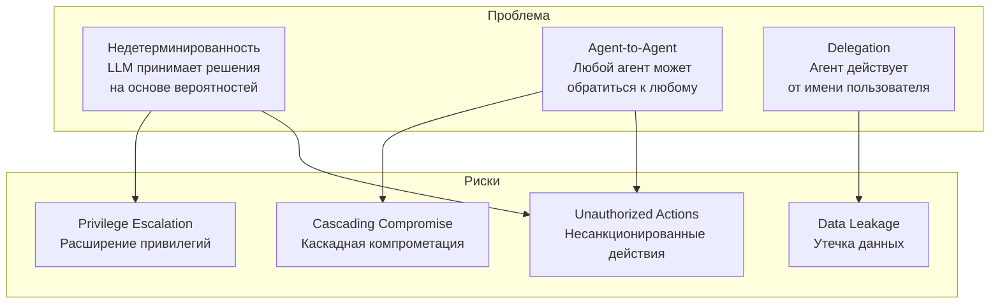

### 1.3. Почему традиционные IAM не работают

| Аспект | Традиционный IAM | LLM-агенты |
|--------|------------------|------------|
| **Субъект** | Человек или статичный сервис | Автономная, недетерминированная система |
| **Поведение** | Предсказуемое, детерминированное | Стохастическое, зависит от контекста |
| **Жизненный цикл** | Длительный (месяцы/годы) | Эфемерный (минуты/часы) |
| **Привилегии** | Фиксированные роли | Динамические, зависят от задачи |
| **Делегирование** | Редкое, явное | Постоянное, неявное |
| **Масштаб вызовов** | Десятки в минуту | Тысячи в час |

> *"OAuth 2.0 assumes deterministic clients, but in agentic settings stochastic reasoning, prompt injection, or multi-agent orchestration can silently expand privileges."* — arXiv: Agentic JWT

---

## 2. Ключевые вызовы

### 2.1. Недетерминированность поведения

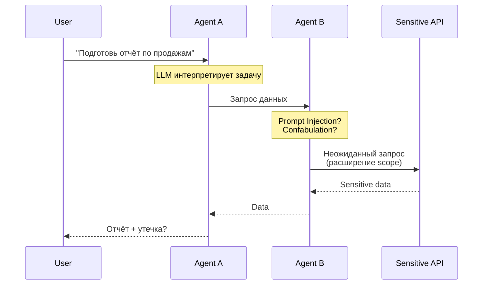

**Проблема:** Один и тот же промпт может привести к разным действиям агента.

### 2.2. Agent-to-Agent коммуникация

В Multi-Agent Systems (MAS) агенты взаимодействуют друг с другом:

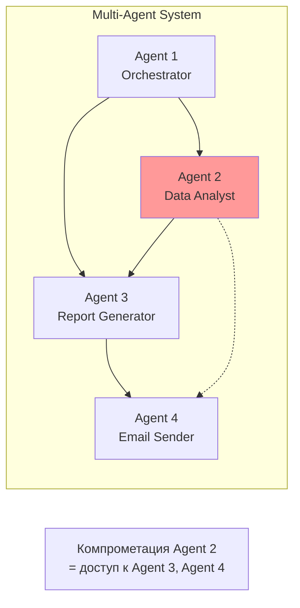

**Риск:** Каскадная компрометация — взлом одного агента распространяется по цепочке.

### 2.3. Транзитивная авторизация (Delegation)

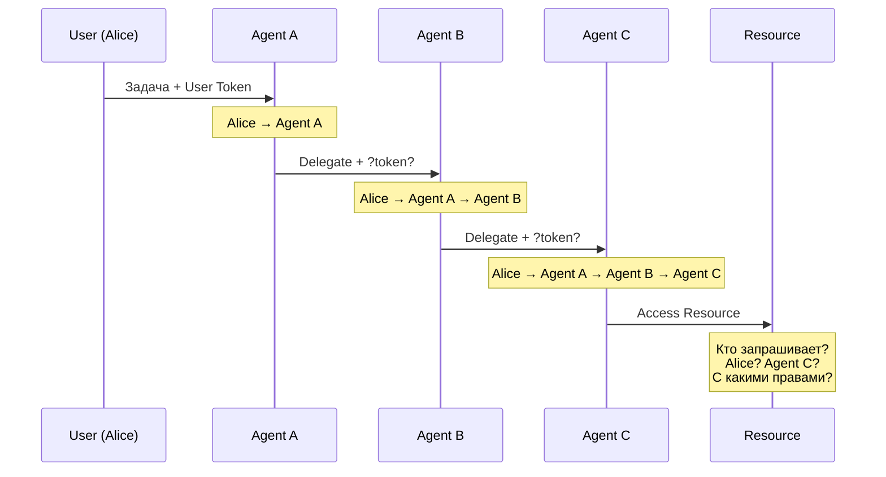

**Вопросы:**
1. Как передать контекст пользователя через цепочку агентов?
2. Как ограничить scope на каждом шаге?
3. Как аудировать всю цепочку?

### 2.4. OWASP Top 10 для Agentic AI (Dec 2025)

OWASP GenAI Security Project выпустил отдельный Top 10 для агентных приложений:

| # | Риск | Описание |
|---|------|----------|
| 1 | **Excessive Agency** | Агент имеет больше привилегий, чем необходимо |
| 2 | Prompt Injection | Манипуляция поведением через входные данные |
| 3 | Memory Poisoning | Внедрение ложной информации в память агента |
| 4 | Tool Abuse | Злоупотребление доступными инструментами |
| 5 | Privilege Escalation | Расширение привилегий через цепочки делегирования |
| 6 | Cascading Failures | Распространение ошибок между агентами |
| 7 | Confused Deputy | Агент выполняет действия с неправильным контекстом |
| 8 | Data Exfiltration | Утечка данных через агентов |
| 9 | Supply Chain | Компрометация зависимостей агента |
| 10 | Audit Gaps | Невозможность отследить действия |

---

## 3. Модели авторизации агентов

### 3.1. Agent-to-Agent (A2A)

Прямая авторизация между агентами на основе их идентичности.

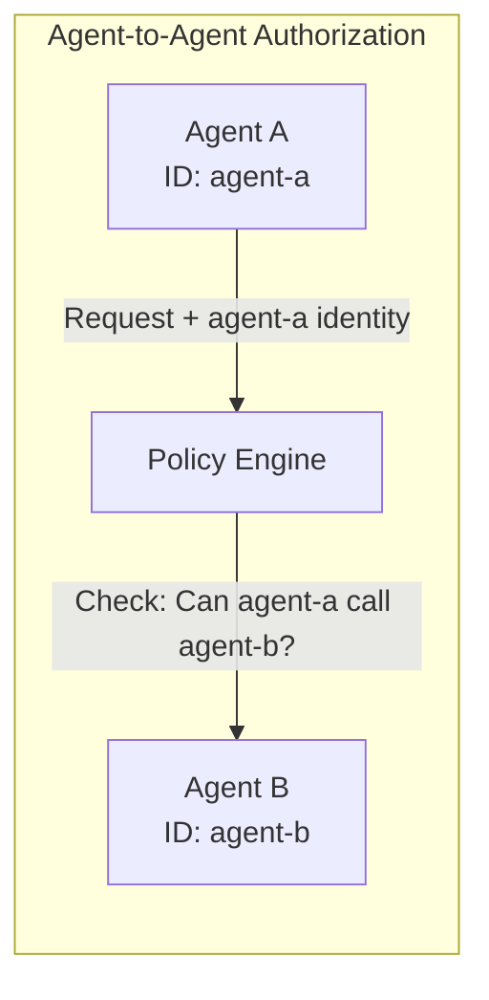

**Характеристики:**
- Агент имеет собственную идентичность (SPIFFE ID, Client Cert, API Key)
- Политики определяют, какие агенты могут взаимодействовать
- Не учитывает контекст пользователя

**Пример политики (Rego):**
```rego
package agent_authz

default allow = false

allow {
    input.source.agent_id == "agent-orchestrator"
    input.destination.agent_id == "agent-data-analyst"
    input.action == "query_data"
}
```

### 3.2. User-Delegated (On-Behalf-Of)

Агент действует от имени пользователя с его привилегиями.

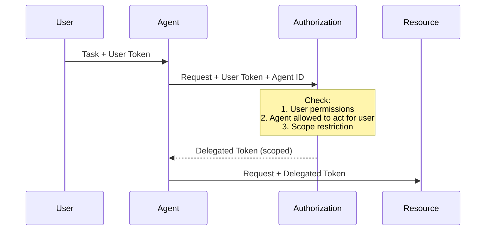

**Характеристики:**
- Агент наследует привилегии пользователя (с ограничениями)
- Требуется явное согласие пользователя на делегирование
- Scope должен сужаться на каждом шаге

### 3.3. Hybrid Model (Рекомендуемый)

Комбинация A2A и User-Delegated с учётом контекста.

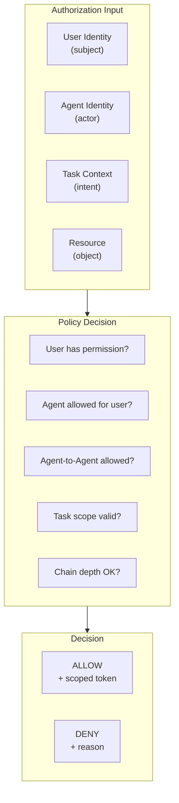

**Формула авторизации:**
```
ALLOW =
    user_has_permission(user, resource, action) AND
    agent_can_act_for_user(agent, user) AND
    agent_to_agent_allowed(source_agent, target_agent) AND
    scope_is_valid(requested_scope, max_scope) AND
    chain_depth <= max_depth
```

---

## 4. Существующие стандарты и протоколы

### 4.1. OAuth 2.0 Token Exchange (RFC 8693)

Базовый механизм для delegation в OAuth.

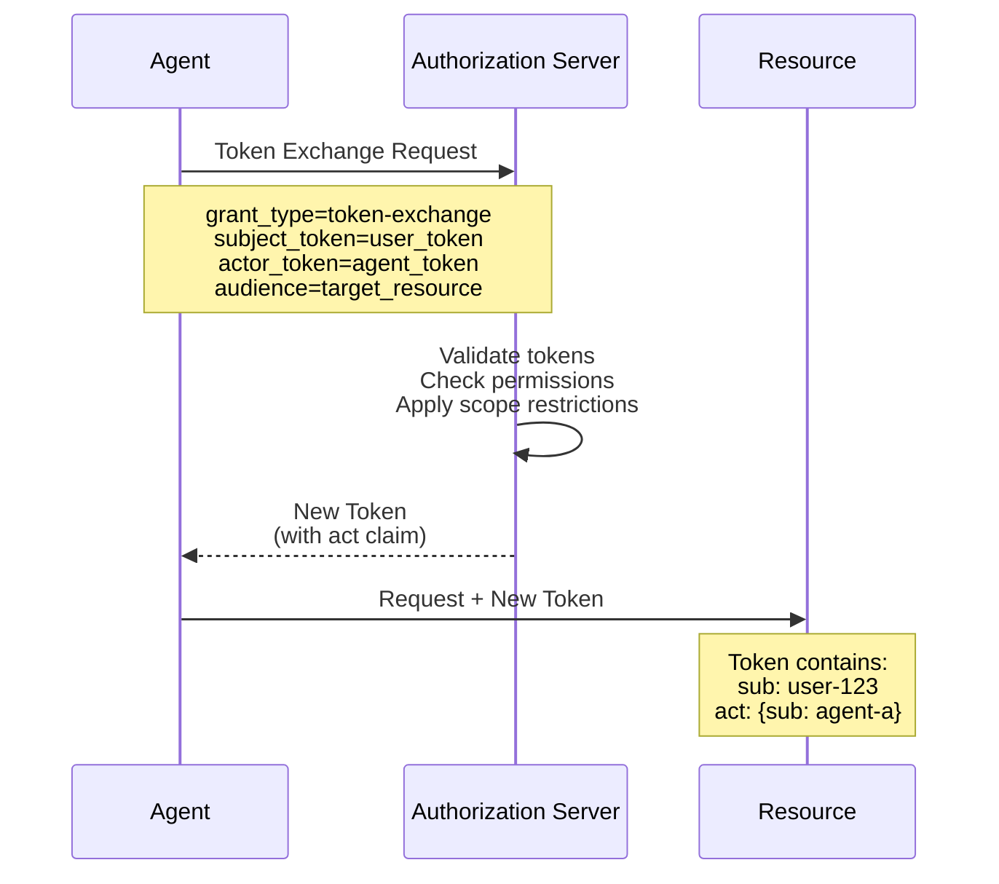

**Delegation chain в JWT:**
```json
{
  "sub": "user-123",
  "act": {
    "sub": "agent-a",
    "act": {
      "sub": "agent-b"
    }
  }
}
```

**Ограничения:**
- RFC 8693 — фреймворк, не готовое решение
- Не учитывает недетерминированность агентов
- Нет стандарта для scope attenuation

### 4.2. IETF Draft: OAuth for AI Agents (2025)

Новый draft, расширяющий OAuth для агентов.

**Ключевые расширения:**
- `requested_actor` параметр для идентификации агента
- Front-channel consent для делегирования агенту
- Явное разделение subject и actor

```http
POST /authorize HTTP/1.1
Host: auth.example.com

response_type=code
&client_id=agent-orchestrator
&requested_actor=agent-data-analyst
&scope=read:reports
&redirect_uri=https://agent.example.com/callback
```

### 4.3. Agentic JWT (A-JWT)

Исследовательский протокол (arXiv, Sept 2025) специально для агентов.

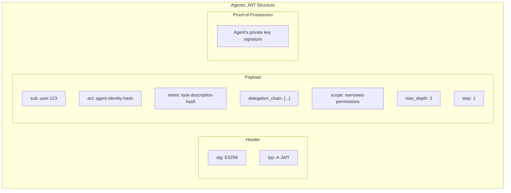

**Инновации:**
- **Agent Identity Hash** — хеш от prompt + tools + config агента
- **Intent Binding** — привязка токена к конкретной задаче
- **Proof-of-Possession** — каждый агент подписывает своим ключом
- **Scope Attenuation** — автоматическое сужение scope

### 4.4. SPIFFE/SPIRE для агентов

SPIFFE (Secure Production Identity Framework for Everyone) применим к агентам.

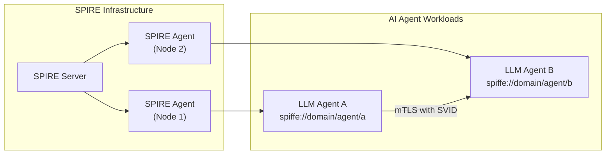

**Преимущества:**
- Автоматическая ротация credentials (SVID)
- Zero Trust архитектура
- Cryptographic proof of identity
- Поддержка ephemeral identities

**Пример SPIFFE ID для агента:**
```
spiffe://corp.example.com/ns/production/agent/data-analyst/instance/abc123
```

### 4.5. Model Context Protocol (MCP) Authorization

MCP — стандарт Anthropic для подключения агентов к инструментам.

**MCP Auth Requirements (June 2025):**
- OAuth 2.1 обязателен
- MCP Server = OAuth Resource Server
- Внешний Authorization Server
- Tool-level permissions

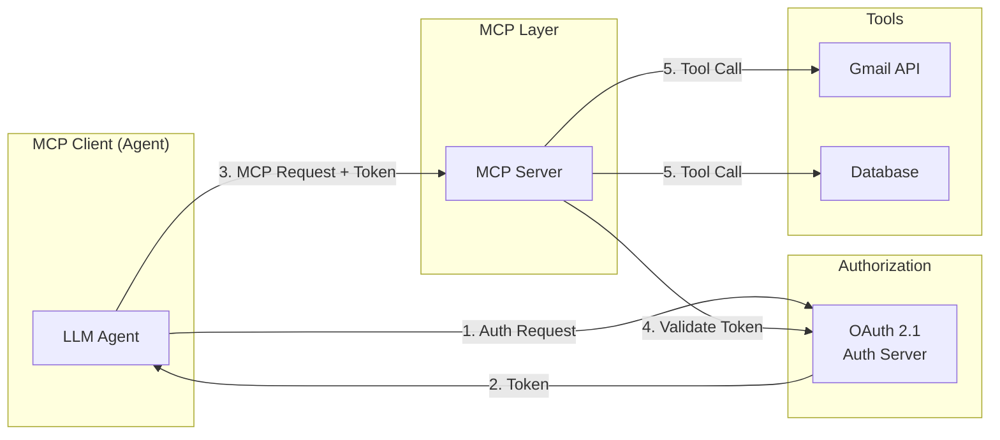

---

## 5. Индустриальные решения

### 5.1. Okta Auth for GenAI

**Релиз:** April 2025 (Developer Preview)

**Компоненты:**

| Компонент | Назначение |
|-----------|------------|
| **Token Vault** | Безопасное хранение OAuth токенов для агентов |
| **Async Authentication** | CIBA flow для фоновых агентов |
| **Fine-Grained Authorization** | ABAC для RAG (какие данные видит агент) |
| **Cross App Access (XAA)** | Стандартизация agent-to-agent подключений |

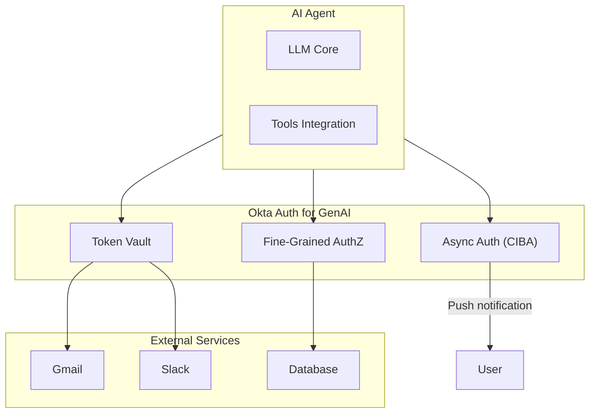

### 5.2. Microsoft Entra Agent ID

**Релиз:** Microsoft Build 2025 (Public Preview)

**Особенности:**
- Отдельный тип identity для агентов (не workload identity)
- Интеграция с Copilot Studio и Azure AI Foundry
- Conditional Access для агентов
- Ограничения на привилегированные роли

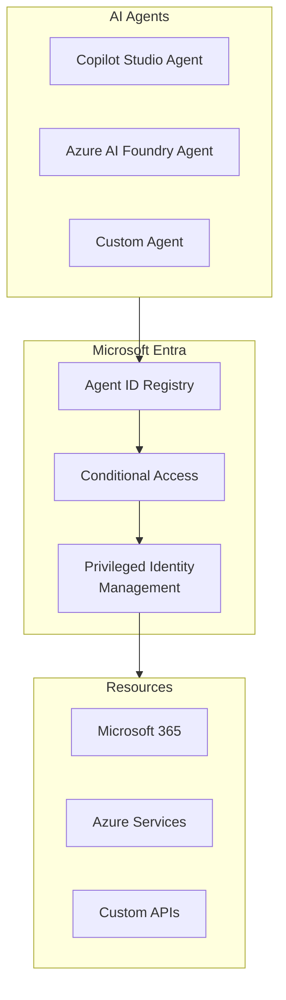

**Ограничения ролей:**
- Global Administrator — ЗАПРЕЩЕНО
- Privileged Role Administrator — ЗАПРЕЩЕНО
- User Administrator — ЗАПРЕЩЕНО
- Reader roles — РАЗРЕШЕНО

### 5.3. Cloud Security Alliance (CSA) Framework

**Документ:** "Agentic AI Identity & Access Management" (March 2025)

**Ключевые рекомендации:**

1. **Decentralized Identifiers (DIDs)** для агентов
2. **Verifiable Credentials (VCs)** для capabilities
3. **Zero Trust** принципы
4. **Agent Naming Service (ANS)** для discovery

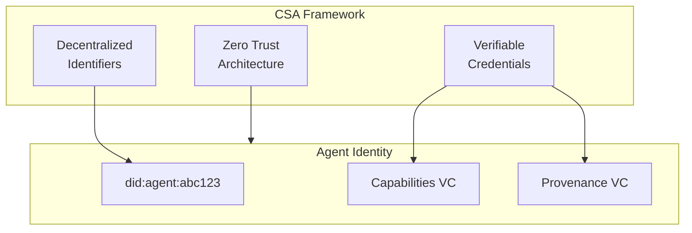

### 5.4. HashiCorp Vault for AI Agents

**Pattern:** Dynamic secrets для агентов

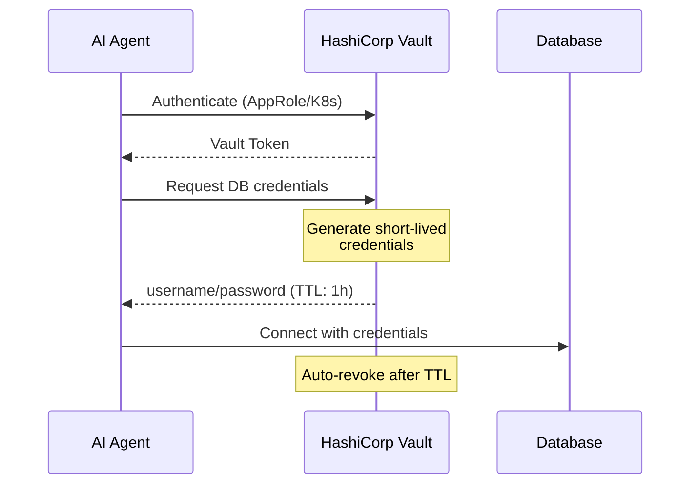

**Преимущества:**
- Ephemeral credentials
- Automatic rotation
- Audit trail
- Policy-based access

---

## 6. Best Practices

### 6.1. Zero Trust для агентов

```
"Never trust, always verify, assume breach" — NIST SP 800-207
```

**Применение к агентам:**

| Принцип | Реализация |
|---------|------------|
| Never Trust | Каждый запрос агента проверяется |
| Always Verify | Continuous authentication |
| Assume Breach | Blast radius minimization |

### 6.2. Principle of Least Privilege

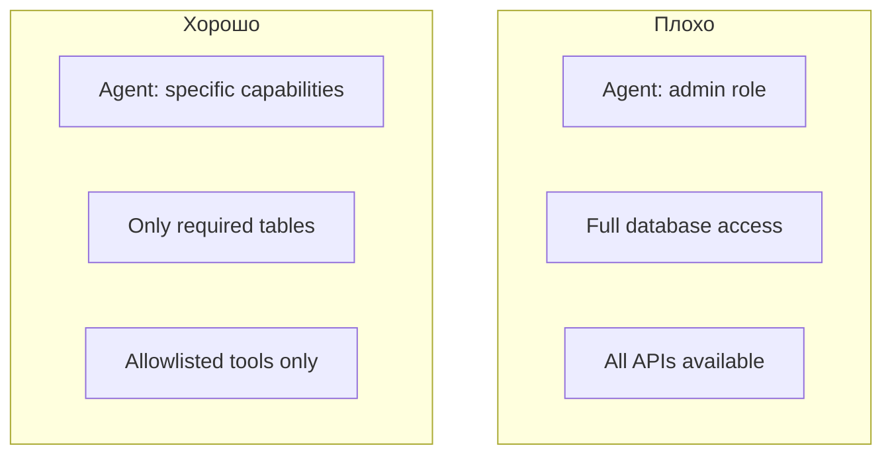

**Правила:**
1. Минимальный набор tools/functions
2. Ограниченный scope токенов
3. Time-bound permissions (JIT access)
4. Resource-specific access

### 6.3. Scope Attenuation

Каждый шаг делегирования должен **сужать** scope.

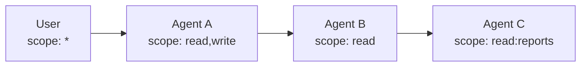

**Правило:** `scope(downstream) ⊂ scope(upstream)`

### 6.4. Chain Depth Limits

Ограничение глубины цепочки делегирования.

```yaml
delegation:
  max_chain_depth: 3

  # User → Agent A → Agent B → Agent C = depth 3
  # User → Agent A → Agent B → Agent C → Agent D = DENIED
```

### 6.5. Human-in-the-Loop для критических действий

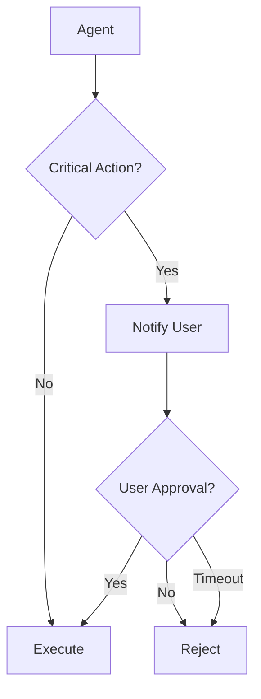

**Критические действия:**
- Финансовые транзакции
- Удаление данных
- Отправка email/сообщений
- Доступ к PII
- Изменение конфигурации

### 6.6. Comprehensive Audit Trail

```json
{
  "event_id": "evt_abc123",
  "timestamp": "2025-12-17T10:30:00Z",
  "event_type": "AGENT_ACTION",

  "user": {
    "id": "user-123",
    "roles": ["analyst"]
  },

  "delegation_chain": [
    {"agent": "agent-orchestrator", "step": 1},
    {"agent": "agent-data-analyst", "step": 2}
  ],

  "action": {
    "type": "API_CALL",
    "target": "reports-api",
    "method": "GET",
    "path": "/api/v1/reports/sales"
  },

  "decision": {
    "result": "ALLOW",
    "policy_version": "v1.2.3",
    "reasons": ["user_permitted", "agent_authorized", "scope_valid"]
  },

  "context": {
    "task_id": "task-xyz",
    "intent_hash": "sha256:abc...",
    "original_prompt_hash": "sha256:def..."
  }
}
```

---

## 7. Архитектурные паттерны

### 7.1. Centralized Policy Decision Point

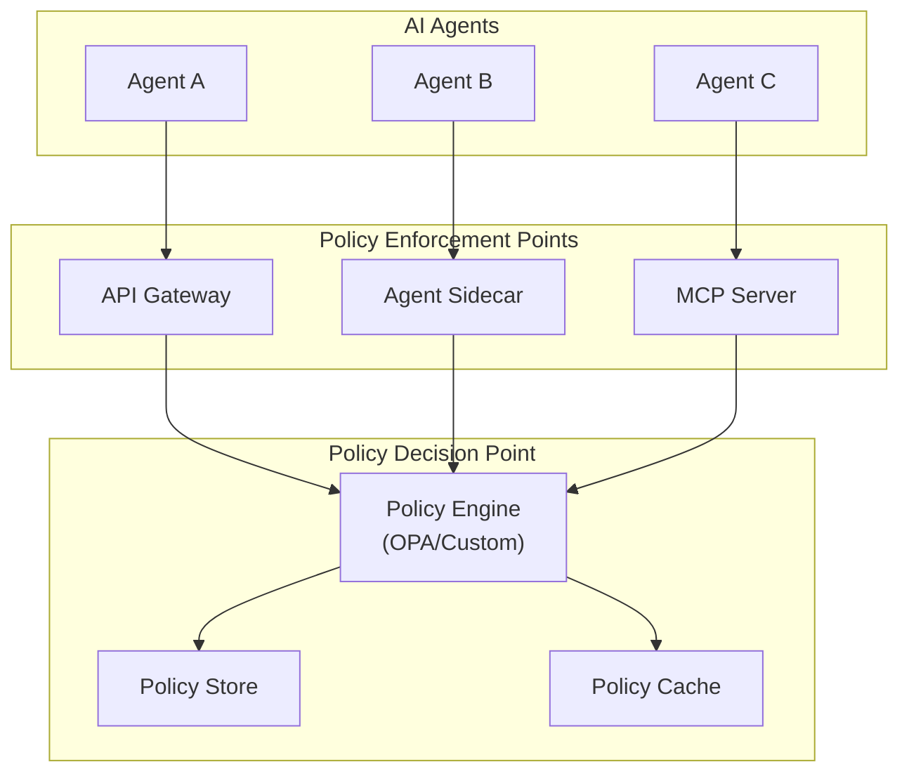

### 7.2. Agent Identity Mesh

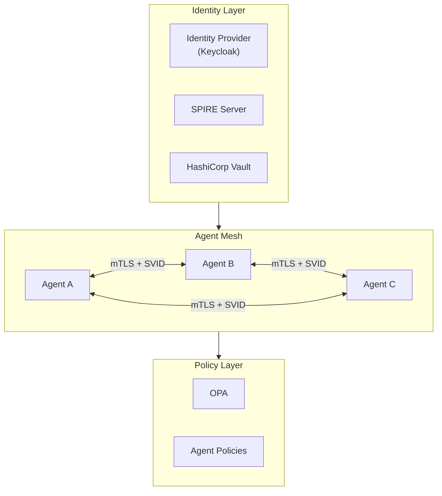

### 7.3. Token Vault Pattern

```mermaid
sequenceDiagram
    participant User
    participant Agent
    participant Vault as Token Vault
    participant Tool as External Tool

    User->>Agent: Task
    Agent->>Vault: Get token for Tool

    alt Token exists and valid
        Vault-->>Agent: Cached token
    else Token expired or missing
        Vault->>Tool: OAuth refresh/exchange
        Tool-->>Vault: New token
        Vault-->>Agent: New token
    end

    Agent->>Tool: API call + token
    Tool-->>Agent: Response
    Agent-->>User: Result
```

### 7.4. Intent-Bound Authorization

```mermaid
flowchart TB
    subgraph Request["Authorization Request"]
        User["User Context"]
        Agent["Agent Identity"]
        Intent["Task Intent<br/>(hashed prompt)"]
        Resource["Target Resource"]
    end

    subgraph Validation["Intent Validation"]
        V1["Intent matches<br/>declared capabilities?"]
        V2["Intent within<br/>user permissions?"]
        V3["Intent not<br/>blocked by policy?"]
    end

    subgraph Decision["Decision"]
        Allow["ALLOW<br/>+ intent-bound token"]
        Deny["DENY"]
    end

    Request --> Validation
    V1 --> V2
    V2 --> V3
    V3 --> Decision
```

---

## 8. Рекомендации для проекта

### 8.1. Расширение текущей архитектуры

Текущая архитектура Go Authorization Service может быть расширена для поддержки агентов:

```mermaid
flowchart TB
    subgraph Current["Текущие компоненты"]
        JWT["JWT Service"]
        Policy["Policy Service"]
        TokenExchange["Token Exchange"]
        Audit["Audit Service"]
    end

    subgraph New["Новые компоненты для агентов"]
        AgentRegistry["Agent Registry"]
        DelegationManager["Delegation Manager"]
        IntentValidator["Intent Validator"]
        ChainTracker["Chain Tracker"]
    end

    subgraph Enhanced["Расширенные"]
        PolicyExt["Policy Service<br/>+ Agent rules"]
        AuditExt["Audit Service<br/>+ Delegation chains"]
    end

    Current --> Enhanced
    New --> Enhanced
```

### 8.2. Новые сущности

```go
// Agent Identity
type AgentIdentity struct {
    ID              string            `json:"id"`
    Name            string            `json:"name"`
    Type            AgentType         `json:"type"`
    Capabilities    []string          `json:"capabilities"`
    AllowedTools    []string          `json:"allowed_tools"`
    MaxChainDepth   int               `json:"max_chain_depth"`
    TrustLevel      TrustLevel        `json:"trust_level"`
    IdentityHash    string            `json:"identity_hash"` // hash(prompt + tools + config)
    CreatedAt       time.Time         `json:"created_at"`
    ExpiresAt       *time.Time        `json:"expires_at"`
}

// Delegation Chain
type DelegationChain struct {
    OriginalUser    string            `json:"original_user"`
    Steps           []DelegationStep  `json:"steps"`
    CurrentDepth    int               `json:"current_depth"`
    MaxDepth        int               `json:"max_depth"`
    OriginalScope   []string          `json:"original_scope"`
    CurrentScope    []string          `json:"current_scope"`
    IntentHash      string            `json:"intent_hash"`
}

type DelegationStep struct {
    AgentID         string            `json:"agent_id"`
    Timestamp       time.Time         `json:"timestamp"`
    ScopeReduction  []string          `json:"scope_reduction"`
    Justification   string            `json:"justification"`
}

// Agent-to-Agent Authorization Request
type A2AAuthzRequest struct {
    SourceAgent     AgentIdentity     `json:"source_agent"`
    TargetAgent     string            `json:"target_agent"`
    Action          string            `json:"action"`
    DelegationChain *DelegationChain  `json:"delegation_chain,omitempty"`
    Intent          *Intent           `json:"intent,omitempty"`
    Context         map[string]any    `json:"context"`
}

type Intent struct {
    Description     string            `json:"description"`
    Hash            string            `json:"hash"`
    AllowedActions  []string          `json:"allowed_actions"`
    ExpiresAt       time.Time         `json:"expires_at"`
}
```

### 8.3. Расширение Policy Engine

```rego
package agent_authz

import future.keywords.in

default allow = false

# Agent-to-Agent authorization
allow {
    valid_agent_identity
    agent_to_agent_permitted
    delegation_chain_valid
    scope_valid
    intent_valid
}

valid_agent_identity {
    input.source_agent.id != ""
    input.source_agent.identity_hash != ""
    not agent_revoked(input.source_agent.id)
}

agent_to_agent_permitted {
    rule := data.agent_policies[input.source_agent.id]
    input.target_agent in rule.allowed_targets
    input.action in rule.allowed_actions
}

delegation_chain_valid {
    chain := input.delegation_chain
    chain.current_depth <= chain.max_depth

    # Each step must reduce or maintain scope
    all_scopes_valid(chain.steps)
}

scope_valid {
    requested := input.requested_scope
    allowed := input.delegation_chain.current_scope

    # All requested scopes must be in allowed
    every scope in requested {
        scope in allowed
    }
}

intent_valid {
    intent := input.intent
    intent.expires_at > time.now_ns()
    input.action in intent.allowed_actions
}

# Helpers
agent_revoked(agent_id) {
    data.revoked_agents[agent_id]
}

all_scopes_valid(steps) {
    count(steps) <= 1
}

all_scopes_valid(steps) {
    count(steps) > 1
    every i in numbers.range(1, count(steps) - 1) {
        scope_subset(steps[i].scope_reduction, steps[i-1].scope_reduction)
    }
}
```

### 8.4. Конфигурация агентов

```yaml
# config/agents.yaml

agents:
  registration:
    enabled: true
    require_approval: true
    max_ttl: 24h

  identity:
    hash_algorithm: sha256
    include_in_hash:
      - system_prompt
      - tools
      - model_version

  delegation:
    max_chain_depth: 3
    require_scope_reduction: true
    require_intent_binding: true

  trust_levels:
    - name: untrusted
      max_scope: ["read:public"]
      max_chain_depth: 1
      require_human_approval: true

    - name: basic
      max_scope: ["read:*"]
      max_chain_depth: 2
      require_human_approval: false

    - name: trusted
      max_scope: ["read:*", "write:owned"]
      max_chain_depth: 3
      require_human_approval: false

    - name: privileged
      max_scope: ["*"]
      max_chain_depth: 3
      require_human_approval: true

  policies:
    agent-orchestrator:
      trust_level: trusted
      allowed_targets:
        - agent-data-analyst
        - agent-report-generator
      allowed_actions:
        - query_data
        - generate_report
      max_calls_per_minute: 100

    agent-data-analyst:
      trust_level: basic
      allowed_targets:
        - database-api
      allowed_actions:
        - read
      restricted_tables:
        - users
        - credentials

  audit:
    log_all_decisions: true
    log_delegation_chains: true
    log_intent_hashes: true
    retention_days: 90

  human_in_loop:
    critical_actions:
      - send_email
      - delete_*
      - financial_transaction
      - access_pii
    approval_timeout: 5m
    notification_channels:
      - push
      - email
```

### 8.5. API расширения

```yaml
# POST /v1/agents/register
# Регистрация нового агента

Request:
  name: string
  type: "llm" | "workflow" | "tool"
  capabilities: string[]
  system_prompt_hash: string
  tools: string[]
  requested_trust_level: string

Response:
  agent_id: string
  identity_hash: string
  status: "pending_approval" | "active"
  credentials:
    client_id: string
    client_secret: string  # one-time display

---

# POST /v1/authorize/agent
# Авторизация agent-to-agent

Request:
  source_agent:
    id: string
    identity_hash: string
  target_agent: string
  action: string
  delegation_chain:
    original_user: string
    steps: [...]
    current_scope: string[]
  intent:
    description: string
    hash: string

Response:
  allow: boolean
  reasons: string[]
  delegated_token: string  # if allowed
  scope: string[]
  expires_in: integer

---

# POST /v1/delegation/exchange
# Token exchange с delegation chain

Request:
  grant_type: "urn:ietf:params:oauth:grant-type:token-exchange"
  subject_token: string
  subject_token_type: "urn:ietf:params:oauth:token-type:access_token"
  actor_token: string  # agent's token
  actor_token_type: "urn:ietf:params:oauth:token-type:jwt"
  audience: string
  scope: string
  intent_hash: string

Response:
  access_token: string
  token_type: "Bearer"
  expires_in: integer
  scope: string
  delegation_chain: object  # included in token
```

### 8.6. Roadmap интеграции

```mermaid
gantt
    title Agent Authorization Integration
    dateFormat YYYY-MM-DD

    section Phase 1: Foundation
    Agent Registry             :a1, 2025-01-01, 10d
    Agent Identity Model       :a2, after a1, 7d
    Basic A2A Authorization    :a3, after a2, 14d

    section Phase 2: Delegation
    Delegation Chain Tracking  :b1, after a3, 10d
    Scope Attenuation         :b2, after b1, 7d
    Token Exchange Extension   :b3, after b2, 10d

    section Phase 3: Advanced
    Intent Binding            :c1, after b3, 14d
    Human-in-Loop Integration :c2, after c1, 10d
    Async Authorization (CIBA):c3, after c2, 14d

    section Phase 4: Hardening
    Audit Enhancement         :d1, after c3, 7d
    Policy Templates          :d2, after d1, 7d
    Performance Optimization  :d3, after d2, 10d
```

---

## 9. Источники

### Стандарты и спецификации

- [RFC 8693 - OAuth 2.0 Token Exchange](https://datatracker.ietf.org/doc/html/rfc8693)
- [IETF Draft: OAuth for AI Agents On-Behalf-Of User](https://www.ietf.org/archive/id/draft-oauth-ai-agents-on-behalf-of-user-01.html)
- [MCP Authorization Specification](https://modelcontextprotocol.io/specification/2025-03-26/basic/authorization)
- [SPIFFE/SPIRE Documentation](https://spiffe.io/docs/latest/)

### Индустриальные фреймворки

- [CSA: Agentic AI Identity & Access Management](https://cloudsecurityalliance.org/artifacts/agentic-ai-identity-and-access-management-a-new-approach)
- [CSA: Securing LLM-Backed Systems](https://cloudsecurityalliance.org/artifacts/securing-llm-backed-systems-essential-authorization-practices)
- [OWASP Top 10 for LLM Applications 2025](https://owasp.org/www-project-top-10-for-large-language-model-applications/)
- [OWASP Top 10 for Agentic Applications](https://genai.owasp.org/2025/12/09/owasp-genai-security-project-releases-top-10-risks-and-mitigations-for-agentic-ai-security/)

### Вендорские решения

- [Okta Auth for GenAI](https://www.okta.com/newsroom/press-releases/auth0-platform-innovation/)
- [Microsoft Entra Agent ID](https://learn.microsoft.com/en-us/entra/agent-id/identity-platform/what-is-agent-id)
- [Auth0 Token Vault](https://auth0.com/blog/auth0-token-vault-secure-token-exchange-for-ai-agents/)
- [HashiCorp Vault for AI Agents](https://developer.hashicorp.com/validated-patterns/vault/ai-agent-identity-with-hashicorp-vault)

### Исследования

- [arXiv: Agentic JWT - Secure Delegation Protocol](https://arxiv.org/abs/2509.13597)
- [arXiv: Zero-Trust Identity Framework for Agentic AI](https://arxiv.org/abs/2505.19301)
- [OpenID Foundation: AI Agent Identity Whitepaper](https://openid.net/new-whitepaper-tackles-ai-agent-identity-challenges/)

### Практические руководства

- [AWS: Agentic AI Security Scoping Matrix](https://aws.amazon.com/blogs/security/the-agentic-ai-security-scoping-matrix-a-framework-for-securing-autonomous-ai-systems/)
- [McKinsey: Deploying Agentic AI with Safety and Security](https://www.mckinsey.com/capabilities/risk-and-resilience/our-insights/deploying-agentic-ai-with-safety-and-security-a-playbook-for-technology-leaders)
- [WorkOS: Securing AI Agents Guide](https://workos.com/blog/securing-ai-agents)
- [Wiz: Securing Agentic AI](https://www.wiz.io/academy/securing-agentic-ai)

### Security Best Practices

- [Anthropic: Claude Code Security](https://docs.claude.com/en/docs/claude-code/security)
- [OpenAI: ChatGPT Agent Security](https://help.openai.com/en/articles/11752874-chatgpt-agent)
- [Strata.io: OAuth and Agentic Identity](https://www.strata.io/blog/agentic-identity/oauth-agentic-identity-zero-trust-ai-6b/)
- [Solo.io: Can SPIFFE Work for Agent IAM?](https://www.solo.io/blog/agent-identity-and-access-management---can-spiffe-work)

---

## История изменений

| Версия | Дата | Автор | Изменения |
|--------|------|-------|-----------|
| 1.0 | 2025-12-17 | Claude | Начальная версия |
