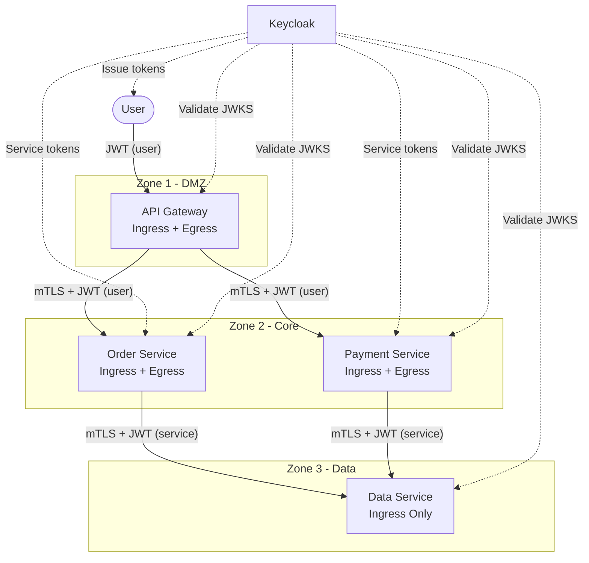
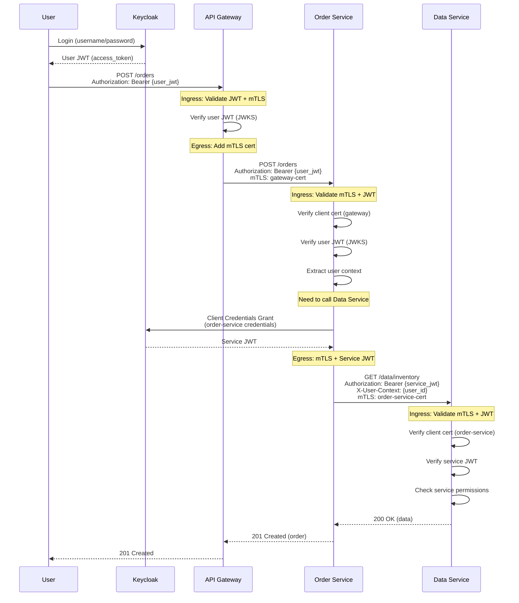
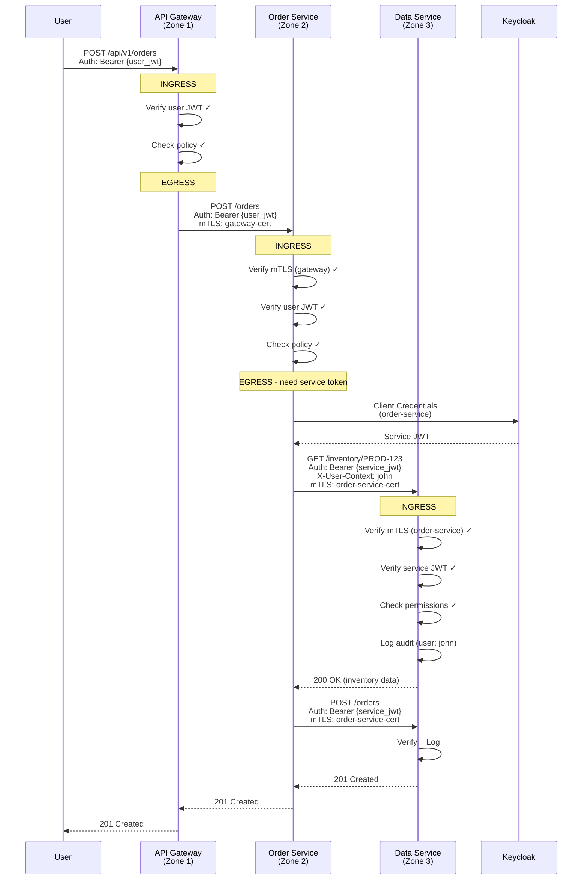
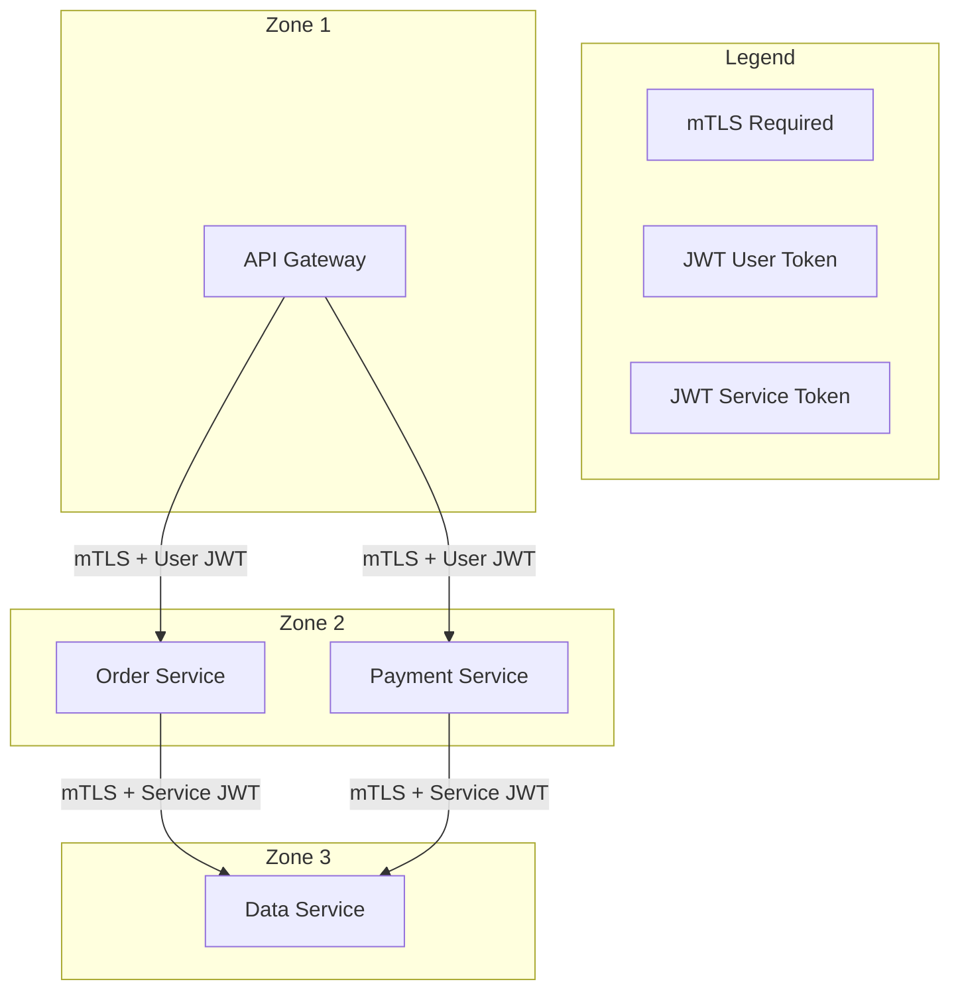

# Service-to-Service Communication: mTLS + JWT

## Введение

Данный документ описывает реализацию безопасного межсервисного взаимодействия в архитектуре с несколькими зонами безопасности. Решение основано на принципах Zero Trust и комбинирует два механизма аутентификации: **mTLS** (mutual TLS) для идентификации сервисов на транспортном уровне и **JWT** (JSON Web Tokens) для передачи контекста авторизации на уровне приложения.

### Почему mTLS + JWT?

**mTLS (Mutual TLS)** обеспечивает:
- Взаимную аутентификацию: и клиент, и сервер предъявляют сертификаты
- Шифрование канала связи
- Невозможность подмены источника запроса (спуфинг)
- Идентификацию сервиса по CN (Common Name) сертификата

**JWT токены** обеспечивают:
- Передачу контекста пользователя между сервисами (user propagation)
- Гранулярный контроль доступа на уровне приложения (RBAC/ABAC)
- Аудит действий с привязкой к пользователю или сервису
- Независимость от транспортного уровня

**Комбинация mTLS + JWT** даёт defense-in-depth:
1. mTLS гарантирует, что запрос пришёл от легитимного сервиса
2. JWT определяет, что именно этот сервис (или пользователь) может делать
3. Даже если злоумышленник получит JWT, без валидного клиентского сертификата он не сможет обратиться к сервису
4. Даже если злоумышленник скомпрометирует сертификат одного сервиса, JWT ограничит его права

---

## Описание архитектуры

### Зоны безопасности

Система разделена на три изолированные зоны безопасности с различными уровнями доверия:

**Zone 1 — DMZ (Demilitarized Zone)**
- Содержит: API Gateway
- Назначение: точка входа для внешних клиентов (пользователей)
- Доступ: принимает запросы из интернета, отправляет запросы в Zone 2
- Безопасность: TLS для входящих соединений, mTLS для исходящих

**Zone 2 — Core (Основная бизнес-логика)**
- Содержит: Order Service, Payment Service
- Назначение: обработка бизнес-логики
- Доступ: принимает запросы только из Zone 1, отправляет запросы в Zone 3
- Безопасность: mTLS для всех соединений (входящих и исходящих)

**Zone 3 — Data (Уровень данных)**
- Содержит: Data Service
- Назначение: хранение и управление данными
- Доступ: принимает запросы только из Zone 2, не инициирует исходящих соединений
- Безопасность: mTLS для входящих соединений, максимальная изоляция

### Принцип Zero Trust

Между зонами применяется модель Zero Trust — каждый запрос проверяется независимо от источника:

1. **Никакого неявного доверия**: даже запросы из "внутренней" сети проверяются
2. **Минимальные привилегии**: сервисы получают только необходимые права
3. **Явная авторизация**: каждый запрос проходит проверку политик
4. **Аудит всего**: все решения логируются для последующего анализа

---

## Модель аутентификации

### Двухуровневая аутентификация

Система использует два уровня аутентификации:

**Уровень 1: mTLS (транспортный)**
- Каждая зона имеет свой Certificate Authority (CA)
- Сервисы предъявляют клиентские сертификаты, подписанные CA целевой зоны
- Сервер проверяет, что клиентский сертификат подписан доверенным CA
- CN сертификата идентифицирует вызывающий сервис

**Уровень 2: JWT (прикладной)**
- User JWT — токен пользователя, выданный Keycloak (realm: users)
- Service JWT — токен сервиса, полученный через Client Credentials Grant (realm: services)
- Токены содержат claims с ролями и разрешениями
- Каждый сервис валидирует JWT через JWKS endpoint Keycloak

### Потоки токенов

**User Token Propagation (Zone 1 → Zone 2)**

Когда пользователь обращается к API Gateway, его JWT токен проверяется и передаётся дальше в Zone 2. Это позволяет сервисам Order и Payment знать, какой пользователь инициировал запрос, и применять соответствующие политики авторизации.

```
User [JWT: user_id=john, roles=[customer]]
  → API Gateway (валидирует JWT, добавляет mTLS cert)
    → Order Service (знает: запрос от john с ролью customer)
```

**Service Token Acquisition (Zone 2 → Zone 3)**

Когда Order Service или Payment Service обращаются к Data Service, они не могут использовать пользовательский токен — Data Service работает в отдельном realm и ожидает сервисные токены. Поэтому сервисы Zone 2 получают собственные JWT через OAuth2 Client Credentials Grant.

```
Order Service
  → Keycloak: POST /token (client_id=order-service, client_secret=xxx)
  ← Keycloak: {access_token: "service_jwt", scope: "data-service:read"}
  → Data Service: Authorization: Bearer {service_jwt}
```

При этом контекст пользователя передаётся в заголовке `X-User-Context` для аудита.

---

## Роль Egress и Ingress Proxy

Каждый сервис использует authz-service в качестве sidecar proxy, который выполняет две функции:

### Ingress Proxy (входящие запросы)

Ingress proxy обрабатывает все входящие запросы и выполняет:
1. **TLS/mTLS терминацию**: расшифровывает TLS, проверяет клиентский сертификат
2. **Валидацию JWT**: проверяет подпись, срок действия, issuer, audience
3. **Авторизацию**: вызывает OPA для проверки политик
4. **Инъекцию заголовков**: добавляет извлечённую информацию (user_id, roles) в заголовки
5. **Логирование**: записывает аудит-лог решения

### Egress Proxy (исходящие запросы)

Egress proxy обрабатывает все исходящие запросы и выполняет:
1. **Получение credentials**: для OAuth2 — запрашивает токен, кэширует, обновляет
2. **mTLS инициацию**: подставляет клиентский сертификат для целевой зоны
3. **Инъекцию заголовков**: добавляет Authorization header с токеном
4. **Проксирование**: передаёт запрос на целевой сервис
5. **Логирование**: записывает метрики и ошибки

### Преимущества sidecar-подхода

1. **Разделение ответственности**: бизнес-логика не содержит кода аутентификации
2. **Единообразие**: все сервисы защищены одинаково
3. **Централизованное управление**: политики и сертификаты обновляются в одном месте
4. **Наблюдаемость**: единая точка сбора метрик и логов

---

## Описание сервисов

### API Gateway (Zone 1)

**Назначение**: Единая точка входа для пользователей.

**Ingress**:
- Принимает HTTPS запросы от пользователей
- Валидирует User JWT (issuer: realms/users)
- Проверяет базовые политики (аутентифицирован ли пользователь)

**Egress**:
- Направляет запросы в Order Service или Payment Service
- Добавляет mTLS клиентский сертификат (подписан Zone 2 CA)
- Пропускает (propagates) оригинальный User JWT
- Добавляет заголовки с user context (X-User-ID, X-User-Email)

**Маршрутизация**:
- `/api/v1/orders/**` → Order Service
- `/api/v1/payments/**` → Payment Service

### Order Service (Zone 2)

**Назначение**: Управление заказами.

**Ingress**:
- Принимает запросы только от API Gateway (проверка mTLS CN)
- Валидирует User JWT (тот же issuer: realms/users)
- Проверяет политики на основе ролей пользователя
- Извлекает user context для бизнес-логики

**Egress**:
- Обращается к Data Service для работы с данными
- Получает Service JWT от Keycloak (client_credentials, realm: services)
- Добавляет mTLS клиентский сертификат (подписан Zone 3 CA)
- Передаёт user context в заголовке X-User-Context для аудита

**Операции**:
- Проверка наличия товара (GET /inventory)
- Создание заказа (POST /orders)
- Получение статуса заказа (GET /orders/{id})

### Payment Service (Zone 2)

**Назначение**: Обработка платежей.

**Ingress**: аналогично Order Service
- Проверяет mTLS (только API Gateway)
- Валидирует User JWT
- Требует роль `payments:create` для создания платежей

**Egress**: аналогично Order Service
- Получает собственный Service JWT (client_id: payment-service)
- Имеет права только на `read-orders` и `write-payments` в Data Service

**Операции**:
- Создание платежа (POST /payments)
- Проверка статуса заказа (GET /orders/{id})

### Data Service (Zone 3)

**Назначение**: Хранение и управление данными (inventory, orders, payments).

**Ingress Only** (не инициирует исходящих соединений):
- Принимает запросы только от Order Service и Payment Service (проверка mTLS CN)
- Валидирует Service JWT (issuer: realms/services)
- Проверяет разрешения сервиса (какой сервис что может делать)
- Логирует все операции с привязкой к user context

**Модель разрешений**:
```
order-service:   read-inventory, write-orders, read-orders
payment-service: read-orders, write-payments
```

Даже если payment-service каким-то образом попытается записать заказ, OPA политика откажет — у этого сервиса нет разрешения `write-orders`.

---

## Обработка запроса: пошаговый разбор

Рассмотрим полный путь запроса на создание заказа:

### Шаг 1: Пользователь получает токен

Пользователь John аутентифицируется в Keycloak:
```
POST /realms/users/protocol/openid-connect/token
→ {username: "john", password: "***", grant_type: "password"}
← {access_token: "eyJ...", token_type: "Bearer"}
```

JWT содержит:
```json
{
  "sub": "user-123",
  "preferred_username": "john",
  "email": "john@example.com",
  "realm_access": {"roles": ["customer", "orders:create"]},
  "exp": 1705315800
}
```

### Шаг 2: Запрос к API Gateway

```
POST https://api.example.com/api/v1/orders
Authorization: Bearer eyJ...
Content-Type: application/json
{"product_id": "PROD-123", "quantity": 2}
```

### Шаг 3: API Gateway — Ingress

1. TLS терминация (расшифровка)
2. Извлечение JWT из заголовка Authorization
3. Валидация JWT:
   - Загрузка JWKS с Keycloak
   - Проверка подписи
   - Проверка exp (не истёк)
   - Проверка iss (issuer = realms/users)
   - Проверка aud (audience = api-gateway)
4. Вызов OPA политики:
   ```
   input: {token: {...}, request: {method: "POST", path: "/api/v1/orders"}}
   → data.gateway.allow = true
   ```
5. Решение: ALLOW

### Шаг 4: API Gateway — Egress

1. Определение целевого сервиса по маршруту: Order Service
2. Подготовка исходящего запроса:
   - URL: https://order-service.zone2.local:8443/orders
   - mTLS: загрузка client-zone2.crt и client-zone2.key
   - Headers: копирование Authorization (JWT propagation)
   - Дополнительные headers: X-User-ID, X-User-Email
3. Отправка запроса с mTLS

### Шаг 5: Order Service — Ingress

1. mTLS handshake:
   - Проверка клиентского сертификата
   - Извлечение CN: "api-gateway-client"
   - Проверка: CN в списке разрешённых? ✓
2. Извлечение и валидация JWT (аналогично шагу 3)
3. Вызов OPA политики:
   ```
   input: {
     mtls: {verified: true, subject: {CN: "api-gateway-client"}},
     token: {sub: "user-123", realm_access: {roles: ["orders:create"]}},
     request: {method: "POST", path: "/orders"}
   }
   → data.order.allow = true (mTLS OK + JWT OK + permission OK)
   ```
4. Решение: ALLOW
5. Передача запроса в бизнес-логику Order Service

### Шаг 6: Order Service — бизнес-логика

Order Service должен проверить наличие товара в Data Service:
```go
// Вызов через egress proxy
resp, _ := http.Get("http://localhost:8080/data/inventory/PROD-123")
```

### Шаг 7: Order Service — Egress

1. Определение целевого сервиса: Data Service
2. Получение Service JWT:
   - Проверка кэша: токен есть? истекает скоро?
   - Если нужен новый: Client Credentials Grant к Keycloak
   ```
   POST /realms/services/protocol/openid-connect/token
   client_id=order-service&client_secret=xxx&grant_type=client_credentials
   → {access_token: "service_jwt", expires_in: 300}
   ```
   - Кэширование токена
3. Подготовка запроса:
   - URL: https://data-service.zone3.local:8443/inventory/PROD-123
   - mTLS: client-zone3.crt
   - Authorization: Bearer {service_jwt}
   - X-User-Context: user-123 (для аудита)
4. Отправка запроса

### Шаг 8: Data Service — Ingress

1. mTLS handshake:
   - CN: "order-service-client" ✓
2. Валидация Service JWT:
   - issuer: realms/services ✓
   - azp (authorized party): order-service ✓
3. OPA политика:
   ```
   input: {
     mtls: {subject: {CN: "order-service-client"}},
     token: {azp: "order-service"},
     request: {method: "GET", path: "/inventory/PROD-123"}
   }

   required_permission = "read-inventory"
   service_permissions["order-service"] = ["read-inventory", "write-orders", ...]
   "read-inventory" in service_permissions["order-service"] = true
   → allow = true
   ```
4. Аудит лог:
   ```json
   {
     "event": "access",
     "service": "order-service",
     "user_context": "user-123",
     "action": "read",
     "resource": "inventory/PROD-123",
     "decision": "allow"
   }
   ```
5. Возврат данных

### Шаги 9-12: Создание заказа

Аналогичный flow для POST /orders — Order Service отправляет запрос на создание, Data Service проверяет разрешение `write-orders`.

### Шаг 13: Ответ пользователю

Цепочка ответов в обратном направлении:
```
Data Service → Order Service → API Gateway → User
201 Created
```

---

## Диаграмма архитектуры



---

## Security Model

| Маршрут | mTLS | JWT | Тип токена |
|---------|------|-----|------------|
| User → API Gateway | TLS (optional) | User JWT | `access_token` |
| API Gateway → Order/Payment | mTLS | User JWT | Propagated |
| Order/Payment → Data Service | mTLS | Service JWT | `client_credentials` |



---

## Certificates Structure

```
/etc/certs/
├── ca/
│   ├── zone1-ca.crt          # CA для Zone 1
│   ├── zone2-ca.crt          # CA для Zone 2
│   └── zone3-ca.crt          # CA для Zone 3
├── gateway/
│   ├── server.crt            # Gateway server cert (для входящих)
│   ├── server.key
│   ├── client-zone2.crt      # Client cert для Zone 2
│   └── client-zone2.key
├── order-service/
│   ├── server.crt            # Order Service server cert
│   ├── server.key
│   ├── client-zone3.crt      # Client cert для Zone 3
│   └── client-zone3.key
├── payment-service/
│   ├── server.crt
│   ├── server.key
│   ├── client-zone3.crt
│   └── client-zone3.key
└── data-service/
    ├── server.crt
    └── server.key
```

### Генерация сертификатов

```bash
#!/bin/bash
# generate-certs.sh

# Zone CAs
for zone in zone1 zone2 zone3; do
  openssl genrsa -out ca/${zone}-ca.key 4096
  openssl req -x509 -new -nodes -key ca/${zone}-ca.key \
    -sha256 -days 365 -out ca/${zone}-ca.crt \
    -subj "/CN=${zone}-CA/O=MyOrg"
done

# Server + Client certs for each service
generate_certs() {
  local service=$1
  local zone_ca=$2
  local cn=$3

  # Server cert
  openssl genrsa -out ${service}/server.key 2048
  openssl req -new -key ${service}/server.key \
    -out ${service}/server.csr \
    -subj "/CN=${cn}/O=MyOrg"
  openssl x509 -req -in ${service}/server.csr \
    -CA ca/${zone_ca}-ca.crt -CAkey ca/${zone_ca}-ca.key \
    -CAcreateserial -out ${service}/server.crt -days 365

  # Client cert (for outgoing calls)
  if [ "$4" != "" ]; then
    local client_zone=$4
    openssl genrsa -out ${service}/client-${client_zone}.key 2048
    openssl req -new -key ${service}/client-${client_zone}.key \
      -out ${service}/client-${client_zone}.csr \
      -subj "/CN=${cn}-client/O=MyOrg"
    openssl x509 -req -in ${service}/client-${client_zone}.csr \
      -CA ca/${client_zone}-ca.crt -CAkey ca/${client_zone}-ca.key \
      -CAcreateserial -out ${service}/client-${client_zone}.crt -days 365
  fi
}

generate_certs "gateway" "zone1" "api-gateway.zone1.local" "zone2"
generate_certs "order-service" "zone2" "order-service.zone2.local" "zone3"
generate_certs "payment-service" "zone2" "payment-service.zone2.local" "zone3"
generate_certs "data-service" "zone3" "data-service.zone3.local"
```

---

## Keycloak Configuration

### Realm: `services`

```json
{
  "realm": "services",
  "enabled": true,
  "clients": [
    {
      "clientId": "api-gateway",
      "enabled": true,
      "publicClient": false,
      "serviceAccountsEnabled": true,
      "clientAuthenticatorType": "client-secret",
      "secret": "gateway-secret"
    },
    {
      "clientId": "order-service",
      "enabled": true,
      "publicClient": false,
      "serviceAccountsEnabled": true,
      "clientAuthenticatorType": "client-secret",
      "secret": "order-service-secret"
    },
    {
      "clientId": "payment-service",
      "enabled": true,
      "publicClient": false,
      "serviceAccountsEnabled": true,
      "clientAuthenticatorType": "client-secret",
      "secret": "payment-service-secret"
    }
  ]
}
```

### Service Account Roles

```json
{
  "clientId": "order-service",
  "serviceAccountRoles": {
    "realm": ["service-account"],
    "client": {
      "data-service": ["read-inventory", "write-orders"]
    }
  }
}
```

---

## Service Configurations

### 1. API Gateway (Zone 1)

```yaml
# gateway/config.yaml
http:
  addr: ":8443"
  tls:
    enabled: true
    cert_file: "/etc/certs/gateway/server.crt"
    key_file: "/etc/certs/gateway/server.key"

# === INGRESS: Validate incoming user requests ===
jwt:
  issuer: "https://keycloak.example.com/realms/users"
  audience: "api-gateway"
  jwks_url: "https://keycloak.example.com/realms/users/protocol/openid-connect/certs"
  jwks_refresh_interval: 1h

proxy:
  enabled: true
  mode: reverse_proxy

  auth:
    enabled: true
    header: "Authorization"
    scheme: "Bearer"

  authz:
    enabled: true
    policy_query: "data.gateway.allow"

  # Route to Zone 2 services
  routes:
    - path: "/api/v1/orders/**"
      upstream: "https://order-service.zone2.local:8443"
      auth_required: true

    - path: "/api/v1/payments/**"
      upstream: "https://payment-service.zone2.local:8443"
      auth_required: true

  # Propagate user JWT to downstream services
  headers:
    pass_token: true
    inject_claims:
      sub: "X-User-ID"
      email: "X-User-Email"
      realm_access.roles: "X-User-Roles"

# === EGRESS: mTLS to Zone 2 ===
egress:
  enabled: true

  targets:
    order-service:
      url: "https://order-service.zone2.local:8443"
      auth:
        type: none  # JWT propagated via headers
      tls:
        enabled: true
        client_cert: "/etc/certs/gateway/client-zone2.crt"
        client_key: "/etc/certs/gateway/client-zone2.key"
        ca_cert: "/etc/certs/ca/zone2-ca.crt"

    payment-service:
      url: "https://payment-service.zone2.local:8443"
      auth:
        type: none
      tls:
        enabled: true
        client_cert: "/etc/certs/gateway/client-zone2.crt"
        client_key: "/etc/certs/gateway/client-zone2.key"
        ca_cert: "/etc/certs/ca/zone2-ca.crt"

policy:
  engine: opa_embedded
  path: "/etc/authz/policies"
```

**Gateway Policy (policies/gateway.rego):**

```rego
package gateway

import rego.v1

default allow := false

# Authenticated users can access API
allow if {
    input.token.sub != ""
    not is_token_expired
}

is_token_expired if {
    input.token.exp < time.now_ns() / 1000000000
}
```

---

### 2. Order Service (Zone 2)

```yaml
# order-service/config.yaml
http:
  addr: ":8443"
  tls:
    enabled: true
    cert_file: "/etc/certs/order-service/server.crt"
    key_file: "/etc/certs/order-service/server.key"
    client_ca_file: "/etc/certs/ca/zone1-ca.crt"  # Verify Zone 1 clients
    client_auth: "require"  # mTLS required

# === INGRESS: Validate mTLS + User JWT ===
jwt:
  issuer: "https://keycloak.example.com/realms/users"
  audience: "order-service"
  jwks_url: "https://keycloak.example.com/realms/users/protocol/openid-connect/certs"

proxy:
  enabled: true
  mode: reverse_proxy

  auth:
    enabled: true
    header: "Authorization"

  authz:
    enabled: true
    policy_query: "data.order.allow"

  # mTLS client verification
  mtls:
    enabled: true
    allowed_clients:
      - "CN=api-gateway-client,O=MyOrg"  # Only gateway can call

  headers:
    inject_user_id: "X-User-ID"
    inject_claims:
      sub: "X-Original-User"

# === EGRESS: mTLS + Service JWT to Zone 3 ===
egress:
  enabled: true

  token_store:
    type: memory

  targets:
    data-service:
      url: "https://data-service.zone3.local:8443"
      auth:
        type: oauth2_client_credentials
        token_url: "https://keycloak.example.com/realms/services/protocol/openid-connect/token"
        client_id: "order-service"
        client_secret: "${ORDER_SERVICE_CLIENT_SECRET}"
        scopes: ["data-service:read", "data-service:write"]
        refresh_before_expiry: 60s
      tls:
        enabled: true
        client_cert: "/etc/certs/order-service/client-zone3.crt"
        client_key: "/etc/certs/order-service/client-zone3.key"
        ca_cert: "/etc/certs/ca/zone3-ca.crt"

  routes:
    - path_prefix: "/data"
      target: data-service
      strip_prefix: "/data"

policy:
  engine: opa_embedded
  path: "/etc/authz/policies"
```

**Order Service Policy (policies/order.rego):**

```rego
package order

import rego.v1

default allow := false

# Verify mTLS client is from allowed list
allow if {
    valid_mtls_client
    valid_user_token
    has_permission
}

valid_mtls_client if {
    input.mtls.verified == true
    input.mtls.subject.CN == "api-gateway-client"
}

valid_user_token if {
    input.token.sub != ""
    input.token.exp > time.now_ns() / 1000000000
}

has_permission if {
    input.request.method == "GET"
}

has_permission if {
    input.request.method == "POST"
    "orders:create" in input.token.realm_access.roles
}
```

**Order Service Code (Go):**

```go
package main

import (
    "context"
    "net/http"
)

type OrderService struct {
    egressClient *http.Client
    egressURL    string
}

func (s *OrderService) CreateOrder(ctx context.Context, userID string, order Order) (*Order, error) {
    // 1. User context is available from ingress proxy headers
    // X-User-ID, X-Original-User are injected by ingress

    // 2. Call Data Service through egress proxy
    // Egress will:
    //   - Get service JWT from Keycloak (client_credentials)
    //   - Add mTLS client certificate
    //   - Forward request

    // Check inventory
    req, _ := http.NewRequestWithContext(ctx, "GET",
        s.egressURL+"/data/inventory/"+order.ProductID, nil)

    // Pass user context for audit trail
    req.Header.Set("X-User-Context", userID)
    req.Header.Set("X-Correlation-ID", getCorrelationID(ctx))

    resp, err := s.egressClient.Do(req)
    if err != nil {
        return nil, err
    }
    defer resp.Body.Close()

    // Process response...

    // 3. Save order to Data Service
    req, _ = http.NewRequestWithContext(ctx, "POST",
        s.egressURL+"/data/orders", orderToJSON(order))
    req.Header.Set("Content-Type", "application/json")
    req.Header.Set("X-User-Context", userID)

    resp, err = s.egressClient.Do(req)
    // ...

    return &order, nil
}
```

---

### 3. Payment Service (Zone 2)

```yaml
# payment-service/config.yaml
http:
  addr: ":8443"
  tls:
    enabled: true
    cert_file: "/etc/certs/payment-service/server.crt"
    key_file: "/etc/certs/payment-service/server.key"
    client_ca_file: "/etc/certs/ca/zone1-ca.crt"
    client_auth: "require"

# === INGRESS ===
jwt:
  issuer: "https://keycloak.example.com/realms/users"
  audience: "payment-service"
  jwks_url: "https://keycloak.example.com/realms/users/protocol/openid-connect/certs"

proxy:
  enabled: true
  mode: reverse_proxy

  auth:
    enabled: true

  authz:
    enabled: true
    policy_query: "data.payment.allow"

  mtls:
    enabled: true
    allowed_clients:
      - "CN=api-gateway-client,O=MyOrg"

# === EGRESS ===
egress:
  enabled: true

  targets:
    data-service:
      url: "https://data-service.zone3.local:8443"
      auth:
        type: oauth2_client_credentials
        token_url: "https://keycloak.example.com/realms/services/protocol/openid-connect/token"
        client_id: "payment-service"
        client_secret: "${PAYMENT_SERVICE_CLIENT_SECRET}"
        scopes: ["data-service:read", "data-service:write-payments"]
        refresh_before_expiry: 60s
      tls:
        enabled: true
        client_cert: "/etc/certs/payment-service/client-zone3.crt"
        client_key: "/etc/certs/payment-service/client-zone3.key"
        ca_cert: "/etc/certs/ca/zone3-ca.crt"

  routes:
    - path_prefix: "/data"
      target: data-service
      strip_prefix: "/data"
```

**Payment Service Policy (policies/payment.rego):**

```rego
package payment

import rego.v1

default allow := false

allow if {
    valid_mtls_client
    valid_user_token
    has_payment_permission
}

valid_mtls_client if {
    input.mtls.verified == true
    input.mtls.subject.CN == "api-gateway-client"
}

valid_user_token if {
    input.token.sub != ""
    input.token.exp > time.now_ns() / 1000000000
}

has_payment_permission if {
    "payments:create" in input.token.realm_access.roles
}

has_payment_permission if {
    input.request.method == "GET"
    "payments:read" in input.token.realm_access.roles
}
```

---

### 4. Data Service (Zone 3)

```yaml
# data-service/config.yaml
http:
  addr: ":8443"
  tls:
    enabled: true
    cert_file: "/etc/certs/data-service/server.crt"
    key_file: "/etc/certs/data-service/server.key"
    client_ca_file: "/etc/certs/ca/zone2-ca.crt"  # Only Zone 2 clients
    client_auth: "require"

# === INGRESS ONLY (no egress) ===
jwt:
  # Service tokens from Keycloak
  issuer: "https://keycloak.example.com/realms/services"
  audience: "data-service"
  jwks_url: "https://keycloak.example.com/realms/services/protocol/openid-connect/certs"

proxy:
  enabled: true
  mode: reverse_proxy

  auth:
    enabled: true
    header: "Authorization"

  authz:
    enabled: true
    policy_query: "data.dataservice.result"

  mtls:
    enabled: true
    allowed_clients:
      - "CN=order-service-client,O=MyOrg"
      - "CN=payment-service-client,O=MyOrg"

  # Extract user context from headers (for audit)
  headers:
    extract:
      - "X-User-Context"
      - "X-Correlation-ID"

policy:
  engine: opa_embedded
  path: "/etc/authz/policies"

# No egress - this service only receives requests
```

**Data Service Policy (policies/dataservice.rego):**

```rego
package dataservice

import rego.v1

default allow := false

result := {
    "allow": allow,
    "reasons": reasons,
    "audit": {
        "service": input.mtls.subject.CN,
        "user_context": input.headers["X-User-Context"],
        "correlation_id": input.headers["X-Correlation-ID"],
        "action": input.request.method,
        "resource": input.request.path,
    }
}

# Verify mTLS + Service JWT
allow if {
    valid_mtls_client
    valid_service_token
    has_service_permission
}

reasons contains "valid mTLS client" if valid_mtls_client
reasons contains "valid service token" if valid_service_token
reasons contains reason if {
    has_service_permission
    reason := sprintf("service %s has permission %s", [service_name, required_permission])
}

# mTLS validation
valid_mtls_client if {
    input.mtls.verified == true
    allowed_services[input.mtls.subject.CN]
}

allowed_services := {
    "order-service-client": true,
    "payment-service-client": true,
}

# Service token validation
valid_service_token if {
    input.token.azp != ""  # Authorized party (client_id)
    input.token.exp > time.now_ns() / 1000000000
}

service_name := input.token.azp

# Permission check based on service and action
has_service_permission if {
    required_permission := get_required_permission
    required_permission in service_permissions[service_name]
}

get_required_permission := "read-inventory" if {
    input.request.method == "GET"
    startswith(input.request.path, "/inventory")
}

get_required_permission := "write-orders" if {
    input.request.method == "POST"
    startswith(input.request.path, "/orders")
}

get_required_permission := "read-orders" if {
    input.request.method == "GET"
    startswith(input.request.path, "/orders")
}

get_required_permission := "write-payments" if {
    input.request.method == "POST"
    startswith(input.request.path, "/payments")
}

# Service permissions matrix
service_permissions := {
    "order-service": ["read-inventory", "write-orders", "read-orders"],
    "payment-service": ["read-orders", "write-payments"],
}
```

---

## Request Flow Examples

### 1. User Creates Order

```bash
# User получает токен
USER_TOKEN=$(curl -s -X POST \
  "https://keycloak.example.com/realms/users/protocol/openid-connect/token" \
  -d "grant_type=password" \
  -d "client_id=web-app" \
  -d "username=john" \
  -d "password=secret" | jq -r '.access_token')

# User создаёт заказ через API Gateway
curl -X POST https://api-gateway.zone1.local:8443/api/v1/orders \
  -H "Authorization: Bearer ${USER_TOKEN}" \
  -H "Content-Type: application/json" \
  -d '{
    "product_id": "PROD-123",
    "quantity": 2
  }'
```

**Flow:**



### 2. Internal Service Call (Order → Data)

```bash
# Order Service внутренне вызывает Data Service
# Egress proxy автоматически:
# 1. Получает service token из Keycloak
# 2. Добавляет mTLS сертификат

curl http://localhost:8080/data/inventory/PROD-123 \
  -H "X-User-Context: user-123" \
  -H "X-Correlation-ID: req-abc"

# Egress proxy трансформирует в:
# GET https://data-service.zone3.local:8443/inventory/PROD-123
# Authorization: Bearer {service_jwt}
# X-User-Context: user-123
# X-Correlation-ID: req-abc
# + mTLS client certificate
```

---

## Docker Compose

```yaml
version: '3.8'

services:
  # === Zone 1: DMZ ===
  api-gateway:
    image: authz-service:latest
    ports:
      - "8443:8443"
    volumes:
      - ./gateway/config.yaml:/etc/authz/config.yaml
      - ./gateway/policies:/etc/authz/policies
      - ./certs/gateway:/etc/certs/gateway:ro
      - ./certs/ca:/etc/certs/ca:ro
    environment:
      - AUTHZ_CONFIG_PATH=/etc/authz/config.yaml
    networks:
      - zone1
      - zone1-zone2

  # === Zone 2: Core ===
  order-service:
    image: authz-service:latest
    volumes:
      - ./order-service/config.yaml:/etc/authz/config.yaml
      - ./order-service/policies:/etc/authz/policies
      - ./certs/order-service:/etc/certs/order-service:ro
      - ./certs/ca:/etc/certs/ca:ro
    environment:
      - AUTHZ_CONFIG_PATH=/etc/authz/config.yaml
      - ORDER_SERVICE_CLIENT_SECRET=${ORDER_SERVICE_CLIENT_SECRET}
    networks:
      - zone1-zone2
      - zone2
      - zone2-zone3

  payment-service:
    image: authz-service:latest
    volumes:
      - ./payment-service/config.yaml:/etc/authz/config.yaml
      - ./payment-service/policies:/etc/authz/policies
      - ./certs/payment-service:/etc/certs/payment-service:ro
      - ./certs/ca:/etc/certs/ca:ro
    environment:
      - AUTHZ_CONFIG_PATH=/etc/authz/config.yaml
      - PAYMENT_SERVICE_CLIENT_SECRET=${PAYMENT_SERVICE_CLIENT_SECRET}
    networks:
      - zone1-zone2
      - zone2
      - zone2-zone3

  # === Zone 3: Data ===
  data-service:
    image: authz-service:latest
    volumes:
      - ./data-service/config.yaml:/etc/authz/config.yaml
      - ./data-service/policies:/etc/authz/policies
      - ./certs/data-service:/etc/certs/data-service:ro
      - ./certs/ca:/etc/certs/ca:ro
    environment:
      - AUTHZ_CONFIG_PATH=/etc/authz/config.yaml
    networks:
      - zone2-zone3
      - zone3

  # === Keycloak ===
  keycloak:
    image: quay.io/keycloak/keycloak:latest
    command: start-dev
    environment:
      - KEYCLOAK_ADMIN=admin
      - KEYCLOAK_ADMIN_PASSWORD=admin
    ports:
      - "8080:8080"
    networks:
      - zone1
      - zone2
      - zone3

networks:
  zone1:
    driver: bridge
  zone2:
    driver: bridge
  zone3:
    driver: bridge
  zone1-zone2:
    driver: bridge
  zone2-zone3:
    driver: bridge
```

---

## Security Matrix



| Source | Destination | mTLS Cert | JWT Type | JWT Issuer |
|--------|-------------|-----------|----------|------------|
| User | API Gateway | - | User | `realms/users` |
| API Gateway | Order Service | `gateway→zone2` | User (propagated) | `realms/users` |
| API Gateway | Payment Service | `gateway→zone2` | User (propagated) | `realms/users` |
| Order Service | Data Service | `order→zone3` | Service | `realms/services` |
| Payment Service | Data Service | `payment→zone3` | Service | `realms/services` |

---

## Audit Trail

Каждый сервис логирует:

```json
// API Gateway
{
  "level": "info",
  "service": "api-gateway",
  "event": "request",
  "user_id": "john",
  "method": "POST",
  "path": "/api/v1/orders",
  "downstream": "order-service",
  "correlation_id": "req-abc-123"
}

// Order Service
{
  "level": "info",
  "service": "order-service",
  "event": "request",
  "mtls_client": "api-gateway-client",
  "user_context": "john",
  "method": "POST",
  "path": "/orders",
  "correlation_id": "req-abc-123"
}

// Data Service
{
  "level": "info",
  "service": "data-service",
  "event": "request",
  "mtls_client": "order-service-client",
  "calling_service": "order-service",
  "user_context": "john",
  "method": "POST",
  "path": "/orders",
  "correlation_id": "req-abc-123",
  "decision": "allow",
  "reasons": ["service order-service has permission write-orders"]
}
```

---

## Summary

| Компонент | Ingress | Egress |
|-----------|---------|--------|
| API Gateway | TLS + User JWT | mTLS to Zone 2 |
| Order Service | mTLS + User JWT | mTLS + Service JWT to Zone 3 |
| Payment Service | mTLS + User JWT | mTLS + Service JWT to Zone 3 |
| Data Service | mTLS + Service JWT | None |

**Token Flow:**
- User JWT: User → Gateway → Order/Payment (propagated)
- Service JWT: Order/Payment → Data (client_credentials from Keycloak)

**Trust Boundaries:**
- Zone 1 ↔ Zone 2: mTLS (Zone 1 CA verifies Gateway, Zone 2 CA verifies Services)
- Zone 2 ↔ Zone 3: mTLS (Zone 2 CA verifies Services, Zone 3 CA verifies Data Service)
