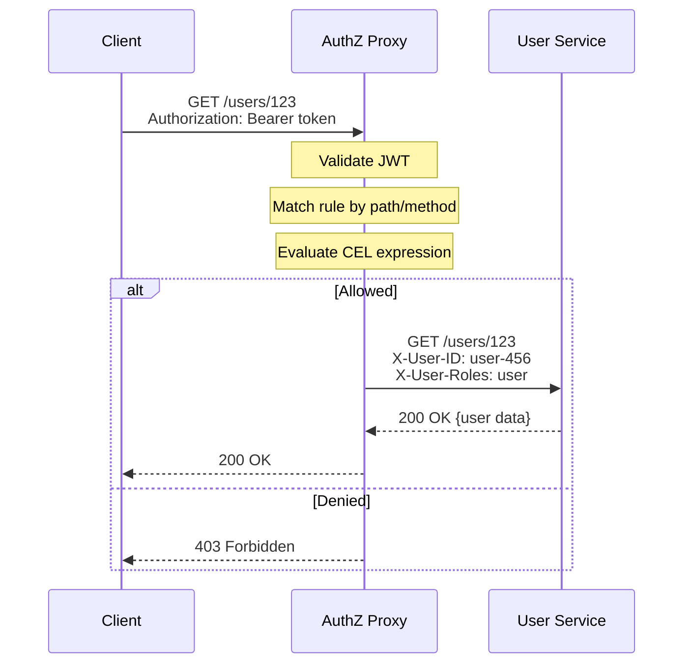

# User CRUD API - Builtin Engine with CEL Example

## Сценарий

REST API для управления пользователями с использованием **Builtin Policy Engine** и **CEL выражений** вместо OPA. Этот подход проще в настройке и не требует внешних зависимостей.



---

## 1. Конфигурация Authz Service (config.yaml)

```yaml
# =============================================================================
# HTTP Server
# =============================================================================
http:
  addr: ":8080"
  read_timeout: 15s
  write_timeout: 15s

# =============================================================================
# Server Mode: Reverse Proxy
# =============================================================================
mode: reverse_proxy

# =============================================================================
# JWT Configuration
# =============================================================================
jwt:
  issuers:
    - issuer_url: "https://keycloak.example.com/realms/myapp"
      jwks_url: "https://keycloak.example.com/realms/myapp/protocol/openid-connect/certs"
      audience: ["user-service"]
      algorithms: ["RS256"]

# =============================================================================
# Policy Configuration - Builtin Engine
# =============================================================================
policy:
  engine: builtin
  builtin:
    rules_path: "/etc/authz/rules.yaml"

# =============================================================================
# Upstream Configuration
# =============================================================================
upstreams:
  default:
    url: "http://user-service:8080"
    timeout: 30s
    health_check:
      path: /health
      interval: 10s

# =============================================================================
# Logging
# =============================================================================
logger:
  level: info
  format: json
```

---

## 2. Правила авторизации с CEL (rules.yaml)

```yaml
version: "v2.0.0"
description: "User CRUD authorization with CEL expressions"
default_deny: true

rules:
  # ============================================================================
  # Health endpoints - public access
  # ============================================================================
  - name: allow-health
    priority: 1000
    enabled: true
    conditions:
      paths:
        - "/health"
        - "/ready"
      methods:
        - GET
    effect: allow

  # ============================================================================
  # ADMIN: Full access to all user operations
  # ============================================================================
  - name: admin-full-access
    description: "Administrators have full access to user management"
    priority: 100
    enabled: true
    conditions:
      path_templates:
        - "/users"
        - "/users/{user_id}"
      roles:
        - admin
    effect: allow

  # ============================================================================
  # MANAGER: Department-scoped access
  # ============================================================================
  # Managers can list users (any department)
  - name: manager-list-users
    description: "Managers can list all users"
    priority: 95
    enabled: true
    conditions:
      paths:
        - "/users"
      methods:
        - GET
      roles:
        - manager
    effect: allow

  # Managers can read/update users in same department
  # CEL checks department match via custom claim
  - name: manager-department-access
    description: "Managers can access users in their department"
    priority: 90
    enabled: true
    conditions:
      path_templates:
        - "/users/{user_id}"
      methods:
        - GET
        - PUT
        - PATCH
      roles:
        - manager
      # CEL: department in path params matches user's department claim
      expression: |
        "department" in token.claims &&
        "department" in resource.params &&
        token.claims["department"] == resource.params["department"]
      expression_mode: and
    effect: allow

  # ============================================================================
  # USER: Self-service access
  # ============================================================================
  # Users can read and update their own profile
  - name: user-self-access
    description: "Users can access their own profile"
    priority: 85
    enabled: true
    conditions:
      path_templates:
        - "/users/{user_id}"
      methods:
        - GET
        - PUT
        - PATCH
      roles:
        - user
      # CEL: user_id in path must match token subject
      expression: 'resource.params["user_id"] == token.sub'
      expression_mode: and
    effect: allow

  # ============================================================================
  # ALTERNATIVE: Combined rule using CEL override
  # ============================================================================
  # This single rule replaces the above 4 rules using CEL
  # Uncomment to use instead of individual rules
  #
  # - name: user-crud-combined
  #   description: |
  #     Combined authorization rule:
  #     - Admin: full access
  #     - Manager: department-scoped access
  #     - User: self-access only
  #   priority: 80
  #   enabled: false  # Set to true to enable
  #   conditions:
  #     path_templates:
  #       - "/users"
  #       - "/users/{user_id}"
  #     expression: |
  #       // Admin - full access
  #       "admin" in token.roles ||
  #
  #       // Manager - list access
  #       ("manager" in token.roles && request.method == "GET" && request.path == "/users") ||
  #
  #       // Manager - department access for specific user
  #       ("manager" in token.roles &&
  #        request.method in ["GET", "PUT", "PATCH"] &&
  #        "user_id" in resource.params &&
  #        token.claims["department"] == resource.params["department"]) ||
  #
  #       // User - self access
  #       ("user" in token.roles &&
  #        request.method in ["GET", "PUT", "PATCH"] &&
  #        "user_id" in resource.params &&
  #        resource.params["user_id"] == token.sub)
  #     expression_mode: override
  #   effect: allow

  # ============================================================================
  # DENY: Explicit deny for non-matching requests
  # ============================================================================
  - name: deny-unauthorized
    description: "Deny all other requests to /users"
    priority: 1
    enabled: true
    conditions:
      paths:
        - "/users"
        - "/users/**"
    effect: deny
```

---

## 3. Примеры запросов

### 3.1. Admin: создание пользователя

```bash
# Admin создаёт нового пользователя
curl -X POST http://localhost:8080/users \
  -H "Authorization: Bearer ${ADMIN_TOKEN}" \
  -H "Content-Type: application/json" \
  -d '{
    "name": "John Doe",
    "email": "john@example.com",
    "department": "engineering"
  }'

# Ожидаемый ответ: 201 Created
```

**JWT токен админа:**
```json
{
  "sub": "admin-001",
  "realm_access": {
    "roles": ["admin"]
  }
}
```

### 3.2. Manager: просмотр пользователя из своего отдела

```bash
# Manager из engineering просматривает пользователя из engineering
curl -X GET http://localhost:8080/users/user-123 \
  -H "Authorization: Bearer ${MANAGER_TOKEN}"

# Ожидаемый ответ: 200 OK (если user-123 из engineering)
```

**JWT токен менеджера:**
```json
{
  "sub": "manager-001",
  "realm_access": {
    "roles": ["manager"]
  },
  "department": "engineering"
}
```

### 3.3. User: обновление своего профиля

```bash
# Пользователь обновляет свой профиль
curl -X PUT http://localhost:8080/users/user-456 \
  -H "Authorization: Bearer ${USER_TOKEN}" \
  -H "Content-Type: application/json" \
  -d '{
    "name": "Jane Doe Updated"
  }'

# Ожидаемый ответ: 200 OK (если sub == user-456)
```

**JWT токен пользователя:**
```json
{
  "sub": "user-456",
  "realm_access": {
    "roles": ["user"]
  }
}
```

### 3.4. Denied: попытка доступа к чужому профилю

```bash
# Пользователь пытается просмотреть чужой профиль
curl -X GET http://localhost:8080/users/user-789 \
  -H "Authorization: Bearer ${USER_TOKEN}"

# Ожидаемый ответ: 403 Forbidden
# (sub == user-456, но запрашивает user-789)
```

---

## 4. Сравнение: OPA vs Builtin + CEL

| Аспект | OPA | Builtin + CEL |
|--------|-----|---------------|
| **Сложность настройки** | Высокая (Rego язык) | Низкая (YAML + CEL) |
| **Внешние зависимости** | OPA sidecar или embedded | Нет |
| **Производительность** | Отличная | Отличная (кеширование) |
| **Гибкость** | Очень высокая | Высокая |
| **Hot-reload** | Да | Да |
| **Тестирование** | opa test | Unit тесты Go |
| **Рекомендуется для** | Сложные enterprise сценарии | Стандартные RBAC/ABAC |

### Когда использовать Builtin + CEL:

1. **Простой RBAC** — roles/scopes достаточно
2. **Owner-based access** — проверка владельца ресурса
3. **Быстрый старт** — минимум настройки
4. **Микросервисы** — меньше зависимостей

### Когда использовать OPA:

1. **Enterprise compliance** — аудируемые политики
2. **Сложная бизнес-логика** — много условий и данных
3. **Централизованное управление** — политики как код
4. **Multi-tenant** — изоляция политик по тенантам

---

## 5. Расширенные примеры CEL

### 5.1. Временные ограничения

```yaml
- name: business-hours-only
  conditions:
    paths: ["/api/sensitive/**"]
    roles: [trader]
    expression: |
      now.getHours() >= 9 && now.getHours() < 18 &&
      now.getDayOfWeek() >= 1 && now.getDayOfWeek() <= 5
    expression_mode: and
  effect: allow
```

### 5.2. IP-based access

```yaml
- name: internal-only
  conditions:
    paths: ["/internal/**"]
    expression: |
      cidrMatch(source.address, "10.0.0.0/8") ||
      cidrMatch(source.address, "192.168.0.0/16")
    expression_mode: override
  effect: allow
```

### 5.3. Проверка кастомных claims

```yaml
- name: verified-users-only
  conditions:
    paths: ["/premium/**"]
    expression: |
      token.claims["email_verified"] == true &&
      token.claims["subscription_status"] == "active"
    expression_mode: and
  effect: allow
```

### 5.4. Method-specific авторизация

```yaml
- name: method-based-access
  conditions:
    path_templates: ["/documents/{doc_id}"]
    expression: |
      (request.method == "GET" && "reader" in token.roles) ||
      (request.method in ["PUT", "POST"] && "editor" in token.roles) ||
      (request.method == "DELETE" && "admin" in token.roles)
    expression_mode: override
  effect: allow
```

---

## Связанные документы

- [CEL Expressions Guide](../guides/CEL_EXPRESSIONS_GUIDE.md) — полное руководство по CEL
- [Rules Example](../../authz-service/configs/examples/rules.example.yaml) — примеры правил
- [User CRUD - Decision API](./USER_CRUD_DECISION_API_EXAMPLE.md) — вариант с OPA
