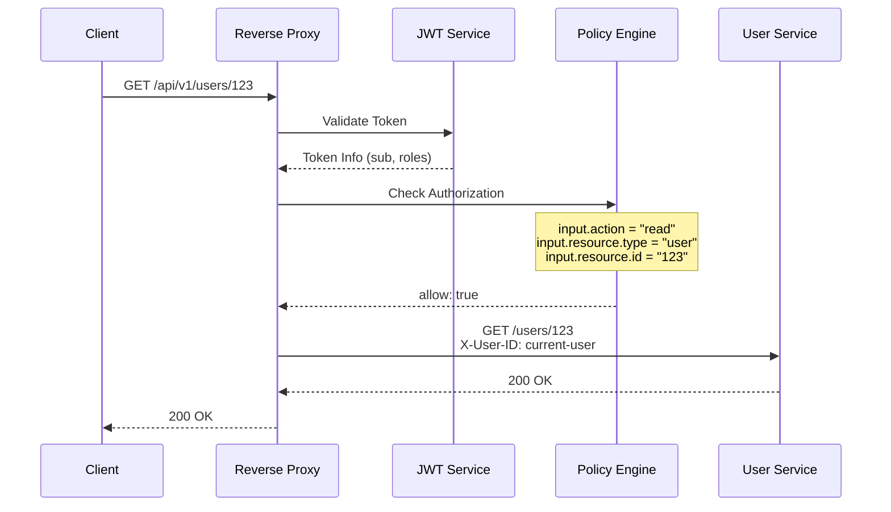
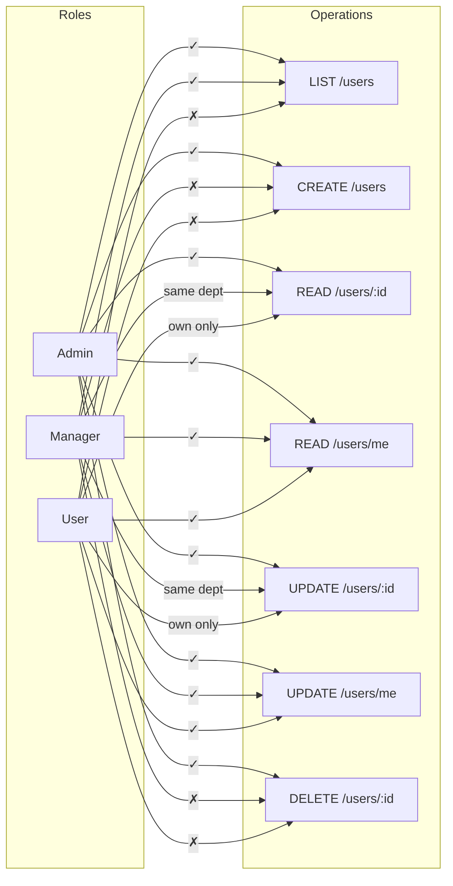

# User CRUD API - Reverse Proxy Example

## Сценарий

REST API для управления пользователями с ролевой моделью доступа:

| Роль | Права |
|------|-------|
| `admin` | Полный доступ ко всем пользователям |
| `manager` | Просмотр и редактирование пользователей своего отдела |
| `user` | Только просмотр и редактирование своего профиля |

## Архитектура



---

## 1. Конфигурация (config.yaml)

```yaml
# =============================================================================
# HTTP Server
# =============================================================================
http:
  addr: ":8080"
  read_timeout: 15s
  write_timeout: 15s

# =============================================================================
# JWT Configuration
# =============================================================================
jwt:
  issuer: "https://keycloak.example.com/realms/myapp"
  audience: "user-service"
  jwks_refresh_interval: 1h
  required_claims:
    - "sub"
    - "realm_access"

# =============================================================================
# Policy Configuration
# =============================================================================
policy:
  engine: opa_embedded
  path: "/etc/authz/policies"
  data_path: "/etc/authz/data"
  query: "data.authz.allow"
  default_decision: deny

# =============================================================================
# Reverse Proxy Configuration
# =============================================================================
proxy:
  enabled: true
  mode: reverse_proxy

  # Backend service
  upstream:
    url: "http://user-service:8080"
    timeout: 10s

  # Authentication
  auth:
    enabled: true
    header: "Authorization"
    scheme: "Bearer"

  # Authorization
  authz:
    enabled: true
    policy_query: "data.authz.result"
    on_deny: reject

  # Public paths (no auth required)
  public_paths:
    - "/health"
    - "/ready"
    - "/api/v1/auth/**"

  # Header injection to backend
  headers:
    inject_user_id: "X-User-ID"
    inject_email: "X-User-Email"
    inject_roles: "X-User-Roles"
    inject_claims:
      department: "X-User-Department"
    remove:
      - "Authorization"
    pass_token: false

  # Route-specific configuration
  routes:
    # User CRUD routes
    - path: "/api/v1/users"
      methods: ["GET"]
      strip_prefix: "/api/v1"
      rewrite_prefix: ""

    - path: "/api/v1/users"
      methods: ["POST"]
      strip_prefix: "/api/v1"

    - path: "/api/v1/users/*"
      methods: ["GET", "PUT", "PATCH", "DELETE"]
      strip_prefix: "/api/v1"

    # Current user profile
    - path: "/api/v1/users/me"
      methods: ["GET", "PUT", "PATCH"]
      strip_prefix: "/api/v1"

  # CORS
  cors:
    enabled: true
    allowed_origins: ["https://app.example.com"]
    allowed_methods: ["GET", "POST", "PUT", "PATCH", "DELETE", "OPTIONS"]
    allowed_headers: ["Authorization", "Content-Type"]
    allow_credentials: true

  # Rate limiting
  rate_limit:
    enabled: true
    requests_per_second: 100
    burst: 200
    by: user

# =============================================================================
# Endpoints
# =============================================================================
endpoints:
  health: "/health"
  ready: "/ready"
  metrics: "/metrics"

# =============================================================================
# Logging
# =============================================================================
logger:
  level: info
  format: json
```

---

## 2. OPA Политика (policies/authz.rego)

```rego
package authz

import rego.v1

# =============================================================================
# Entry Point
# =============================================================================

default allow := false

# Result object with allow decision and reasons
result := {
    "allow": final_allow,
    "reasons": final_reasons,
    "user_id": input.token.sub,
}

# =============================================================================
# Request Parsing
# =============================================================================

# Extract action from HTTP method
action := "create" if input.request.method == "POST"
action := "read" if input.request.method == "GET"
action := "update" if input.request.method in ["PUT", "PATCH"]
action := "delete" if input.request.method == "DELETE"
action := "unknown" if not input.request.method

# Parse resource from path
# /users -> list users
# /users/123 -> specific user
# /users/me -> current user profile

resource := parsed if {
    path_parts := split(trim_prefix(input.request.path, "/"), "/")
    parsed := parse_resource(path_parts)
}

parse_resource(parts) := {"type": "user", "action": "list", "id": null} if {
    count(parts) == 1
    parts[0] == "users"
}

parse_resource(parts) := {"type": "user", "action": "self", "id": "me"} if {
    count(parts) == 2
    parts[0] == "users"
    parts[1] == "me"
}

parse_resource(parts) := {"type": "user", "action": "single", "id": parts[1]} if {
    count(parts) == 2
    parts[0] == "users"
    parts[1] != "me"
}

# =============================================================================
# Role Extraction
# =============================================================================

user_roles := input.token.realm_access.roles if input.token.realm_access.roles
user_roles := [] if not input.token.realm_access.roles

user_department := input.token.department if input.token.department
user_department := "" if not input.token.department

is_admin if "admin" in user_roles
is_manager if "manager" in user_roles
is_user if "user" in user_roles

# =============================================================================
# Authorization Rules
# =============================================================================

# --- ADMIN: Full access ---
allow if {
    is_admin
}

reasons contains "admin role: full access" if {
    is_admin
    allow
}

# --- LIST USERS ---
# Admin and Manager can list users
allow if {
    action == "read"
    resource.action == "list"
    is_manager
}

reasons contains "manager can list users" if {
    action == "read"
    resource.action == "list"
    is_manager
}

# --- READ SINGLE USER ---
# Manager can read users from same department
allow if {
    action == "read"
    resource.action == "single"
    is_manager
    same_department(resource.id)
}

reasons contains reason if {
    action == "read"
    resource.action == "single"
    is_manager
    same_department(resource.id)
    reason := sprintf("manager can read user %s (same department)", [resource.id])
}

# User can read own profile
allow if {
    action == "read"
    resource.action == "single"
    resource.id == input.token.sub
}

allow if {
    action == "read"
    resource.action == "self"
}

reasons contains "user can read own profile" if {
    action == "read"
    resource.action in ["single", "self"]
    resource.id == input.token.sub
}

reasons contains "user can read own profile" if {
    action == "read"
    resource.action == "self"
}

# --- CREATE USER ---
# Only admin can create (handled above)

# --- UPDATE USER ---
# Manager can update users from same department
allow if {
    action == "update"
    resource.action == "single"
    is_manager
    same_department(resource.id)
}

reasons contains reason if {
    action == "update"
    resource.action == "single"
    is_manager
    same_department(resource.id)
    reason := sprintf("manager can update user %s (same department)", [resource.id])
}

# User can update own profile
allow if {
    action == "update"
    resource.action == "single"
    resource.id == input.token.sub
}

allow if {
    action == "update"
    resource.action == "self"
}

reasons contains "user can update own profile" if {
    action == "update"
    resource.action in ["single", "self"]
    resource.id == input.token.sub
}

reasons contains "user can update own profile" if {
    action == "update"
    resource.action == "self"
}

# --- DELETE USER ---
# Only admin can delete (handled above)

# =============================================================================
# Helper Functions
# =============================================================================

# Check if target user is in same department
same_department(user_id) if {
    target_user := data.users[user_id]
    target_user.department == user_department
}

# Fallback: if user not in data, deny by default
same_department(user_id) := false if {
    not data.users[user_id]
}

# =============================================================================
# Deny Reasons
# =============================================================================

deny_reasons contains "insufficient permissions" if {
    not allow
}

deny_reasons contains reason if {
    action == "read"
    resource.action == "single"
    is_manager
    not same_department(resource.id)
    reason := sprintf("user %s is not in your department", [resource.id])
}

# =============================================================================
# Final Decision
# =============================================================================

final_allow := allow
final_reasons := reasons if allow
final_reasons := deny_reasons if not allow
```

---

## 3. Data файл (data/users.json)

```json
{
  "users": {
    "user-001": {
      "id": "user-001",
      "name": "John Doe",
      "email": "john@example.com",
      "department": "engineering"
    },
    "user-002": {
      "id": "user-002",
      "name": "Jane Smith",
      "email": "jane@example.com",
      "department": "engineering"
    },
    "user-003": {
      "id": "user-003",
      "name": "Bob Wilson",
      "email": "bob@example.com",
      "department": "sales"
    },
    "user-004": {
      "id": "user-004",
      "name": "Alice Brown",
      "email": "alice@example.com",
      "department": "sales"
    }
  }
}
```

---

## 4. Примеры запросов

### 4.1 JWT Token структура

```json
{
  "sub": "user-001",
  "email": "john@example.com",
  "preferred_username": "john.doe",
  "realm_access": {
    "roles": ["user", "manager"]
  },
  "department": "engineering",
  "iat": 1705312200,
  "exp": 1705315800
}
```

### 4.2 CRUD операции

#### LIST - Получить список пользователей

```bash
# Manager (engineering) - разрешено
curl -X GET http://localhost:8080/api/v1/users \
  -H "Authorization: Bearer ${MANAGER_TOKEN}"

# Response: 200 OK
# X-User-ID: user-001
# X-User-Roles: user,manager
# → Backend получает: GET /users
```

```bash
# User (без роли manager) - запрещено
curl -X GET http://localhost:8080/api/v1/users \
  -H "Authorization: Bearer ${USER_TOKEN}"

# Response: 403 Forbidden
# {"error": "access denied", "reasons": ["insufficient permissions"]}
```

#### CREATE - Создать пользователя

```bash
# Admin - разрешено
curl -X POST http://localhost:8080/api/v1/users \
  -H "Authorization: Bearer ${ADMIN_TOKEN}" \
  -H "Content-Type: application/json" \
  -d '{"name": "New User", "email": "new@example.com", "department": "hr"}'

# Response: 201 Created
# → Backend получает: POST /users
```

```bash
# Manager - запрещено
curl -X POST http://localhost:8080/api/v1/users \
  -H "Authorization: Bearer ${MANAGER_TOKEN}" \
  -H "Content-Type: application/json" \
  -d '{"name": "New User", "email": "new@example.com"}'

# Response: 403 Forbidden
```

#### READ - Получить пользователя по ID

```bash
# Manager (engineering) читает user-002 (engineering) - разрешено
curl -X GET http://localhost:8080/api/v1/users/user-002 \
  -H "Authorization: Bearer ${MANAGER_TOKEN}"

# Response: 200 OK
# → Backend получает: GET /users/user-002
```

```bash
# Manager (engineering) читает user-003 (sales) - запрещено
curl -X GET http://localhost:8080/api/v1/users/user-003 \
  -H "Authorization: Bearer ${MANAGER_TOKEN}"

# Response: 403 Forbidden
# {"error": "access denied", "reasons": ["user user-003 is not in your department"]}
```

```bash
# User читает свой профиль - разрешено
curl -X GET http://localhost:8080/api/v1/users/user-001 \
  -H "Authorization: Bearer ${USER_001_TOKEN}"

# Response: 200 OK
```

```bash
# User читает чужой профиль - запрещено
curl -X GET http://localhost:8080/api/v1/users/user-002 \
  -H "Authorization: Bearer ${USER_001_TOKEN}"

# Response: 403 Forbidden
```

#### READ /me - Получить свой профиль

```bash
# Любой авторизованный пользователь
curl -X GET http://localhost:8080/api/v1/users/me \
  -H "Authorization: Bearer ${ANY_USER_TOKEN}"

# Response: 200 OK
# → Backend получает: GET /users/me
#   с заголовком X-User-ID для идентификации
```

#### UPDATE - Обновить пользователя

```bash
# Manager обновляет пользователя своего отдела - разрешено
curl -X PUT http://localhost:8080/api/v1/users/user-002 \
  -H "Authorization: Bearer ${MANAGER_TOKEN}" \
  -H "Content-Type: application/json" \
  -d '{"name": "Jane Smith Updated"}'

# Response: 200 OK
```

```bash
# User обновляет свой профиль - разрешено
curl -X PATCH http://localhost:8080/api/v1/users/me \
  -H "Authorization: Bearer ${USER_TOKEN}" \
  -H "Content-Type: application/json" \
  -d '{"name": "John Updated"}'

# Response: 200 OK
```

```bash
# User обновляет чужой профиль - запрещено
curl -X PUT http://localhost:8080/api/v1/users/user-002 \
  -H "Authorization: Bearer ${USER_001_TOKEN}" \
  -H "Content-Type: application/json" \
  -d '{"name": "Hacked"}'

# Response: 403 Forbidden
```

#### DELETE - Удалить пользователя

```bash
# Admin - разрешено
curl -X DELETE http://localhost:8080/api/v1/users/user-003 \
  -H "Authorization: Bearer ${ADMIN_TOKEN}"

# Response: 204 No Content
```

```bash
# Manager - запрещено
curl -X DELETE http://localhost:8080/api/v1/users/user-003 \
  -H "Authorization: Bearer ${MANAGER_TOKEN}"

# Response: 403 Forbidden
```

---

## 5. Матрица доступа



| Операция | Admin | Manager | User |
|----------|-------|---------|------|
| `GET /users` | ✓ | ✓ | ✗ |
| `POST /users` | ✓ | ✗ | ✗ |
| `GET /users/:id` | ✓ | same dept | own only |
| `GET /users/me` | ✓ | ✓ | ✓ |
| `PUT /users/:id` | ✓ | same dept | own only |
| `PATCH /users/me` | ✓ | ✓ | ✓ |
| `DELETE /users/:id` | ✓ | ✗ | ✗ |

---

## 6. Input для OPA

Пример input, который получает политика:

```json
{
  "request": {
    "method": "GET",
    "path": "/users/user-002",
    "headers": {
      "content-type": "application/json"
    }
  },
  "token": {
    "sub": "user-001",
    "email": "john@example.com",
    "realm_access": {
      "roles": ["user", "manager"]
    },
    "department": "engineering",
    "iat": 1705312200,
    "exp": 1705315800
  },
  "source": {
    "address": "192.168.1.100"
  },
  "context": {
    "request_id": "req-abc-123",
    "timestamp": 1705312500
  }
}
```

---

## 7. Тесты политики (policies/authz_test.rego)

```rego
package authz_test

import rego.v1
import data.authz

# =============================================================================
# Admin Tests
# =============================================================================

test_admin_can_list_users if {
    authz.allow with input as {
        "request": {"method": "GET", "path": "/users"},
        "token": {"sub": "admin-1", "realm_access": {"roles": ["admin"]}}
    }
}

test_admin_can_create_user if {
    authz.allow with input as {
        "request": {"method": "POST", "path": "/users"},
        "token": {"sub": "admin-1", "realm_access": {"roles": ["admin"]}}
    }
}

test_admin_can_delete_user if {
    authz.allow with input as {
        "request": {"method": "DELETE", "path": "/users/user-001"},
        "token": {"sub": "admin-1", "realm_access": {"roles": ["admin"]}}
    }
}

# =============================================================================
# Manager Tests
# =============================================================================

test_manager_can_list_users if {
    authz.allow with input as {
        "request": {"method": "GET", "path": "/users"},
        "token": {"sub": "mgr-1", "realm_access": {"roles": ["manager"]}, "department": "engineering"}
    }
}

test_manager_cannot_create_user if {
    not authz.allow with input as {
        "request": {"method": "POST", "path": "/users"},
        "token": {"sub": "mgr-1", "realm_access": {"roles": ["manager"]}, "department": "engineering"}
    }
}

test_manager_can_read_same_department_user if {
    authz.allow with input as {
        "request": {"method": "GET", "path": "/users/user-001"},
        "token": {"sub": "mgr-1", "realm_access": {"roles": ["manager"]}, "department": "engineering"}
    } with data.users as {"user-001": {"department": "engineering"}}
}

test_manager_cannot_read_other_department_user if {
    not authz.allow with input as {
        "request": {"method": "GET", "path": "/users/user-003"},
        "token": {"sub": "mgr-1", "realm_access": {"roles": ["manager"]}, "department": "engineering"}
    } with data.users as {"user-003": {"department": "sales"}}
}

test_manager_cannot_delete_user if {
    not authz.allow with input as {
        "request": {"method": "DELETE", "path": "/users/user-001"},
        "token": {"sub": "mgr-1", "realm_access": {"roles": ["manager"]}, "department": "engineering"}
    }
}

# =============================================================================
# User Tests
# =============================================================================

test_user_cannot_list_users if {
    not authz.allow with input as {
        "request": {"method": "GET", "path": "/users"},
        "token": {"sub": "user-001", "realm_access": {"roles": ["user"]}}
    }
}

test_user_can_read_own_profile if {
    authz.allow with input as {
        "request": {"method": "GET", "path": "/users/user-001"},
        "token": {"sub": "user-001", "realm_access": {"roles": ["user"]}}
    }
}

test_user_can_read_me if {
    authz.allow with input as {
        "request": {"method": "GET", "path": "/users/me"},
        "token": {"sub": "user-001", "realm_access": {"roles": ["user"]}}
    }
}

test_user_cannot_read_other_profile if {
    not authz.allow with input as {
        "request": {"method": "GET", "path": "/users/user-002"},
        "token": {"sub": "user-001", "realm_access": {"roles": ["user"]}}
    }
}

test_user_can_update_own_profile if {
    authz.allow with input as {
        "request": {"method": "PUT", "path": "/users/user-001"},
        "token": {"sub": "user-001", "realm_access": {"roles": ["user"]}}
    }
}

test_user_can_update_me if {
    authz.allow with input as {
        "request": {"method": "PATCH", "path": "/users/me"},
        "token": {"sub": "user-001", "realm_access": {"roles": ["user"]}}
    }
}

test_user_cannot_delete if {
    not authz.allow with input as {
        "request": {"method": "DELETE", "path": "/users/user-001"},
        "token": {"sub": "user-001", "realm_access": {"roles": ["user"]}}
    }
}
```

Запуск тестов:

```bash
opa test policies/ -v
```

---

## 8. Docker Compose

```yaml
version: '3.8'

services:
  authz-proxy:
    image: authz-service:latest
    ports:
      - "8080:8080"
    volumes:
      - ./config.yaml:/etc/authz/config.yaml
      - ./policies:/etc/authz/policies
      - ./data:/etc/authz/data
    environment:
      - AUTHZ_CONFIG_PATH=/etc/authz/config.yaml
    depends_on:
      - user-service

  user-service:
    image: user-service:latest
    ports:
      - "8081:8080"
    environment:
      - DB_HOST=postgres

  postgres:
    image: postgres:15
    environment:
      - POSTGRES_DB=users
      - POSTGRES_USER=app
      - POSTGRES_PASSWORD=secret
```

---

## 9. Логи

Пример логов при запросе:

```json
{"level":"info","ts":"2025-01-15T10:30:00Z","msg":"http request","method":"GET","path":"/api/v1/users/user-002","status":200,"duration":"12.5ms","request_id":"req-abc-123"}

{"level":"info","ts":"2025-01-15T10:30:01Z","msg":"authorization decision","request_id":"req-abc-123","allowed":true,"reasons":["manager can read user user-002 (same department)"],"user_id":"user-001","action":"read","resource":"user:user-002"}

{"level":"info","ts":"2025-01-15T10:30:05Z","msg":"http request","method":"GET","path":"/api/v1/users/user-003","status":403,"duration":"8.2ms","request_id":"req-def-456"}

{"level":"warn","ts":"2025-01-15T10:30:05Z","msg":"authorization denied","request_id":"req-def-456","reasons":["user user-003 is not in your department"],"user_id":"user-001","action":"read","resource":"user:user-003"}
```
