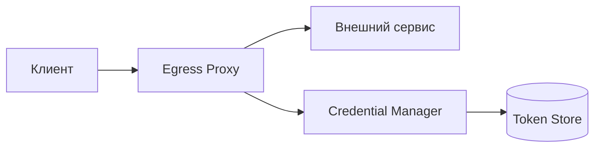

# Egress Proxy - Руководство администратора

## Обзор

Egress Proxy позволяет сервису выступать посредником при исходящих запросах к внешним системам, автоматически добавляя аутентификацию.



---

## Параметры конфигурации

### Основные параметры

| Параметр | Тип | По умолчанию | Описание |
|----------|-----|--------------|----------|
| `egress.enabled` | bool | `false` | Включить egress proxy |

### Конфигурация целей (targets)

| Параметр | Тип | Описание |
|----------|-----|----------|
| `egress.targets.<name>.url` | string | **Обязательно.** Базовый URL целевого сервиса |
| `egress.targets.<name>.timeout` | duration | Таймаут запроса (default: 30s) |

### Аутентификация целей

| Параметр | Тип | Описание |
|----------|-----|----------|
| `egress.targets.<name>.auth.type` | string | Тип аутентификации (см. ниже) |

#### Типы аутентификации

**`bearer`** - Статический Bearer токен

| Параметр | Тип | Описание |
|----------|-----|----------|
| `egress.targets.<name>.auth.token` | string | JWT или Bearer токен |

**`api_key`** - API ключ

| Параметр | Тип | Описание |
|----------|-----|----------|
| `egress.targets.<name>.auth.header` | string | Имя заголовка (например, `X-API-Key`) |
| `egress.targets.<name>.auth.key` | string | Значение ключа |

**`basic`** - Basic Authentication

| Параметр | Тип | Описание |
|----------|-----|----------|
| `egress.targets.<name>.auth.username` | string | Имя пользователя |
| `egress.targets.<name>.auth.password` | string | Пароль |

**`oauth2_client_credentials`** - OAuth2 Client Credentials Flow

| Параметр | Тип | Описание |
|----------|-----|----------|
| `egress.targets.<name>.auth.token_url` | string | URL для получения токена |
| `egress.targets.<name>.auth.client_id` | string | Client ID |
| `egress.targets.<name>.auth.client_secret` | string | Client Secret |
| `egress.targets.<name>.auth.scopes` | []string | Запрашиваемые scopes |
| `egress.targets.<name>.auth.refresh_before_expiry` | duration | Обновить токен за N до истечения (default: 60s) |

**`mtls`** - Mutual TLS

| Параметр | Тип | Описание |
|----------|-----|----------|
| `egress.targets.<name>.tls.client_cert` | string | Путь к клиентскому сертификату |
| `egress.targets.<name>.tls.client_key` | string | Путь к приватному ключу |
| `egress.targets.<name>.tls.ca_cert` | string | Путь к CA сертификату |

**`none`** - Без аутентификации

### TLS конфигурация целей

| Параметр | Тип | Описание |
|----------|-----|----------|
| `egress.targets.<name>.tls.enabled` | bool | Включить TLS |
| `egress.targets.<name>.tls.insecure_skip_verify` | bool | Пропустить проверку сертификата (только для dev!) |

### Маршрутизация

| Параметр | Тип | Описание |
|----------|-----|----------|
| `egress.routes[].path_prefix` | string | Префикс пути для сопоставления |
| `egress.routes[].target` | string | Имя целевого сервиса из `targets` |
| `egress.routes[].methods` | []string | HTTP методы (пусто = все) |
| `egress.routes[].strip_prefix` | string | Удалить этот префикс перед пересылкой |
| `egress.routes[].rewrite_prefix` | string | Добавить этот префикс после удаления |

### Хранилище токенов

| Параметр | Тип | Описание |
|----------|-----|----------|
| `egress.token_store.type` | string | `memory` или `redis` |
| `egress.token_store.redis.address` | string | Адрес Redis (host:port) |
| `egress.token_store.redis.password` | string | Пароль Redis |
| `egress.token_store.redis.db` | int | Номер базы данных |
| `egress.token_store.redis.key_prefix` | string | Префикс ключей (default: `egress:tokens:`) |

### Значения по умолчанию

| Параметр | Тип | Описание |
|----------|-----|----------|
| `egress.defaults.timeout` | duration | Таймаут по умолчанию для всех целей |
| `egress.defaults.retry_count` | int | Количество повторов |
| `egress.defaults.retry_delay` | duration | Задержка между повторами |

### Endpoint

| Параметр | Тип | Описание |
|----------|-----|----------|
| `endpoints.egress` | string | Базовый путь для egress API (default: `/egress`) |

---

## Комплексный пример

```yaml
# Включение egress proxy
egress:
  enabled: true

  # Хранилище токенов (для кластерного развертывания)
  token_store:
    type: redis
    redis:
      address: "redis:6379"
      password: "${REDIS_PASSWORD}"
      db: 1

  # Значения по умолчанию
  defaults:
    timeout: 30s
    retry_count: 3
    retry_delay: 1s

  # Целевые сервисы
  targets:
    # OAuth2 - автоматическое получение и обновление токенов
    keycloak-admin:
      url: "https://keycloak.example.com"
      auth:
        type: oauth2_client_credentials
        token_url: "https://keycloak.example.com/realms/master/protocol/openid-connect/token"
        client_id: "admin-cli"
        client_secret: "${KEYCLOAK_ADMIN_SECRET}"
        scopes: ["openid", "profile"]
        refresh_before_expiry: 60s

    # Статический Bearer токен
    payment-gateway:
      url: "https://payments.provider.com/api/v1"
      timeout: 10s
      auth:
        type: bearer
        token: "${PAYMENT_API_TOKEN}"
      tls:
        enabled: true

    # API Key в заголовке
    analytics-service:
      url: "https://analytics.internal"
      auth:
        type: api_key
        header: "X-API-Key"
        key: "${ANALYTICS_API_KEY}"

    # mTLS для внутренних сервисов
    secure-backend:
      url: "https://backend.secure.local"
      auth:
        type: mtls
      tls:
        enabled: true
        client_cert: "/etc/certs/client.crt"
        client_key: "/etc/certs/client.key"
        ca_cert: "/etc/certs/ca.crt"

  # Маршруты
  routes:
    - path_prefix: "/egress/keycloak"
      target: keycloak-admin
      strip_prefix: "/egress/keycloak"
      rewrite_prefix: "/admin/realms"

    - path_prefix: "/egress/payments"
      target: payment-gateway
      strip_prefix: "/egress/payments"
      methods: ["POST"]

    - path_prefix: "/egress/analytics"
      target: analytics-service
      strip_prefix: "/egress/analytics"
      methods: ["GET", "POST"]

    - path_prefix: "/egress/backend"
      target: secure-backend
      strip_prefix: "/egress/backend"

# Endpoint для egress
endpoints:
  egress: "/egress"
```

---

## Переменные окружения

Все параметры можно задать через переменные окружения:

```
AUTHZ_EGRESS_ENABLED=true
AUTHZ_EGRESS_TARGETS_<NAME>_URL=...
AUTHZ_EGRESS_TARGETS_<NAME>_AUTH_TYPE=...
AUTHZ_EGRESS_TARGETS_<NAME>_AUTH_TOKEN=...
```

**Формат:** `AUTHZ_` + путь в UPPER_SNAKE_CASE

---

## Порядок приоритета маршрутов

Маршруты проверяются **в порядке объявления**. Первый совпавший маршрут используется.

**Рекомендация:** Размещайте более специфичные маршруты выше общих:

```yaml
routes:
  - path_prefix: "/egress/api/v2/admin"  # Специфичный - первым
    target: admin-service
  - path_prefix: "/egress/api/v2"        # Общий - вторым
    target: api-service
```

---

## Безопасность

| Рекомендация | Описание |
|--------------|----------|
| Секреты через env | Используйте `${VAR}` для паролей и токенов |
| Redis с паролем | Для production используйте защищённый Redis |
| TLS везде | Включайте TLS для внешних сервисов |
| Не используйте `insecure_skip_verify` | Только для разработки |
| Ротация токенов | Используйте OAuth2 вместо статических токенов где возможно |

---

## Диагностика

### Health Check

```bash
curl http://localhost:8080/health
```

### Логирование

Egress proxy логирует все запросы:

```json
{
  "level": "info",
  "msg": "Egress request",
  "target": "payment-gateway",
  "method": "POST",
  "path": "/egress/payments/charge",
  "target_url": "https://payments.provider.com/api/v1/charge",
  "duration": "45.2ms",
  "status": 200
}
```

### Метрики

| Метрика | Описание |
|---------|----------|
| `egress_requests_total` | Количество запросов по target |
| `egress_request_duration_seconds` | Латентность запросов |
| `egress_credential_refresh_total` | Обновления токенов |
