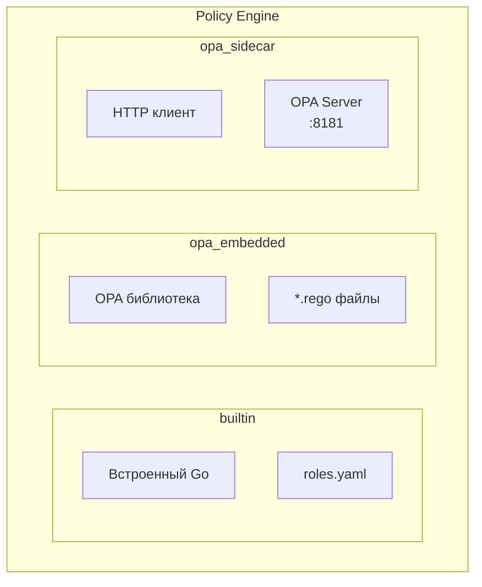

# OPA Policy Engine - Руководство администратора

## Обзор

Сервис поддерживает три режима работы с OPA (Open Policy Agent):

| Режим | Описание | Использование |
|-------|----------|---------------|
| `builtin` | Встроенные правила | Простые сценарии, RBAC |
| `opa_embedded` | OPA как библиотека | Сложные политики, один процесс |
| `opa_sidecar` | Внешний OPA сервер | Микросервисы, централизованное управление |



---

## Параметры конфигурации

### Общие параметры

| Параметр | Тип | По умолчанию | Описание |
|----------|-----|--------------|----------|
| `policy.engine` | string | `builtin` | Движок: `builtin`, `opa_embedded`, `opa_sidecar` |
| `policy.default_decision` | string | `deny` | Решение по умолчанию |
| `policy.query` | string | `data.authz.allow` | OPA query path |

### Builtin Engine

| Параметр | Тип | Описание |
|----------|-----|----------|
| `policy.builtin.roles_file` | string | Путь к файлу ролей (YAML) |
| `policy.builtin.permissions_file` | string | Путь к файлу разрешений |
| `policy.builtin.role_claim` | string | Claim с ролями в JWT (default: `realm_access.roles`) |
| `policy.builtin.superuser_roles` | []string | Роли с полным доступом |

### OPA Embedded Engine

| Параметр | Тип | Описание |
|----------|-----|----------|
| `policy.path` | string | Путь к директории с .rego файлами |
| `policy.data_path` | string | Путь к директории с data.json файлами |
| `policy.bundle.enabled` | bool | Использовать OPA bundle |
| `policy.bundle.url` | string | URL для загрузки bundle |
| `policy.bundle.polling_interval` | duration | Интервал обновления bundle |
| `policy.bundle.auth_token` | string | Bearer токен для загрузки |
| `policy.bundle.auth_type` | string | Тип auth: `bearer`, `basic`, `none` |
| `policy.print_enabled` | bool | Включить `print()` в rego (debug) |

### OPA Sidecar Engine

| Параметр | Тип | Описание |
|----------|-----|----------|
| `policy.opa.url` | string | URL OPA сервера |
| `policy.opa.policy_path` | string | Путь к политике в OPA |
| `policy.opa.timeout` | duration | Таймаут запроса |
| `policy.opa.retry_count` | int | Количество повторов |
| `policy.opa.retry_delay` | duration | Задержка между повторами |

---

## Режим: Builtin

Простой RBAC без OPA. Подходит для базовых сценариев.

### Конфигурация

```yaml
policy:
  engine: builtin
  default_decision: deny
  builtin:
    roles_file: "/etc/authz/roles.yaml"
    permissions_file: "/etc/authz/permissions.yaml"
    role_claim: "realm_access.roles"
    superuser_roles:
      - "admin"
      - "superadmin"
```

### Файл ролей (roles.yaml)

```yaml
roles:
  admin:
    description: "Администратор системы"
    permissions:
      - "users:*"
      - "settings:*"
      - "reports:read"

  manager:
    description: "Менеджер"
    permissions:
      - "users:read"
      - "users:update"
      - "reports:*"

  user:
    description: "Обычный пользователь"
    permissions:
      - "profile:*"
      - "documents:read"
```

### Файл разрешений (permissions.yaml)

```yaml
resources:
  users:
    actions: ["create", "read", "update", "delete", "list"]

  documents:
    actions: ["create", "read", "update", "delete", "share"]

  reports:
    actions: ["read", "export"]

  profile:
    actions: ["read", "update"]
```

---

## Режим: OPA Embedded

OPA работает как встроенная библиотека. Политики загружаются из файлов.

### Конфигурация

```yaml
policy:
  engine: opa_embedded
  path: "/etc/authz/policies"
  data_path: "/etc/authz/data"
  query: "data.authz.allow"
  default_decision: deny
  print_enabled: false
```

### Структура директории

```
/etc/authz/
├── policies/
│   ├── authz.rego        # Основная политика
│   ├── rbac.rego         # RBAC правила
│   └── abac.rego         # ABAC правила
└── data/
    ├── roles.json        # Данные о ролях
    └── permissions.json  # Данные о разрешениях
```

### Пример политики (authz.rego)

```rego
package authz

import rego.v1

# Точка входа
default allow := false

# Разрешить если есть роль admin
allow if {
    "admin" in input.token.realm_access.roles
}

# Разрешить если есть конкретное разрешение
allow if {
    required_permission := sprintf("%s:%s", [input.resource.type, input.action])
    user_permissions := get_user_permissions(input.token)
    required_permission in user_permissions
}

# Получить разрешения пользователя из ролей
get_user_permissions(token) := permissions if {
    user_roles := token.realm_access.roles
    permissions := {p |
        some role in user_roles
        some p in data.roles[role].permissions
    }
}
```

### Пример data файла (data/roles.json)

```json
{
  "roles": {
    "admin": {
      "permissions": ["users:*", "settings:*", "reports:*"]
    },
    "manager": {
      "permissions": ["users:read", "users:update", "reports:read"]
    },
    "user": {
      "permissions": ["profile:read", "profile:update"]
    }
  }
}
```

---

## Режим: OPA Embedded с Bundle

Политики загружаются из удалённого bundle (tar.gz).

### Конфигурация

```yaml
policy:
  engine: opa_embedded
  query: "data.authz.allow"
  default_decision: deny

  bundle:
    enabled: true
    url: "https://opa-bundle.example.com/authz/bundle.tar.gz"
    polling_interval: 5m
    auth_type: bearer
    auth_token: "${OPA_BUNDLE_TOKEN}"
```

### Создание bundle

```bash
# Структура
bundle/
├── authz.rego
├── rbac.rego
└── data.json

# Создание bundle
cd bundle
tar -czvf ../bundle.tar.gz .

# Загрузка на сервер
aws s3 cp bundle.tar.gz s3://my-bucket/authz/
```

---

## Режим: OPA Sidecar

OPA работает как отдельный сервис. Authz-service отправляет HTTP запросы.

### Конфигурация authz-service

```yaml
policy:
  engine: opa_sidecar
  query: "data.authz.allow"
  default_decision: deny

  opa:
    url: "http://opa:8181"
    policy_path: "/v1/data/authz/allow"
    timeout: 5s
    retry_count: 3
    retry_delay: 100ms
```

### Конфигурация OPA (opa.yaml)

```yaml
services:
  bundle:
    url: https://opa-bundle.example.com
    credentials:
      bearer:
        token: "${OPA_BUNDLE_TOKEN}"

bundles:
  authz:
    service: bundle
    resource: authz/bundle.tar.gz
    polling:
      min_delay_seconds: 60
      max_delay_seconds: 120

decision_logs:
  console: true
  reporting:
    min_delay_seconds: 300
    max_delay_seconds: 600
```

### Docker Compose

```yaml
services:
  authz:
    image: authz-service:latest
    environment:
      - AUTHZ_POLICY_ENGINE=opa_sidecar
      - AUTHZ_POLICY_OPA_URL=http://opa:8181
    depends_on:
      - opa

  opa:
    image: openpolicyagent/opa:latest
    command: ["run", "--server", "--config-file=/etc/opa/config.yaml"]
    volumes:
      - ./opa-config.yaml:/etc/opa/config.yaml
    ports:
      - "8181:8181"
```

---

## Input формат

Все политики получают input в следующем формате:

```json
{
  "token": {
    "sub": "user-uuid",
    "email": "user@example.com",
    "preferred_username": "john.doe",
    "realm_access": {
      "roles": ["user", "manager"]
    },
    "resource_access": {
      "my-app": {
        "roles": ["editor"]
      }
    },
    "groups": ["/department/engineering"],
    "iat": 1705312200,
    "exp": 1705315800
  },
  "resource": {
    "type": "document",
    "id": "doc-123",
    "owner": "other-user-uuid",
    "attributes": {
      "classification": "confidential"
    }
  },
  "action": "read",
  "context": {
    "request_id": "req-abc",
    "timestamp": 1705312500
  },
  "source": {
    "address": "192.168.1.100"
  }
}
```

---

## Комплексный пример политики

```rego
package authz

import rego.v1

# ============================================================
# Точка входа
# ============================================================

default allow := false
default reasons := []

# Результат с причинами
result := {
    "allow": allow,
    "reasons": reasons
}

# ============================================================
# Superuser - полный доступ
# ============================================================

allow if is_superuser
reasons contains "superuser access" if is_superuser

is_superuser if {
    superuser_roles := {"admin", "superadmin"}
    user_roles := {r | some r in input.token.realm_access.roles}
    count(superuser_roles & user_roles) > 0
}

# ============================================================
# RBAC - доступ по ролям
# ============================================================

allow if has_role_permission
reasons contains reason if {
    has_role_permission
    reason := sprintf("role permission: %s", [matched_permission])
}

has_role_permission if {
    some permission in user_permissions
    matches_permission(permission, input.resource.type, input.action)
}

user_permissions := permissions if {
    user_roles := input.token.realm_access.roles
    permissions := {p |
        some role in user_roles
        some p in data.roles[role].permissions
    }
}

matches_permission(permission, resource, action) if {
    parts := split(permission, ":")
    parts[0] == resource
    parts[1] == "*"
}

matches_permission(permission, resource, action) if {
    permission == sprintf("%s:%s", [resource, action])
}

matched_permission := permission if {
    some permission in user_permissions
    matches_permission(permission, input.resource.type, input.action)
}

# ============================================================
# ABAC - владелец ресурса
# ============================================================

allow if is_resource_owner
reasons contains "resource owner" if is_resource_owner

is_resource_owner if {
    input.resource.owner == input.token.sub
}

# ============================================================
# Временные ограничения
# ============================================================

deny_reasons contains "outside business hours" if {
    not is_business_hours
    not is_superuser
}

is_business_hours if {
    hour := time.clock([input.context.timestamp * 1000000000, "Europe/Moscow"])[0]
    hour >= 9
    hour < 18
}

# ============================================================
# IP ограничения
# ============================================================

deny_reasons contains "IP not allowed" if {
    not is_allowed_ip
    input.resource.attributes.classification == "confidential"
}

is_allowed_ip if {
    allowed_ranges := data.config.allowed_ip_ranges
    some range in allowed_ranges
    net.cidr_contains(range, input.source.address)
}

# ============================================================
# Финальное решение
# ============================================================

final_allow := allow if {
    count(deny_reasons) == 0
}

final_reasons := reasons if {
    count(deny_reasons) == 0
} else := deny_reasons
```

### Data файл для политики

```json
{
  "roles": {
    "admin": {
      "permissions": ["*:*"]
    },
    "manager": {
      "permissions": ["users:read", "users:update", "documents:*", "reports:read"]
    },
    "user": {
      "permissions": ["profile:read", "profile:update", "documents:read"]
    }
  },
  "config": {
    "allowed_ip_ranges": [
      "10.0.0.0/8",
      "192.168.0.0/16",
      "172.16.0.0/12"
    ]
  }
}
```

---

## Тестирование политик

### OPA CLI

```bash
# Тест с input файлом
opa eval -d policies/ -i input.json "data.authz.allow"

# Тест с data файлом
opa eval -d policies/ -d data/ -i input.json "data.authz.result"

# Профилирование
opa eval -d policies/ -i input.json --profile "data.authz.allow"
```

### Unit тесты (authz_test.rego)

```rego
package authz_test

import rego.v1
import data.authz

test_admin_allowed if {
    authz.allow with input as {
        "token": {"realm_access": {"roles": ["admin"]}},
        "resource": {"type": "users"},
        "action": "delete"
    }
}

test_user_denied_delete if {
    not authz.allow with input as {
        "token": {"realm_access": {"roles": ["user"]}},
        "resource": {"type": "users"},
        "action": "delete"
    }
}

test_owner_can_update if {
    authz.allow with input as {
        "token": {"sub": "user-1", "realm_access": {"roles": ["user"]}},
        "resource": {"type": "documents", "owner": "user-1"},
        "action": "update"
    }
}
```

```bash
# Запуск тестов
opa test policies/ -v
```

---

## Метрики

| Метрика | Описание |
|---------|----------|
| `policy_evaluations_total` | Количество вычислений |
| `policy_evaluation_duration_seconds` | Время вычисления |
| `policy_bundle_last_success_timestamp` | Последняя успешная загрузка bundle |
| `policy_bundle_failures_total` | Ошибки загрузки bundle |

---

## Отладка

### Включить debug логирование

```yaml
logger:
  level: debug

policy:
  print_enabled: true  # для opa_embedded
```

### Print в политике

```rego
allow if {
    print("Checking user:", input.token.sub)
    print("Roles:", input.token.realm_access.roles)
    print("Resource:", input.resource)
    # ... логика
}
```
