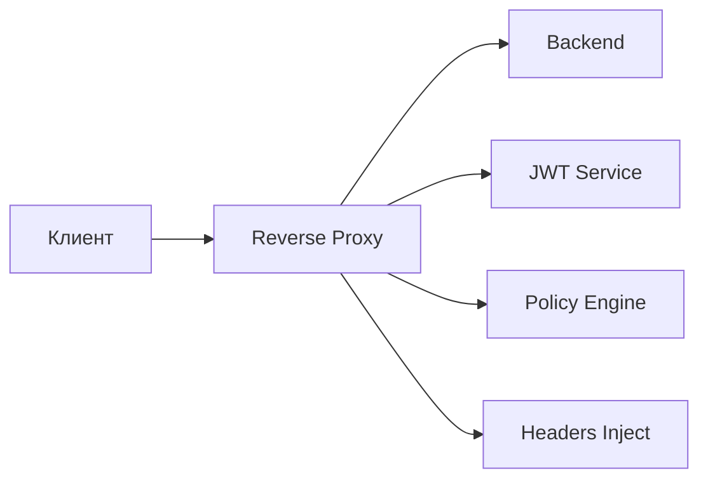
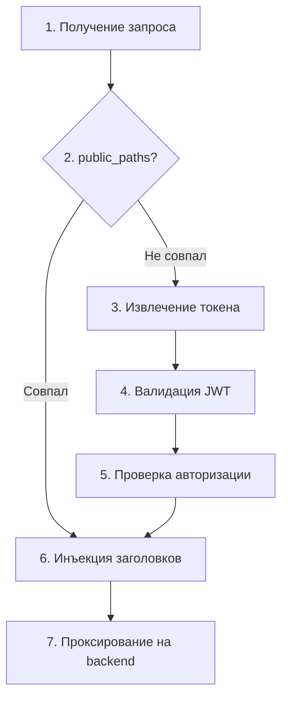

# Reverse Proxy (Ingress) - Руководство администратора

## Обзор

Reverse Proxy режим позволяет сервису выступать посредником для входящих запросов, выполняя аутентификацию и авторизацию перед пересылкой на backend.



---

## Параметры конфигурации

### Основные параметры

| Параметр | Тип | По умолчанию | Описание |
|----------|-----|--------------|----------|
| `proxy.enabled` | bool | `false` | Включить reverse proxy |
| `proxy.mode` | string | `reverse_proxy` | Режим работы |

### Upstream (Backend)

| Параметр | Тип | По умолчанию | Описание |
|----------|-----|--------------|----------|
| `proxy.upstream.url` | string | - | **Обязательно.** URL backend сервиса |
| `proxy.upstream.timeout` | duration | `30s` | Таймаут запроса к backend |
| `proxy.upstream.max_idle_conns` | int | `100` | Макс. idle соединений |
| `proxy.upstream.idle_conn_timeout` | duration | `90s` | Таймаут idle соединения |

### TLS для upstream

| Параметр | Тип | Описание |
|----------|-----|----------|
| `proxy.upstream.tls.enabled` | bool | Включить TLS для backend |
| `proxy.upstream.tls.insecure_skip_verify` | bool | Пропустить проверку сертификата |
| `proxy.upstream.tls.ca_cert` | string | Путь к CA сертификату |
| `proxy.upstream.tls.client_cert` | string | Путь к клиентскому сертификату (mTLS) |
| `proxy.upstream.tls.client_key` | string | Путь к приватному ключу (mTLS) |

### Аутентификация

| Параметр | Тип | По умолчанию | Описание |
|----------|-----|--------------|----------|
| `proxy.auth.enabled` | bool | `true` | Требовать аутентификацию |
| `proxy.auth.header` | string | `Authorization` | Заголовок с токеном |
| `proxy.auth.scheme` | string | `Bearer` | Схема аутентификации |
| `proxy.auth.query_param` | string | - | Альтернатива: токен в query параметре |
| `proxy.auth.cookie_name` | string | - | Альтернатива: токен в cookie |

### Авторизация

| Параметр | Тип | По умолчанию | Описание |
|----------|-----|--------------|----------|
| `proxy.authz.enabled` | bool | `true` | Проверять авторизацию |
| `proxy.authz.policy_query` | string | `data.authz.allow` | OPA query |
| `proxy.authz.on_deny` | string | `reject` | Действие: `reject`, `log_only` |

### Инъекция заголовков

| Параметр | Тип | Описание |
|----------|-----|----------|
| `proxy.headers.inject_user_id` | string | Заголовок для user ID (из `sub`) |
| `proxy.headers.inject_email` | string | Заголовок для email |
| `proxy.headers.inject_roles` | string | Заголовок для ролей |
| `proxy.headers.inject_groups` | string | Заголовок для групп |
| `proxy.headers.inject_claims` | map | Маппинг claim → заголовок |
| `proxy.headers.remove` | []string | Заголовки для удаления |
| `proxy.headers.pass_token` | bool | Передать оригинальный токен на backend |

### Маршрутизация

| Параметр | Тип | Описание |
|----------|-----|----------|
| `proxy.routes[].path` | string | Путь или шаблон (glob) |
| `proxy.routes[].methods` | []string | HTTP методы (пусто = все) |
| `proxy.routes[].upstream` | string | URL backend (переопределяет основной) |
| `proxy.routes[].auth_required` | bool | Требуется ли аутентификация |
| `proxy.routes[].authz_required` | bool | Требуется ли авторизация |
| `proxy.routes[].strip_prefix` | string | Удалить префикс пути |
| `proxy.routes[].rewrite_prefix` | string | Заменить префикс |
| `proxy.routes[].rate_limit` | string | Лимит запросов (например, `100/m`) |

### Публичные пути

| Параметр | Тип | Описание |
|----------|-----|----------|
| `proxy.public_paths` | []string | Пути без аутентификации (glob) |

### CORS

| Параметр | Тип | Описание |
|----------|-----|----------|
| `proxy.cors.enabled` | bool | Включить CORS |
| `proxy.cors.allowed_origins` | []string | Разрешённые origins (`*` = все) |
| `proxy.cors.allowed_methods` | []string | Разрешённые методы |
| `proxy.cors.allowed_headers` | []string | Разрешённые заголовки |
| `proxy.cors.exposed_headers` | []string | Заголовки в ответе |
| `proxy.cors.allow_credentials` | bool | Разрешить credentials |
| `proxy.cors.max_age` | duration | Cache preflight запросов |

### Rate Limiting

| Параметр | Тип | Описание |
|----------|-----|----------|
| `proxy.rate_limit.enabled` | bool | Включить rate limiting |
| `proxy.rate_limit.requests_per_second` | int | Запросов в секунду |
| `proxy.rate_limit.burst` | int | Максимальный burst |
| `proxy.rate_limit.by` | string | Ключ: `ip`, `user`, `token` |

### Таймауты и ретраи

| Параметр | Тип | По умолчанию | Описание |
|----------|-----|--------------|----------|
| `proxy.timeout` | duration | `30s` | Общий таймаут запроса |
| `proxy.retry.enabled` | bool | `false` | Включить ретраи |
| `proxy.retry.attempts` | int | `3` | Количество попыток |
| `proxy.retry.delay` | duration | `100ms` | Задержка между попытками |
| `proxy.retry.conditions` | []string | Условия: `5xx`, `reset`, `connect_failure` |

---

## Комплексный пример

```yaml
# Включение reverse proxy
proxy:
  enabled: true
  mode: reverse_proxy

  # Backend сервис
  upstream:
    url: "http://backend-service:8080"
    timeout: 30s
    max_idle_conns: 100
    tls:
      enabled: false

  # Аутентификация
  auth:
    enabled: true
    header: "Authorization"
    scheme: "Bearer"

  # Авторизация
  authz:
    enabled: true
    policy_query: "data.authz.allow"
    on_deny: reject

  # Публичные пути (без аутентификации)
  public_paths:
    - "/health"
    - "/ready"
    - "/live"
    - "/api/v1/public/**"
    - "/.well-known/**"

  # Инъекция заголовков в backend
  headers:
    inject_user_id: "X-User-ID"
    inject_email: "X-User-Email"
    inject_roles: "X-User-Roles"
    inject_claims:
      preferred_username: "X-Username"
      realm_access.roles: "X-Realm-Roles"
      resource_access.myapp.roles: "X-App-Roles"
    remove:
      - "Authorization"  # Не передавать токен на backend
    pass_token: false

  # Маршруты с особой логикой
  routes:
    # Admin API - строгая авторизация
    - path: "/api/v1/admin/**"
      methods: ["GET", "POST", "PUT", "DELETE"]
      auth_required: true
      authz_required: true
      rate_limit: "10/m"

    # Публичный API - только аутентификация
    - path: "/api/v1/users/me"
      methods: ["GET"]
      auth_required: true
      authz_required: false

    # Webhook - без аутентификации, но с rate limit
    - path: "/api/v1/webhooks/**"
      auth_required: false
      authz_required: false
      rate_limit: "100/m"

    # Legacy API - проксирование на другой backend
    - path: "/api/v0/**"
      upstream: "http://legacy-service:8080"
      strip_prefix: "/api/v0"
      rewrite_prefix: "/api"

  # CORS
  cors:
    enabled: true
    allowed_origins:
      - "https://app.example.com"
      - "https://admin.example.com"
    allowed_methods:
      - "GET"
      - "POST"
      - "PUT"
      - "DELETE"
      - "OPTIONS"
    allowed_headers:
      - "Authorization"
      - "Content-Type"
      - "X-Request-ID"
    allow_credentials: true
    max_age: 1h

  # Rate limiting
  rate_limit:
    enabled: true
    requests_per_second: 100
    burst: 200
    by: user  # по user ID из токена

  # Ретраи
  retry:
    enabled: true
    attempts: 3
    delay: 100ms
    conditions:
      - "5xx"
      - "connect_failure"

# JWT конфигурация (обязательно для auth)
jwt:
  issuer: "https://keycloak.example.com/realms/production"
  audience: "my-app"

# Policy конфигурация (для authz)
policy:
  engine: builtin
  path: "/etc/authz/policies"
  default_decision: deny
```

---

## Логика обработки запроса



---

## Формат заголовков

### Входящие (от клиента)

```
Authorization: Bearer <jwt-token>
```

### Исходящие (на backend)

```
X-User-ID: 550e8400-e29b-41d4-a716-446655440000
X-User-Email: user@example.com
X-User-Roles: admin,user
X-Username: john.doe
X-Request-ID: abc123
```

---

## Метрики

| Метрика | Описание |
|---------|----------|
| `proxy_requests_total` | Всего запросов |
| `proxy_request_duration_seconds` | Латентность |
| `proxy_auth_failures_total` | Ошибки аутентификации |
| `proxy_authz_denials_total` | Отказы авторизации |
| `proxy_upstream_errors_total` | Ошибки backend |
| `proxy_rate_limited_total` | Запросы с rate limit |

---

## Коды ошибок

| Код | Описание |
|-----|----------|
| `401` | Токен отсутствует или невалидный |
| `403` | Авторизация отклонена |
| `429` | Rate limit превышен |
| `502` | Backend недоступен |
| `504` | Таймаут backend |
