# Техническое задание: Go Authorization Service

## Оглавление

1. [Общие сведения](#1-общие-сведения)
2. [Режимы работы](#2-режимы-работы)
3. [Архитектура приложения](#3-архитектура-приложения)
4. [Функциональные требования](#4-функциональные-требования)
   - 4.8 [Extensibility для LLM-агентов](#48-extensibility-для-llm-агентов-fr-agent)
   - 4.9 [Reverse Proxy (FR-PROXY)](#49-reverse-proxy-fr-proxy)
   - 4.10 [Egress Proxy (FR-EGRESS)](#410-egress-proxy-fr-egress)
5. [API Specification](#5-api-specification)
6. [Компоненты системы](#6-компоненты-системы)
7. [Интеграции](#7-интеграции)
8. [Конфигурация](#8-конфигурация)
9. [Observability](#9-observability)
10. [Безопасность](#10-безопасность)
11. [Нефункциональные требования](#11-нефункциональные-требования)
12. [Структура проекта](#12-структура-проекта)
13. [Зависимости](#13-зависимости)
14. [Этапы разработки](#14-этапы-разработки)

### Связанные документы

- [LLM Agent Authorization Analysis](./LLM_AGENT_AUTHORIZATION_ANALYSIS.md) — анализ авторизации LLM-агентов

---

## 1. Общие сведения

### 1.1. Назначение

**Go Authorization Service** — центральный компонент авторизационного слоя, который:

- **Работает как авторизующий прокси** (аутентификация + авторизация + проксирование)
- Принимает решения об авторизации запросов (PDP orchestrator)
- Валидирует JWT токены
- Интегрируется с OPA для policy evaluation (embedded или sidecar)
- Обеспечивает Token Exchange workflow
- Предоставляет HTTP REST API (основной)
- Предоставляет Envoy ext_authz gRPC API (**опционально**, для Istio/Envoy)
- Кеширует решения для снижения latency
- Собирает метрики и audit logs
- **Проксирует авторизованные запросы к upstream сервисам**

### 1.2. Позиция в архитектуре

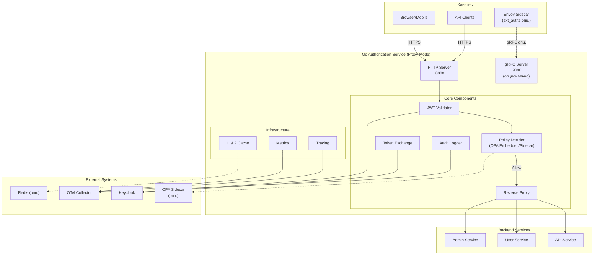
```mermaid
flowchart TB
    subgraph Clients["Клиенты"]
        Browser["Browser/Mobile"]
        APIClient["API Clients"]
        Envoy["Envoy Sidecar<br/>(ext_authz опц.)"]
    end

    subgraph AuthZService["Go Authorization Service (Proxy Mode)"]
        HTTP["HTTP Server<br/>:8080"]
        GRPC["gRPC Server<br/>:9090<br/>(опционально)"]

        subgraph Core["Core Components"]
            JWTValidator["JWT Validator"]
            PolicyDecider["Policy Decider<br/>(OPA Embedded/Sidecar)"]
            ReverseProxy["Reverse Proxy"]
            TokenExchange["Token Exchange"]
            AuditLogger["Audit Logger"]
        end

        subgraph Infra["Infrastructure"]
            Cache["L1/L2 Cache"]
            Metrics["Metrics"]
            Tracing["Tracing"]
        end
    end

    subgraph Upstreams["Backend Services"]
        APIService["API Service"]
        UserService["User Service"]
        AdminService["Admin Service"]
    end

    subgraph External["External Systems"]
        Keycloak["Keycloak"]
        OPA["OPA Sidecar<br/>(опц.)"]
        Redis["Redis (опц.)"]
        OTel["OTel Collector"]
    end

    Browser -->|HTTPS| HTTP
    APIClient -->|HTTPS| HTTP
    Envoy -.->|gRPC опц.| GRPC

    HTTP --> JWTValidator
    JWTValidator --> PolicyDecider
    PolicyDecider -->|Allow| ReverseProxy
    ReverseProxy --> APIService
    ReverseProxy --> UserService
    ReverseProxy --> AdminService

    JWTValidator --> Keycloak
    PolicyDecider -.-> OPA
    TokenExchange --> Keycloak
    Cache -.-> Redis
    Metrics --> OTel
    Tracing --> OTel
    AuditLogger --> OTel
```

> **Примечание:** Сервис работает как авторизующий прокси: аутентифицирует запрос (JWT), авторизует (OPA/builtin), затем проксирует к upstream сервису.

### 1.3. Ключевые характеристики

| Характеристика | Значение |
|----------------|----------|
| Язык | Go 1.24+ |
| Режимы работы | Decision API, **Reverse Proxy** |
| Протоколы | HTTP/REST (основной), gRPC (опционально) |
| Policy Engines | OPA Embedded, OPA Sidecar, Built-in YAML |
| Deployment | Kubernetes (Sidecar/Standalone), VM |
| Stateless | Да (состояние в Redis/OPA) |
| HA | Horizontal scaling |

### 1.4. Опциональные компоненты

| Компонент | Когда нужен | Описание |
|-----------|-------------|----------|
| **gRPC (ext_authz)** | Istio / Envoy | Стандартный Envoy External Authorization API |
| **OPA Sidecar** | Отдельное управление политиками | OPA как HTTP сервис |
| **Redis** | Распределённый кеш | L2 кеш для multi-instance deployment |

---

## 2. Режимы работы

Сервис поддерживает два режима работы:

### 2.1. Decision API Mode (decision_only)

В этом режиме сервис только возвращает решения об авторизации:

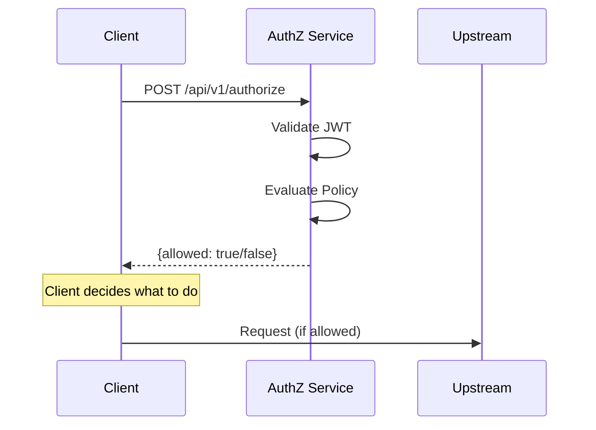
```mermaid
sequenceDiagram
    participant Client
    participant AuthZ as AuthZ Service
    participant Upstream

    Client->>AuthZ: POST /api/v1/authorize
    AuthZ->>AuthZ: Validate JWT
    AuthZ->>AuthZ: Evaluate Policy
    AuthZ-->>Client: {allowed: true/false}
    Note over Client: Client decides what to do
    Client->>Upstream: Request (if allowed)
```

**Используется когда:**
- Интеграция с API Gateway (Kong, Nginx, Traefik)
- Интеграция с Envoy через ext_authz
- Клиент сам управляет проксированием

### 2.2. Reverse Proxy Mode (reverse_proxy) ⭐

В этом режиме сервис работает как полноценный авторизующий прокси:

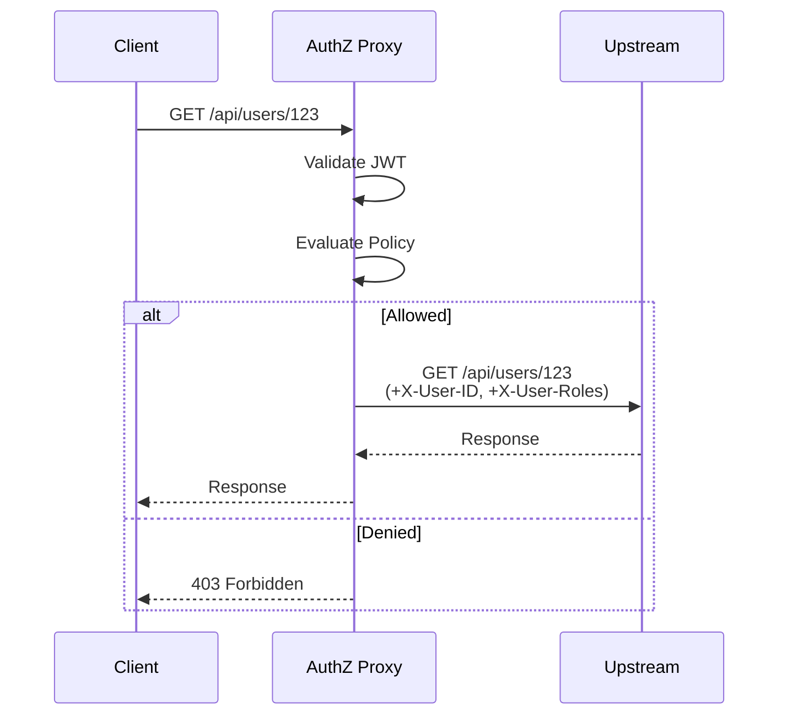
```mermaid
sequenceDiagram
    participant Client
    participant AuthZ as AuthZ Proxy
    participant Upstream

    Client->>AuthZ: GET /api/users/123
    AuthZ->>AuthZ: Validate JWT
    AuthZ->>AuthZ: Evaluate Policy
    alt Allowed
        AuthZ->>Upstream: GET /api/users/123<br/>(+X-User-ID, +X-User-Roles)
        Upstream-->>AuthZ: Response
        AuthZ-->>Client: Response
    else Denied
        AuthZ-->>Client: 403 Forbidden
    end
```

**Преимущества:**
- Единая точка входа для всех запросов
- Автоматическое добавление user info headers
- Централизованное логирование и метрики
- Поддержка множественных upstream'ов с маршрутизацией

### 2.3. Egress Proxy Mode (egress_proxy) ⭐

В этом режиме сервис работает как исходящий прокси для внутренних сервисов:

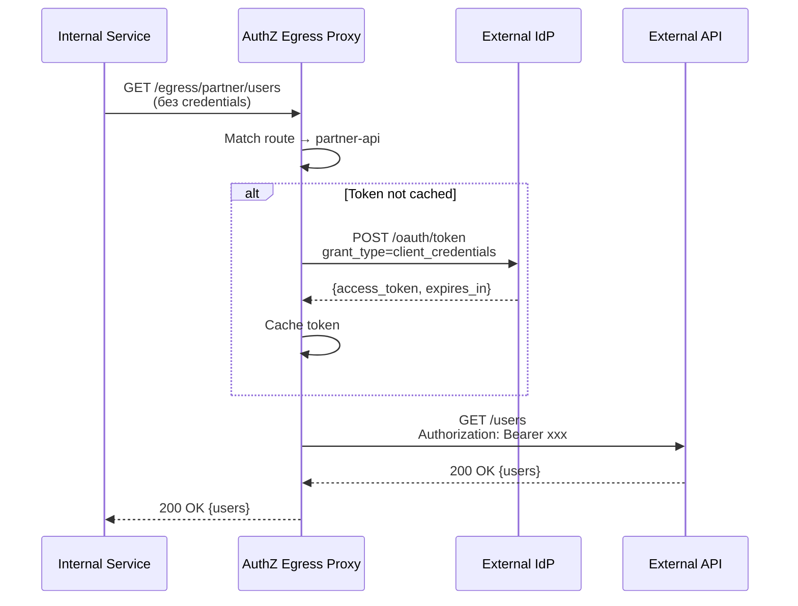
```mermaid
sequenceDiagram
    participant Service as Internal Service
    participant AuthZ as AuthZ Egress Proxy
    participant IdP as External IdP
    participant API as External API

    Service->>AuthZ: GET /egress/partner/users<br/>(без credentials)
    AuthZ->>AuthZ: Match route → partner-api

    alt Token not cached
        AuthZ->>IdP: POST /oauth/token<br/>grant_type=client_credentials
        IdP-->>AuthZ: {access_token, expires_in}
        AuthZ->>AuthZ: Cache token
    end

    AuthZ->>API: GET /users<br/>Authorization: Bearer xxx
    API-->>AuthZ: 200 OK {users}
    AuthZ-->>Service: 200 OK {users}
```

**Используется когда:**
- Внутренний сервис обращается к внешнему API
- Нужно централизованно управлять credentials для внешних систем
- Нужно автоматически обновлять токены (OAuth2, Service Accounts)
- Требуется audit всех исходящих запросов

**Преимущества:**
- Централизованное управление credentials
- Автоматический refresh токенов
- Audit всех исходящих запросов
- Единая точка для rate limiting к внешним API
- Секреты хранятся только в прокси, не в каждом сервисе

### 2.4. Сравнение режимов

| Функция | Decision API | Reverse Proxy | Egress Proxy |
|---------|--------------|---------------|--------------|
| Направление | Входящие | Входящие | Исходящие |
| Возврат решения | ✅ JSON | ✅ HTTP status | — |
| Проксирование | ❌ | ✅ К backend | ✅ К external |
| Валидация JWT | ✅ Входящий | ✅ Входящий | ❌ |
| Получение токенов | ❌ | ❌ | ✅ OAuth2/SA |
| Header injection | ❌ | ✅ X-User-ID | ✅ Authorization |
| Credential mgmt | ❌ | ❌ | ✅ Централизованно |

### 2.5. Конфигурация режимов

```yaml
proxy:
  enabled: true
  mode: "reverse_proxy"  # decision_only | reverse_proxy

  upstream:
    url: "http://backend:8080"
    timeout: 30s

  headers:
    add_user_info: true
    user_id_header: "X-User-ID"
    user_roles_header: "X-User-Roles"
```

---

## 3. Архитектура приложения

### 3.1. Слоистая архитектура

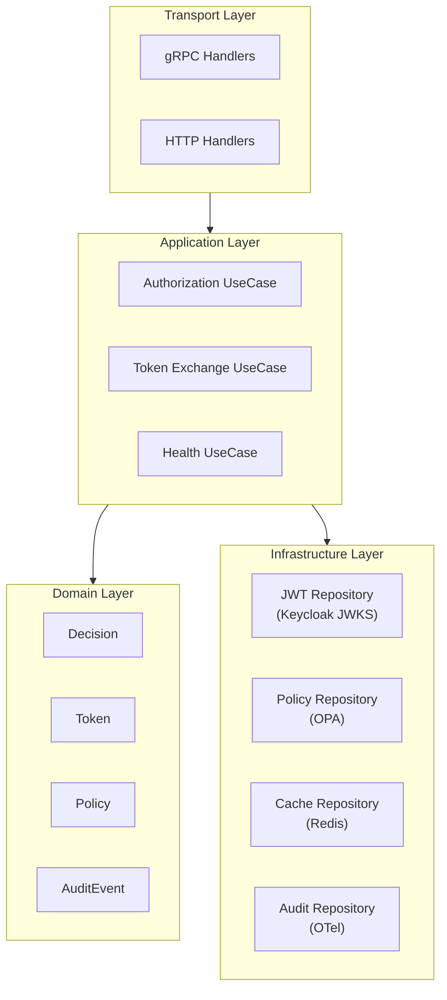
```mermaid
flowchart TB
    subgraph Transport["Transport Layer"]
        GRPCHandler["gRPC Handlers"]
        HTTPHandler["HTTP Handlers"]
    end

    subgraph Application["Application Layer"]
        AuthZUseCase["Authorization UseCase"]
        TokenExchangeUseCase["Token Exchange UseCase"]
        HealthUseCase["Health UseCase"]
    end

    subgraph Domain["Domain Layer"]
        Decision["Decision"]
        Token["Token"]
        Policy["Policy"]
        AuditEvent["AuditEvent"]
    end

    subgraph Infrastructure["Infrastructure Layer"]
        JWTRepo["JWT Repository<br/>(Keycloak JWKS)"]
        PolicyRepo["Policy Repository<br/>(OPA)"]
        CacheRepo["Cache Repository<br/>(Redis)"]
        AuditRepo["Audit Repository<br/>(OTel)"]
    end

    Transport --> Application
    Application --> Domain
    Application --> Infrastructure
```

### 3.2. Компонентная диаграмма


```mermaid
flowchart LR
    subgraph Entrypoints["Entrypoints"]
        GRPCServer["gRPC Server"]
        HTTPServer["HTTP Server"]
    end

    subgraph Middleware["Middleware"]
        Recovery["Recovery"]
        Logging["Logging"]
        Metrics["Metrics"]
        Tracing["Tracing"]
        RateLimit["Rate Limiting"]
    end

    subgraph Handlers["Handlers"]
        ExtAuthz["ext_authz Handler"]
        AuthzAPI["Authorization API"]
        TokenAPI["Token Exchange API"]
        HealthAPI["Health API"]
        AdminAPI["Admin API"]
    end

    subgraph Services["Services"]
        AuthzService["AuthZ Service"]
        JWTService["JWT Service"]
        PolicyService["Policy Service"]
        CacheService["Cache Service"]
        AuditService["Audit Service"]
    end

    subgraph Clients["External Clients"]
        OPAClient["OPA Client"]
        KeycloakClient["Keycloak Client"]
        RedisClient["Redis Client"]
        OTelClient["OTel Client"]
    end

    Entrypoints --> Middleware
    Middleware --> Handlers
    Handlers --> Services
    Services --> Clients
```

### 3.3. Sequence: Authorization Request

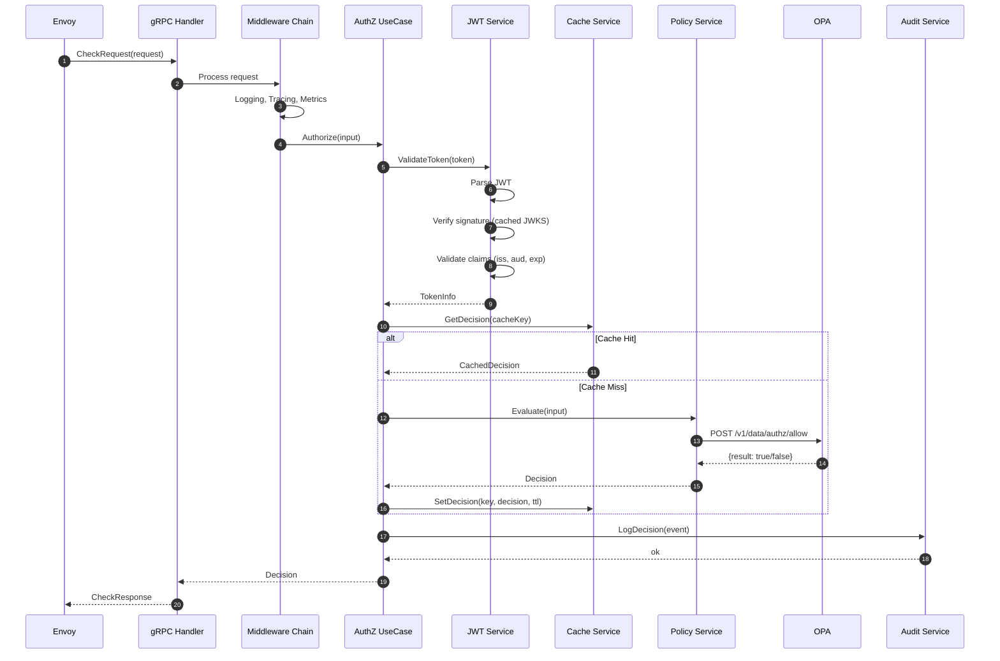
```mermaid
sequenceDiagram
    autonumber
    participant Envoy
    participant Handler as gRPC Handler
    participant Middleware as Middleware Chain
    participant UseCase as AuthZ UseCase
    participant JWT as JWT Service
    participant Cache as Cache Service
    participant Policy as Policy Service
    participant OPA
    participant Audit as Audit Service

    Envoy->>Handler: CheckRequest(request)
    Handler->>Middleware: Process request
    Middleware->>Middleware: Logging, Tracing, Metrics
    Middleware->>UseCase: Authorize(input)

    UseCase->>JWT: ValidateToken(token)
    JWT->>JWT: Parse JWT
    JWT->>JWT: Verify signature (cached JWKS)
    JWT->>JWT: Validate claims (iss, aud, exp)
    JWT-->>UseCase: TokenInfo

    UseCase->>Cache: GetDecision(cacheKey)

    alt Cache Hit
        Cache-->>UseCase: CachedDecision
    else Cache Miss
        UseCase->>Policy: Evaluate(input)
        Policy->>OPA: POST /v1/data/authz/allow
        OPA-->>Policy: {result: true/false}
        Policy-->>UseCase: Decision
        UseCase->>Cache: SetDecision(key, decision, ttl)
    end

    UseCase->>Audit: LogDecision(event)
    Audit-->>UseCase: ok

    UseCase-->>Handler: Decision
    Handler-->>Envoy: CheckResponse
```

---

## 4. Функциональные требования

### 4.1. Authorization (FR-AUTH)

| ID | Требование | Приоритет |
|----|------------|-----------|
| FR-AUTH-01 | Валидация JWT токенов (RS256, ES256) | P0 |
| FR-AUTH-02 | Проверка claims: iss, aud, exp, nbf, iat | P0 |
| FR-AUTH-03 | Извлечение roles, scopes, custom claims | P0 |
| FR-AUTH-04 | Поддержка JWKS endpoint с кешированием | P0 |
| FR-AUTH-05 | Поддержка multiple issuers | P1 |
| FR-AUTH-06 | Offline token validation (cached JWKS) | P1 |

### 4.2. Policy Evaluation (FR-POLICY)

| ID | Требование | Приоритет |
|----|------------|-----------|
| FR-POLICY-01 | Интеграция с OPA (HTTP client) | P0 |
| FR-POLICY-02 | Embedded OPA (Go library) | P1 |
| FR-POLICY-03 | Built-in rules (YAML-based) | P0 |
| FR-POLICY-04 | Переключение между policy engines | P0 |
| FR-POLICY-05 | Fallback при недоступности OPA | P0 |
| FR-POLICY-06 | Hot-reload политик | P2 |
| FR-POLICY-07 | CEL expressions в Built-in rules | P1 |

#### FR-POLICY-07: CEL Expressions

Built-in policy engine поддерживает [CEL (Common Expression Language)](https://github.com/google/cel-spec) для сложной логики авторизации.

**Возможности:**
- Доступ к JWT claims, request info, resource params
- Кастомные функции: `cidrMatch()`, `globMatch()`
- Три режима: `and`, `or`, `override`
- Компиляция и кеширование выражений

**Пример:**
```yaml
rules:
  - name: owner-or-admin
    conditions:
      path_templates:
        - "/api/v1/documents/{document_id}"
      expression: '"admin" in token.roles || resource.params["owner_id"] == token.sub'
      expression_mode: override
    effect: allow
```

**См. также:** [CEL Expressions Guide](../guides/CEL_EXPRESSIONS_GUIDE.md)

### 4.3. Caching (FR-CACHE)

| ID | Требование | Приоритет |
|----|------------|-----------|
| FR-CACHE-01 | Кеширование authorization decisions | P0 |
| FR-CACHE-02 | Кеширование JWT validation results | P1 |
| FR-CACHE-03 | Кеширование JWKS | P0 |
| FR-CACHE-04 | Configurable TTL per cache type | P0 |
| FR-CACHE-05 | Cache invalidation API | P1 |
| FR-CACHE-06 | Distributed cache (Redis) | P0 |
| FR-CACHE-07 | Local in-memory cache (L1) | P1 |

### 4.4. Token Exchange (FR-EXCHANGE)

| ID | Требование | Приоритет |
|----|------------|-----------|
| FR-EXCHANGE-01 | OAuth 2.0 Token Exchange (RFC 8693) | P0 |
| FR-EXCHANGE-02 | Проверка разрешений на exchange | P0 |
| FR-EXCHANGE-03 | Scope downscoping | P0 |
| FR-EXCHANGE-04 | Chain depth validation (max=3) | P0 |
| FR-EXCHANGE-05 | Actor claim injection | P0 |
| FR-EXCHANGE-06 | Audience restriction | P0 |

### 4.5. Audit & Logging (FR-AUDIT)

| ID | Требование | Приоритет |
|----|------------|-----------|
| FR-AUDIT-01 | Structured audit events (JSON) | P0 |
| FR-AUDIT-02 | Correlation ID propagation | P0 |
| FR-AUDIT-03 | Decision logging (allow/deny + reason) | P0 |
| FR-AUDIT-04 | Export to OpenTelemetry | P0 |
| FR-AUDIT-05 | Configurable verbosity levels | P1 |
| FR-AUDIT-06 | PII masking | P1 |

### 4.6. Service-to-Service (FR-S2S)

| ID | Требование | Приоритет |
|----|------------|-----------|
| FR-S2S-01 | SPIFFE ID extraction from mTLS | P0 |
| FR-S2S-02 | Service identity validation | P0 |
| FR-S2S-03 | Service-to-service policies | P0 |
| FR-S2S-04 | Delegation chain validation | P0 |

### 4.7. Administration (FR-ADMIN)

| ID | Требование | Приоритет |
|----|------------|-----------|
| FR-ADMIN-01 | Health check endpoints | P0 |
| FR-ADMIN-02 | Readiness/Liveness probes | P0 |
| FR-ADMIN-03 | Prometheus metrics endpoint | P0 |
| FR-ADMIN-04 | Cache management API | P2 |
| FR-ADMIN-05 | Runtime configuration reload | P2 |

### 4.8. Extensibility для LLM-агентов (FR-AGENT)

> **Контекст:** Подготовка архитектуры к будущей поддержке авторизации LLM-агентов
> (agent-to-agent, delegation chains, intent-based authorization).
> См. анализ: [LLM_AGENT_AUTHORIZATION_ANALYSIS.md](./LLM_AGENT_AUTHORIZATION_ANALYSIS.md)

| ID | Требование | Приоритет | Описание |
|----|------------|-----------|----------|
| FR-AGENT-01 | Extensible PolicyInput | P0 | Поле `Extensions map[string]any` для будущих agent-атрибутов |
| FR-AGENT-02 | Generic Token Claims | P0 | Поле `ExtraClaims map[string]any` для `act`, `delegation_chain` |
| FR-AGENT-03 | Extensible AuditEvent | P0 | Поле `Context map[string]any` для agent-контекста |
| FR-AGENT-04 | AuthorizationEnhancer interface | P1 | Интерфейс для middleware-расширений авторизации |
| FR-AGENT-05 | Config placeholder для agents | P1 | Зарезервированная секция `agents:` в конфигурации |
| FR-AGENT-06 | Middleware chain support | P1 | Поддержка цепочки обработчиков для расширяемости |

#### Спецификация точек расширения

**FR-AGENT-01: Extensible PolicyInput**

```go
// internal/domain/policy.go

type PolicyInput struct {
    Request     RequestInfo        `json:"request"`
    Token       TokenInfo          `json:"token"`
    Source      SourceInfo         `json:"source"`
    Destination DestinationInfo    `json:"destination"`
    Context     ContextInfo        `json:"context"`

    // Точка расширения для будущих атрибутов (agent identity, intent, etc.)
    Extensions  map[string]any     `json:"extensions,omitempty"`
}
```

**FR-AGENT-02: Generic Token Claims**

```go
// internal/domain/token.go

type TokenInfo struct {
    Valid       bool               `json:"valid"`
    Subject     string             `json:"sub"`
    Issuer      string             `json:"iss"`
    Audience    []string           `json:"aud"`
    Roles       []string           `json:"roles"`
    Scopes      []string           `json:"scopes"`
    ExpiresAt   time.Time          `json:"exp"`

    // Точка расширения для act claim, delegation_chain, agent_id
    ExtraClaims map[string]any     `json:"extra_claims,omitempty"`
}

// Пример будущего использования:
// token.ExtraClaims["act"] = map[string]any{"sub": "agent-123"}
// token.ExtraClaims["delegation_chain"] = [...]
```

**FR-AGENT-03: Extensible AuditEvent**

```go
// internal/domain/audit.go

type AuditEvent struct {
    Timestamp     time.Time          `json:"timestamp"`
    EventID       string             `json:"event_id"`
    EventType     string             `json:"event_type"`
    Subject       SubjectInfo        `json:"subject"`
    Resource      ResourceInfo       `json:"resource"`
    Action        string             `json:"action"`
    Decision      DecisionInfo       `json:"decision"`

    // Точка расширения для agent context, delegation chain logging
    Context       map[string]any     `json:"context,omitempty"`
}

// Пример будущего использования:
// event.Context["agent_id"] = "agent-orchestrator"
// event.Context["delegation_chain"] = [...]
// event.Context["intent_hash"] = "sha256:..."
```

**FR-AGENT-04: AuthorizationEnhancer Interface**

```go
// internal/service/authz/enhancer.go

// AuthorizationEnhancer позволяет расширять авторизационный pipeline
// Будущий AgentModule будет реализовывать этот интерфейс
type AuthorizationEnhancer interface {
    // Enhance добавляет дополнительный контекст к PolicyInput
    Enhance(ctx context.Context, input *PolicyInput) (*PolicyInput, error)

    // Name возвращает имя enhancer для логирования
    Name() string

    // Enabled проверяет, активен ли enhancer
    Enabled() bool
}

// NoopEnhancer — заглушка, которая ничего не делает
type NoopEnhancer struct{}

func (e *NoopEnhancer) Enhance(ctx context.Context, input *PolicyInput) (*PolicyInput, error) {
    return input, nil
}
func (e *NoopEnhancer) Name() string { return "noop" }
func (e *NoopEnhancer) Enabled() bool { return false }
```

**FR-AGENT-05: Config Placeholder**

```yaml
# config/config.yaml

# ... существующие секции ...

# ============================================================
# ЗАРЕЗЕРВИРОВАНО: Поддержка LLM-агентов (будущая функциональность)
# ============================================================
# agents:
#   enabled: false
#
#   registry:
#     storage: redis  # или memory, postgres
#     ttl: 24h
#
#   delegation:
#     max_chain_depth: 3
#     require_scope_reduction: true
#     require_intent_binding: false
#
#   trust_levels:
#     - name: basic
#       max_scope: ["read:*"]
#     - name: trusted
#       max_scope: ["read:*", "write:owned"]
#
#   policies:
#     agent-orchestrator:
#       trust_level: trusted
#       allowed_targets: ["agent-*"]
# ============================================================
```

**FR-AGENT-06: Middleware Chain**

```go
// internal/transport/http/middleware.go

// AuthzMiddleware — тип для middleware авторизации
type AuthzMiddleware func(next AuthzHandler) AuthzHandler

// AuthzHandler — обработчик авторизационного запроса
type AuthzHandler func(ctx context.Context, req *AuthzRequest) (*AuthzResponse, error)

// ChainMiddleware объединяет middleware в цепочку
func ChainMiddleware(middlewares ...AuthzMiddleware) AuthzMiddleware {
    return func(final AuthzHandler) AuthzHandler {
        for i := len(middlewares) - 1; i >= 0; i-- {
            final = middlewares[i](final)
        }
        return final
    }
}

// Пример будущего использования:
// chain := ChainMiddleware(
//     LoggingMiddleware,
//     MetricsMiddleware,
//     AgentEnhancerMiddleware,  // ← будущий agent middleware
// )
```

#### Диаграмма точек расширения

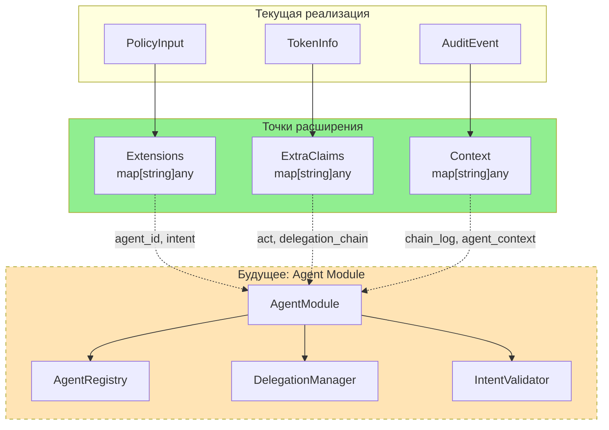
```mermaid
flowchart TB
    subgraph Current["Текущая реализация"]
        PI["PolicyInput"]
        TI["TokenInfo"]
        AE["AuditEvent"]
    end

    subgraph Extensions["Точки расширения"]
        E1["Extensions<br/>map[string]any"]
        E2["ExtraClaims<br/>map[string]any"]
        E3["Context<br/>map[string]any"]
    end

    subgraph Future["Будущее: Agent Module"]
        AM["AgentModule"]
        AR["AgentRegistry"]
        DM["DelegationManager"]
        IV["IntentValidator"]
    end

    PI --> E1
    TI --> E2
    AE --> E3

    E1 -.->|"agent_id, intent"| AM
    E2 -.->|"act, delegation_chain"| AM
    E3 -.->|"chain_log, agent_context"| AM

    AM --> AR
    AM --> DM
    AM --> IV

    style Extensions fill:#90EE90
    style Future fill:#FFE4B5,stroke-dasharray: 5 5
```

### 4.9. Reverse Proxy (FR-PROXY)

| ID | Требование | Приоритет | Описание |
|----|------------|-----------|----------|
| FR-PROXY-01 | Reverse proxy mode | P0 | Проксирование авторизованных запросов к upstream |
| FR-PROXY-02 | Multiple upstreams | P0 | Поддержка нескольких backend сервисов |
| FR-PROXY-03 | Routing rules | P0 | Маршрутизация по path, method, headers |
| FR-PROXY-04 | Path rewriting | P1 | Strip prefix, rewrite prefix |
| FR-PROXY-05 | Header manipulation | P0 | Добавление/удаление headers |
| FR-PROXY-06 | User info injection | P0 | Автоматическое добавление X-User-ID, X-User-Roles |
| FR-PROXY-07 | mTLS to upstream | P1 | TLS/mTLS соединения к backend |
| FR-PROXY-08 | Connection pooling | P1 | Переиспользование соединений |
| FR-PROXY-09 | Health checks | P2 | Проверка доступности upstream |
| FR-PROXY-10 | Circuit breaker | P2 | Защита от каскадных отказов |

#### Архитектура Reverse Proxy

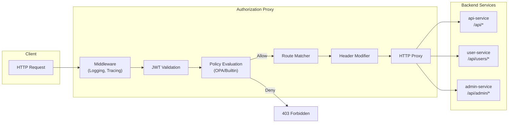
```mermaid
flowchart LR
    subgraph Client
        Request["HTTP Request"]
    end

    subgraph AuthZProxy["Authorization Proxy"]
        Middleware["Middleware<br/>(Logging, Tracing)"]
        JWT["JWT Validation"]
        Policy["Policy Evaluation<br/>(OPA/Builtin)"]
        Router["Route Matcher"]
        HeaderMod["Header Modifier"]
        Proxy["HTTP Proxy"]
    end

    subgraph Upstreams["Backend Services"]
        API["api-service<br/>/api/*"]
        Users["user-service<br/>/api/users/*"]
        Admin["admin-service<br/>/api/admin/*"]
    end

    Request --> Middleware
    Middleware --> JWT
    JWT --> Policy
    Policy -->|Deny| Denied["403 Forbidden"]
    Policy -->|Allow| Router
    Router --> HeaderMod
    HeaderMod --> Proxy
    Proxy --> API
    Proxy --> Users
    Proxy --> Admin
```

#### Конфигурация Proxy

```yaml
proxy:
  enabled: true
  mode: "reverse_proxy"

  # Default upstream
  upstream:
    url: "http://api-service:8080"
    timeout: 30s
    tls:
      enabled: false

  # Named upstreams
  upstreams:
    user-service:
      url: "http://user-service:8080"
      timeout: 15s
    admin-service:
      url: "https://admin-service:8443"
      timeout: 30s
      tls:
        enabled: true
        ca_cert: "/etc/ssl/certs/ca.crt"

  # Routing rules (evaluated in order)
  routes:
    - path_prefix: "/api/users"
      upstream: "user-service"
      methods: ["GET", "POST", "PUT", "DELETE"]

    - path_prefix: "/api/admin"
      upstream: "admin-service"
      strip_prefix: "/api/admin"
      rewrite_prefix: "/admin"

    - path_prefix: "/api"
      upstream: "default"

  # Header manipulation
  headers:
    add:
      X-Forwarded-By: "authz-proxy"
    remove:
      - "X-Internal-Token"
    add_user_info: true
    user_id_header: "X-User-ID"
    user_roles_header: "X-User-Roles"
    preserve_host: true

  # Connection settings
  max_idle_conns: 100
  idle_conn_timeout: 90s
```

#### Sequence: Proxy Request Flow

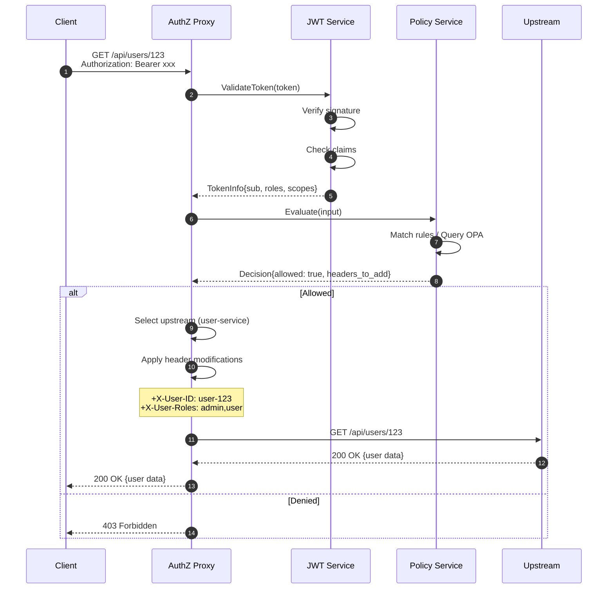
```mermaid
sequenceDiagram
    autonumber
    participant Client
    participant Proxy as AuthZ Proxy
    participant JWT as JWT Service
    participant Policy as Policy Service
    participant Upstream

    Client->>Proxy: GET /api/users/123<br/>Authorization: Bearer xxx

    Proxy->>JWT: ValidateToken(token)
    JWT->>JWT: Verify signature
    JWT->>JWT: Check claims
    JWT-->>Proxy: TokenInfo{sub, roles, scopes}

    Proxy->>Policy: Evaluate(input)
    Policy->>Policy: Match rules / Query OPA
    Policy-->>Proxy: Decision{allowed: true, headers_to_add}

    alt Allowed
        Proxy->>Proxy: Select upstream (user-service)
        Proxy->>Proxy: Apply header modifications
        Note over Proxy: +X-User-ID: user-123<br/>+X-User-Roles: admin,user
        Proxy->>Upstream: GET /api/users/123
        Upstream-->>Proxy: 200 OK {user data}
        Proxy-->>Client: 200 OK {user data}
    else Denied
        Proxy-->>Client: 403 Forbidden
    end
```

### 4.10. Egress Proxy (FR-EGRESS)

> **Контекст:** Egress Proxy позволяет внутренним сервисам обращаться к внешним системам
> через единую точку с централизованным управлением credentials и аутентификацией.

| ID | Требование | Приоритет | Описание |
|----|------------|-----------|----------|
| FR-EGRESS-01 | Egress proxy mode | P0 | Проксирование исходящих запросов к внешним системам |
| FR-EGRESS-02 | OAuth2 Client Credentials | P0 | Автоматическое получение токенов через client_credentials flow |
| FR-EGRESS-03 | Token caching | P0 | Кеширование токенов с автоматическим refresh |
| FR-EGRESS-04 | Multiple targets | P0 | Поддержка нескольких внешних систем |
| FR-EGRESS-05 | API Key injection | P1 | Добавление статических API ключей |
| FR-EGRESS-06 | mTLS к внешним системам | P1 | Client certificate authentication |
| FR-EGRESS-07 | Service Account auth | P1 | GCP/AWS service account authentication |
| FR-EGRESS-08 | Credential rotation | P2 | Автоматическая ротация credentials |
| FR-EGRESS-09 | Egress audit logging | P0 | Логирование всех исходящих запросов |
| FR-EGRESS-10 | Rate limiting к targets | P2 | Ограничение запросов к внешним API |

#### Архитектура Egress Proxy

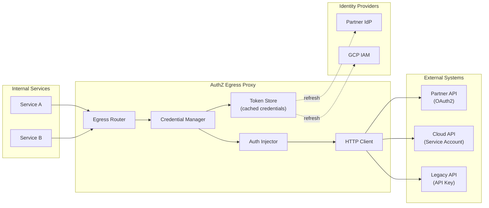
```mermaid
flowchart LR
    subgraph Internal["Internal Services"]
        ServiceA["Service A"]
        ServiceB["Service B"]
    end

    subgraph EgressProxy["AuthZ Egress Proxy"]
        Router["Egress Router"]
        CredMgr["Credential Manager"]
        TokenStore["Token Store<br/>(cached credentials)"]
        AuthInject["Auth Injector"]
        Proxy["HTTP Client"]
    end

    subgraph External["External Systems"]
        PartnerAPI["Partner API<br/>(OAuth2)"]
        CloudAPI["Cloud API<br/>(Service Account)"]
        LegacyAPI["Legacy API<br/>(API Key)"]
    end

    subgraph IdPs["Identity Providers"]
        PartnerIdP["Partner IdP"]
        GCP["GCP IAM"]
    end

    ServiceA --> Router
    ServiceB --> Router
    Router --> CredMgr
    CredMgr --> TokenStore
    TokenStore -.->|refresh| PartnerIdP
    TokenStore -.->|refresh| GCP
    CredMgr --> AuthInject
    AuthInject --> Proxy
    Proxy --> PartnerAPI
    Proxy --> CloudAPI
    Proxy --> LegacyAPI
```

#### Поддерживаемые типы аутентификации

| Тип | Описание | Параметры |
|-----|----------|-----------|
| `oauth2_client_credentials` | OAuth2 Client Credentials flow | token_url, client_id, client_secret, scopes |
| `oauth2_refresh_token` | OAuth2 с refresh token | token_url, client_id, refresh_token |
| `gcp_service_account` | Google Cloud Service Account | credentials_file, scopes |
| `aws_iam` | AWS IAM (STS AssumeRole) | role_arn, region |
| `api_key` | Статический API ключ | header/query, key |
| `mtls` | Mutual TLS | client_cert, client_key |
| `basic` | HTTP Basic Auth | username, password |
| `bearer` | Статический Bearer token | token |

#### Конфигурация Egress Proxy

```yaml
egress:
  enabled: true

  # Внешние системы (targets)
  targets:
    # OAuth2 Client Credentials
    partner-api:
      url: "https://api.partner.com"
      timeout: 30s
      auth:
        type: "oauth2_client_credentials"
        token_url: "https://auth.partner.com/oauth/token"
        client_id: "${PARTNER_CLIENT_ID}"
        client_secret: "${PARTNER_CLIENT_SECRET}"
        scopes: ["api:read", "api:write"]
        # Refresh token before expiry (default: 60s)
        refresh_before_expiry: 60s

    # GCP Service Account
    gcp-storage:
      url: "https://storage.googleapis.com"
      timeout: 60s
      auth:
        type: "gcp_service_account"
        credentials_file: "/etc/gcp/service-account.json"
        scopes:
          - "https://www.googleapis.com/auth/cloud-platform"
          - "https://www.googleapis.com/auth/devstorage.read_write"

    # AWS IAM
    aws-s3:
      url: "https://s3.amazonaws.com"
      auth:
        type: "aws_iam"
        region: "us-east-1"
        role_arn: "arn:aws:iam::123456789:role/external-access"

    # API Key
    legacy-system:
      url: "https://legacy.internal.com"
      timeout: 15s
      auth:
        type: "api_key"
        header: "X-API-Key"
        key: "${LEGACY_API_KEY}"

    # mTLS
    secure-partner:
      url: "https://secure.partner.com"
      auth:
        type: "mtls"
        client_cert: "/etc/certs/client.crt"
        client_key: "/etc/certs/client.key"
        ca_cert: "/etc/certs/partner-ca.crt"

    # Basic Auth
    basic-api:
      url: "https://api.example.com"
      auth:
        type: "basic"
        username: "${BASIC_USER}"
        password: "${BASIC_PASSWORD}"

  # Маршрутизация исходящих запросов
  routes:
    - path_prefix: "/egress/partner"
      target: "partner-api"
      strip_prefix: "/egress/partner"

    - path_prefix: "/egress/gcp"
      target: "gcp-storage"
      strip_prefix: "/egress/gcp"

    - path_prefix: "/egress/legacy"
      target: "legacy-system"
      strip_prefix: "/egress/legacy"
      rewrite_prefix: "/api/v1"

  # Глобальные настройки
  defaults:
    timeout: 30s
    retry:
      max_attempts: 3
      initial_backoff: 100ms
      max_backoff: 2s

  # Token store настройки
  token_store:
    type: "memory"  # memory | redis
    redis:
      address: "redis:6379"
      key_prefix: "egress:tokens:"
```

#### Sequence: Egress Request Flow

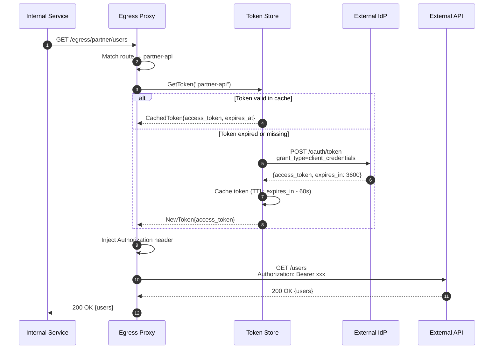
```mermaid
sequenceDiagram
    autonumber
    participant Service as Internal Service
    participant Proxy as Egress Proxy
    participant Store as Token Store
    participant IdP as External IdP
    participant API as External API

    Service->>Proxy: GET /egress/partner/users
    Proxy->>Proxy: Match route → partner-api

    Proxy->>Store: GetToken("partner-api")

    alt Token valid in cache
        Store-->>Proxy: CachedToken{access_token, expires_at}
    else Token expired or missing
        Store->>IdP: POST /oauth/token<br/>grant_type=client_credentials
        IdP-->>Store: {access_token, expires_in: 3600}
        Store->>Store: Cache token (TTL: expires_in - 60s)
        Store-->>Proxy: NewToken{access_token}
    end

    Proxy->>Proxy: Inject Authorization header
    Proxy->>API: GET /users<br/>Authorization: Bearer xxx
    API-->>Proxy: 200 OK {users}
    Proxy-->>Service: 200 OK {users}
```

#### Credential Manager Interface

```go
// internal/service/egress/credentials.go

// CredentialProvider получает credentials для target
type CredentialProvider interface {
    // GetCredentials возвращает актуальные credentials
    GetCredentials(ctx context.Context, targetName string) (*Credentials, error)

    // RefreshCredentials принудительно обновляет credentials
    RefreshCredentials(ctx context.Context, targetName string) (*Credentials, error)

    // Health проверяет доступность provider
    Health(ctx context.Context) error
}

// Credentials представляет полученные credentials
type Credentials struct {
    Type        CredentialType    // oauth2, api_key, mtls, etc.
    AccessToken string            // For OAuth2/Bearer
    ExpiresAt   time.Time         // Token expiration
    Headers     map[string]string // Headers to inject
    TLSConfig   *tls.Config       // For mTLS
}

// CredentialType определяет тип credential
type CredentialType string

const (
    CredentialTypeOAuth2      CredentialType = "oauth2"
    CredentialTypeAPIKey      CredentialType = "api_key"
    CredentialTypeMTLS        CredentialType = "mtls"
    CredentialTypeBasic       CredentialType = "basic"
    CredentialTypeBearer      CredentialType = "bearer"
    CredentialTypeGCP         CredentialType = "gcp_service_account"
    CredentialTypeAWS         CredentialType = "aws_iam"
)
```

#### Диаграмма компонентов Egress

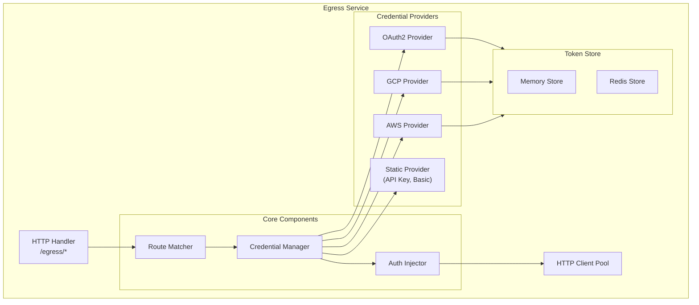
```mermaid
flowchart TB
    subgraph EgressService["Egress Service"]
        Handler["HTTP Handler<br/>/egress/*"]

        subgraph Core["Core Components"]
            Router["Route Matcher"]
            CredManager["Credential Manager"]
            AuthInjector["Auth Injector"]
        end

        subgraph Providers["Credential Providers"]
            OAuth2["OAuth2 Provider"]
            GCPProvider["GCP Provider"]
            AWSProvider["AWS Provider"]
            StaticProvider["Static Provider<br/>(API Key, Basic)"]
        end

        subgraph Store["Token Store"]
            MemoryStore["Memory Store"]
            RedisStore["Redis Store"]
        end

        HTTPClient["HTTP Client Pool"]
    end

    Handler --> Router
    Router --> CredManager
    CredManager --> OAuth2
    CredManager --> GCPProvider
    CredManager --> AWSProvider
    CredManager --> StaticProvider

    OAuth2 --> Store
    GCPProvider --> Store
    AWSProvider --> Store

    CredManager --> AuthInjector
    AuthInjector --> HTTPClient
```

#### Audit Events для Egress

```go
// Egress audit event
type EgressAuditEvent struct {
    Timestamp   time.Time `json:"timestamp"`
    EventID     string    `json:"event_id"`
    EventType   string    `json:"event_type"` // EGRESS_REQUEST

    // Source (internal service)
    Source      SourceInfo `json:"source"`

    // Target (external system)
    Target      TargetInfo `json:"target"`

    // Request details
    Request     RequestInfo `json:"request"`

    // Response details
    Response    ResponseInfo `json:"response"`

    // Credential info (masked)
    Credential  CredentialInfo `json:"credential"`

    // Timing
    Duration    time.Duration `json:"duration_ms"`
}

type TargetInfo struct {
    Name    string `json:"name"`    // partner-api
    URL     string `json:"url"`     // https://api.partner.com
    Type    string `json:"type"`    // oauth2_client_credentials
}

type CredentialInfo struct {
    Type       string    `json:"type"`        // oauth2
    TokenHash  string    `json:"token_hash"`  // sha256 первых 8 символов
    ExpiresAt  time.Time `json:"expires_at"`
    FromCache  bool      `json:"from_cache"`
}
```

---

## 5. API Specification

### 5.1. gRPC API (Envoy ext_authz) — ОПЦИОНАЛЬНО

> **Когда включать:** Только при использовании Istio/Envoy service mesh.
> При работе без service mesh можно использовать только HTTP REST API.

```protobuf
// api/proto/envoy/service/auth/v3/external_auth.proto
// Стандартный Envoy ext_authz API

syntax = "proto3";

package envoy.service.auth.v3;

service Authorization {
  // Основной метод проверки авторизации
  rpc Check(CheckRequest) returns (CheckResponse);
}

message CheckRequest {
  AttributeContext attributes = 1;
}

message CheckResponse {
  Status status = 1;
  OkHttpResponse ok_response = 2;
  DeniedHttpResponse denied_response = 3;
  DynamicMetadata dynamic_metadata = 4;
}
```

### 5.2. HTTP REST API

#### 5.2.1. Authorization Check

```yaml
# POST /v1/authorize
# Проверка авторизации

Request:
  Content-Type: application/json
  Body:
    request:
      method: string        # HTTP method
      path: string          # Request path
      headers: object       # HTTP headers
    source:
      principal: string     # SPIFFE ID (optional)
    token: string           # JWT token (optional, can be in headers)

Response (200 OK):
  allow: boolean
  reasons: string[]
  headers_to_add: object
  headers_to_remove: string[]

Response (401 Unauthorized):
  error: "invalid_token"
  error_description: string

Response (403 Forbidden):
  error: "access_denied"
  reasons: string[]
```

#### 5.2.2. Token Exchange

```yaml
# POST /v1/token/exchange
# Обмен токена для delegation

Request:
  Content-Type: application/x-www-form-urlencoded
  Body:
    grant_type: "urn:ietf:params:oauth:grant-type:token-exchange"
    subject_token: string      # Original token
    subject_token_type: string # "urn:ietf:params:oauth:token-type:access_token"
    audience: string           # Target service
    scope: string              # Requested scopes (optional)

Response (200 OK):
  access_token: string
  issued_token_type: string
  token_type: "Bearer"
  expires_in: integer

Response (400 Bad Request):
  error: "invalid_request" | "invalid_target" | "invalid_scope"
  error_description: string
```

#### 5.2.3. Batch Authorization

```yaml
# POST /v1/authorize/batch
# Пакетная проверка авторизации

Request:
  Content-Type: application/json
  Body:
    token: string
    checks:
      - id: string
        method: string
        path: string
        resource: object

Response (200 OK):
  results:
    - id: string
      allow: boolean
      reason: string
```

#### 5.2.4. Health & Admin

```yaml
# GET /health
# Health check
Response (200 OK):
  status: "healthy"
  components:
    opa: "healthy" | "unhealthy" | "degraded"
    redis: "healthy" | "unhealthy"
    keycloak: "healthy" | "unhealthy"

# GET /ready
# Readiness probe
Response (200 OK): {}
Response (503 Service Unavailable): {}

# GET /metrics
# Prometheus metrics
Response (200 OK):
  Content-Type: text/plain
  Body: # Prometheus format
```

### 5.3. Internal gRPC API — ОПЦИОНАЛЬНО

> **Примечание:** Этот API опционален. Все функции также доступны через HTTP REST API.

```protobuf
// api/proto/authz/v1/authz.proto
// Внутренний API для сервисов (опционально)

syntax = "proto3";

package authz.v1;

service AuthorizationService {
  // Проверка авторизации
  rpc Authorize(AuthorizeRequest) returns (AuthorizeResponse);

  // Пакетная проверка
  rpc AuthorizeBatch(AuthorizeBatchRequest) returns (AuthorizeBatchResponse);

  // Обмен токена
  rpc ExchangeToken(ExchangeTokenRequest) returns (ExchangeTokenResponse);

  // Инвалидация кеша
  rpc InvalidateCache(InvalidateCacheRequest) returns (InvalidateCacheResponse);
}

message AuthorizeRequest {
  string token = 1;
  RequestContext request = 2;
  SourceContext source = 3;
}

message RequestContext {
  string method = 1;
  string path = 2;
  map<string, string> headers = 3;
  bytes body = 4;
}

message SourceContext {
  string principal = 1;  // SPIFFE ID
  string namespace = 2;
  string service_account = 3;
}

message AuthorizeResponse {
  bool allow = 1;
  repeated string reasons = 2;
  map<string, string> headers_to_add = 3;
  repeated string headers_to_remove = 4;
  DecisionMetadata metadata = 5;
}

message DecisionMetadata {
  string decision_id = 1;
  string policy_version = 2;
  bool cached = 3;
  int64 evaluation_time_ns = 4;
}
```

---

## 6. Компоненты системы

### 6.1. JWT Service

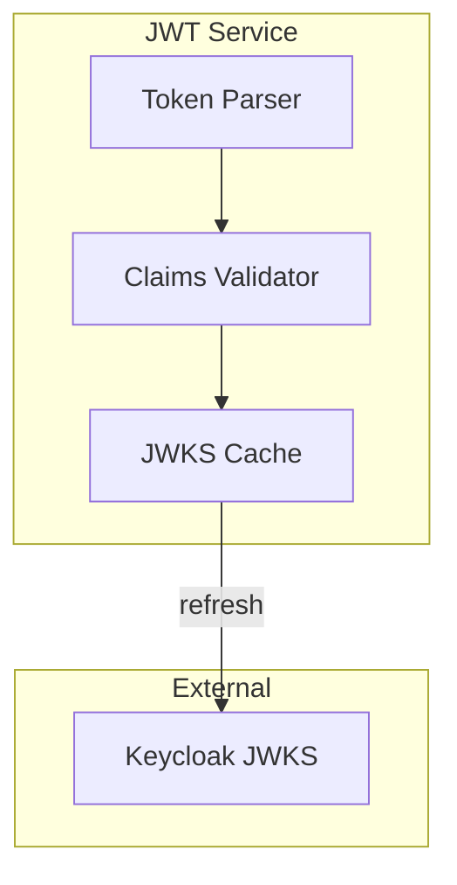
```mermaid
flowchart TB
    subgraph JWTService["JWT Service"]
        Parser["Token Parser"]
        Validator["Claims Validator"]
        JWKSCache["JWKS Cache"]

        Parser --> Validator
        Validator --> JWKSCache
    end

    subgraph External["External"]
        Keycloak["Keycloak JWKS"]
    end

    JWKSCache -->|refresh| Keycloak
```

**Responsibilities:**
- Парсинг JWT токенов
- Валидация подписи (RS256, ES256)
- Проверка claims (iss, aud, exp, nbf)
- Кеширование JWKS с автообновлением
- Извлечение claims для policy evaluation

**Configuration:**

```yaml
jwt:
  issuers:
    - name: keycloak
      issuer_url: https://keycloak.example.com/realms/corp
      jwks_url: https://keycloak.example.com/realms/corp/protocol/openid-connect/certs
      audience: ["authz-service"]
      algorithms: ["RS256"]

  jwks_cache:
    refresh_interval: 1h
    refresh_timeout: 10s
    min_refresh_interval: 5m

  validation:
    clock_skew: 30s
    require_expiration: true
    require_not_before: false
```

### 6.2. Policy Service

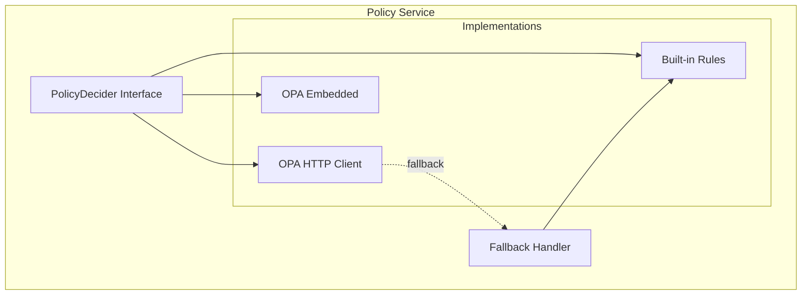
```mermaid
flowchart TB
    subgraph PolicyService["Policy Service"]
        Interface["PolicyDecider Interface"]

        subgraph Implementations["Implementations"]
            OPAClient["OPA HTTP Client"]
            OPAEmbedded["OPA Embedded"]
            BuiltIn["Built-in Rules"]
        end

        Fallback["Fallback Handler"]
    end

    Interface --> OPAClient
    Interface --> OPAEmbedded
    Interface --> BuiltIn
    OPAClient -.->|fallback| Fallback
    Fallback --> BuiltIn
```

**Interface:**

```go
type PolicyDecider interface {
    Decide(ctx context.Context, input *PolicyInput) (*Decision, error)
    Health(ctx context.Context) error
    Close() error
}

type PolicyInput struct {
    Request     RequestInfo
    Source      SourceInfo
    Destination DestinationInfo
    Token       TokenInfo
    Context     ContextInfo
}

type Decision struct {
    Allow   bool
    Reasons []string
    Headers map[string]string
}
```

### 6.3. Cache Service

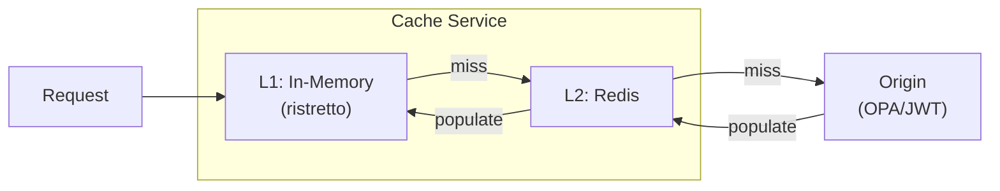
```mermaid
flowchart LR
    subgraph CacheService["Cache Service"]
        L1["L1: In-Memory<br/>(ristretto)"]
        L2["L2: Redis"]
    end

    Request["Request"] --> L1
    L1 -->|miss| L2
    L2 -->|miss| Origin["Origin<br/>(OPA/JWT)"]

    Origin -->|populate| L2
    L2 -->|populate| L1
```

**Cache Keys:**

| Cache Type | Key Format | TTL |
|------------|------------|-----|
| Authorization | `authz:v{ver}:{hash(input)}` | 60s |
| JWT Validation | `jwt:{token_hash}` | token exp |
| JWKS | `jwks:{issuer_hash}` | 1h |

**Configuration:**

```yaml
cache:
  l1:
    enabled: true
    max_size: 10000
    ttl: 10s

  l2:
    enabled: true
    backend: redis
    redis:
      addresses: ["redis:6379"]
      password: "${REDIS_PASSWORD}"
      db: 0
      pool_size: 100

    ttl:
      authorization: 60s
      jwt: 300s
      jwks: 3600s

    key_prefix: "authz:"
```

### 6.4. Token Exchange Service

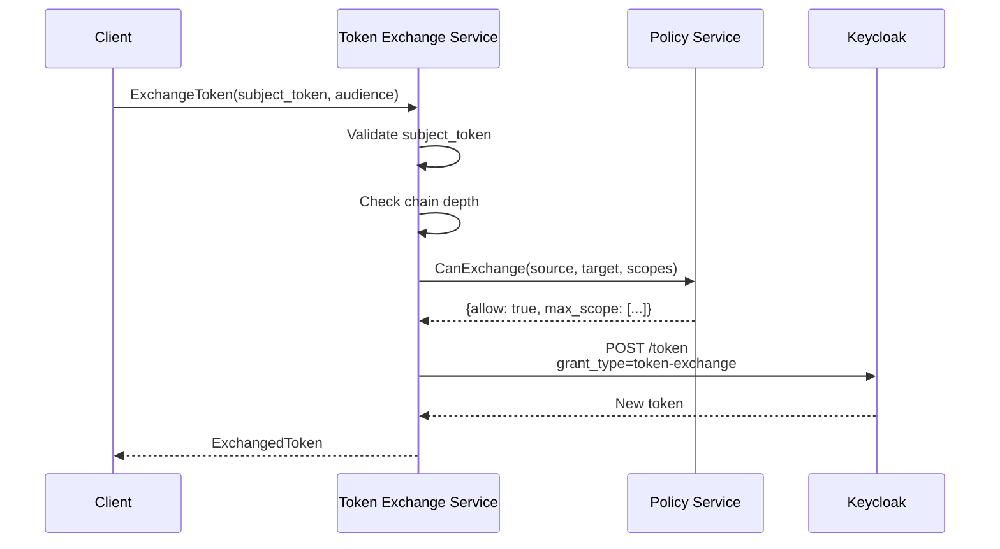
```mermaid
sequenceDiagram
    participant Client
    participant ExchangeService as Token Exchange Service
    participant Policy as Policy Service
    participant Keycloak

    Client->>ExchangeService: ExchangeToken(subject_token, audience)

    ExchangeService->>ExchangeService: Validate subject_token
    ExchangeService->>ExchangeService: Check chain depth

    ExchangeService->>Policy: CanExchange(source, target, scopes)
    Policy-->>ExchangeService: {allow: true, max_scope: [...]}

    ExchangeService->>Keycloak: POST /token<br/>grant_type=token-exchange
    Keycloak-->>ExchangeService: New token

    ExchangeService-->>Client: ExchangedToken
```

**Configuration:**

```yaml
token_exchange:
  enabled: true
  max_chain_depth: 3

  keycloak:
    token_url: https://keycloak.example.com/realms/corp/protocol/openid-connect/token
    client_id: authz-service
    client_secret: "${KEYCLOAK_CLIENT_SECRET}"
    timeout: 5s

  allowed_audiences:
    service-a:
      - service-b
      - service-c
    service-b:
      - service-c

  scope_restrictions:
    default_downscope: true
    max_scope_per_target:
      service-b: ["read", "write"]
      service-c: ["read"]
```

### 6.5. Audit Service

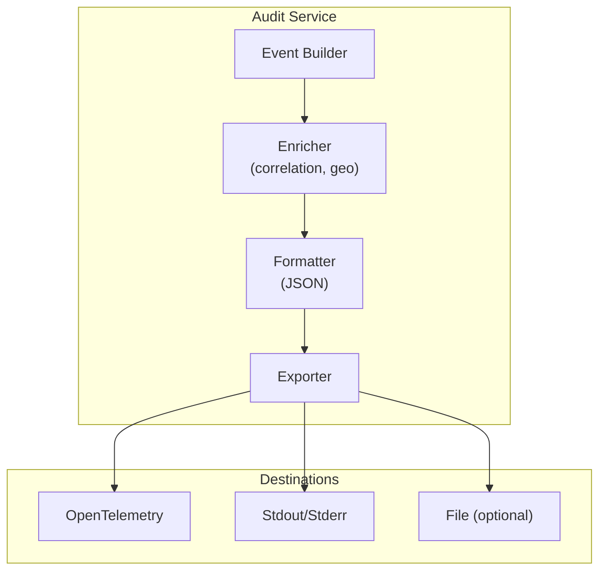
```mermaid
flowchart TB
    subgraph AuditService["Audit Service"]
        EventBuilder["Event Builder"]
        Enricher["Enricher<br/>(correlation, geo)"]
        Formatter["Formatter<br/>(JSON)"]
        Exporter["Exporter"]
    end

    subgraph Destinations["Destinations"]
        OTel["OpenTelemetry"]
        Stdout["Stdout/Stderr"]
        File["File (optional)"]
    end

    EventBuilder --> Enricher
    Enricher --> Formatter
    Formatter --> Exporter

    Exporter --> OTel
    Exporter --> Stdout
    Exporter --> File
```

**Audit Event Schema:**

```go
type AuditEvent struct {
    Timestamp   time.Time              `json:"timestamp"`
    EventID     string                 `json:"event_id"`
    EventType   string                 `json:"event_type"`

    Subject     SubjectInfo            `json:"subject"`
    Actor       *ActorInfo             `json:"actor,omitempty"`
    Resource    ResourceInfo           `json:"resource"`
    Action      string                 `json:"action"`

    Decision    DecisionInfo           `json:"decision"`
    Context     ContextInfo            `json:"context"`
    Metadata    map[string]interface{} `json:"metadata,omitempty"`
}

type DecisionInfo struct {
    Allowed       bool     `json:"allowed"`
    Reasons       []string `json:"reasons,omitempty"`
    PolicyVersion string   `json:"policy_version"`
    Cached        bool     `json:"cached"`
    DurationMs    float64  `json:"duration_ms"`
}
```

---

## 7. Интеграции

### 7.1. Keycloak Integration

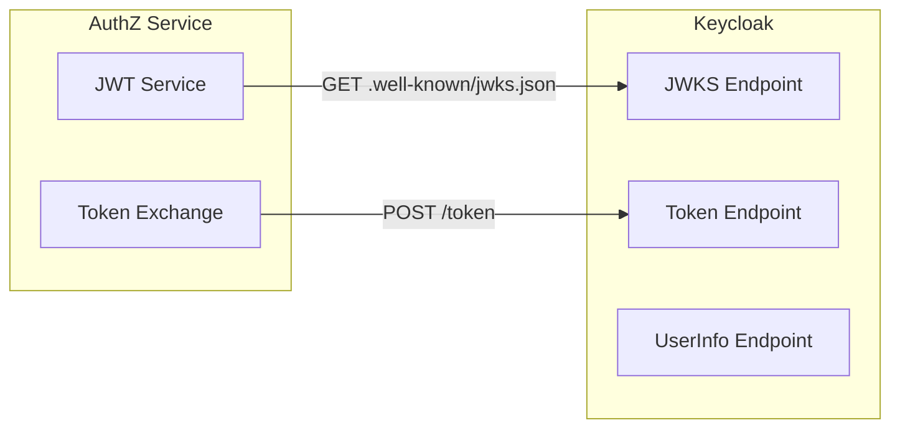
```mermaid
flowchart LR
    subgraph AuthZService["AuthZ Service"]
        JWTService["JWT Service"]
        TokenExchange["Token Exchange"]
    end

    subgraph Keycloak["Keycloak"]
        JWKS["JWKS Endpoint"]
        TokenEndpoint["Token Endpoint"]
        UserInfo["UserInfo Endpoint"]
    end

    JWTService -->|GET .well-known/jwks.json| JWKS
    TokenExchange -->|POST /token| TokenEndpoint
```

**Required Keycloak Configuration:**
- Client: `authz-service` (confidential)
- Roles: Token exchange enabled
- Permissions: token-exchange scope

### 7.2. OPA Integration

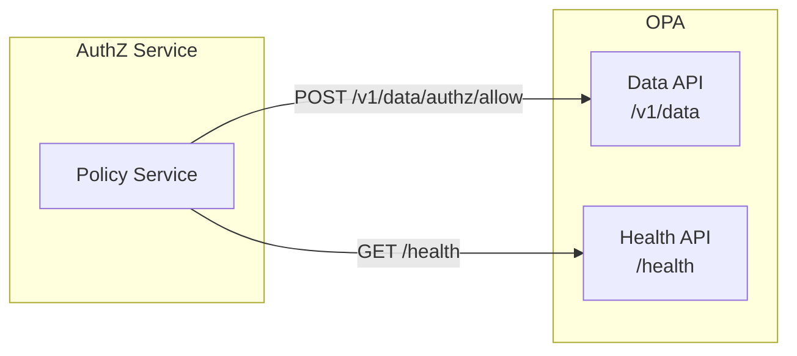
```mermaid
flowchart LR
    subgraph AuthZService["AuthZ Service"]
        PolicyService["Policy Service"]
    end

    subgraph OPA["OPA"]
        DataAPI["Data API<br/>/v1/data"]
        HealthAPI["Health API<br/>/health"]
    end

    PolicyService -->|POST /v1/data/authz/allow| DataAPI
    PolicyService -->|GET /health| HealthAPI
```

**OPA Input Format:**

```json
{
  "input": {
    "request": {
      "method": "GET",
      "path": "/api/v1/users/123",
      "headers": {"authorization": "Bearer ..."}
    },
    "source": {
      "principal": "spiffe://domain/ns/prod/sa/service-a"
    },
    "token": {
      "valid": true,
      "payload": {
        "sub": "user-123",
        "roles": ["user"],
        "scope": "read write"
      }
    }
  }
}
```

### 7.3. Redis Integration

```mermaid
flowchart LR
    subgraph AuthZService["AuthZ Service"]
        CacheService["Cache Service"]
    end

    subgraph Redis["Redis Cluster"]
        Master["Master"]
        Replica1["Replica 1"]
        Replica2["Replica 2"]
    end

    CacheService -->|write| Master
    CacheService -->|read| Replica1
    CacheService -->|read| Replica2
```

**Redis Commands Used:**
- `GET`, `SET`, `SETEX` — basic caching
- `DEL`, `SCAN` — invalidation
- `PING` — health check

### 7.4. OpenTelemetry Integration

```mermaid
flowchart TB
    subgraph AuthZService["AuthZ Service"]
        Traces["Traces"]
        Metrics["Metrics"]
        Logs["Logs"]
    end

    subgraph OTelCollector["OTel Collector"]
        Receiver["OTLP Receiver"]
        Processor["Processor"]
        Exporter["Exporter"]
    end

    subgraph Backends["Backends"]
        Jaeger["Jaeger/Tempo"]
        Prometheus["Prometheus"]
        Loki["Loki"]
    end

    Traces --> Receiver
    Metrics --> Receiver
    Logs --> Receiver

    Receiver --> Processor
    Processor --> Exporter

    Exporter --> Jaeger
    Exporter --> Prometheus
    Exporter --> Loki
```

---

## 8. Конфигурация

### 8.1. Полная конфигурация приложения

```yaml
# config/config.yaml

# Server configuration
server:
  http:
    enabled: true  # Основной протокол
    addr: ":8080"
    read_timeout: 10s
    write_timeout: 10s
    idle_timeout: 120s
    max_header_bytes: 1048576

  # gRPC — ОПЦИОНАЛЬНО (только для Istio/Envoy)
  grpc:
    enabled: false  # По умолчанию выключен
    addr: ":9090"
    max_recv_msg_size: 4194304
    max_send_msg_size: 4194304
    keepalive:
      time: 30s
      timeout: 10s

# JWT configuration
jwt:
  issuers:
    - name: keycloak
      issuer_url: https://keycloak.example.com/realms/corp
      jwks_url: https://keycloak.example.com/realms/corp/protocol/openid-connect/certs
      audience: ["authz-service"]
      algorithms: ["RS256"]

  jwks_cache:
    refresh_interval: 1h
    refresh_timeout: 10s

  validation:
    clock_skew: 30s
    require_expiration: true

# Policy engine configuration
policy:
  # Engine: builtin | opa-sidecar | opa-embedded
  engine: opa-sidecar

  opa:
    url: http://localhost:8181
    policy_path: /v1/data/authz/allow
    timeout: 10ms
    retry:
      max_attempts: 3
      initial_backoff: 1ms
      max_backoff: 10ms

  opa_embedded:
    bundle_path: /etc/opa/bundle.tar.gz
    decision_path: authz/allow

  builtin:
    rules_path: /etc/authz/rules.yaml

  fallback:
    enabled: true
    engine: builtin
    behavior: deny

# Cache configuration
cache:
  l1:
    enabled: true
    max_size: 10000
    ttl: 10s

  l2:
    enabled: true
    backend: redis
    redis:
      addresses: ["redis:6379"]
      password: "${REDIS_PASSWORD}"
      db: 0
      pool_size: 100
      read_timeout: 100ms
      write_timeout: 100ms

    ttl:
      authorization: 60s
      jwt: 300s
      jwks: 3600s

    key_prefix: "authz:"

# Token exchange configuration
token_exchange:
  enabled: true
  max_chain_depth: 3

  keycloak:
    token_url: https://keycloak.example.com/realms/corp/protocol/openid-connect/token
    client_id: authz-service
    client_secret: "${KEYCLOAK_CLIENT_SECRET}"
    timeout: 5s

# Audit configuration
audit:
  enabled: true

  events:
    - AUTHZ_DECISION
    - TOKEN_EXCHANGE
    - CACHE_INVALIDATION

  export:
    otlp:
      enabled: true
      endpoint: otel-collector:4317
      insecure: true

    stdout:
      enabled: true
      format: json

  enrichment:
    include_headers: ["x-request-id", "x-correlation-id"]
    mask_fields: ["authorization", "cookie"]

# Observability configuration
observability:
  metrics:
    enabled: true
    path: /metrics
    namespace: authz
    subsystem: service

  tracing:
    enabled: true
    exporter: otlp
    endpoint: otel-collector:4317
    sample_rate: 1.0
    service_name: authz-service

  logging:
    level: info
    format: json
    output: stdout

# Rate limiting
rate_limit:
  enabled: true
  requests_per_second: 10000
  burst: 1000

# Health check
health:
  check_interval: 10s
  timeout: 5s

  checks:
    - name: opa
      enabled: true
      critical: true
    - name: redis
      enabled: true
      critical: false
    - name: keycloak
      enabled: true
      critical: false
```

### 8.2. Environment Variables

```bash
# Server
AUTHZ_SERVER_HTTP_ADDR=:8080

# gRPC (опционально, для Istio/Envoy)
AUTHZ_SERVER_GRPC_ENABLED=false  # true для включения
AUTHZ_SERVER_GRPC_ADDR=:9090

# JWT
AUTHZ_JWT_ISSUER_URL=https://keycloak.example.com/realms/corp

# Policy
AUTHZ_POLICY_ENGINE=opa-sidecar
AUTHZ_POLICY_OPA_URL=http://localhost:8181

# Cache
AUTHZ_CACHE_REDIS_ADDRESSES=redis:6379
AUTHZ_CACHE_REDIS_PASSWORD=secret

# Keycloak
AUTHZ_KEYCLOAK_CLIENT_ID=authz-service
AUTHZ_KEYCLOAK_CLIENT_SECRET=secret

# Observability
AUTHZ_OTEL_ENDPOINT=otel-collector:4317
AUTHZ_LOG_LEVEL=info
```

---

## 9. Observability

### 9.1. Metrics

| Metric | Type | Labels | Description |
|--------|------|--------|-------------|
| `authz_requests_total` | Counter | `method`, `path`, `decision`, `cached` | Total authorization requests |
| `authz_request_duration_seconds` | Histogram | `method`, `engine` | Request duration |
| `authz_cache_hits_total` | Counter | `cache_type` | Cache hits |
| `authz_cache_misses_total` | Counter | `cache_type` | Cache misses |
| `authz_policy_evaluation_duration_seconds` | Histogram | `engine` | Policy evaluation time |
| `authz_jwt_validation_duration_seconds` | Histogram | `issuer` | JWT validation time |
| `authz_token_exchange_total` | Counter | `source`, `target`, `status` | Token exchanges |
| `authz_errors_total` | Counter | `type`, `component` | Errors by type |
| `authz_active_connections` | Gauge | `protocol` | Active connections |

### 9.2. Traces

**Span Naming Convention:**

```
authz.check                    # Root span for authorization check
├── authz.jwt.validate         # JWT validation
│   └── authz.jwks.fetch       # JWKS fetch (if needed)
├── authz.cache.get            # Cache lookup
├── authz.policy.evaluate      # Policy evaluation
│   └── authz.opa.query        # OPA query
├── authz.cache.set            # Cache update
└── authz.audit.log            # Audit logging
```

**Span Attributes:**

```go
// Security-related attributes
span.SetAttributes(
    attribute.String("authz.decision", "allow"),
    attribute.String("authz.user.id", userID),
    attribute.StringSlice("authz.user.roles", roles),
    attribute.String("authz.resource.method", method),
    attribute.String("authz.resource.path", path),
    attribute.Bool("authz.cached", cached),
    attribute.String("authz.policy.version", version),
)
```

### 9.3. Logging

**Log Levels:**

| Level | Usage |
|-------|-------|
| ERROR | Unrecoverable errors, system failures |
| WARN | Recoverable errors, degraded state |
| INFO | Authorization decisions, significant events |
| DEBUG | Detailed flow information |
| TRACE | Full request/response data (dev only) |

**Structured Log Format:**

```json
{
  "timestamp": "2024-12-17T10:30:00.123Z",
  "level": "INFO",
  "logger": "authz.handler",
  "message": "authorization decision",
  "trace_id": "abc123",
  "span_id": "def456",
  "request_id": "req-789",
  "fields": {
    "decision": "allow",
    "user_id": "user-123",
    "method": "GET",
    "path": "/api/users",
    "duration_ms": 2.5,
    "cached": false
  }
}
```

---

## 10. Безопасность

### 10.1. Security Requirements

| Requirement | Implementation |
|-------------|----------------|
| Input validation | Strict validation of all inputs |
| JWT validation | Signature + claims verification |
| mTLS support | TLS 1.3, client cert validation |
| Secrets management | Environment variables / Vault |
| Rate limiting | Per-client rate limits |
| Audit logging | All security events logged |

### 10.2. Secure Defaults

```yaml
security:
  # Reject tokens without expiration
  jwt:
    require_expiration: true
    max_token_age: 24h

  # Fail-closed on errors
  policy:
    fail_open: false

  # TLS configuration
  tls:
    min_version: "1.3"
    cipher_suites:
      - TLS_AES_256_GCM_SHA384
      - TLS_CHACHA20_POLY1305_SHA256

  # Rate limiting
  rate_limit:
    enabled: true
    default_rps: 1000
```

### 10.3. Input Validation

```go
// All inputs must be validated
type AuthorizeRequest struct {
    Token   string `validate:"required,jwt"`
    Method  string `validate:"required,oneof=GET POST PUT DELETE PATCH"`
    Path    string `validate:"required,uri"`
    Headers map[string]string `validate:"dive,keys,required,endkeys"`
}
```

---

## 11. Нефункциональные требования

### 11.1. Performance

| Metric | Target | Measurement |
|--------|--------|-------------|
| Authorization latency (p50) | < 2ms | With cache hit |
| Authorization latency (p99) | < 10ms | With cache miss |
| JWT validation | < 1ms | Cached JWKS |
| Throughput | 10,000 RPS | Per instance |
| Memory | < 256MB | Base + cache |
| CPU | < 500m | At 5000 RPS |

### 11.2. Reliability

| Metric | Target |
|--------|--------|
| Availability | 99.99% |
| Error rate | < 0.01% |
| Mean Time to Recovery | < 1 min |

### 11.3. Scalability

| Aspect | Requirement |
|--------|-------------|
| Horizontal scaling | Stateless, unlimited replicas |
| Connection pooling | Configurable pool sizes |
| Graceful shutdown | Drain connections before stop |

---

## 12. Структура проекта

```
authz-service/
├── cmd/
│   └── authz/
│       └── main.go                 # Application entrypoint
├── api/
│   └── proto/
│       ├── envoy/                  # Envoy ext_authz proto
│       └── authz/v1/               # Internal API proto
├── internal/
│   ├── app/
│   │   └── app.go                  # Application bootstrap
│   ├── config/
│   │   └── config.go               # Configuration loading
│   ├── domain/
│   │   ├── decision.go             # Decision entity
│   │   ├── token.go                # Token entity
│   │   └── audit.go                # Audit event entity
│   ├── usecase/
│   │   ├── authorize.go            # Authorization use case
│   │   ├── exchange.go             # Token exchange use case
│   │   └── health.go               # Health check use case
│   ├── transport/
│   │   ├── grpc/                   # (опционально, для Istio/Envoy)
│   │   │   ├── server.go           # gRPC server
│   │   │   ├── extauthz.go         # ext_authz handler
│   │   │   └── interceptors.go     # gRPC interceptors
│   │   └── http/                   # (основной протокол)
│   │       ├── server.go           # HTTP server
│   │       ├── handlers.go         # HTTP handlers
│   │       └── middleware.go       # HTTP middleware
│   ├── service/
│   │   ├── jwt/
│   │   │   ├── service.go          # JWT service
│   │   │   ├── validator.go        # Token validator
│   │   │   └── jwks.go             # JWKS cache
│   │   ├── policy/
│   │   │   ├── decider.go          # Policy decider interface
│   │   │   ├── opa.go              # OPA client
│   │   │   ├── embedded.go         # Embedded OPA
│   │   │   └── builtin.go          # Built-in rules
│   │   ├── cache/
│   │   │   ├── service.go          # Cache service
│   │   │   ├── redis.go            # Redis client
│   │   │   └── memory.go           # In-memory cache
│   │   ├── exchange/
│   │   │   └── service.go          # Token exchange service
│   │   └── audit/
│   │       ├── service.go          # Audit service
│   │       └── exporter.go         # Audit exporters
│   └── pkg/
│       ├── logger/                 # Structured logging
│       ├── metrics/                # Prometheus metrics
│       ├── tracing/                # OpenTelemetry tracing
│       └── errors/                 # Error types
├── pkg/
│   └── authzclient/                # Client library for other services
├── configs/
│   ├── config.yaml                 # Default configuration
│   └── rules.yaml                  # Built-in rules
├── deployments/
│   ├── docker/
│   │   └── Dockerfile
│   └── kubernetes/
│       ├── deployment.yaml
│       ├── service.yaml
│       ├── configmap.yaml
│       └── hpa.yaml
├── policies/
│   ├── authz.rego                  # Main authorization policy
│   ├── service_authz.rego          # S2S authorization
│   └── exchange.rego               # Token exchange policy
├── scripts/
│   ├── build.sh
│   └── test.sh
├── tests/
│   ├── integration/
│   └── e2e/
├── go.mod
├── go.sum
├── Makefile
└── README.md
```

---

## 13. Зависимости

### 13.1. Core Dependencies

```go
// go.mod

module github.com/your-org/authz-service

go 1.22

require (
    // HTTP (основной протокол)
    github.com/go-chi/chi/v5 v5.0.11

    // JWT
    github.com/golang-jwt/jwt/v5 v5.2.0
    github.com/coreos/go-oidc/v3 v3.9.0

    // Cache (L1)
    github.com/dgraph-io/ristretto v0.1.1

    // Observability
    go.opentelemetry.io/otel v1.22.0
    go.opentelemetry.io/otel/trace v1.22.0
    go.opentelemetry.io/otel/metric v1.22.0
    go.opentelemetry.io/otel/exporters/otlp/otlptrace/otlptracegrpc v1.22.0
    github.com/prometheus/client_golang v1.18.0
    go.uber.org/zap v1.26.0

    // Configuration
    github.com/spf13/viper v1.18.0

    // Validation
    github.com/go-playground/validator/v10 v10.17.0

    // Testing
    github.com/stretchr/testify v1.8.4
    github.com/golang/mock v1.6.0
)
```

### 13.2. Optional Dependencies

```go
// Опциональные зависимости (в зависимости от конфигурации)

require (
    // gRPC (опционально, для Istio/Envoy)
    google.golang.org/grpc v1.60.0
    google.golang.org/protobuf v1.32.0

    // OPA (опционально)
    github.com/open-policy-agent/opa v0.60.0

    // Redis (опционально, для L2 cache)
    github.com/redis/go-redis/v9 v9.4.0
)
```

### 13.3. Development Dependencies

```go
require (
    // Code generation
    github.com/vektra/mockery/v2 v2.40.0

    // Linting
    github.com/golangci/golangci-lint v1.55.0

    // Proto
    google.golang.org/grpc/cmd/protoc-gen-go-grpc v1.3.0
    google.golang.org/protobuf/cmd/protoc-gen-go v1.32.0
)
```

---

## 14. Этапы разработки

### 14.1. Roadmap

```mermaid
gantt
    title Go AuthZ Service Development
    dateFormat  YYYY-MM-DD

    section Phase 1: Core
    Project setup           :p1_1, 2024-01-01, 3d
    Domain models           :p1_2, after p1_1, 2d
    JWT Service             :p1_3, after p1_2, 5d
    Built-in Policy Engine  :p1_4, after p1_3, 3d
    gRPC ext_authz          :p1_5, after p1_4, 5d
    HTTP API                :p1_6, after p1_5, 3d
    Unit tests              :p1_7, after p1_6, 5d

    section Phase 2: Integration
    OPA Integration         :p2_1, after p1_7, 5d
    Redis Cache             :p2_2, after p2_1, 3d
    Token Exchange          :p2_3, after p2_2, 5d
    Integration tests       :p2_4, after p2_3, 5d

    section Phase 3: Observability
    Metrics                 :p3_1, after p2_4, 3d
    Tracing                 :p3_2, after p3_1, 3d
    Audit logging           :p3_3, after p3_2, 3d
    Dashboards              :p3_4, after p3_3, 2d

    section Phase 4: Production
    Kubernetes manifests    :p4_1, after p3_4, 3d
    Helm chart              :p4_2, after p4_1, 3d
    E2E tests               :p4_3, after p4_2, 5d
    Documentation           :p4_4, after p4_3, 3d
    Performance testing     :p4_5, after p4_4, 5d
```

### 14.2. Phase 1: Core (MVP)

**Deliverables:**
- [ ] Project scaffolding (structure, configs, Makefile)
- [ ] Domain models (Decision, Token, AuditEvent)
- [ ] JWT Service (parsing, validation, JWKS cache)
- [ ] Built-in Policy Engine (YAML rules)
- [ ] HTTP server with REST API (основной)
- [ ] gRPC server with ext_authz handler (опционально)
- [ ] Unit tests (>80% coverage)

**Success Criteria:**
- Can validate JWT tokens
- Can make authorization decisions with built-in rules
- HTTP REST API работает
- gRPC ext_authz работает (если включён)

### 14.3. Phase 2: Integration

**Deliverables:**
- [ ] OPA HTTP client integration
- [ ] OPA embedded integration
- [ ] Policy engine switching (config-based)
- [ ] Redis cache integration
- [ ] L1 in-memory cache
- [ ] Token Exchange with Keycloak
- [ ] Integration tests

**Success Criteria:**
- OPA-based authorization working
- Caching reduces latency
- Token exchange produces valid tokens

### 14.4. Phase 3: Observability

**Deliverables:**
- [ ] Prometheus metrics
- [ ] OpenTelemetry tracing
- [ ] Structured audit logging
- [ ] Grafana dashboards
- [ ] Alert rules

**Success Criteria:**
- All key metrics exposed
- Traces show full request flow
- Audit logs capture all decisions

### 14.5. Phase 4: Production Readiness

**Deliverables:**
- [ ] Dockerfile (multi-stage)
- [ ] Kubernetes manifests
- [ ] Helm chart
- [ ] E2E tests
- [ ] Performance tests
- [ ] Documentation
- [ ] Runbook

**Success Criteria:**
- Deploys to Kubernetes
- Meets performance targets
- Documentation complete

---

## Приложения

### A. Makefile

```makefile
.PHONY: build test lint proto run docker

# Build
build:
	go build -o bin/authz ./cmd/authz

# Test
test:
	go test -v -race -coverprofile=coverage.out ./...

test-integration:
	go test -v -tags=integration ./tests/integration/...

# Lint
lint:
	golangci-lint run

# Proto
proto:
	buf generate

# Run
run:
	go run ./cmd/authz

# Docker
docker-build:
	docker build -t authz-service:latest -f deployments/docker/Dockerfile .

docker-run:
	docker run -p 8080:8080 authz-service:latest

# С gRPC (опционально)
docker-run-grpc:
	docker run -p 8080:8080 -p 9090:9090 -e AUTHZ_SERVER_GRPC_ENABLED=true authz-service:latest

# Dev tools
tools:
	go install github.com/vektra/mockery/v2@latest
	go install github.com/golangci/golangci-lint/cmd/golangci-lint@latest

# Generate mocks
mocks:
	mockery --all --output=internal/mocks

# Clean
clean:
	rm -rf bin/ coverage.out
```

### B. Dockerfile

```dockerfile
# Build stage
FROM golang:1.22-alpine AS builder

WORKDIR /app

# Dependencies
COPY go.mod go.sum ./
RUN go mod download

# Source
COPY . .

# Build
RUN CGO_ENABLED=0 GOOS=linux go build -ldflags="-w -s" -o /authz ./cmd/authz

# Runtime stage
FROM alpine:3.19

RUN apk --no-cache add ca-certificates tzdata

WORKDIR /app

COPY --from=builder /authz .
COPY configs/config.yaml /etc/authz/config.yaml

USER nobody:nobody

EXPOSE 8080
# EXPOSE 9090  # gRPC — раскомментировать при необходимости

ENTRYPOINT ["/app/authz"]
CMD ["--config", "/etc/authz/config.yaml"]
```

### C. Kubernetes Deployment

```yaml
apiVersion: apps/v1
kind: Deployment
metadata:
  name: authz-service
  labels:
    app: authz-service
spec:
  replicas: 3
  selector:
    matchLabels:
      app: authz-service
  template:
    metadata:
      labels:
        app: authz-service
      annotations:
        prometheus.io/scrape: "true"
        prometheus.io/port: "8080"
        prometheus.io/path: "/metrics"
    spec:
      serviceAccountName: authz-service
      containers:
        - name: authz-service
          image: authz-service:latest
          ports:
            - name: http
              containerPort: 8080
            # gRPC порт — раскомментировать при использовании Istio/Envoy
            # - name: grpc
            #   containerPort: 9090
          env:
            - name: AUTHZ_SERVER_GRPC_ENABLED
              value: "false"  # "true" для включения gRPC
            - name: AUTHZ_POLICY_OPA_URL
              value: "http://localhost:8181"
            - name: AUTHZ_CACHE_REDIS_ADDRESSES
              value: "redis:6379"
            - name: AUTHZ_CACHE_REDIS_PASSWORD
              valueFrom:
                secretKeyRef:
                  name: authz-secrets
                  key: redis-password
          resources:
            requests:
              memory: "128Mi"
              cpu: "100m"
            limits:
              memory: "256Mi"
              cpu: "500m"
          livenessProbe:
            httpGet:
              path: /health
              port: http
            initialDelaySeconds: 5
            periodSeconds: 10
          readinessProbe:
            httpGet:
              path: /ready
              port: http
            initialDelaySeconds: 5
            periodSeconds: 5
          volumeMounts:
            - name: config
              mountPath: /etc/authz

        # OPA Sidecar
        - name: opa
          image: openpolicyagent/opa:0.60.0
          args:
            - "run"
            - "--server"
            - "--addr=0.0.0.0:8181"
            - "/policies"
          ports:
            - name: opa
              containerPort: 8181
          resources:
            requests:
              memory: "64Mi"
              cpu: "50m"
            limits:
              memory: "128Mi"
              cpu: "200m"
          volumeMounts:
            - name: policies
              mountPath: /policies

      volumes:
        - name: config
          configMap:
            name: authz-config
        - name: policies
          configMap:
            name: opa-policies
```

---

## История изменений

| Версия | Дата | Автор | Изменения |
|--------|------|-------|-----------|
| 1.0 | 2024-12-17 | Claude | Начальная версия |
| 1.1 | 2025-12-18 | Claude | Добавлен раздел 2 "Режимы работы", раздел 4.9 FR-PROXY, обновлены диаграммы архитектуры для proxy mode |
| 1.2 | 2025-12-18 | Claude | Добавлен раздел 4.10 FR-EGRESS для Egress Proxy, обновлён раздел 2 с описанием egress mode |
