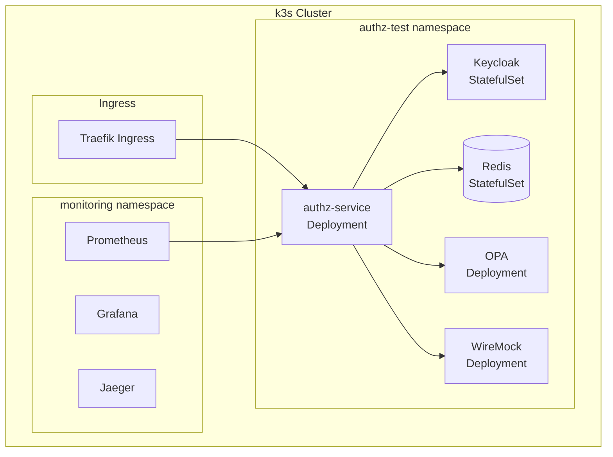

# Tier 2: k3s Vanilla + Helm

## Назначение

Kubernetes-native тестирование: service discovery, scaling, rolling updates, liveness/readiness probes.

---

## Компоненты стека



---

## Инструменты и обоснование выбора

| Инструмент | Версия | Назначение | Почему выбран |
|------------|--------|------------|---------------|
| **k3s** | 1.29+ | Kubernetes дистрибутив | Лёгкий, быстрый запуск, включает Traefik ingress |
| **Helm** | 3.14+ | Package manager | Стандарт для K8s, шаблонизация, зависимости |
| **Traefik** | 2.x | Ingress controller | Встроен в k3s, автоматический TLS |
| **Kustomize** | встроен | Overlays | Патчинг без форка, встроен в kubectl |

---

## Автоматизация развёртывания

### Установка k3s

```bash
#!/bin/bash
# tests/scripts/setup-k3s.sh

set -e

# Установка k3s
curl -sfL https://get.k3s.io | sh -s - \
    --write-kubeconfig-mode 644 \
    --disable servicelb \
    --disable-cloud-controller

# Ожидание готовности
kubectl wait --for=condition=ready node --all --timeout=120s

# Установка Helm
curl https://raw.githubusercontent.com/helm/helm/main/scripts/get-helm-3 | bash

echo "k3s готов!"
```

### Makefile

```makefile
# tests/Makefile

.PHONY: tier2-setup tier2-deploy tier2-destroy

NAMESPACE := authz-test
HELM_RELEASE := authz

tier2-setup:
	./scripts/setup-k3s.sh
	kubectl create namespace $(NAMESPACE) --dry-run=client -o yaml | kubectl apply -f -

tier2-deploy:
	helm dependency update ./helm/authz-service
	helm upgrade --install $(HELM_RELEASE) ./helm/authz-service \
		-n $(NAMESPACE) \
		-f ./helm/authz-service/values-test.yaml \
		--wait --timeout 10m

tier2-destroy:
	helm uninstall $(HELM_RELEASE) -n $(NAMESPACE) || true
	kubectl delete namespace $(NAMESPACE) || true

tier2-status:
	kubectl get pods -n $(NAMESPACE)
	kubectl get svc -n $(NAMESPACE)
```

---

## Helm Chart структура

```
tests/helm/authz-service/
├── Chart.yaml
├── values.yaml
├── values-test.yaml
├── values-staging.yaml
├── values-prod.yaml
├── templates/
│   ├── _helpers.tpl
│   ├── deployment.yaml
│   ├── service.yaml
│   ├── configmap.yaml
│   ├── secret.yaml
│   ├── serviceaccount.yaml
│   ├── hpa.yaml
│   ├── pdb.yaml
│   └── ingress.yaml
└── charts/
    ├── keycloak/
    ├── redis/
    └── opa/
```

### Chart.yaml

```yaml
# tests/helm/authz-service/Chart.yaml

apiVersion: v2
name: authz-service
description: Authorization service Helm chart
type: application
version: 0.1.0
appVersion: "1.0.0"

dependencies:
  - name: keycloak
    version: "18.x"
    repository: "https://codecentric.github.io/helm-charts"
    condition: keycloak.enabled

  - name: redis
    version: "18.x"
    repository: "https://charts.bitnami.com/bitnami"
    condition: redis.enabled

  - name: opa
    version: "6.x"
    repository: "https://open-policy-agent.github.io/kube-mgmt/charts"
    condition: opa.enabled
```

### values.yaml (базовые значения)

```yaml
# tests/helm/authz-service/values.yaml

replicaCount: 2

image:
  repository: authz-service
  pullPolicy: IfNotPresent
  tag: "latest"

serviceAccount:
  create: true
  name: ""

podSecurityContext:
  runAsNonRoot: true
  runAsUser: 1000
  fsGroup: 1000

securityContext:
  allowPrivilegeEscalation: false
  readOnlyRootFilesystem: true
  capabilities:
    drop:
      - ALL

service:
  type: ClusterIP
  port: 8080
  adminPort: 15000
  healthPort: 15020
  readyPort: 15021

ingress:
  enabled: true
  className: "traefik"
  hosts:
    - host: authz.local
      paths:
        - path: /
          pathType: Prefix

resources:
  limits:
    cpu: 500m
    memory: 512Mi
  requests:
    cpu: 100m
    memory: 128Mi

autoscaling:
  enabled: true
  minReplicas: 2
  maxReplicas: 10
  targetCPUUtilizationPercentage: 70

podDisruptionBudget:
  enabled: true
  minAvailable: 1

livenessProbe:
  httpGet:
    path: /healthz/ready
    port: 15020
  initialDelaySeconds: 10
  periodSeconds: 10

readinessProbe:
  httpGet:
    path: /healthz/ready
    port: 15021
  initialDelaySeconds: 5
  periodSeconds: 5

env:
  AUTHZ_ENV_NAME: kubernetes
  AUTHZ_LOGGING_LEVEL: info
  AUTHZ_LOGGING_FORMAT: json

config:
  environment: |
    # Environment config embedded
  services: |
    # Services config embedded
  rules: |
    # Rules config embedded

# Subchart configurations
keycloak:
  enabled: true
  auth:
    adminUser: admin
    adminPassword: admin
  postgresql:
    enabled: true

redis:
  enabled: true
  auth:
    enabled: false
  master:
    persistence:
      enabled: false

opa:
  enabled: true
```

### values-test.yaml (тестовые значения)

```yaml
# tests/helm/authz-service/values-test.yaml

replicaCount: 1

image:
  tag: "test"

resources:
  limits:
    cpu: 200m
    memory: 256Mi
  requests:
    cpu: 50m
    memory: 64Mi

autoscaling:
  enabled: false

podDisruptionBudget:
  enabled: false

env:
  AUTHZ_ENV_NAME: k3s-test
  AUTHZ_LOGGING_LEVEL: debug
  AUTHZ_CACHE_L2_ENABLED: "true"
  AUTHZ_POLICY_ENGINE: opa_sidecar

keycloak:
  enabled: true
  replicaCount: 1
  postgresql:
    primary:
      persistence:
        enabled: false

redis:
  enabled: true
  replica:
    replicaCount: 0
```

### Deployment template

```yaml
# tests/helm/authz-service/templates/deployment.yaml

apiVersion: apps/v1
kind: Deployment
metadata:
  name: {{ include "authz-service.fullname" . }}
  labels:
    {{- include "authz-service.labels" . | nindent 4 }}
spec:
  {{- if not .Values.autoscaling.enabled }}
  replicas: {{ .Values.replicaCount }}
  {{- end }}
  selector:
    matchLabels:
      {{- include "authz-service.selectorLabels" . | nindent 6 }}
  template:
    metadata:
      annotations:
        checksum/config: {{ include (print $.Template.BasePath "/configmap.yaml") . | sha256sum }}
      labels:
        {{- include "authz-service.selectorLabels" . | nindent 8 }}
    spec:
      serviceAccountName: {{ include "authz-service.serviceAccountName" . }}
      securityContext:
        {{- toYaml .Values.podSecurityContext | nindent 8 }}
      containers:
        - name: {{ .Chart.Name }}
          securityContext:
            {{- toYaml .Values.securityContext | nindent 12 }}
          image: "{{ .Values.image.repository }}:{{ .Values.image.tag | default .Chart.AppVersion }}"
          imagePullPolicy: {{ .Values.image.pullPolicy }}
          ports:
            - name: http
              containerPort: 8080
              protocol: TCP
            - name: admin
              containerPort: 15000
              protocol: TCP
            - name: health
              containerPort: 15020
              protocol: TCP
            - name: ready
              containerPort: 15021
              protocol: TCP
          envFrom:
            - configMapRef:
                name: {{ include "authz-service.fullname" . }}-env
            - secretRef:
                name: {{ include "authz-service.fullname" . }}-secrets
          env:
            {{- range $key, $value := .Values.env }}
            - name: {{ $key }}
              value: {{ $value | quote }}
            {{- end }}
            - name: AUTHZ_JWT_ISSUERS_0_ISSUER_URL
              value: "http://{{ .Release.Name }}-keycloak:8080/realms/test"
            - name: AUTHZ_CACHE_L2_REDIS_ADDRESSES_0
              value: "{{ .Release.Name }}-redis-master:6379"
            - name: AUTHZ_POLICY_OPA_URL
              value: "http://{{ .Release.Name }}-opa:8181"
          livenessProbe:
            {{- toYaml .Values.livenessProbe | nindent 12 }}
          readinessProbe:
            {{- toYaml .Values.readinessProbe | nindent 12 }}
          resources:
            {{- toYaml .Values.resources | nindent 12 }}
          volumeMounts:
            - name: config
              mountPath: /etc/authz
              readOnly: true
            - name: tmp
              mountPath: /tmp
      volumes:
        - name: config
          configMap:
            name: {{ include "authz-service.fullname" . }}-config
        - name: tmp
          emptyDir: {}
```

---

## Порты и сервисы

| Сервис | ClusterIP Port | NodePort | Описание |
|--------|----------------|----------|----------|
| authz-service | 8080 | 30080 | Main API |
| authz-service-admin | 15000 | 30150 | Admin endpoints |
| keycloak | 8080 | 30180 | OIDC |
| redis | 6379 | - | Internal only |
| opa | 8181 | - | Internal only |

---

## Ресурсные требования

| Ресурс | Минимум | Рекомендуется |
|--------|---------|---------------|
| CPU | 2 cores | 4 cores |
| RAM | 4 GB | 8 GB |
| Disk | 20 GB | 40 GB |
| Nodes | 1 | 3 |

---

## Типичное использование

```bash
# Подготовка k3s
make tier2-setup

# Деплой всего стека
make tier2-deploy

# Проверка статуса
make tier2-status

# Получение токена
./scripts/get-k8s-token.sh

# Запуск тестов
go test ./e2e/... -v -tags=e2e,k8s

# Удаление
make tier2-destroy
```
