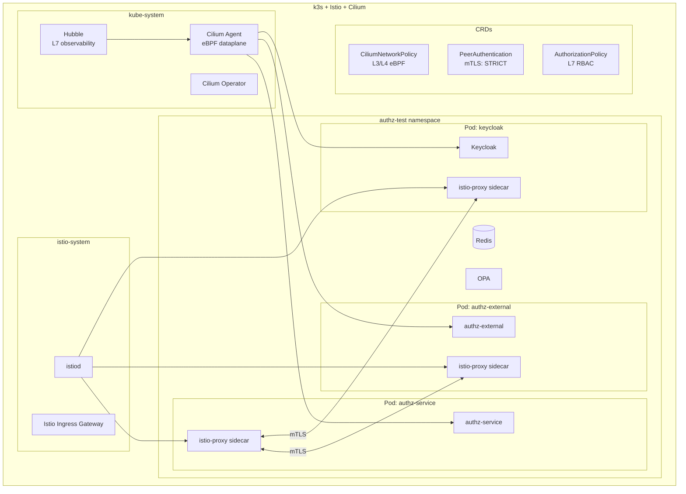
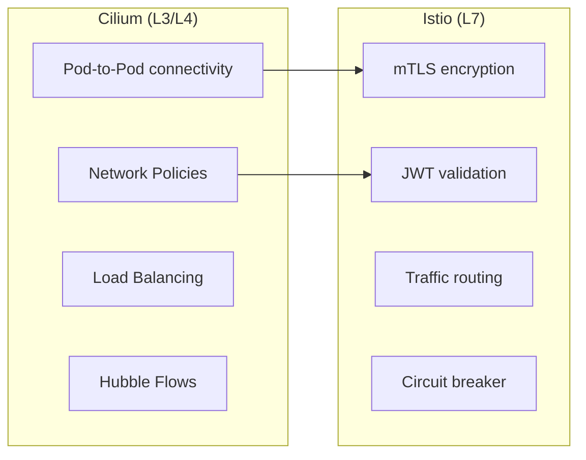
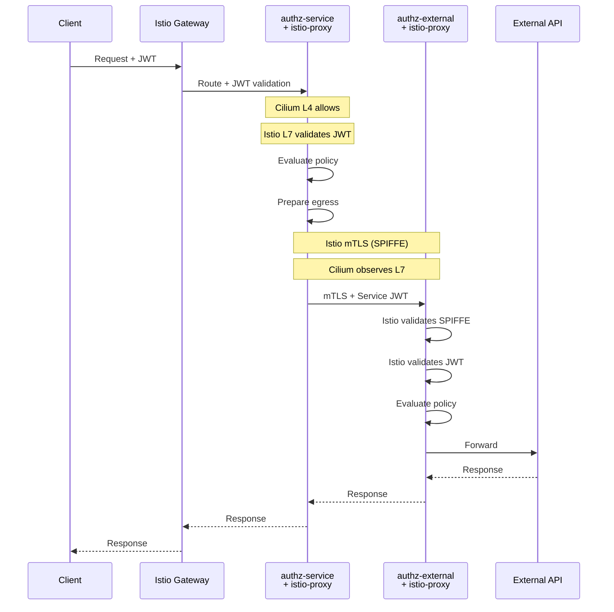

# Tier 5: k3s + Istio + Cilium

## Назначение

Комбинированное тестирование: Cilium как CNI с eBPF dataplane + Istio для service mesh.
Максимальная observability и security для production-like окружения.

---

## Компоненты стека



---

## Архитектурное решение

### Зачем Istio + Cilium вместе?

| Компонент | Роль | Преимущества |
|-----------|------|--------------|
| **Cilium CNI** | Сетевой уровень (L3/L4) | eBPF производительность, kernel-level policies |
| **Cilium Hubble** | Observability | Real-time L7 visibility без overhead |
| **Istio** | Service Mesh (L7) | mTLS, traffic management, JWT validation |
| **Istio Sidecar** | Application proxy | Fine-grained L7 policies, retries, circuit breaking |

### Разделение ответственности



---

## Инструменты и обоснование

| Инструмент | Версия | Назначение | Почему выбран |
|------------|--------|------------|---------------|
| **Cilium** | 1.15+ | CNI + eBPF | Kernel-level networking, Hubble observability |
| **Istio** | 1.21+ | Service Mesh | mTLS, traffic management, без замены CNI |
| **Hubble** | встроен | Network flows | Real-time L3-L7 visibility |
| **Kiali** | 1.80+ | Service graph | Istio-specific visualization |
| **cert-manager** | 1.14+ | Certificates | Автоматическая ротация TLS |

---

## Автоматизация развёртывания

### Установка (порядок важен!)

```bash
#!/bin/bash
# tests/scripts/setup-tier5.sh

set -e

CILIUM_VERSION="1.15.0"
ISTIO_VERSION="1.21.0"

echo "=== Step 1: Install k3s without CNI ==="
curl -sfL https://get.k3s.io | INSTALL_K3S_EXEC="\
    --flannel-backend=none \
    --disable-network-policy \
    --disable servicelb \
    --disable traefik" sh -

export KUBECONFIG=/etc/rancher/k3s/k3s.yaml
sudo chmod 644 $KUBECONFIG

echo "=== Step 2: Install Cilium as CNI ==="
# Install Cilium CLI
CILIUM_CLI_VERSION=$(curl -s https://raw.githubusercontent.com/cilium/cilium-cli/main/stable.txt)
curl -L --fail --remote-name-all \
    https://github.com/cilium/cilium-cli/releases/download/${CILIUM_CLI_VERSION}/cilium-linux-amd64.tar.gz
sudo tar xzvfC cilium-linux-amd64.tar.gz /usr/local/bin
rm cilium-linux-amd64.tar.gz

# Install Cilium with Hubble
cilium install --version $CILIUM_VERSION \
    --set hubble.enabled=true \
    --set hubble.relay.enabled=true \
    --set hubble.ui.enabled=true \
    --set kubeProxyReplacement=true \
    --set k8sServiceHost=$(hostname -I | awk '{print $1}') \
    --set k8sServicePort=6443

# Wait for Cilium to be ready
cilium status --wait

echo "=== Step 3: Install Istio (without CNI replacement) ==="
curl -L https://istio.io/downloadIstio | ISTIO_VERSION=$ISTIO_VERSION sh -
export PATH=$PWD/istio-$ISTIO_VERSION/bin:$PATH

# Install Istio with minimal profile (no CNI, Cilium handles networking)
istioctl install --set profile=default \
    --set components.cni.enabled=false \
    --set values.global.proxy.resources.requests.cpu=10m \
    --set values.global.proxy.resources.requests.memory=40Mi \
    -y

# Wait for Istio
kubectl wait --for=condition=ready pod -l app=istiod -n istio-system --timeout=300s

echo "=== Step 4: Create test namespace with Istio injection ==="
kubectl create namespace authz-test --dry-run=client -o yaml | kubectl apply -f -
kubectl label namespace authz-test istio-injection=enabled --overwrite

echo "=== Step 5: Install cert-manager ==="
kubectl apply -f https://github.com/cert-manager/cert-manager/releases/download/v1.14.0/cert-manager.yaml
kubectl wait --for=condition=ready pod -l app=cert-manager -n cert-manager --timeout=300s

echo "=== Step 6: Verify installation ==="
cilium status
istioctl version
kubectl get pods -A

echo "Tier 5 setup complete!"
```

### Makefile

```makefile
# tests/Makefile

.PHONY: tier5-setup tier5-deploy tier5-destroy tier5-status

NAMESPACE := authz-test

tier5-setup:
	./scripts/setup-tier5.sh
	kubectl apply -f ./k8s/tier5/cert-manager/
	kubectl apply -f ./k8s/tier5/cilium/
	kubectl apply -f ./k8s/tier5/istio/

tier5-deploy:
	helm dependency update ./helm/authz-service
	helm upgrade --install authz ./helm/authz-service \
		-n $(NAMESPACE) \
		-f ./helm/authz-service/values-tier5.yaml \
		--wait --timeout 10m
	kubectl apply -f ./k8s/tier5/policies/

tier5-hubble:
	cilium hubble ui &
	@echo "Hubble UI: http://localhost:12000"

tier5-kiali:
	istioctl dashboard kiali &
	@echo "Kiali UI: http://localhost:20001"

tier5-status:
	@echo "=== Cilium Status ==="
	cilium status
	@echo ""
	@echo "=== Istio Status ==="
	istioctl proxy-status
	@echo ""
	@echo "=== Pods ==="
	kubectl get pods -n $(NAMESPACE)

tier5-connectivity-test:
	cilium connectivity test --test egress-l7

tier5-mtls-check:
	istioctl authn tls-check authz-service.$(NAMESPACE).svc.cluster.local
```

---

## Конфигурация политик

### Cilium Network Policy (L3/L4)

```yaml
# tests/k8s/tier5/cilium/network-policy.yaml

apiVersion: cilium.io/v2
kind: CiliumNetworkPolicy
metadata:
  name: authz-service-l4
  namespace: authz-test
spec:
  description: "L3/L4 policy for authz-service"
  endpointSelector:
    matchLabels:
      app: authz-service

  ingress:
    # От Istio Ingress Gateway
    - fromEndpoints:
        - matchLabels:
            istio: ingressgateway
            io.kubernetes.pod.namespace: istio-system
      toPorts:
        - ports:
            - port: "8080"
              protocol: TCP

    # От других сервисов в mesh
    - fromEndpoints:
        - matchLabels:
            app.kubernetes.io/part-of: authz-system
      toPorts:
        - ports:
            - port: "8080"
              protocol: TCP
            - port: "15020"
              protocol: TCP
            - port: "15021"
              protocol: TCP

  egress:
    # К Keycloak
    - toEndpoints:
        - matchLabels:
            app: keycloak
      toPorts:
        - ports:
            - port: "8080"
              protocol: TCP

    # К Redis
    - toEndpoints:
        - matchLabels:
            app: redis
      toPorts:
        - ports:
            - port: "6379"
              protocol: TCP

    # К OPA
    - toEndpoints:
        - matchLabels:
            app: opa
      toPorts:
        - ports:
            - port: "8181"
              protocol: TCP

    # К external authz-service
    - toEndpoints:
        - matchLabels:
            app: authz-external
      toPorts:
        - ports:
            - port: "8080"
              protocol: TCP
            - port: "8443"
              protocol: TCP

    # DNS
    - toEndpoints:
        - matchLabels:
            k8s:io.kubernetes.pod.namespace: kube-system
            k8s-app: kube-dns
      toPorts:
        - ports:
            - port: "53"
              protocol: UDP
          rules:
            dns:
              - matchPattern: "*"

---
# Cilium policy для authz-external
apiVersion: cilium.io/v2
kind: CiliumNetworkPolicy
metadata:
  name: authz-external-l4
  namespace: authz-test
spec:
  endpointSelector:
    matchLabels:
      app: authz-external

  ingress:
    # Только от internal authz-service
    - fromEndpoints:
        - matchLabels:
            app: authz-service
      toPorts:
        - ports:
            - port: "8080"
              protocol: TCP
            - port: "8443"
              protocol: TCP

  egress:
    # К external mock API
    - toEndpoints:
        - matchLabels:
            app: mock-external-api
      toPorts:
        - ports:
            - port: "8080"
              protocol: TCP

    # DNS
    - toEndpoints:
        - matchLabels:
            k8s:io.kubernetes.pod.namespace: kube-system
      toPorts:
        - ports:
            - port: "53"
              protocol: UDP
```

### Istio PeerAuthentication (mTLS)

```yaml
# tests/k8s/tier5/istio/peer-authentication.yaml

apiVersion: security.istio.io/v1
kind: PeerAuthentication
metadata:
  name: default
  namespace: authz-test
spec:
  mtls:
    mode: STRICT

---
# Redis без sidecar, разрешаем PERMISSIVE
apiVersion: security.istio.io/v1
kind: PeerAuthentication
metadata:
  name: redis-permissive
  namespace: authz-test
spec:
  selector:
    matchLabels:
      app: redis
  mtls:
    mode: PERMISSIVE
```

### Istio AuthorizationPolicy (L7 RBAC)

```yaml
# tests/k8s/tier5/istio/authorization-policy.yaml

apiVersion: security.istio.io/v1
kind: AuthorizationPolicy
metadata:
  name: authz-service-policy
  namespace: authz-test
spec:
  selector:
    matchLabels:
      app: authz-service
  rules:
    # Health checks без авторизации
    - to:
        - operation:
            paths: ["/health*", "/ready*", "/live*", "/metrics"]
            methods: ["GET"]

    # API с JWT
    - from:
        - source:
            requestPrincipals: ["*"]
      to:
        - operation:
            methods: ["POST"]
            paths: ["/authorize", "/authorize/batch"]

    # S2S с SPIFFE identity
    - from:
        - source:
            principals:
              - "cluster.local/ns/authz-test/sa/client-service"
      to:
        - operation:
            methods: ["POST"]
            paths: ["/authorize"]

---
# Policy для authz-external
apiVersion: security.istio.io/v1
kind: AuthorizationPolicy
metadata:
  name: authz-external-policy
  namespace: authz-test
spec:
  selector:
    matchLabels:
      app: authz-external
  rules:
    # Только от internal authz с mTLS
    - from:
        - source:
            principals:
              - "cluster.local/ns/authz-test/sa/authz-service"
      to:
        - operation:
            methods: ["POST", "GET"]
            paths: ["/api/*", "/partner/*"]

    # Health checks
    - to:
        - operation:
            paths: ["/health*", "/metrics"]
            methods: ["GET"]
```

### Istio RequestAuthentication (JWT)

```yaml
# tests/k8s/tier5/istio/request-authentication.yaml

apiVersion: security.istio.io/v1
kind: RequestAuthentication
metadata:
  name: authz-jwt-auth
  namespace: authz-test
spec:
  selector:
    matchLabels:
      app: authz-service
  jwtRules:
    - issuer: "http://keycloak.authz-test.svc.cluster.local:8080/realms/test"
      jwksUri: "http://keycloak.authz-test.svc.cluster.local:8080/realms/test/protocol/openid-connect/certs"
      forwardOriginalToken: true
      outputPayloadToHeader: x-jwt-payload
```

---

## Helm values для Tier 5

```yaml
# tests/helm/authz-service/values-tier5.yaml

replicaCount: 2

podAnnotations:
  # Istio sidecar
  sidecar.istio.io/inject: "true"
  proxy.istio.io/config: |
    holdApplicationUntilProxyStarts: true
    proxyMetadata:
      ISTIO_META_DNS_CAPTURE: "true"
  # Cilium visibility
  policy.cilium.io/proxy-visibility: "<Egress/8080/TCP/HTTP>,<Ingress/8080/TCP/HTTP>"

podLabels:
  app.kubernetes.io/part-of: authz-system
  security.istio.io/tlsMode: istio

serviceAccount:
  create: true
  annotations:
    spiffe.io/spiffeId: "spiffe://cluster.local/ns/authz-test/sa/authz-service"

env:
  AUTHZ_ENV_NAME: k8s-tier5
  AUTHZ_LOGGING_LEVEL: info
  # Istio handles mTLS, read XFCC header
  AUTHZ_TLS_CLIENT_CERT_ENABLED: "true"
  AUTHZ_TLS_CLIENT_CERT_SOURCES_XFCC_ENABLED: "true"
  AUTHZ_TLS_CLIENT_CERT_TRUSTED_SPIFFE_DOMAINS_0: "cluster.local"

# Resource limits (Cilium eBPF adds minimal overhead)
resources:
  limits:
    cpu: 500m
    memory: 512Mi
  requests:
    cpu: 100m
    memory: 128Mi

# Separate authz-external deployment
authzExternal:
  enabled: true
  replicaCount: 1
  env:
    AUTHZ_ENV_NAME: k8s-tier5-external
    AUTHZ_POLICY_ENGINE: builtin
```

---

## Observability

### Hubble (L3-L7 flows)

```bash
# Все flows в namespace
hubble observe -n authz-test --follow

# HTTP flows между authz-service и authz-external
hubble observe -n authz-test \
    --from-pod authz-service \
    --to-pod authz-external \
    --protocol http --follow

# Dropped packets (Cilium enforcement)
hubble observe -n authz-test --verdict DROPPED --follow

# L7 HTTP details
hubble observe -n authz-test --http-method POST --http-path "/authorize"
```

### Kiali (Service Mesh)

```bash
# Open Kiali dashboard
istioctl dashboard kiali

# Features:
# - Service graph with mTLS status
# - Traffic routing visualization
# - Istio config validation
# - Distributed tracing integration
```

### Combined dashboard (Grafana)

```yaml
# Prometheus scrape config
scrape_configs:
  - job_name: 'hubble'
    static_configs:
      - targets: ['hubble-metrics.kube-system.svc:9965']

  - job_name: 'istio-mesh'
    kubernetes_sd_configs:
      - role: endpoints
        namespaces:
          names: ['istio-system']
    relabel_configs:
      - source_labels: [__meta_kubernetes_service_name]
        regex: istio-telemetry
        action: keep
```

---

## Тестовые сценарии

### E2E: authz-to-authz через Istio mTLS



### Chaos: Cilium + Istio resilience

| ID | Сценарий | Инструмент | Ожидание |
|----|----------|------------|----------|
| T5-CHAOS-001 | Network partition | Cilium policy | Istio circuit breaker opens |
| T5-CHAOS-002 | Packet loss 10% | Cilium | Istio retries succeed |
| T5-CHAOS-003 | Pod failure | kubectl delete | Istio routes to healthy pods |
| T5-CHAOS-004 | mTLS cert expiry | cert-manager | Auto-rotation by Istio |

---

## Диагностика

```bash
# Cilium status
cilium status
cilium endpoint list -n authz-test

# Istio proxy status
istioctl proxy-status
istioctl analyze -n authz-test

# Check mTLS
istioctl authn tls-check authz-service.authz-test.svc.cluster.local

# Cilium + Istio flows combined
hubble observe -n authz-test --follow &
kubectl logs -l app=authz-service -c istio-proxy -n authz-test -f &

# Debug specific pod
istioctl proxy-config listener authz-service-xxx -n authz-test
cilium endpoint get -l app=authz-service -n authz-test
```

---

## Ресурсные требования

| Ресурс | Минимум | Рекомендуется |
|--------|---------|---------------|
| CPU | 8 cores | 16 cores |
| RAM | 16 GB | 32 GB |
| Disk | 80 GB | 160 GB |
| Kernel | 5.10+ | 5.15+ |
| Nodes | 3 | 5 |

> **Note:** Tier 5 требует больше ресурсов из-за Istio sidecars + Cilium eBPF.

---

## Типичное использование

```bash
# Установка k3s + Cilium + Istio
make tier5-setup

# Деплой authz-service + authz-external
make tier5-deploy

# Проверка статуса
make tier5-status

# Hubble UI (L3-L7 flows)
make tier5-hubble

# Kiali UI (Service mesh)
make tier5-kiali

# mTLS проверка
make tier5-mtls-check

# Connectivity test
make tier5-connectivity-test

# Запуск тестов
go test ./e2e/... -v -tags=e2e,istio,cilium,tier5
```

---

## Сравнение с другими Tiers

| Аспект | Tier 3 (Istio) | Tier 4 (Cilium) | Tier 5 (Both) |
|--------|----------------|-----------------|---------------|
| CNI | Default | Cilium eBPF | Cilium eBPF |
| mTLS | Istio | Cilium mTLS | Istio |
| L7 Policies | Istio | Cilium L7 | Istio + Cilium |
| Observability | Kiali | Hubble | Both |
| Overhead | High (sidecars) | Low (eBPF) | Medium |
| Use case | Full mesh | Performance | Production |
