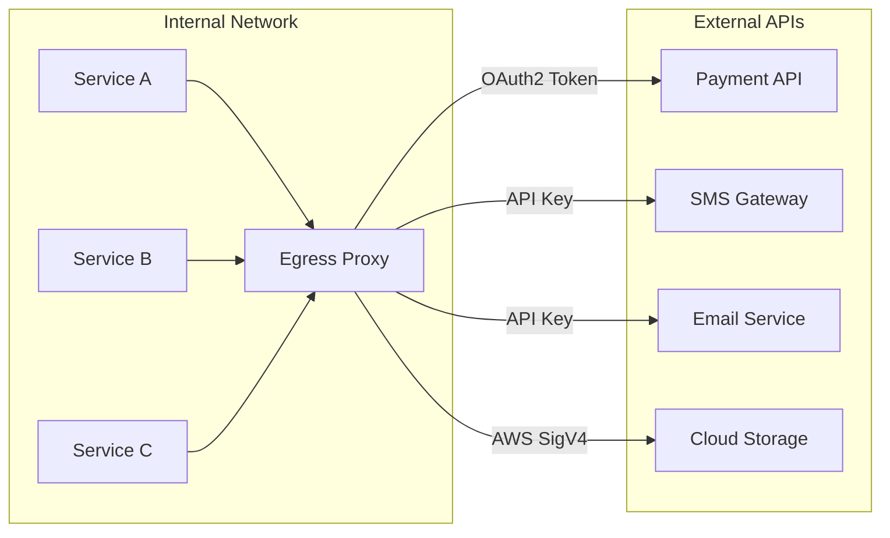
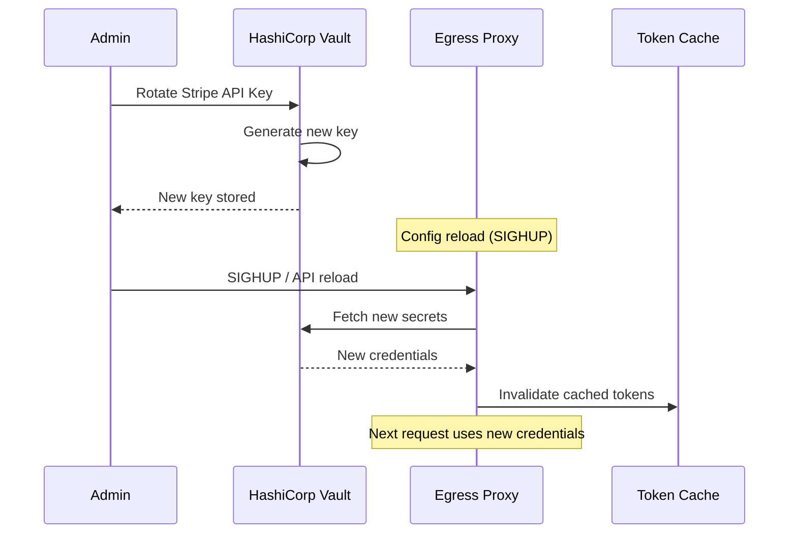
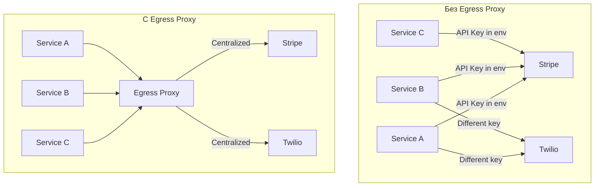

# Egress Only Auth - Credential Injection Example

## Сценарий

Простой режим: Egress Proxy только инжектирует credentials в исходящие запросы. Никакой бизнес-логики, только централизованное управление секретами.

**Преимущества:**
- Сервисы не хранят секреты
- Централизованная ротация credentials
- Единая точка аудита внешних вызовов
- Zero-trust между сервисами и внешними API



---

## 1. Конфигурация (config.yaml)

```yaml
# =============================================================================
# Egress Only Auth Mode
# =============================================================================
http:
  addr: ":8080"
  read_timeout: 60s
  write_timeout: 60s

egress:
  enabled: true

  # Redis for OAuth2 token caching
  token_store:
    type: redis
    redis:
      address: "redis:6379"
      password: "${REDIS_PASSWORD}"
      db: 0
      key_prefix: "egress:creds:"

  defaults:
    timeout: 30s
    retry_count: 3
    retry_delay: 500ms

  # ==========================================================================
  # External Services
  # ==========================================================================
  targets:

    # --- Payment Provider (Stripe) - OAuth2 ---
    stripe:
      url: "https://api.stripe.com/v1"
      auth:
        type: bearer
        token: "${STRIPE_SECRET_KEY}"

    # --- Payment Provider (PayPal) - OAuth2 Client Credentials ---
    paypal:
      url: "https://api.paypal.com/v2"
      auth:
        type: oauth2_client_credentials
        token_url: "https://api.paypal.com/v1/oauth2/token"
        client_id: "${PAYPAL_CLIENT_ID}"
        client_secret: "${PAYPAL_CLIENT_SECRET}"
        refresh_before_expiry: 300s

    # --- SMS Gateway (Twilio) - Basic Auth ---
    twilio:
      url: "https://api.twilio.com/2010-04-01"
      auth:
        type: basic
        username: "${TWILIO_ACCOUNT_SID}"
        password: "${TWILIO_AUTH_TOKEN}"

    # --- Email Service (SendGrid) - API Key ---
    sendgrid:
      url: "https://api.sendgrid.com/v3"
      auth:
        type: bearer
        token: "${SENDGRID_API_KEY}"

    # --- Cloud Storage (AWS S3) - AWS Signature ---
    aws-s3:
      url: "https://s3.amazonaws.com"
      auth:
        type: api_key
        header: "Authorization"
        key: "${AWS_S3_PRESIGNED_HEADER}"  # Or use AWS SDK signing
      tls:
        enabled: true

    # --- Google Cloud APIs - Service Account ---
    gcp:
      url: "https://storage.googleapis.com"
      auth:
        type: oauth2_client_credentials
        token_url: "https://oauth2.googleapis.com/token"
        client_id: "${GCP_CLIENT_EMAIL}"
        client_secret: "${GCP_PRIVATE_KEY}"
        scopes: ["https://www.googleapis.com/auth/cloud-platform"]

    # --- Internal Microservice - mTLS ---
    internal-api:
      url: "https://internal-api.svc.cluster.local"
      auth:
        type: mtls
      tls:
        enabled: true
        client_cert: "/etc/certs/client.crt"
        client_key: "/etc/certs/client.key"
        ca_cert: "/etc/certs/ca.crt"

    # --- Slack Webhooks - No Auth (URL contains token) ---
    slack:
      url: "https://hooks.slack.com/services"
      auth:
        type: none

    # --- Custom Header Auth ---
    custom-api:
      url: "https://api.custom-service.com"
      auth:
        type: api_key
        header: "X-Custom-Auth-Token"
        key: "${CUSTOM_API_TOKEN}"

  # ==========================================================================
  # Route Mapping
  # ==========================================================================
  routes:
    # Payments
    - path_prefix: "/ext/stripe"
      target: stripe
      strip_prefix: "/ext/stripe"

    - path_prefix: "/ext/paypal"
      target: paypal
      strip_prefix: "/ext/paypal"

    # Communications
    - path_prefix: "/ext/sms"
      target: twilio
      strip_prefix: "/ext/sms"
      rewrite_prefix: "/Accounts/${TWILIO_ACCOUNT_SID}"

    - path_prefix: "/ext/email"
      target: sendgrid
      strip_prefix: "/ext/email"

    # Storage
    - path_prefix: "/ext/s3"
      target: aws-s3
      strip_prefix: "/ext/s3"

    - path_prefix: "/ext/gcs"
      target: gcp
      strip_prefix: "/ext/gcs"

    # Internal
    - path_prefix: "/ext/internal"
      target: internal-api
      strip_prefix: "/ext/internal"

    # Notifications
    - path_prefix: "/ext/slack"
      target: slack
      strip_prefix: "/ext/slack"

    # Custom
    - path_prefix: "/ext/custom"
      target: custom-api
      strip_prefix: "/ext/custom"

# Health & Metrics
endpoints:
  egress: "/ext"
  health: "/health"
  ready: "/ready"
  metrics: "/metrics"

logger:
  level: info
  format: json
```

---

## 2. Использование из любого сервиса

### Generic HTTP Client (любой язык)

```bash
# Вместо прямого вызова внешнего API:
# curl https://api.stripe.com/v1/charges -H "Authorization: Bearer sk_..."

# Вызываем через Egress Proxy:
curl http://egress-proxy:8080/ext/stripe/charges \
  -H "Content-Type: application/json" \
  -d '{"amount": 1000, "currency": "usd"}'

# Egress Proxy автоматически добавит:
# Authorization: Bearer sk_live_...
```

### Go

```go
package egress

import (
    "bytes"
    "encoding/json"
    "fmt"
    "io"
    "net/http"
    "os"
    "time"
)

// Client is a generic egress proxy client
type Client struct {
    baseURL    string
    httpClient *http.Client
}

// New creates egress client
func New() *Client {
    return &Client{
        baseURL: os.Getenv("EGRESS_PROXY_URL"), // http://egress-proxy:8080
        httpClient: &http.Client{
            Timeout: 30 * time.Second,
        },
    }
}

// Request makes a request through egress proxy
func (c *Client) Request(method, target, path string, body any) (*http.Response, error) {
    var bodyReader io.Reader
    if body != nil {
        data, _ := json.Marshal(body)
        bodyReader = bytes.NewReader(data)
    }

    url := fmt.Sprintf("%s/ext/%s%s", c.baseURL, target, path)
    req, err := http.NewRequest(method, url, bodyReader)
    if err != nil {
        return nil, err
    }

    if body != nil {
        req.Header.Set("Content-Type", "application/json")
    }

    return c.httpClient.Do(req)
}

// === Convenience Methods ===

// Stripe
func (c *Client) StripeCreateCharge(amount int, currency string) (*http.Response, error) {
    return c.Request("POST", "stripe", "/charges", map[string]any{
        "amount":   amount,
        "currency": currency,
    })
}

// PayPal
func (c *Client) PayPalCreateOrder(amount string) (*http.Response, error) {
    return c.Request("POST", "paypal", "/checkout/orders", map[string]any{
        "intent": "CAPTURE",
        "purchase_units": []map[string]any{
            {"amount": map[string]string{"currency_code": "USD", "value": amount}},
        },
    })
}

// Twilio SMS
func (c *Client) SendSMS(to, body string) (*http.Response, error) {
    return c.Request("POST", "sms", "/Messages.json", map[string]string{
        "To":   to,
        "From": os.Getenv("TWILIO_PHONE"),
        "Body": body,
    })
}

// SendGrid Email
func (c *Client) SendEmail(to, subject, content string) (*http.Response, error) {
    return c.Request("POST", "email", "/mail/send", map[string]any{
        "personalizations": []map[string]any{
            {"to": []map[string]string{{"email": to}}},
        },
        "from":    map[string]string{"email": "noreply@example.com"},
        "subject": subject,
        "content": []map[string]string{
            {"type": "text/plain", "value": content},
        },
    })
}

// Slack
func (c *Client) SlackNotify(webhookPath, text string) (*http.Response, error) {
    return c.Request("POST", "slack", webhookPath, map[string]string{
        "text": text,
    })
}
```

### Python

```python
import os
import requests

class EgressClient:
    def __init__(self):
        self.base_url = os.getenv('EGRESS_PROXY_URL', 'http://egress-proxy:8080')

    def request(self, method: str, target: str, path: str, **kwargs) -> requests.Response:
        url = f"{self.base_url}/ext/{target}{path}"
        return requests.request(method, url, **kwargs)

    # Stripe
    def stripe_create_charge(self, amount: int, currency: str) -> dict:
        resp = self.request('POST', 'stripe', '/charges', json={
            'amount': amount,
            'currency': currency
        })
        return resp.json()

    # PayPal
    def paypal_create_order(self, amount: str) -> dict:
        resp = self.request('POST', 'paypal', '/checkout/orders', json={
            'intent': 'CAPTURE',
            'purchase_units': [{'amount': {'currency_code': 'USD', 'value': amount}}]
        })
        return resp.json()

    # Twilio
    def send_sms(self, to: str, body: str) -> dict:
        resp = self.request('POST', 'sms', '/Messages.json', data={
            'To': to,
            'From': os.getenv('TWILIO_PHONE'),
            'Body': body
        })
        return resp.json()

    # SendGrid
    def send_email(self, to: str, subject: str, content: str) -> dict:
        resp = self.request('POST', 'email', '/mail/send', json={
            'personalizations': [{'to': [{'email': to}]}],
            'from': {'email': 'noreply@example.com'},
            'subject': subject,
            'content': [{'type': 'text/plain', 'value': content}]
        })
        return resp.json() if resp.content else {}

    # Slack
    def slack_notify(self, webhook_path: str, text: str) -> dict:
        resp = self.request('POST', 'slack', webhook_path, json={'text': text})
        return {'ok': resp.status_code == 200}


# Usage
egress = EgressClient()
egress.stripe_create_charge(1000, 'usd')
egress.send_sms('+1234567890', 'Hello!')
egress.send_email('user@example.com', 'Welcome', 'Hello!')
```

### Node.js / TypeScript

```typescript
import axios, { AxiosInstance, AxiosResponse } from 'axios';

class EgressClient {
  private client: AxiosInstance;

  constructor() {
    this.client = axios.create({
      baseURL: process.env.EGRESS_PROXY_URL || 'http://egress-proxy:8080',
      timeout: 30000,
    });
  }

  async request<T>(method: string, target: string, path: string, data?: any): Promise<T> {
    const response: AxiosResponse<T> = await this.client.request({
      method,
      url: `/ext/${target}${path}`,
      data,
    });
    return response.data;
  }

  // Stripe
  async stripeCreateCharge(amount: number, currency: string) {
    return this.request('POST', 'stripe', '/charges', { amount, currency });
  }

  // PayPal
  async paypalCreateOrder(amount: string) {
    return this.request('POST', 'paypal', '/checkout/orders', {
      intent: 'CAPTURE',
      purchase_units: [{ amount: { currency_code: 'USD', value: amount } }],
    });
  }

  // Twilio
  async sendSMS(to: string, body: string) {
    return this.request('POST', 'sms', '/Messages.json', {
      To: to,
      From: process.env.TWILIO_PHONE,
      Body: body,
    });
  }

  // SendGrid
  async sendEmail(to: string, subject: string, content: string) {
    return this.request('POST', 'email', '/mail/send', {
      personalizations: [{ to: [{ email: to }] }],
      from: { email: 'noreply@example.com' },
      subject,
      content: [{ type: 'text/plain', value: content }],
    });
  }

  // Slack
  async slackNotify(webhookPath: string, text: string) {
    return this.request('POST', 'slack', webhookPath, { text });
  }
}

// Usage
const egress = new EgressClient();
await egress.stripeCreateCharge(1000, 'usd');
await egress.sendSMS('+1234567890', 'Hello!');
```

---

## 3. Примеры curl

### Payments

```bash
# Stripe - Create Charge
curl -X POST http://egress:8080/ext/stripe/charges \
  -H "Content-Type: application/json" \
  -d '{"amount": 2000, "currency": "usd", "source": "tok_visa"}'

# PayPal - Create Order
curl -X POST http://egress:8080/ext/paypal/checkout/orders \
  -H "Content-Type: application/json" \
  -d '{
    "intent": "CAPTURE",
    "purchase_units": [{"amount": {"currency_code": "USD", "value": "100.00"}}]
  }'

# Stripe - Get Balance
curl http://egress:8080/ext/stripe/balance
```

### Communications

```bash
# Twilio - Send SMS
curl -X POST http://egress:8080/ext/sms/Messages.json \
  -H "Content-Type: application/x-www-form-urlencoded" \
  -d "To=+1234567890&From=+0987654321&Body=Hello"

# SendGrid - Send Email
curl -X POST http://egress:8080/ext/email/mail/send \
  -H "Content-Type: application/json" \
  -d '{
    "personalizations": [{"to": [{"email": "user@example.com"}]}],
    "from": {"email": "noreply@example.com"},
    "subject": "Test",
    "content": [{"type": "text/plain", "value": "Hello!"}]
  }'

# Slack - Webhook
curl -X POST http://egress:8080/ext/slack/T00000000/B00000000/XXXXXXXX \
  -H "Content-Type: application/json" \
  -d '{"text": "Hello from service!"}'
```

### Storage

```bash
# AWS S3 - List Bucket
curl http://egress:8080/ext/s3/my-bucket?list-type=2

# GCS - Get Object
curl http://egress:8080/ext/gcs/storage/v1/b/my-bucket/o/my-file
```

---

## 4. Credential Rotation



### Vault Integration (config.yaml)

```yaml
egress:
  targets:
    stripe:
      url: "https://api.stripe.com/v1"
      auth:
        type: bearer
        # Token from Vault
        token: "vault:secret/data/stripe#api_key"

    paypal:
      url: "https://api.paypal.com/v2"
      auth:
        type: oauth2_client_credentials
        token_url: "https://api.paypal.com/v1/oauth2/token"
        # Secrets from Vault
        client_id: "vault:secret/data/paypal#client_id"
        client_secret: "vault:secret/data/paypal#client_secret"
```

---

## 5. Kubernetes Deployment

```yaml
apiVersion: apps/v1
kind: Deployment
metadata:
  name: egress-proxy
spec:
  replicas: 3
  selector:
    matchLabels:
      app: egress-proxy
  template:
    metadata:
      labels:
        app: egress-proxy
    spec:
      containers:
        - name: egress-proxy
          image: authz-service:latest
          ports:
            - containerPort: 8080
          env:
            - name: REDIS_PASSWORD
              valueFrom:
                secretKeyRef:
                  name: redis-secret
                  key: password
          envFrom:
            - secretRef:
                name: egress-credentials
          volumeMounts:
            - name: config
              mountPath: /etc/authz
            - name: certs
              mountPath: /etc/certs
              readOnly: true
          livenessProbe:
            httpGet:
              path: /health
              port: 8080
          readinessProbe:
            httpGet:
              path: /ready
              port: 8080
      volumes:
        - name: config
          configMap:
            name: egress-config
        - name: certs
          secret:
            secretName: mtls-certs
---
apiVersion: v1
kind: Service
metadata:
  name: egress-proxy
spec:
  selector:
    app: egress-proxy
  ports:
    - port: 8080
      targetPort: 8080
---
apiVersion: v1
kind: Secret
metadata:
  name: egress-credentials
type: Opaque
stringData:
  STRIPE_SECRET_KEY: "sk_live_..."
  PAYPAL_CLIENT_ID: "..."
  PAYPAL_CLIENT_SECRET: "..."
  TWILIO_ACCOUNT_SID: "..."
  TWILIO_AUTH_TOKEN: "..."
  SENDGRID_API_KEY: "SG...."
```

---

## 6. Service Mesh Integration

```yaml
# Istio VirtualService - route all external traffic through egress
apiVersion: networking.istio.io/v1beta1
kind: VirtualService
metadata:
  name: external-apis
spec:
  hosts:
    - "*.stripe.com"
    - "*.paypal.com"
    - "*.twilio.com"
    - "*.sendgrid.com"
  http:
    - route:
        - destination:
            host: egress-proxy.default.svc.cluster.local
            port:
              number: 8080
```

---

## 7. Мониторинг

### Метрики

| Метрика | Описание |
|---------|----------|
| `egress_requests_total{target,method,status}` | Запросы по target |
| `egress_request_duration_seconds{target}` | Латентность |
| `egress_credential_refresh_total{target,status}` | Обновления токенов |
| `egress_credential_cache_hits{target}` | Попадания в кэш |
| `egress_errors_total{target,error_type}` | Ошибки |

### Grafana Dashboard Query

```promql
# Request rate by target
sum(rate(egress_requests_total[5m])) by (target)

# Error rate
sum(rate(egress_requests_total{status=~"5.."}[5m])) by (target)
/ sum(rate(egress_requests_total[5m])) by (target) * 100

# P99 latency
histogram_quantile(0.99, rate(egress_request_duration_seconds_bucket[5m]))
```

### Alerts

```yaml
groups:
  - name: egress
    rules:
      - alert: EgressHighErrorRate
        expr: |
          sum(rate(egress_requests_total{status=~"5.."}[5m])) by (target)
          / sum(rate(egress_requests_total[5m])) by (target) > 0.05
        for: 5m
        labels:
          severity: warning
        annotations:
          summary: "High error rate for {{ $labels.target }}"

      - alert: EgressCredentialRefreshFailed
        expr: egress_credential_refresh_total{status="error"} > 0
        for: 1m
        labels:
          severity: critical
        annotations:
          summary: "Credential refresh failed for {{ $labels.target }}"
```

---

## 8. Сравнение: с Egress Proxy и без



| Аспект | Без Egress | С Egress Proxy |
|--------|------------|----------------|
| Хранение секретов | В каждом сервисе | Централизованно |
| Ротация | Обновить все сервисы | Обновить 1 место |
| Аудит | Разрозненный | Единая точка |
| OAuth2 refresh | В каждом сервисе | Автоматически |
| mTLS | Сертификаты везде | Сертификаты в proxy |
| Код сервисов | Логика auth | Просто HTTP |
