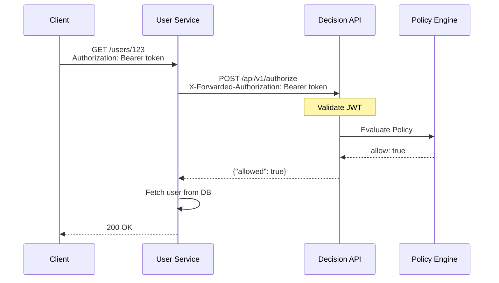
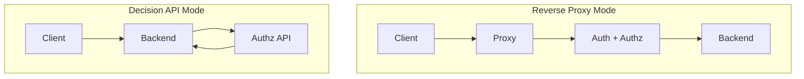

# User CRUD API - Decision API Example

## Сценарий

REST API для управления пользователями. Backend самостоятельно вызывает Decision API для проверки авторизации перед выполнением операции.



---

## 1. Конфигурация Authz Service (config.yaml)

```yaml
# =============================================================================
# HTTP Server
# =============================================================================
http:
  addr: ":8080"
  read_timeout: 15s
  write_timeout: 15s

# =============================================================================
# JWT Configuration
# =============================================================================
jwt:
  issuer: "https://keycloak.example.com/realms/myapp"
  audience: "user-service"
  jwks_refresh_interval: 1h
  required_claims:
    - "sub"
    - "realm_access"

# =============================================================================
# Policy Configuration
# =============================================================================
policy:
  engine: opa_embedded
  path: "/etc/authz/policies"
  data_path: "/etc/authz/data"
  query: "data.authz.result"
  default_decision: deny

# =============================================================================
# Cache Configuration
# =============================================================================
cache:
  enabled: true
  type: redis
  ttl: 5m
  redis:
    address: "redis:6379"
    password: "${REDIS_PASSWORD}"
    db: 0
    key_prefix: "authz:decisions:"

# =============================================================================
# Endpoints
# =============================================================================
endpoints:
  authorize: "/api/v1/authorize"
  authorize_batch: "/api/v1/authorize/batch"
  token_validate: "/api/v1/token/validate"
  health: "/health"
  ready: "/ready"
  metrics: "/metrics"

# =============================================================================
# Audit
# =============================================================================
audit:
  enabled: true
  log_allowed: true
  log_denied: true

# =============================================================================
# Logging
# =============================================================================
logger:
  level: info
  format: json
```

---

## 2. OPA Политика (policies/authz.rego)

```rego
package authz

import rego.v1

# =============================================================================
# Entry Point
# =============================================================================

default allow := false

result := {
    "allow": final_allow,
    "reasons": final_reasons,
    "metadata": {
        "user_id": input.token.sub,
        "roles": user_roles,
        "resource": sprintf("%s:%s", [input.resource.type, input.resource.id]),
        "action": input.action,
    }
}

# =============================================================================
# Role Extraction
# =============================================================================

user_roles := input.token.realm_access.roles if input.token.realm_access.roles
user_roles := [] if not input.token.realm_access.roles

user_department := input.token.department if input.token.department
user_department := "" if not input.token.department

is_admin if "admin" in user_roles
is_manager if "manager" in user_roles
is_user if "user" in user_roles

# =============================================================================
# Authorization Rules
# =============================================================================

# --- ADMIN: Full access ---
allow if is_admin
reasons contains "admin role: full access" if is_admin

# --- LIST USERS ---
allow if {
    input.resource.type == "user"
    input.action == "list"
    is_manager
}
reasons contains "manager can list users" if {
    input.resource.type == "user"
    input.action == "list"
    is_manager
}

# --- READ USER ---
allow if {
    input.resource.type == "user"
    input.action == "read"
    is_manager
    same_department(input.resource.id)
}
reasons contains "manager can read user (same department)" if {
    input.resource.type == "user"
    input.action == "read"
    is_manager
    same_department(input.resource.id)
}

# User can read own profile
allow if {
    input.resource.type == "user"
    input.action == "read"
    input.resource.id == input.token.sub
}
reasons contains "user can read own profile" if {
    input.resource.type == "user"
    input.action == "read"
    input.resource.id == input.token.sub
}

# --- CREATE USER ---
# Only admin (handled above)

# --- UPDATE USER ---
allow if {
    input.resource.type == "user"
    input.action == "update"
    is_manager
    same_department(input.resource.id)
}
reasons contains "manager can update user (same department)" if {
    input.resource.type == "user"
    input.action == "update"
    is_manager
    same_department(input.resource.id)
}

allow if {
    input.resource.type == "user"
    input.action == "update"
    input.resource.id == input.token.sub
}
reasons contains "user can update own profile" if {
    input.resource.type == "user"
    input.action == "update"
    input.resource.id == input.token.sub
}

# --- DELETE USER ---
# Only admin (handled above)

# =============================================================================
# Helper Functions
# =============================================================================

same_department(user_id) if {
    target_user := data.users[user_id]
    target_user.department == user_department
}

same_department(user_id) := false if not data.users[user_id]

# =============================================================================
# Deny Reasons
# =============================================================================

deny_reasons contains "insufficient permissions" if not allow

deny_reasons contains "different department" if {
    input.resource.type == "user"
    input.action in ["read", "update"]
    is_manager
    not same_department(input.resource.id)
}

# =============================================================================
# Final Decision
# =============================================================================

final_allow := allow
final_reasons := reasons if allow
final_reasons := deny_reasons if not allow
```

---

## 3. Backend Integration (Go)

```go
package main

import (
    "bytes"
    "encoding/json"
    "fmt"
    "net/http"
)

// AuthzClient is a client for the authorization service
type AuthzClient struct {
    baseURL    string
    httpClient *http.Client
}

// AuthzRequest represents an authorization request
type AuthzRequest struct {
    Resource Resource          `json:"resource"`
    Action   string            `json:"action"`
    Context  map[string]any    `json:"context,omitempty"`
}

type Resource struct {
    Type       string         `json:"type"`
    ID         string         `json:"id,omitempty"`
    Attributes map[string]any `json:"attributes,omitempty"`
}

// AuthzResponse represents an authorization response
type AuthzResponse struct {
    Allowed  bool              `json:"allowed"`
    Reasons  []string          `json:"reasons,omitempty"`
    Metadata map[string]any    `json:"metadata,omitempty"`
}

// Authorize checks if the action is allowed
func (c *AuthzClient) Authorize(token string, req AuthzRequest) (*AuthzResponse, error) {
    body, _ := json.Marshal(req)

    httpReq, _ := http.NewRequest("POST", c.baseURL+"/api/v1/authorize", bytes.NewReader(body))
    httpReq.Header.Set("Content-Type", "application/json")
    httpReq.Header.Set("Authorization", "Bearer "+token)

    resp, err := c.httpClient.Do(httpReq)
    if err != nil {
        return nil, err
    }
    defer resp.Body.Close()

    var authzResp AuthzResponse
    json.NewDecoder(resp.Body).Decode(&authzResp)

    return &authzResp, nil
}

// UserHandler handles user requests
type UserHandler struct {
    authz *AuthzClient
    repo  *UserRepository
}

// GetUser handles GET /users/:id
func (h *UserHandler) GetUser(w http.ResponseWriter, r *http.Request) {
    userID := r.PathValue("id") // Go 1.22+
    token := extractToken(r)

    // Check authorization
    authzResp, err := h.authz.Authorize(token, AuthzRequest{
        Resource: Resource{Type: "user", ID: userID},
        Action:   "read",
    })
    if err != nil {
        http.Error(w, "authorization service unavailable", http.StatusServiceUnavailable)
        return
    }

    if !authzResp.Allowed {
        w.Header().Set("Content-Type", "application/json")
        w.WriteHeader(http.StatusForbidden)
        json.NewEncoder(w).Encode(map[string]any{
            "error":   "access denied",
            "reasons": authzResp.Reasons,
        })
        return
    }

    // Fetch user from database
    user, err := h.repo.GetByID(userID)
    if err != nil {
        http.Error(w, "user not found", http.StatusNotFound)
        return
    }

    json.NewEncoder(w).Encode(user)
}

// ListUsers handles GET /users
func (h *UserHandler) ListUsers(w http.ResponseWriter, r *http.Request) {
    token := extractToken(r)

    authzResp, _ := h.authz.Authorize(token, AuthzRequest{
        Resource: Resource{Type: "user"},
        Action:   "list",
    })

    if !authzResp.Allowed {
        http.Error(w, "access denied", http.StatusForbidden)
        return
    }

    users, _ := h.repo.List()
    json.NewEncoder(w).Encode(users)
}

// CreateUser handles POST /users
func (h *UserHandler) CreateUser(w http.ResponseWriter, r *http.Request) {
    token := extractToken(r)

    authzResp, _ := h.authz.Authorize(token, AuthzRequest{
        Resource: Resource{Type: "user"},
        Action:   "create",
    })

    if !authzResp.Allowed {
        http.Error(w, "access denied", http.StatusForbidden)
        return
    }

    // Create user...
}

// UpdateUser handles PUT /users/:id
func (h *UserHandler) UpdateUser(w http.ResponseWriter, r *http.Request) {
    userID := r.PathValue("id")
    token := extractToken(r)

    authzResp, _ := h.authz.Authorize(token, AuthzRequest{
        Resource: Resource{Type: "user", ID: userID},
        Action:   "update",
    })

    if !authzResp.Allowed {
        http.Error(w, "access denied", http.StatusForbidden)
        return
    }

    // Update user...
}

// DeleteUser handles DELETE /users/:id
func (h *UserHandler) DeleteUser(w http.ResponseWriter, r *http.Request) {
    userID := r.PathValue("id")
    token := extractToken(r)

    authzResp, _ := h.authz.Authorize(token, AuthzRequest{
        Resource: Resource{Type: "user", ID: userID},
        Action:   "delete",
    })

    if !authzResp.Allowed {
        http.Error(w, "access denied", http.StatusForbidden)
        return
    }

    // Delete user...
}

func extractToken(r *http.Request) string {
    auth := r.Header.Get("Authorization")
    if len(auth) > 7 && auth[:7] == "Bearer " {
        return auth[7:]
    }
    return ""
}
```

---

## 4. Примеры запросов к Decision API

### 4.1 Authorize Request

```bash
# LIST users (Manager)
curl -X POST http://authz:8080/api/v1/authorize \
  -H "Authorization: Bearer ${MANAGER_TOKEN}" \
  -H "Content-Type: application/json" \
  -d '{
    "resource": {"type": "user"},
    "action": "list"
  }'

# Response:
{
  "allowed": true,
  "reasons": ["manager can list users"],
  "metadata": {
    "user_id": "mgr-001",
    "roles": ["manager"],
    "resource": "user:",
    "action": "list"
  }
}
```

```bash
# READ user (own profile)
curl -X POST http://authz:8080/api/v1/authorize \
  -H "Authorization: Bearer ${USER_TOKEN}" \
  -H "Content-Type: application/json" \
  -d '{
    "resource": {"type": "user", "id": "user-001"},
    "action": "read"
  }'

# Response:
{
  "allowed": true,
  "reasons": ["user can read own profile"]
}
```

```bash
# READ user (other user - denied)
curl -X POST http://authz:8080/api/v1/authorize \
  -H "Authorization: Bearer ${USER_TOKEN}" \
  -H "Content-Type: application/json" \
  -d '{
    "resource": {"type": "user", "id": "user-002"},
    "action": "read"
  }'

# Response:
{
  "allowed": false,
  "reasons": ["insufficient permissions"]
}
```

```bash
# CREATE user (Admin only)
curl -X POST http://authz:8080/api/v1/authorize \
  -H "Authorization: Bearer ${ADMIN_TOKEN}" \
  -H "Content-Type: application/json" \
  -d '{
    "resource": {"type": "user"},
    "action": "create"
  }'

# Response:
{
  "allowed": true,
  "reasons": ["admin role: full access"]
}
```

### 4.2 Batch Authorization

```bash
curl -X POST http://authz:8080/api/v1/authorize/batch \
  -H "Content-Type: application/json" \
  -d '{
    "token": "'${MANAGER_TOKEN}'",
    "requests": [
      {"resource": {"type": "user", "id": "user-001"}, "action": "read"},
      {"resource": {"type": "user", "id": "user-002"}, "action": "read"},
      {"resource": {"type": "user", "id": "user-003"}, "action": "read"},
      {"resource": {"type": "user"}, "action": "create"}
    ]
  }'

# Response:
{
  "responses": [
    {"allowed": true, "reasons": ["manager can read user (same department)"]},
    {"allowed": true, "reasons": ["manager can read user (same department)"]},
    {"allowed": false, "reasons": ["different department"]},
    {"allowed": false, "reasons": ["insufficient permissions"]}
  ]
}
```

### 4.3 Token Validation

```bash
curl -X GET http://authz:8080/api/v1/token/validate \
  -H "Authorization: Bearer ${TOKEN}"

# Response:
{
  "valid": true,
  "subject": "user-001",
  "email": "user@example.com",
  "roles": ["user", "manager"],
  "expires_at": "2025-01-15T12:00:00Z"
}
```

---

## 5. Матрица доступа

| Операция | Resource | Action | Admin | Manager | User |
|----------|----------|--------|-------|---------|------|
| GET /users | `{type: "user"}` | `list` | ✓ | ✓ | ✗ |
| POST /users | `{type: "user"}` | `create` | ✓ | ✗ | ✗ |
| GET /users/:id | `{type: "user", id: ":id"}` | `read` | ✓ | same dept | own |
| PUT /users/:id | `{type: "user", id: ":id"}` | `update` | ✓ | same dept | own |
| DELETE /users/:id | `{type: "user", id: ":id"}` | `delete` | ✓ | ✗ | ✗ |

---

## 6. Docker Compose

```yaml
version: '3.8'

services:
  authz:
    image: authz-service:latest
    ports:
      - "8080:8080"
    volumes:
      - ./config.yaml:/etc/authz/config.yaml
      - ./policies:/etc/authz/policies
      - ./data:/etc/authz/data
    environment:
      - AUTHZ_CONFIG_PATH=/etc/authz/config.yaml
      - REDIS_PASSWORD=${REDIS_PASSWORD}
    depends_on:
      - redis

  user-service:
    image: user-service:latest
    ports:
      - "8081:8080"
    environment:
      - AUTHZ_URL=http://authz:8080
      - DB_HOST=postgres
    depends_on:
      - authz
      - postgres

  redis:
    image: redis:7-alpine
    command: redis-server --requirepass ${REDIS_PASSWORD}

  postgres:
    image: postgres:15
    environment:
      - POSTGRES_DB=users
      - POSTGRES_USER=app
      - POSTGRES_PASSWORD=secret
```

---

## 7. Сравнение с Reverse Proxy



| Аспект | Reverse Proxy | Decision API |
|--------|---------------|--------------|
| Интеграция | Прозрачная | Требует код |
| Контроль | Централизованный | В приложении |
| Гибкость | Ограничена path | Полная |
| Латентность | +1 hop | +1 call |
| Отказоустойчивость | SPOF | Graceful |
