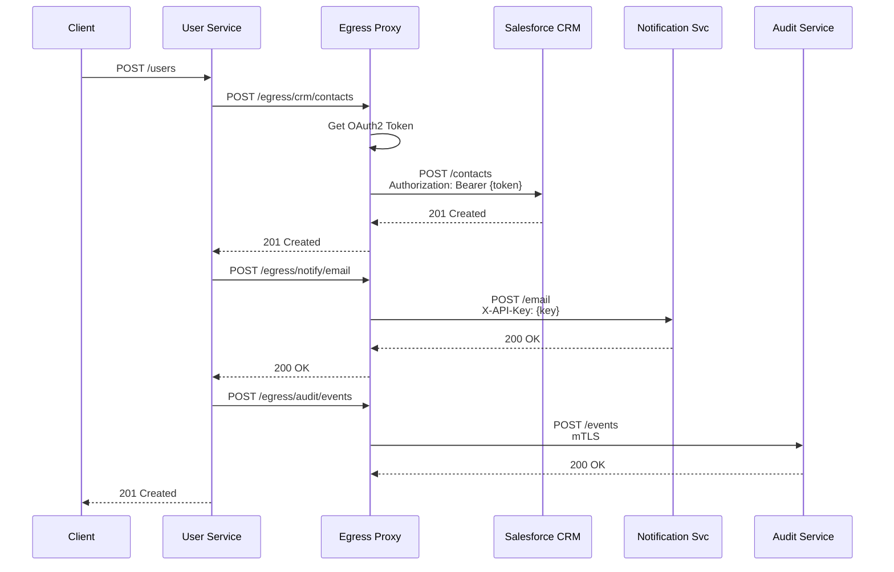
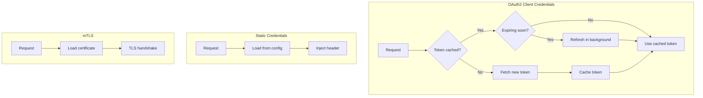
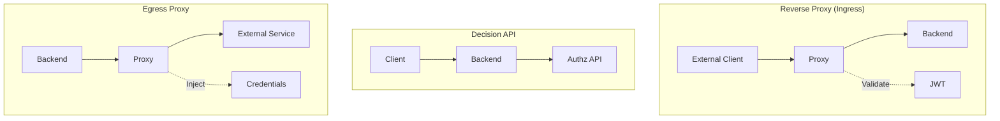

# User CRUD API - Egress Proxy Example

## Сценарий

User Service при CRUD операциях обращается к внешним системам:
- **CRM** (Salesforce) - синхронизация данных клиентов
- **Notification Service** - отправка уведомлений
- **Audit Service** - логирование операций

Egress Proxy автоматически добавляет аутентификацию к исходящим запросам.



---

## 1. Конфигурация Egress Proxy (config.yaml)

```yaml
# =============================================================================
# HTTP Server
# =============================================================================
http:
  addr: ":8080"
  read_timeout: 30s
  write_timeout: 30s

# =============================================================================
# Egress Proxy Configuration
# =============================================================================
egress:
  enabled: true

  # Token storage for OAuth2 tokens
  token_store:
    type: redis
    redis:
      address: "redis:6379"
      password: "${REDIS_PASSWORD}"
      db: 1
      key_prefix: "egress:tokens:"

  # Default settings
  defaults:
    timeout: 30s
    retry_count: 3
    retry_delay: 1s

  # External services (targets)
  targets:
    # Salesforce CRM - OAuth2 Client Credentials
    salesforce:
      url: "https://mycompany.salesforce.com/services/data/v58.0"
      timeout: 15s
      auth:
        type: oauth2_client_credentials
        token_url: "https://login.salesforce.com/services/oauth2/token"
        client_id: "${SALESFORCE_CLIENT_ID}"
        client_secret: "${SALESFORCE_CLIENT_SECRET}"
        scopes: ["api", "refresh_token"]
        refresh_before_expiry: 300s
      tls:
        enabled: true

    # Notification Service - API Key
    notification:
      url: "https://notify.internal.svc"
      timeout: 10s
      auth:
        type: api_key
        header: "X-API-Key"
        key: "${NOTIFICATION_API_KEY}"
      tls:
        enabled: true
        insecure_skip_verify: false

    # Audit Service - mTLS
    audit:
      url: "https://audit.secure.svc"
      timeout: 5s
      auth:
        type: mtls
      tls:
        enabled: true
        client_cert: "/etc/certs/audit-client.crt"
        client_key: "/etc/certs/audit-client.key"
        ca_cert: "/etc/certs/audit-ca.crt"

    # Analytics Service - Bearer Token
    analytics:
      url: "https://analytics.example.com/api/v2"
      timeout: 10s
      auth:
        type: bearer
        token: "${ANALYTICS_BEARER_TOKEN}"

    # Legacy System - Basic Auth
    legacy-erp:
      url: "https://erp.internal:8443/api"
      timeout: 30s
      auth:
        type: basic
        username: "${ERP_USERNAME}"
        password: "${ERP_PASSWORD}"
      tls:
        enabled: true
        insecure_skip_verify: true  # Self-signed cert

  # Route mapping
  routes:
    # CRM routes
    - path_prefix: "/egress/crm"
      target: salesforce
      strip_prefix: "/egress/crm"
      rewrite_prefix: "/sobjects"
      methods: ["GET", "POST", "PUT", "PATCH", "DELETE"]

    # Notification routes
    - path_prefix: "/egress/notify"
      target: notification
      strip_prefix: "/egress/notify"
      methods: ["POST"]

    # Audit routes
    - path_prefix: "/egress/audit"
      target: audit
      strip_prefix: "/egress/audit"
      methods: ["POST"]

    # Analytics routes (read-only)
    - path_prefix: "/egress/analytics"
      target: analytics
      strip_prefix: "/egress/analytics"
      methods: ["GET", "POST"]

    # Legacy ERP
    - path_prefix: "/egress/erp"
      target: legacy-erp
      strip_prefix: "/egress/erp"
      rewrite_prefix: "/v1"

# =============================================================================
# Endpoints
# =============================================================================
endpoints:
  egress: "/egress"
  health: "/health"
  ready: "/ready"
  metrics: "/metrics"

# =============================================================================
# Logging
# =============================================================================
logger:
  level: info
  format: json
```

---

## 2. Backend Integration (Go)

```go
package main

import (
    "bytes"
    "encoding/json"
    "fmt"
    "io"
    "net/http"
    "time"
)

// EgressClient wraps HTTP client for egress proxy
type EgressClient struct {
    baseURL    string
    httpClient *http.Client
}

func NewEgressClient(egressURL string) *EgressClient {
    return &EgressClient{
        baseURL: egressURL,
        httpClient: &http.Client{
            Timeout: 30 * time.Second,
        },
    }
}

// =============================================================================
// CRM Client (Salesforce)
// =============================================================================

type CRMClient struct {
    egress *EgressClient
}

type CRMContact struct {
    ID        string `json:"Id,omitempty"`
    FirstName string `json:"FirstName"`
    LastName  string `json:"LastName"`
    Email     string `json:"Email"`
    Phone     string `json:"Phone,omitempty"`
}

func (c *CRMClient) CreateContact(contact CRMContact) (*CRMContact, error) {
    body, _ := json.Marshal(contact)

    resp, err := c.egress.httpClient.Post(
        c.egress.baseURL+"/egress/crm/Contact",
        "application/json",
        bytes.NewReader(body),
    )
    if err != nil {
        return nil, fmt.Errorf("egress request failed: %w", err)
    }
    defer resp.Body.Close()

    if resp.StatusCode != http.StatusCreated {
        body, _ := io.ReadAll(resp.Body)
        return nil, fmt.Errorf("CRM error %d: %s", resp.StatusCode, body)
    }

    var result CRMContact
    json.NewDecoder(resp.Body).Decode(&result)
    return &result, nil
}

func (c *CRMClient) GetContact(id string) (*CRMContact, error) {
    resp, err := c.egress.httpClient.Get(
        c.egress.baseURL + "/egress/crm/Contact/" + id,
    )
    if err != nil {
        return nil, err
    }
    defer resp.Body.Close()

    var contact CRMContact
    json.NewDecoder(resp.Body).Decode(&contact)
    return &contact, nil
}

func (c *CRMClient) UpdateContact(id string, contact CRMContact) error {
    body, _ := json.Marshal(contact)

    req, _ := http.NewRequest(
        "PATCH",
        c.egress.baseURL+"/egress/crm/Contact/"+id,
        bytes.NewReader(body),
    )
    req.Header.Set("Content-Type", "application/json")

    resp, err := c.egress.httpClient.Do(req)
    if err != nil {
        return err
    }
    defer resp.Body.Close()

    if resp.StatusCode != http.StatusNoContent && resp.StatusCode != http.StatusOK {
        return fmt.Errorf("CRM update failed: %d", resp.StatusCode)
    }
    return nil
}

func (c *CRMClient) DeleteContact(id string) error {
    req, _ := http.NewRequest(
        "DELETE",
        c.egress.baseURL+"/egress/crm/Contact/"+id,
        nil,
    )

    resp, err := c.egress.httpClient.Do(req)
    if err != nil {
        return err
    }
    defer resp.Body.Close()

    return nil
}

// =============================================================================
// Notification Client
// =============================================================================

type NotificationClient struct {
    egress *EgressClient
}

type EmailNotification struct {
    To      string `json:"to"`
    Subject string `json:"subject"`
    Body    string `json:"body"`
    Type    string `json:"type"` // welcome, update, delete
}

func (c *NotificationClient) SendEmail(notif EmailNotification) error {
    body, _ := json.Marshal(notif)

    resp, err := c.egress.httpClient.Post(
        c.egress.baseURL+"/egress/notify/email",
        "application/json",
        bytes.NewReader(body),
    )
    if err != nil {
        return err
    }
    defer resp.Body.Close()

    if resp.StatusCode != http.StatusOK && resp.StatusCode != http.StatusAccepted {
        return fmt.Errorf("notification failed: %d", resp.StatusCode)
    }
    return nil
}

// =============================================================================
// Audit Client
// =============================================================================

type AuditClient struct {
    egress *EgressClient
}

type AuditEvent struct {
    Timestamp  time.Time      `json:"timestamp"`
    Actor      string         `json:"actor"`
    Action     string         `json:"action"`
    Resource   string         `json:"resource"`
    ResourceID string         `json:"resource_id"`
    Details    map[string]any `json:"details,omitempty"`
}

func (c *AuditClient) LogEvent(event AuditEvent) error {
    event.Timestamp = time.Now()
    body, _ := json.Marshal(event)

    resp, err := c.egress.httpClient.Post(
        c.egress.baseURL+"/egress/audit/events",
        "application/json",
        bytes.NewReader(body),
    )
    if err != nil {
        // Audit failures should not break the flow
        fmt.Printf("Audit log failed: %v\n", err)
        return nil
    }
    defer resp.Body.Close()

    return nil
}

// =============================================================================
// User Service with Egress Integration
// =============================================================================

type UserService struct {
    repo   *UserRepository
    crm    *CRMClient
    notify *NotificationClient
    audit  *AuditClient
}

func NewUserService(egressURL string, repo *UserRepository) *UserService {
    egress := NewEgressClient(egressURL)
    return &UserService{
        repo:   repo,
        crm:    &CRMClient{egress: egress},
        notify: &NotificationClient{egress: egress},
        audit:  &AuditClient{egress: egress},
    }
}

// CreateUser creates user and syncs with external systems
func (s *UserService) CreateUser(actor string, user User) (*User, error) {
    // 1. Create in local DB
    created, err := s.repo.Create(user)
    if err != nil {
        return nil, err
    }

    // 2. Sync to CRM
    crmContact, err := s.crm.CreateContact(CRMContact{
        FirstName: user.FirstName,
        LastName:  user.LastName,
        Email:     user.Email,
        Phone:     user.Phone,
    })
    if err != nil {
        // Log but don't fail
        fmt.Printf("CRM sync failed: %v\n", err)
    } else {
        // Update local record with CRM ID
        created.CRMContactID = crmContact.ID
        s.repo.Update(created.ID, *created)
    }

    // 3. Send welcome notification
    s.notify.SendEmail(EmailNotification{
        To:      user.Email,
        Subject: "Welcome!",
        Body:    fmt.Sprintf("Hello %s, welcome to our platform!", user.FirstName),
        Type:    "welcome",
    })

    // 4. Audit log
    s.audit.LogEvent(AuditEvent{
        Actor:      actor,
        Action:     "create",
        Resource:   "user",
        ResourceID: created.ID,
        Details:    map[string]any{"email": user.Email},
    })

    return created, nil
}

// UpdateUser updates user and syncs changes
func (s *UserService) UpdateUser(actor, id string, updates User) (*User, error) {
    // 1. Update in local DB
    updated, err := s.repo.Update(id, updates)
    if err != nil {
        return nil, err
    }

    // 2. Sync to CRM
    if updated.CRMContactID != "" {
        s.crm.UpdateContact(updated.CRMContactID, CRMContact{
            FirstName: updates.FirstName,
            LastName:  updates.LastName,
            Email:     updates.Email,
            Phone:     updates.Phone,
        })
    }

    // 3. Audit log
    s.audit.LogEvent(AuditEvent{
        Actor:      actor,
        Action:     "update",
        Resource:   "user",
        ResourceID: id,
    })

    return updated, nil
}

// DeleteUser deletes user from all systems
func (s *UserService) DeleteUser(actor, id string) error {
    user, err := s.repo.GetByID(id)
    if err != nil {
        return err
    }

    // 1. Delete from CRM
    if user.CRMContactID != "" {
        s.crm.DeleteContact(user.CRMContactID)
    }

    // 2. Delete from local DB
    if err := s.repo.Delete(id); err != nil {
        return err
    }

    // 3. Send notification
    s.notify.SendEmail(EmailNotification{
        To:      user.Email,
        Subject: "Account Deleted",
        Body:    "Your account has been deleted.",
        Type:    "delete",
    })

    // 4. Audit log
    s.audit.LogEvent(AuditEvent{
        Actor:      actor,
        Action:     "delete",
        Resource:   "user",
        ResourceID: id,
    })

    return nil
}
```

---

## 3. Примеры запросов через Egress Proxy

### 3.1 CRM (OAuth2)

```bash
# CREATE contact in Salesforce
# Egress автоматически получает OAuth2 токен
curl -X POST http://localhost:8080/egress/crm/Contact \
  -H "Content-Type: application/json" \
  -d '{
    "FirstName": "John",
    "LastName": "Doe",
    "Email": "john@example.com"
  }'

# Egress Proxy делает:
# POST https://mycompany.salesforce.com/services/data/v58.0/sobjects/Contact
# Authorization: Bearer <oauth2-token>
# Content-Type: application/json

# Response: 201 Created
{
  "Id": "003xx000004TmiQAAS",
  "success": true
}
```

```bash
# GET contact
curl http://localhost:8080/egress/crm/Contact/003xx000004TmiQAAS

# Egress Proxy делает:
# GET https://mycompany.salesforce.com/services/data/v58.0/sobjects/Contact/003xx000004TmiQAAS
# Authorization: Bearer <oauth2-token>
```

```bash
# UPDATE contact
curl -X PATCH http://localhost:8080/egress/crm/Contact/003xx000004TmiQAAS \
  -H "Content-Type: application/json" \
  -d '{"Phone": "+1234567890"}'
```

```bash
# DELETE contact
curl -X DELETE http://localhost:8080/egress/crm/Contact/003xx000004TmiQAAS
```

### 3.2 Notification Service (API Key)

```bash
# Send email notification
curl -X POST http://localhost:8080/egress/notify/email \
  -H "Content-Type: application/json" \
  -d '{
    "to": "user@example.com",
    "subject": "Welcome!",
    "body": "Hello and welcome!",
    "type": "welcome"
  }'

# Egress Proxy делает:
# POST https://notify.internal.svc/email
# X-API-Key: <api-key>
# Content-Type: application/json
```

### 3.3 Audit Service (mTLS)

```bash
# Log audit event
curl -X POST http://localhost:8080/egress/audit/events \
  -H "Content-Type: application/json" \
  -d '{
    "actor": "admin@example.com",
    "action": "create",
    "resource": "user",
    "resource_id": "user-123"
  }'

# Egress Proxy делает:
# POST https://audit.secure.svc/events
# (mTLS client certificate authentication)
# Content-Type: application/json
```

### 3.4 Analytics (Bearer Token)

```bash
# Get analytics
curl http://localhost:8080/egress/analytics/users/stats

# Egress Proxy делает:
# GET https://analytics.example.com/api/v2/users/stats
# Authorization: Bearer <static-token>
```

### 3.5 Legacy ERP (Basic Auth)

```bash
# Get data from legacy system
curl http://localhost:8080/egress/erp/customers/123

# Egress Proxy делает:
# GET https://erp.internal:8443/api/v1/customers/123
# Authorization: Basic <base64(user:pass)>
```

---

## 4. Credential Flow



---

## 5. Маршрутизация

| Incoming Path | Target | Outgoing URL |
|---------------|--------|--------------|
| `/egress/crm/Contact` | salesforce | `https://salesforce.com/.../sobjects/Contact` |
| `/egress/crm/Contact/123` | salesforce | `https://salesforce.com/.../sobjects/Contact/123` |
| `/egress/notify/email` | notification | `https://notify.internal.svc/email` |
| `/egress/audit/events` | audit | `https://audit.secure.svc/events` |
| `/egress/analytics/stats` | analytics | `https://analytics.example.com/api/v2/stats` |
| `/egress/erp/customers` | legacy-erp | `https://erp.internal:8443/api/v1/customers` |

---

## 6. Docker Compose

```yaml
version: '3.8'

services:
  egress-proxy:
    image: authz-service:latest
    ports:
      - "8080:8080"
    volumes:
      - ./config.yaml:/etc/authz/config.yaml
      - ./certs:/etc/certs:ro
    environment:
      - AUTHZ_CONFIG_PATH=/etc/authz/config.yaml
      - REDIS_PASSWORD=${REDIS_PASSWORD}
      - SALESFORCE_CLIENT_ID=${SALESFORCE_CLIENT_ID}
      - SALESFORCE_CLIENT_SECRET=${SALESFORCE_CLIENT_SECRET}
      - NOTIFICATION_API_KEY=${NOTIFICATION_API_KEY}
      - ANALYTICS_BEARER_TOKEN=${ANALYTICS_BEARER_TOKEN}
      - ERP_USERNAME=${ERP_USERNAME}
      - ERP_PASSWORD=${ERP_PASSWORD}
    depends_on:
      - redis

  user-service:
    image: user-service:latest
    ports:
      - "8081:8080"
    environment:
      - EGRESS_URL=http://egress-proxy:8080
      - DB_HOST=postgres
    depends_on:
      - egress-proxy
      - postgres

  redis:
    image: redis:7-alpine
    command: redis-server --requirepass ${REDIS_PASSWORD}

  postgres:
    image: postgres:15
    environment:
      - POSTGRES_DB=users
      - POSTGRES_USER=app
      - POSTGRES_PASSWORD=secret
```

---

## 7. Логи

```json
{"level":"info","ts":"2025-01-15T10:30:00Z","msg":"Egress request","target":"salesforce","method":"POST","path":"/egress/crm/Contact","target_url":"https://mycompany.salesforce.com/services/data/v58.0/sobjects/Contact","duration":"245ms","status":201}

{"level":"debug","ts":"2025-01-15T10:30:00Z","msg":"Credentials refreshed","target":"salesforce","type":"oauth2","expires_at":"2025-01-15T11:30:00Z"}

{"level":"info","ts":"2025-01-15T10:30:01Z","msg":"Egress request","target":"notification","method":"POST","path":"/egress/notify/email","target_url":"https://notify.internal.svc/email","duration":"45ms","status":200}

{"level":"info","ts":"2025-01-15T10:30:01Z","msg":"Egress request","target":"audit","method":"POST","path":"/egress/audit/events","target_url":"https://audit.secure.svc/events","duration":"12ms","status":200}
```

---

## 8. Сравнение режимов



| Аспект | Reverse Proxy | Decision API | Egress Proxy |
|--------|---------------|--------------|--------------|
| Направление | Входящие | Входящие | Исходящие |
| Цель | Защита backend | Проверка прав | Доступ к внешним API |
| Auth | Валидация JWT | Валидация JWT | Инъекция credentials |
| Управление | Централизованное | В приложении | Централизованное |
