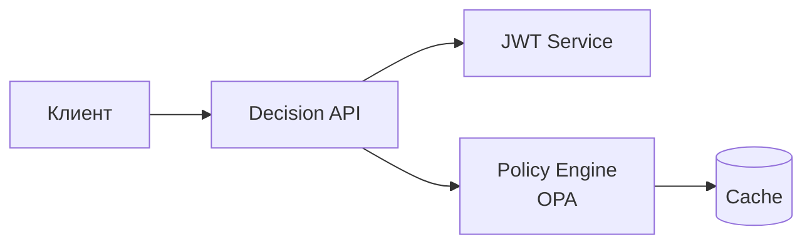

# Decision API - Руководство администратора

## Обзор

Decision API - основной режим работы сервиса. Принимает запросы на авторизацию и возвращает решение (allow/deny) на основе JWT токена и политик.



---

## Параметры конфигурации

### HTTP сервер

| Параметр | Тип | По умолчанию | Описание |
|----------|-----|--------------|----------|
| `http.addr` | string | `:8080` | Адрес и порт сервера |
| `http.read_timeout` | duration | `15s` | Таймаут чтения запроса |
| `http.write_timeout` | duration | `15s` | Таймаут записи ответа |
| `http.idle_timeout` | duration | `60s` | Таймаут idle соединения |
| `http.max_header_bytes` | int | `1048576` | Макс. размер заголовков (1MB) |

### JWT валидация

| Параметр | Тип | По умолчанию | Описание |
|----------|-----|--------------|----------|
| `jwt.issuer` | string | - | **Обязательно.** URL издателя токенов (Keycloak realm) |
| `jwt.audience` | string | - | Ожидаемый audience в токене |
| `jwt.jwks_url` | string | - | URL для получения JWKS (auto: `{issuer}/protocol/openid-connect/certs`) |
| `jwt.jwks_refresh_interval` | duration | `1h` | Интервал обновления JWKS |
| `jwt.required_claims` | []string | - | Обязательные claims в токене |
| `jwt.allowed_algorithms` | []string | `["RS256"]` | Разрешённые алгоритмы подписи |

### Политики (OPA)

| Параметр | Тип | По умолчанию | Описание |
|----------|-----|--------------|----------|
| `policy.engine` | string | `builtin` | Движок: `builtin`, `opa_sidecar`, `opa_embedded` |
| `policy.path` | string | `./policies` | Путь к файлам политик (.rego) |
| `policy.default_decision` | string | `deny` | Решение по умолчанию: `allow`, `deny` |
| `policy.query` | string | `data.authz.allow` | OPA query для получения решения |

#### OPA Sidecar режим

| Параметр | Тип | Описание |
|----------|-----|----------|
| `policy.opa.url` | string | URL OPA сервера (например, `http://localhost:8181`) |
| `policy.opa.policy_path` | string | Путь к политике в OPA (`/v1/data/authz/allow`) |
| `policy.opa.timeout` | duration | Таймаут запроса к OPA |

#### OPA Embedded режим

| Параметр | Тип | Описание |
|----------|-----|----------|
| `policy.bundle.url` | string | URL для загрузки бандла политик |
| `policy.bundle.polling_interval` | duration | Интервал проверки обновлений |
| `policy.bundle.auth_token` | string | Токен для загрузки бандла |

### Кэширование

| Параметр | Тип | По умолчанию | Описание |
|----------|-----|--------------|----------|
| `cache.enabled` | bool | `true` | Включить кэширование решений |
| `cache.type` | string | `memory` | Тип: `memory`, `redis` |
| `cache.ttl` | duration | `5m` | Время жизни записи в кэше |
| `cache.max_size` | int | `10000` | Макс. количество записей (memory) |

#### Redis кэш

| Параметр | Тип | Описание |
|----------|-----|----------|
| `cache.redis.address` | string | Адрес Redis (host:port) |
| `cache.redis.password` | string | Пароль |
| `cache.redis.db` | int | Номер базы данных |
| `cache.redis.key_prefix` | string | Префикс ключей |

### Endpoints

| Параметр | Тип | По умолчанию | Описание |
|----------|-----|--------------|----------|
| `endpoints.authorize` | string | `/api/v1/authorize` | Endpoint авторизации |
| `endpoints.authorize_batch` | string | `/api/v1/authorize/batch` | Batch авторизация |
| `endpoints.token_validate` | string | `/api/v1/token/validate` | Валидация токена |
| `endpoints.token_exchange` | string | `/api/v1/token/exchange` | Token Exchange (RFC 8693) |
| `endpoints.health` | string | `/health` | Health check |
| `endpoints.ready` | string | `/ready` | Readiness probe |
| `endpoints.live` | string | `/live` | Liveness probe |
| `endpoints.metrics` | string | `/metrics` | Prometheus метрики |

### Аудит

| Параметр | Тип | По умолчанию | Описание |
|----------|-----|--------------|----------|
| `audit.enabled` | bool | `false` | Включить аудит |
| `audit.log_allowed` | bool | `true` | Логировать разрешённые запросы |
| `audit.log_denied` | bool | `true` | Логировать отклонённые запросы |
| `audit.include_token` | bool | `false` | Включать токен в лог (осторожно!) |

### Логирование

| Параметр | Тип | По умолчанию | Описание |
|----------|-----|--------------|----------|
| `logger.level` | string | `info` | Уровень: `debug`, `info`, `warn`, `error` |
| `logger.format` | string | `json` | Формат: `json`, `console` |
| `logger.output` | string | `stdout` | Вывод: `stdout`, `stderr`, путь к файлу |

---

## Комплексный пример

```yaml
# HTTP сервер
http:
  addr: ":8080"
  read_timeout: 15s
  write_timeout: 15s
  idle_timeout: 60s

# JWT валидация
jwt:
  issuer: "https://keycloak.example.com/realms/production"
  audience: "authz-service"
  jwks_refresh_interval: 1h
  required_claims:
    - "sub"
    - "realm_access"
  allowed_algorithms:
    - "RS256"
    - "ES256"

# Политики
policy:
  engine: opa_embedded
  path: "/etc/authz/policies"
  default_decision: deny
  query: "data.authz.allow"
  bundle:
    url: "https://opa-bundle.example.com/authz/bundle.tar.gz"
    polling_interval: 5m
    auth_token: "${OPA_BUNDLE_TOKEN}"

# Кэширование
cache:
  enabled: true
  type: redis
  ttl: 5m
  redis:
    address: "redis:6379"
    password: "${REDIS_PASSWORD}"
    db: 0
    key_prefix: "authz:decisions:"

# Endpoints
endpoints:
  authorize: "/api/v1/authorize"
  authorize_batch: "/api/v1/authorize/batch"
  token_validate: "/api/v1/token/validate"
  health: "/health"
  ready: "/ready"
  live: "/live"
  metrics: "/metrics"

# Аудит
audit:
  enabled: true
  log_allowed: true
  log_denied: true
  include_token: false

# Логирование
logger:
  level: info
  format: json
  output: stdout
```

---

## API запросы

### Авторизация

```bash
curl -X POST http://localhost:8080/api/v1/authorize \
  -H "Authorization: Bearer ${TOKEN}" \
  -H "Content-Type: application/json" \
  -d '{
    "resource": {"type": "document", "id": "123"},
    "action": "read"
  }'
```

### Batch авторизация

```bash
curl -X POST http://localhost:8080/api/v1/authorize/batch \
  -H "Content-Type: application/json" \
  -d '{
    "token": "...",
    "requests": [
      {"resource": {"type": "document", "id": "1"}, "action": "read"},
      {"resource": {"type": "document", "id": "2"}, "action": "write"}
    ]
  }'
```

---

## Формат ответа

```json
{
  "allowed": true,
  "reasons": ["user has role admin"],
  "metadata": {
    "policy_version": "1.2.0",
    "evaluated_at": "2025-01-15T10:30:00Z"
  }
}
```

---

## Метрики

| Метрика | Описание |
|---------|----------|
| `authz_decisions_total` | Количество решений (allowed/denied) |
| `authz_decision_duration_seconds` | Время принятия решения |
| `authz_cache_hits_total` | Попадания в кэш |
| `authz_cache_misses_total` | Промахи кэша |
| `authz_jwt_validations_total` | Валидации токенов |
| `authz_policy_evaluations_total` | Вычисления политик |
