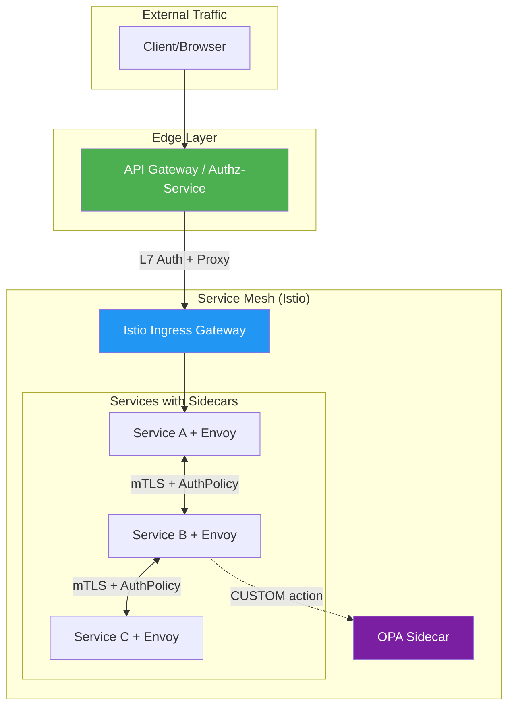
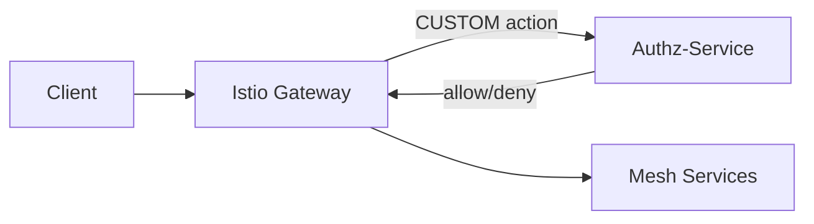
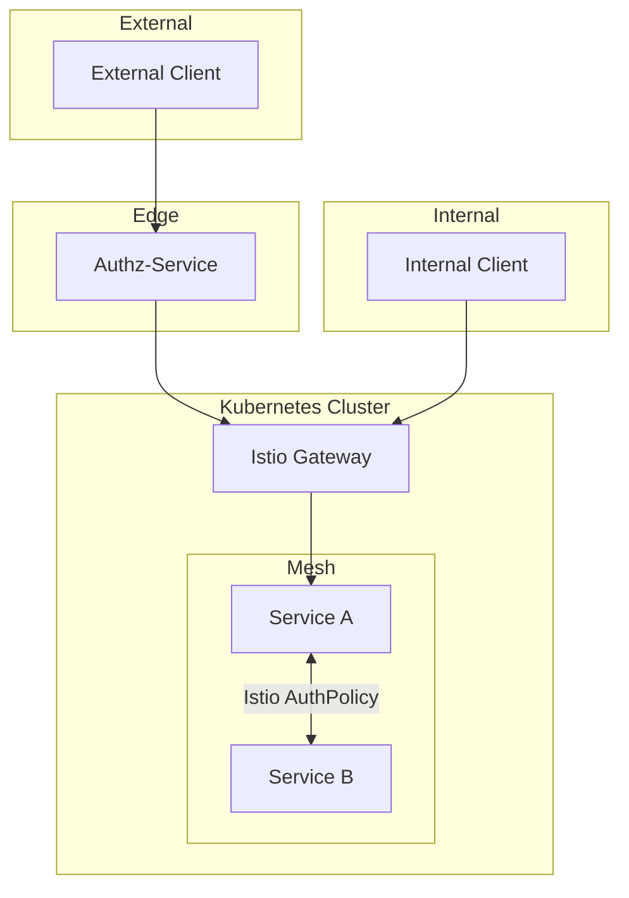

# Сравнение Authz-Service с Istio и OPA

Данный документ анализирует степень пересечения функционала authz-service с решениями на базе Istio.

## Архитектурное позиционирование



**Ключевое различие:**
- **Istio** — service mesh, работает на уровне sidecar proxy между сервисами
- **Authz-Service** — edge/API gateway, работает на входе в систему
- **OPA** — policy engine, может быть добавлен к Istio для сложной логики

## Сравнительная таблица возможностей

| Функция | Authz-Service | Istio AuthPolicy | Istio + OPA |
|---------|:-------------:|:----------------:|:-----------:|
| **Policy Language** | CEL | YAML CRD | Rego |
| **JWT Claims Access** | ✅ Полный | ⚠️ Ограниченный | ✅ Полный |
| **Path Matching** | ✅ `*`, `**`, `:param` | ✅ `{*}`, `{**}` | ✅ Любой |
| **HTTP Headers** | ✅ Полный | ⚠️ Ограниченный | ✅ Полный |
| **Query Parameters** | ✅ | ❌ | ✅ |
| **Request Body** | ❌ | ❌ | ✅ |
| **Regex Matching** | ✅ `matches()` | ❌ | ✅ |
| **mTLS/SPIFFE Identity** | ❌ | ✅ | ✅ |
| **L3/L4 Network Rules** | ❌ | ✅ | ✅ |
| **Caching** | ✅ Redis/Memory | ❌ | ⚠️ Manual |
| **External Data** | ❌ | ❌ | ✅ |
| **Environment Context** | ✅ | ❌ | ✅ |
| **Feature Flags** | ✅ Built-in | ❌ | ⚠️ Manual |
| **Rate Limiting** | ✅ Built-in | ❌ Separate | ❌ Separate |
| **Circuit Breaker** | ✅ Built-in | ❌ Separate | ❌ Separate |
| **Audit Trail** | ✅ Kafka/Webhook | ⚠️ AUDIT action | ✅ Decision logs |
| **Requires K8s** | ❌ | ✅ | ✅ |

## Детальное сравнение

### 1. Istio AuthorizationPolicy (без OPA)

**Возможности:**
- Service-to-service авторизация на основе mTLS identity
- Namespace и workload изоляция
- IP whitelisting/blacklisting (ipBlocks, remoteIpBlocks)
- Базовые JWT проверки (issuer, subject)
- Path/method/host matching с wildcards
- L3/L4 сетевые политики

**Ограничения:**
- YAML-based правила без сложной логики
- Нет regex matching
- Нет доступа к query parameters
- Нет кастомных функций
- Ограниченный доступ к JWT claims

**Пример Istio AuthorizationPolicy:**
```yaml
apiVersion: security.istio.io/v1
kind: AuthorizationPolicy
metadata:
  name: httpbin-policy
  namespace: default
spec:
  selector:
    matchLabels:
      app: httpbin
  action: ALLOW
  rules:
  - from:
    - source:
        requestPrincipals: ["*"]
    to:
    - operation:
        methods: ["GET"]
        paths: ["/api/*"]
    when:
    - key: request.auth.claims[groups]
      values: ["admin"]
```

**Эквивалент в Authz-Service:**
```yaml
rules:
  - id: httpbin-policy
    path: /api/*
    methods: [GET]
    condition: '"admin" in token.claims.groups'
    action: allow
```

### 2. Istio + OPA

**Дополнительные возможности OPA:**
- Rego — полноценный policy language
- Доступ к request body
- External data fetching
- Сложная бизнес-логика
- Централизованное управление политиками
- Decision logging

**Пример OPA Rego политики:**
```rego
package istio.authz

default allow = false

allow {
    input.attributes.request.http.method == "GET"
    glob.match("/api/*", [], input.attributes.request.http.path)
    token.payload.groups[_] == "admin"
}

token = {"payload": payload} {
    [_, encoded, _] := split(input.attributes.request.http.headers.authorization, ".")
    payload := json.unmarshal(base64url.decode(encoded))
}
```

**Эквивалент в Authz-Service (CEL):**
```yaml
rules:
  - id: admin-api-access
    path: /api/*
    methods: [GET]
    condition: '"admin" in token.claims.groups'
    action: allow
```

### 3. Authz-Service

**Уникальные возможности:**
- CEL expressions (типобезопасный, компилируемый)
- Встроенное кэширование решений (Redis, in-memory)
- Встроенный rate limiting
- Встроенный circuit breaker
- Environment context (region, cluster, features)
- Feature flags в политиках
- Reverse proxy в одном бинарнике
- Не требует Kubernetes

**Пример CEL политики:**
```yaml
rules:
  - id: production-admin-only
    path: /admin/**
    condition: |
      env.name == "production" &&
      "admin" in token.roles &&
      env.features["admin_panel_v2"] == true
    action: allow
```

## Степень пересечения функционала

### С чистым Istio AuthorizationPolicy: ~60%

**Общее:**
- JWT валидация и claims access
- Path/method matching
- Header checks
- Allow/Deny actions

**Уникальное для Istio:**
- mTLS/SPIFFE identity
- L3/L4 network rules
- Namespace isolation
- Service account matching

**Уникальное для Authz-Service:**
- CEL expressions
- Regex matching
- Query parameters
- Caching
- Rate limiting
- Circuit breaker
- Environment context

### С Istio + OPA: ~80%

**Общее:**
- Сложные policy expressions
- JWT claims access
- Path/method/header matching
- Query parameters
- Environment context

**Уникальное для Istio + OPA:**
- mTLS identity
- L3/L4 rules
- Request body access
- External data fetching
- Rego ecosystem

**Уникальное для Authz-Service:**
- CEL (проще Rego)
- Built-in caching
- Built-in rate limiting
- Built-in circuit breaker
- Single binary deployment
- No K8s requirement

## Когда использовать каждое решение

### Выбирайте Istio AuthorizationPolicy когда:

1. **Service-to-service авторизация** — нужна изоляция между сервисами в mesh
2. **Namespace isolation** — разделение по namespace в Kubernetes
3. **mTLS identity** — авторизация на основе SPIFFE identity
4. **IP-based rules** — whitelisting/blacklisting по IP
5. **Уже используете Istio** — минимальный overhead

### Выбирайте Istio + OPA когда:

1. **Сложная бизнес-логика** — правила, которые не выразить в YAML
2. **Request body inspection** — нужен доступ к телу запроса
3. **External data** — решения на основе внешних данных (DB, API)
4. **End-user-to-resource** — fine-grained доступ к ресурсам
5. **Централизованные политики** — управление через Styra DAS или аналоги

### Выбирайте Authz-Service когда:

1. **Edge/API Gateway** — авторизация на входе в систему
2. **Нет Kubernetes** — VM, bare metal, Docker Compose
3. **All-in-one решение** — proxy + auth + rate limit + circuit breaker
4. **CEL предпочтительнее Rego** — типобезопасность, простота
5. **Кэширование решений** — высокая нагрузка, нужен Redis cache
6. **Environment-aware** — canary deployments, regional restrictions
7. **Feature flags** — gradual rollout функционала
8. **Минимальный overhead** — один бинарник без зависимостей

## Варианты интеграции

### Вариант 1: Authz-Service как Edge Gateway


**Использование:**
- Authz-Service на edge для JWT валидации и rate limiting
- Istio для service-to-service авторизации внутри mesh
- Defense-in-depth архитектура

### Вариант 2: Authz-Service как External Authorizer



**Конфигурация Istio:**
```yaml
apiVersion: security.istio.io/v1
kind: AuthorizationPolicy
metadata:
  name: ext-authz
spec:
  action: CUSTOM
  provider:
    name: authz-service
  rules:
  - to:
    - operation:
        paths: ["/api/*"]
---
apiVersion: networking.istio.io/v1alpha3
kind: EnvoyFilter
metadata:
  name: ext-authz-filter
spec:
  configPatches:
  - applyTo: HTTP_FILTER
    match:
      context: SIDECAR_INBOUND
    patch:
      operation: INSERT_BEFORE
      value:
        name: envoy.filters.http.ext_authz
        typed_config:
          "@type": type.googleapis.com/envoy.extensions.filters.http.ext_authz.v3.ExtAuthz
          grpc_service:
            envoy_grpc:
              cluster_name: authz-service
```

### Вариант 3: Параллельное использование



**Использование:**
- External traffic через Authz-Service (JWT, rate limit, CEL rules)
- Internal traffic напрямую через Istio Gateway
- Service-to-service через Istio AuthorizationPolicy

## Сравнение языков политик

### CEL (Authz-Service)

```cel
// Простой и читаемый синтаксис
token.roles.exists(r, r == "admin") &&
request.path.startsWith("/api/v2") &&
env.name == "production"
```

**Преимущества:**
- Типобезопасность на этапе компиляции
- Простой синтаксис, похожий на обычные языки
- Быстрая компиляция и выполнение
- Встроенная поддержка в Google Cloud, Kubernetes

### Rego (OPA)

```rego
// Более мощный, но сложнее
allow {
    some role in input.token.roles
    role == "admin"
    startswith(input.request.path, "/api/v2")
    input.env.name == "production"
}
```

**Преимущества:**
- Полноценный язык с модулями
- Поддержка external data
- Мощная экосистема
- Decision logging из коробки

### YAML (Istio)

```yaml
# Декларативный, но ограниченный
when:
- key: request.auth.claims[roles]
  values: ["admin"]
```

**Преимущества:**
- Простота для базовых случаев
- Нативная интеграция с K8s
- Не требует изучения нового языка

## Производительность

| Метрика | Authz-Service | Istio AuthPolicy | Istio + OPA |
|---------|---------------|------------------|-------------|
| Latency (p50) | ~1-2ms | ~0.5ms | ~2-5ms |
| Latency с cache | ~0.1ms | N/A | ~0.5ms |
| Memory overhead | ~50MB | Envoy sidecar | +50MB per pod |
| CPU overhead | Minimal | Envoy processing | Policy evaluation |

**Примечания:**
- Istio AuthPolicy быстрее за счёт inline evaluation в Envoy
- Authz-Service выигрывает при включённом кэшировании
- OPA добавляет latency на external call

## Заключение

**Authz-Service не конкурирует напрямую с Istio** — они работают на разных уровнях:

- **Istio** оптимален для service mesh и service-to-service авторизации
- **Authz-Service** оптимален для edge/API gateway авторизации
- **OPA** добавляет сложную логику к любому решению

**Рекомендации:**

1. Для новых проектов без K8s — **Authz-Service**
2. Для K8s с простыми правилами — **Istio AuthPolicy**
3. Для K8s со сложной логикой — **Istio + OPA** или **Authz-Service как External Authorizer**
4. Для максимальной защиты — комбинация **Authz-Service (edge) + Istio (mesh)**

## Ссылки

- [Istio Authorization Policy Reference](https://istio.io/latest/docs/reference/config/security/authorization-policy/)
- [Istio Security Concepts](https://istio.io/latest/docs/concepts/security/)
- [OPA Istio Tutorial](https://www.openpolicyagent.org/docs/latest/envoy-tutorial-istio/)
- [CEL Specification](https://github.com/google/cel-spec)
- [Fine-grained Authorization with Istio and OPA](https://www.solo.io/blog/fine-grained-service-authorizations-istio-opa)
