# ТЕХНИЧЕСКОЕ ЗАДАНИЕ (v2.0 - Дополненное)

## Система аутентификации и авторизации пользователей и межсервисных взаимодействий

---

## 1. Общие положения

### 1.1. Назначение документа

Настоящее техническое задание определяет требования к проектированию, реализации и эксплуатации единой системы **аутентификации и авторизации** (IAM + Service Authorization), предназначенной для:

* аутентификации конечных пользователей;
* авторизации пользовательских запросов;
* аутентификации и авторизации межсервисных взаимодействий;
* поддержки пользовательских цепочек вызовов между сервисами;
* централизованного и декларативного управления политиками доступа;
* **аудита и мониторинга всех операций безопасности**.

Документ предназначен для архитекторов, backend-разработчиков, DevOps/SRE-команд и специалистов по безопасности.

### 1.2. Цели и задачи системы

#### Основные цели:

* Централизовать управление идентичностями, ролями, группами и атрибутами.
* Обеспечить обязательную и проверяемую авторизацию **всех** запросов (user → service, service → service).
* Минимизировать связность сервисов с IAM-логикой.
* Обеспечить расширяемость и соответствие отраслевым стандартам.
* **Обеспечить полную наблюдаемость (observability) системы безопасности.**

#### Ключевые задачи:

* Интеграция корпоративного каталога пользователей с IdP.
* Реализация безопасной модели user authentication + service authentication.
* Разработка универсального авторизационного слоя.
* Поддержка token delegation (user-initiated service chains).
* Снижение latency и трафика за счёт контролируемого кеширования.
* **Реализация comprehensive audit trail.**
* **Интеграция с системами мониторинга и алертинга.**

---

## 2. Архитектура системы

### 2.1. Высокоуровневая архитектура

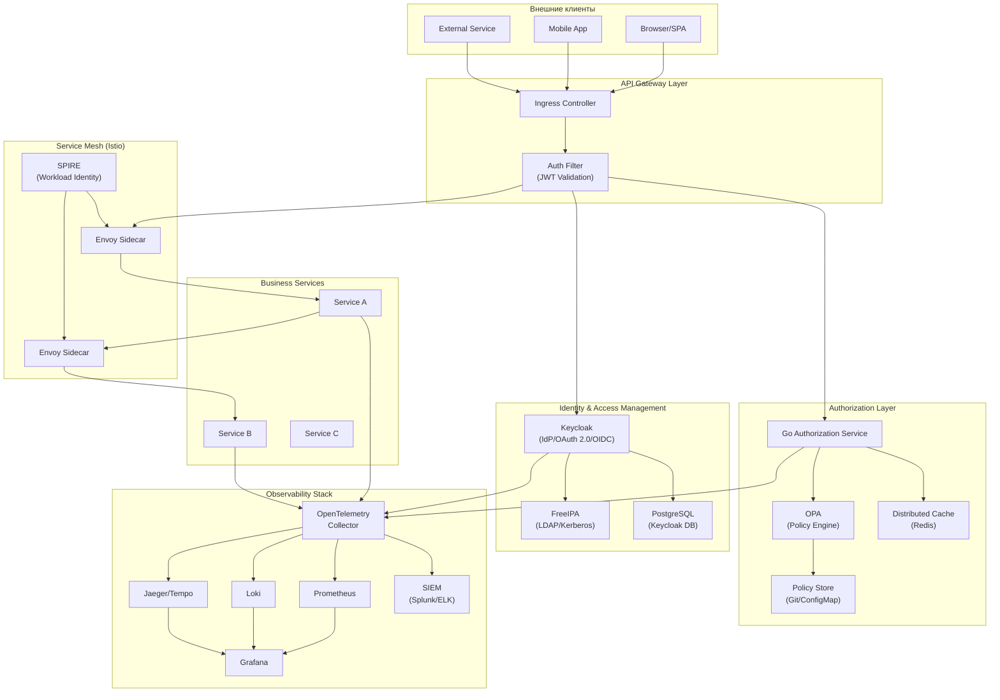
```mermaid
flowchart TB
    subgraph External["Внешние клиенты"]
        Browser["Browser/SPA"]
        Mobile["Mobile App"]
        ExtService["External Service"]
    end

    subgraph Gateway["API Gateway Layer"]
        Ingress["Ingress Controller"]
        AuthFilter["Auth Filter<br/>(JWT Validation)"]
    end

    subgraph IAM["Identity & Access Management"]
        Keycloak["Keycloak<br/>(IdP/OAuth 2.0/OIDC)"]
        FreeIPA["FreeIPA<br/>(LDAP/Kerberos)"]
        PostgreSQL["PostgreSQL<br/>(Keycloak DB)"]
    end

    subgraph AuthzLayer["Authorization Layer"]
        OPA["OPA<br/>(Policy Engine)"]
        AuthzService["Go Authorization Service"]
        PolicyStore["Policy Store<br/>(Git/ConfigMap)"]
        Cache["Distributed Cache<br/>(Redis)"]
    end

    subgraph ServiceMesh["Service Mesh (Istio)"]
        Sidecar1["Envoy Sidecar"]
        Sidecar2["Envoy Sidecar"]
        SPIRE["SPIRE<br/>(Workload Identity)"]
    end

    subgraph Services["Business Services"]
        ServiceA["Service A"]
        ServiceB["Service B"]
        ServiceC["Service C"]
    end

    subgraph Observability["Observability Stack"]
        OTel["OpenTelemetry<br/>Collector"]
        Prometheus["Prometheus"]
        Grafana["Grafana"]
        Loki["Loki"]
        Jaeger["Jaeger/Tempo"]
        SIEM["SIEM<br/>(Splunk/ELK)"]
    end

    Browser --> Ingress
    Mobile --> Ingress
    ExtService --> Ingress

    Ingress --> AuthFilter
    AuthFilter --> Keycloak
    AuthFilter --> AuthzService

    Keycloak --> FreeIPA
    Keycloak --> PostgreSQL

    AuthzService --> OPA
    AuthzService --> Cache
    OPA --> PolicyStore

    AuthFilter --> Sidecar1
    Sidecar1 --> ServiceA
    ServiceA --> Sidecar2
    Sidecar2 --> ServiceB

    SPIRE --> Sidecar1
    SPIRE --> Sidecar2

    AuthzService --> OTel
    Keycloak --> OTel
    ServiceA --> OTel
    ServiceB --> OTel

    OTel --> Prometheus
    OTel --> Loki
    OTel --> Jaeger
    OTel --> SIEM
    Prometheus --> Grafana
    Loki --> Grafana
    Jaeger --> Grafana
```

### 2.2. Технологический стек

#### Обязательные компоненты

| Компонент | Версия | Назначение | Референс |
|-----------|--------|------------|----------|
| **Keycloak** | 26.x+ | Identity Provider (OIDC/OAuth 2.0) | [Keycloak Docs](https://www.keycloak.org/documentation) |
| **FreeIPA** | 4.11+ | Корпоративный каталог (LDAP/Kerberos) | [FreeIPA Docs](https://freeipa.org/page/Documentation) |
| **PostgreSQL** | 16+ | Хранилище данных Keycloak | [PostgreSQL Docs](https://www.postgresql.org/docs/) |
| **OPA** | 0.60+ | Policy Engine (Rego) | [OPA Docs](https://www.openpolicyagent.org/docs/latest/) |
| **SPIRE** | 1.9+ | SPIFFE Workload Identity | [SPIFFE/SPIRE](https://spiffe.io/docs/latest/) |
| **Kubernetes** | 1.29+ | Платформа исполнения | [K8s Docs](https://kubernetes.io/docs/) |
| **Go** | 1.22+ | Authorization Layer | [Go Docs](https://go.dev/doc/) |
| **Redis** | 7.2+ | Distributed Cache | [Redis Docs](https://redis.io/docs/) |

#### Опциональные компоненты

| Компонент | Версия | Назначение |
|-----------|--------|------------|
| **Istio** | 1.20+ | Service Mesh (mTLS, Envoy) |
| **Calico** | 3.27+ | Network Policies |
| **Vault** | 1.15+ | Secrets Management |

---

## 3. Аутентификация пользователей

### 3.1. Источник идентичности

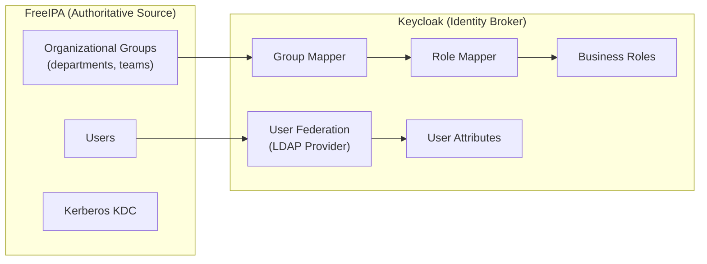
```mermaid
flowchart LR
    subgraph FreeIPA["FreeIPA (Authoritative Source)"]
        Users["Users"]
        OrgGroups["Organizational Groups<br/>(departments, teams)"]
        Kerberos["Kerberos KDC"]
    end

    subgraph Keycloak["Keycloak (Identity Broker)"]
        UserFed["User Federation<br/>(LDAP Provider)"]
        GroupMapper["Group Mapper"]
        RoleMapper["Role Mapper"]
        BizRoles["Business Roles"]
        Attributes["User Attributes"]
    end

    Users --> UserFed
    OrgGroups --> GroupMapper
    GroupMapper --> RoleMapper
    RoleMapper --> BizRoles
    UserFed --> Attributes
```

**Уточнение:** FreeIPA является **единственным источником истины** для:
- Учётных данных пользователей (credentials)
- Организационной структуры (группы отделов, команд)
- Базовых атрибутов пользователя (email, phone, department)

**Keycloak** отвечает за:
- Трансформацию организационных групп в бизнес-роли
- Управление application-specific roles и scopes
- Хранение авторизационных атрибутов

### 3.2. Поток аутентификации пользователя

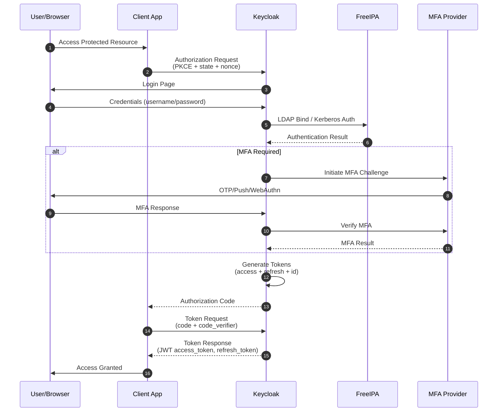
```mermaid
sequenceDiagram
    autonumber
    participant User as User/Browser
    participant App as Client App
    participant KC as Keycloak
    participant IPA as FreeIPA
    participant MFA as MFA Provider

    User->>App: Access Protected Resource
    App->>KC: Authorization Request<br/>(PKCE + state + nonce)
    KC->>User: Login Page
    User->>KC: Credentials (username/password)
    KC->>IPA: LDAP Bind / Kerberos Auth
    IPA-->>KC: Authentication Result

    alt MFA Required
        KC->>MFA: Initiate MFA Challenge
        MFA->>User: OTP/Push/WebAuthn
        User->>KC: MFA Response
        KC->>MFA: Verify MFA
        MFA-->>KC: MFA Result
    end

    KC->>KC: Generate Tokens<br/>(access + refresh + id)
    KC-->>App: Authorization Code
    App->>KC: Token Request<br/>(code + code_verifier)
    KC-->>App: Token Response<br/>(JWT access_token, refresh_token)
    App->>User: Access Granted
```

### 3.3. Требования к аутентификации

#### Поддерживаемые методы

| Метод | Обязательность | Стандарт |
|-------|---------------|----------|
| Username/Password | Обязательно | - |
| OIDC SSO | Обязательно | [OpenID Connect Core 1.0](https://openid.net/specs/openid-connect-core-1_0.html) |
| PKCE | Обязательно для SPA/Mobile | [RFC 7636](https://datatracker.ietf.org/doc/html/rfc7636) |
| TOTP (Google Authenticator) | Обязательно | [RFC 6238](https://datatracker.ietf.org/doc/html/rfc6238) |
| WebAuthn/FIDO2 | Рекомендуется | [WebAuthn L2](https://www.w3.org/TR/webauthn-2/) |
| Kerberos (SPNEGO) | Опционально | [RFC 4120](https://datatracker.ietf.org/doc/html/rfc4120) |

#### Session Management

| Параметр | Значение | Настраиваемость |
|----------|----------|-----------------|
| Access Token TTL | 5-15 минут | YAML config |
| Refresh Token TTL | 8-24 часа | YAML config |
| SSO Session Idle | 30 минут | YAML config |
| SSO Session Max | 8 часов | YAML config |
| Concurrent Sessions | Ограничено (configurable) | Per-client |
| Session Revocation | Immediate propagation | Required |

#### Password Policy (FreeIPA)

| Правило | Значение |
|---------|----------|
| Минимальная длина | 12 символов |
| Complexity | Upper + Lower + Digit + Special |
| History | Последние 12 паролей |
| Max Age | 90 дней |
| Lockout | 5 попыток / 15 минут |

### 3.4. JWT Token Structure

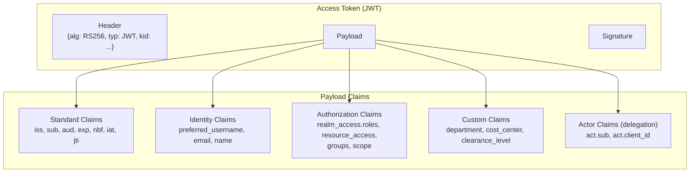
```mermaid
flowchart TB
    subgraph AccessToken["Access Token (JWT)"]
        Header["Header<br/>{alg: RS256, typ: JWT, kid: ...}"]
        Payload["Payload"]
        Signature["Signature"]
    end

    subgraph PayloadContent["Payload Claims"]
        Standard["Standard Claims<br/>iss, sub, aud, exp, nbf, iat, jti"]
        Identity["Identity Claims<br/>preferred_username, email, name"]
        AuthZ["Authorization Claims<br/>realm_access.roles, resource_access,<br/>groups, scope"]
        Custom["Custom Claims<br/>department, cost_center, clearance_level"]
        Actor["Actor Claims (delegation)<br/>act.sub, act.client_id"]
    end

    Payload --> Standard
    Payload --> Identity
    Payload --> AuthZ
    Payload --> Custom
    Payload --> Actor
```

**Обязательные claims в access token:**

| Claim | Описание | Пример |
|-------|----------|--------|
| `iss` | Issuer URL | `https://keycloak.example.com/realms/corp` |
| `sub` | Subject (user ID) | `f47ac10b-58cc-4372-a567-0e02b2c3d479` |
| `aud` | Audience (client/resource) | `["api-gateway", "service-a"]` |
| `exp` | Expiration time | Unix timestamp |
| `nbf` | Not before | Unix timestamp |
| `iat` | Issued at | Unix timestamp |
| `jti` | JWT ID (unique) | UUID |
| `azp` | Authorized party | `web-client` |
| `scope` | Granted scopes | `openid profile email api:read` |
| `realm_access.roles` | Realm roles | `["user", "admin"]` |

---

## 4. Авторизация пользователей

### 4.1. Модель авторизации

Система использует **гибридную модель RBAC + ABAC**:

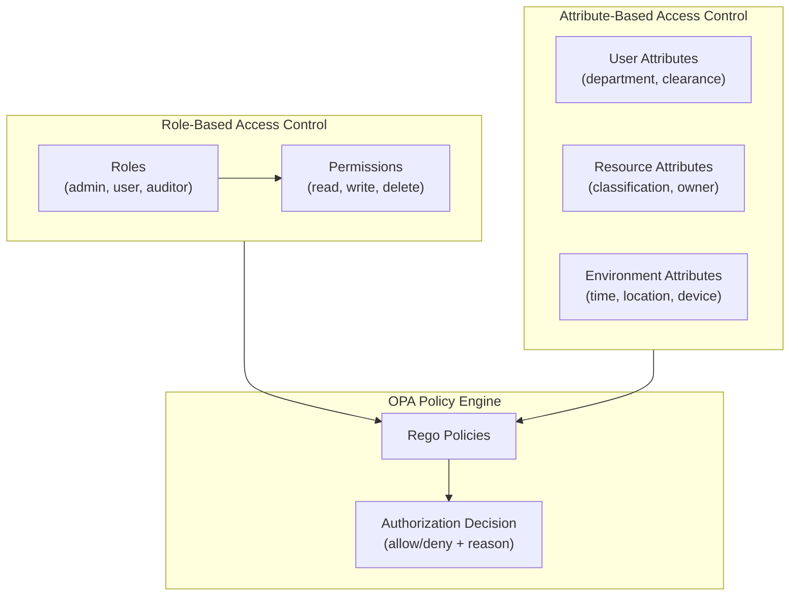
```mermaid
flowchart TB
    subgraph RBAC["Role-Based Access Control"]
        Roles["Roles<br/>(admin, user, auditor)"]
        Permissions["Permissions<br/>(read, write, delete)"]
        Roles --> Permissions
    end

    subgraph ABAC["Attribute-Based Access Control"]
        UserAttr["User Attributes<br/>(department, clearance)"]
        ResourceAttr["Resource Attributes<br/>(classification, owner)"]
        EnvAttr["Environment Attributes<br/>(time, location, device)"]
    end

    subgraph PolicyEngine["OPA Policy Engine"]
        RegoPolicy["Rego Policies"]
        Decision["Authorization Decision<br/>(allow/deny + reason)"]
    end

    RBAC --> RegoPolicy
    ABAC --> RegoPolicy
    RegoPolicy --> Decision
```

### 4.2. Policy Enforcement Points

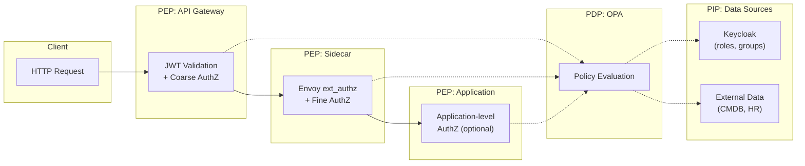
```mermaid
flowchart LR
    subgraph Client["Client"]
        Request["HTTP Request"]
    end

    subgraph PEP1["PEP: API Gateway"]
        GatewayFilter["JWT Validation<br/>+ Coarse AuthZ"]
    end

    subgraph PEP2["PEP: Sidecar"]
        EnvoyFilter["Envoy ext_authz<br/>+ Fine AuthZ"]
    end

    subgraph PEP3["PEP: Application"]
        AppFilter["Application-level<br/>AuthZ (optional)"]
    end

    subgraph PDP["PDP: OPA"]
        PolicyEval["Policy Evaluation"]
    end

    subgraph PIP["PIP: Data Sources"]
        Keycloak2["Keycloak<br/>(roles, groups)"]
        ExternalData["External Data<br/>(CMDB, HR)"]
    end

    Request --> GatewayFilter
    GatewayFilter --> EnvoyFilter
    EnvoyFilter --> AppFilter

    GatewayFilter -.-> PolicyEval
    EnvoyFilter -.-> PolicyEval
    AppFilter -.-> PolicyEval

    PolicyEval -.-> Keycloak2
    PolicyEval -.-> ExternalData
```

---

## 5. Межсервисная аутентификация и авторизация

### 5.1. Service Identity (SPIFFE/SPIRE)

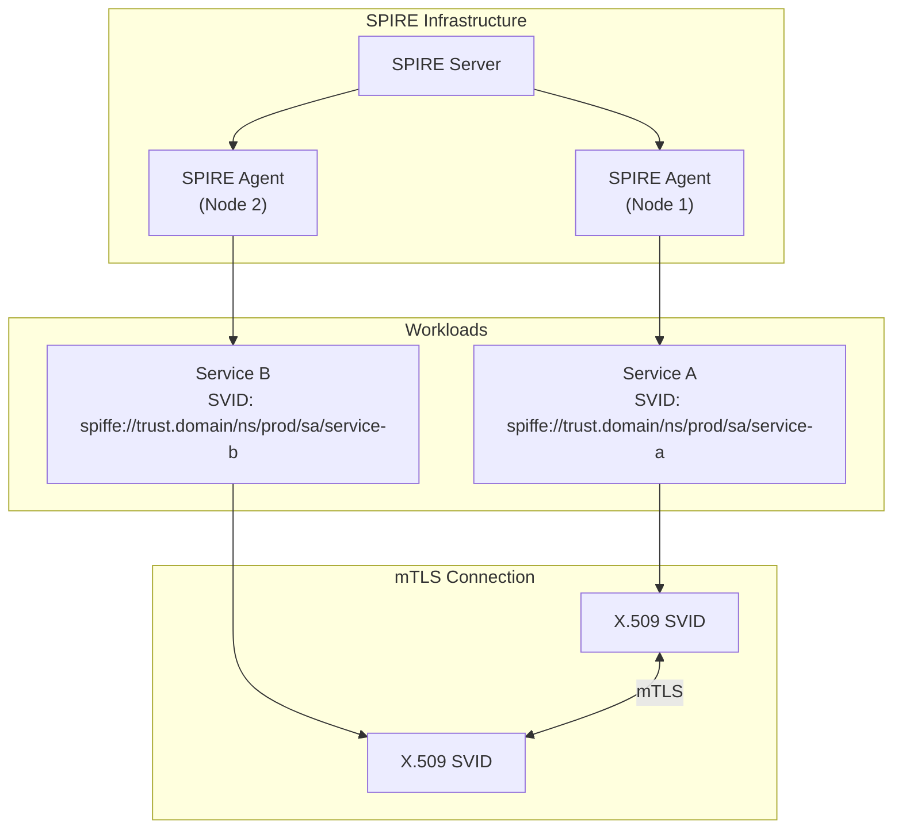
```mermaid
flowchart TB
    subgraph SPIRE["SPIRE Infrastructure"]
        Server["SPIRE Server"]
        Agent1["SPIRE Agent<br/>(Node 1)"]
        Agent2["SPIRE Agent<br/>(Node 2)"]
    end

    subgraph Workloads["Workloads"]
        Service1["Service A<br/>SVID: spiffe://trust.domain/ns/prod/sa/service-a"]
        Service2["Service B<br/>SVID: spiffe://trust.domain/ns/prod/sa/service-b"]
    end

    subgraph mTLS["mTLS Connection"]
        Cert1["X.509 SVID"]
        Cert2["X.509 SVID"]
    end

    Server --> Agent1
    Server --> Agent2
    Agent1 --> Service1
    Agent2 --> Service2
    Service1 --> Cert1
    Service2 --> Cert2
    Cert1 <-->|mTLS| Cert2
```

**SPIFFE ID Format:**
```
spiffe://<trust-domain>/ns/<namespace>/sa/<service-account>
```

### 5.2. Service-to-Service Authorization Flow

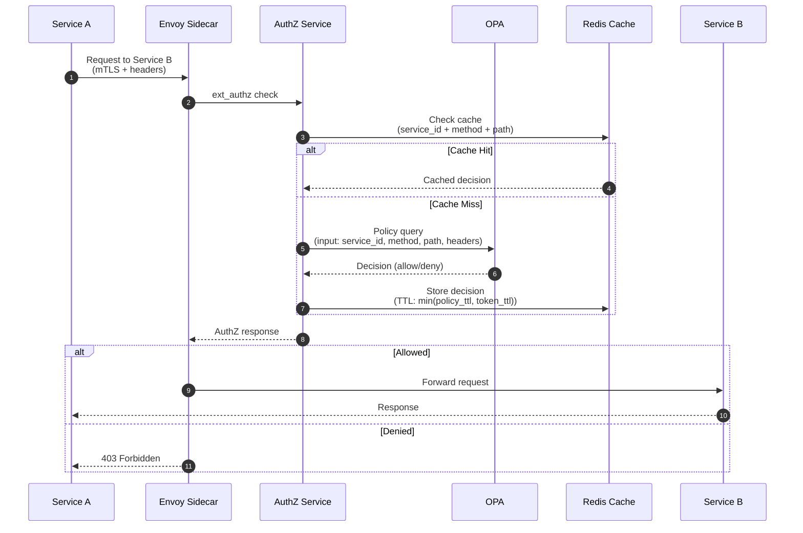
```mermaid
sequenceDiagram
    autonumber
    participant SA as Service A
    participant Sidecar as Envoy Sidecar
    participant AuthZ as AuthZ Service
    participant OPA as OPA
    participant Cache as Redis Cache
    participant SB as Service B

    SA->>Sidecar: Request to Service B<br/>(mTLS + headers)
    Sidecar->>AuthZ: ext_authz check

    AuthZ->>Cache: Check cache<br/>(service_id + method + path)

    alt Cache Hit
        Cache-->>AuthZ: Cached decision
    else Cache Miss
        AuthZ->>OPA: Policy query<br/>(input: service_id, method, path, headers)
        OPA-->>AuthZ: Decision (allow/deny)
        AuthZ->>Cache: Store decision<br/>(TTL: min(policy_ttl, token_ttl))
    end

    AuthZ-->>Sidecar: AuthZ response

    alt Allowed
        Sidecar->>SB: Forward request
        SB-->>SA: Response
    else Denied
        Sidecar-->>SA: 403 Forbidden
    end
```

### 5.3. Кеширование авторизации

#### Cache Key Structure

```
authz:{version}:{service_id}:{method}:{path_pattern}:{relevant_claims_hash}
```

| Компонент | Описание | Пример |
|-----------|----------|--------|
| `version` | Версия политик | `v23` |
| `service_id` | SPIFFE ID (hashed) | `sha256(spiffe://...)[:16]` |
| `method` | HTTP method | `GET` |
| `path_pattern` | Normalized path | `/api/v1/users/*` |
| `claims_hash` | Hash релевантных claims | `sha256(roles+scopes)[:16]` |

#### Cache Configuration (YAML)

```yaml
cache:
  enabled: true
  backend: redis
  redis:
    addresses:
      - redis-cluster:6379
    password: ${REDIS_PASSWORD}
    db: 0
    pool_size: 100

  authorization:
    default_ttl: 60s
    max_ttl: 300s
    negative_ttl: 30s
    max_entries: 100000
    eviction_policy: lru

  jwt_validation:
    enabled: true
    ttl: 30s

  invalidation:
    mode: event-driven  # event-driven | polling | version-based
    policy_change_topic: "authz.policy.changed"
    token_revocation_topic: "authz.token.revoked"
```

#### Fail-Safe Behavior

| Сценарий | Поведение | Настройка |
|----------|-----------|-----------|
| Cache unavailable | Fail-closed (deny) | `fail_open: false` |
| OPA unavailable | Fail-closed (deny) | `fail_open: false` |
| Keycloak unavailable | Use cached tokens | `offline_validation: true` |
| Stale cache | Async refresh | `stale_while_revalidate: true` |

---

## 6. User-Initiated Service Chains (Token Exchange)

### 6.1. Token Exchange Flow (RFC 8693)

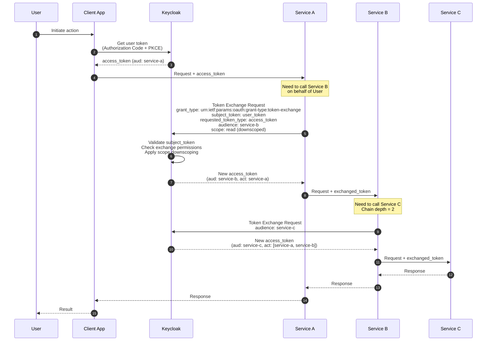
```mermaid
sequenceDiagram
    autonumber
    participant User as User
    participant App as Client App
    participant KC as Keycloak
    participant SA as Service A
    participant SB as Service B
    participant SC as Service C

    User->>App: Initiate action
    App->>KC: Get user token<br/>(Authorization Code + PKCE)
    KC-->>App: access_token (aud: service-a)

    App->>SA: Request + access_token

    Note over SA: Need to call Service B<br/>on behalf of User

    SA->>KC: Token Exchange Request<br/>grant_type: urn:ietf:params:oauth:grant-type:token-exchange<br/>subject_token: user_token<br/>requested_token_type: access_token<br/>audience: service-b<br/>scope: read (downscoped)

    KC->>KC: Validate subject_token<br/>Check exchange permissions<br/>Apply scope downscoping
    KC-->>SA: New access_token<br/>(aud: service-b, act: service-a)

    SA->>SB: Request + exchanged_token

    Note over SB: Need to call Service C<br/>Chain depth = 2

    SB->>KC: Token Exchange Request<br/>audience: service-c
    KC-->>SB: New access_token<br/>(aud: service-c, act: [service-a, service-b])

    SB->>SC: Request + exchanged_token
    SC-->>SB: Response
    SB-->>SA: Response
    SA-->>App: Response
    App-->>User: Result
```

### 6.2. Token Exchange Requirements

| Параметр | Требование | Обоснование |
|----------|------------|-------------|
| Max Chain Depth | 3 | Предотвращение бесконечных цепочек |
| Scope Downscoping | Обязательно | Principle of least privilege |
| Audience Restriction | Обязательно | Ограничение области действия токена |
| Actor Claim (`act`) | Обязательно | Audit trail, policy decisions |
| Exchange TTL | ≤ Original TTL | Токен не может жить дольше оригинала |

### 6.3. Exchanged Token Structure

```json
{
  "iss": "https://keycloak.example.com/realms/corp",
  "sub": "user-uuid",
  "aud": ["service-b"],
  "exp": 1702900000,
  "iat": 1702899100,
  "azp": "service-a",
  "scope": "read",
  "act": {
    "sub": "service-a",
    "client_id": "service-a-client"
  },
  "may_act": {
    "sub": "service-a",
    "aud": ["service-b", "service-c"]
  }
}
```

---

## 7. Authorization Layer Implementation

### 7.1. Deployment Models

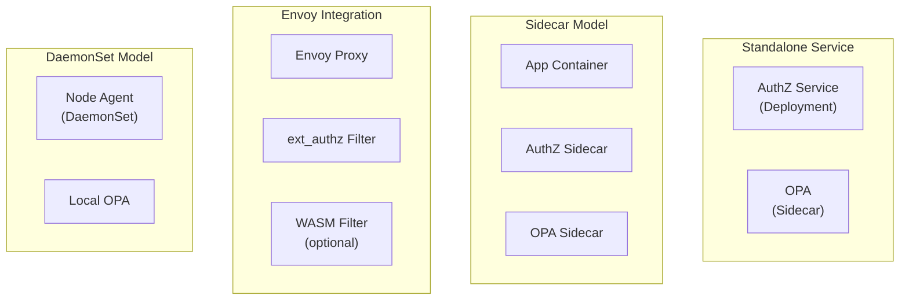
```mermaid
flowchart TB
    subgraph Standalone["Standalone Service"]
        StandaloneAuthZ["AuthZ Service<br/>(Deployment)"]
        StandaloneOPA["OPA<br/>(Sidecar)"]
    end

    subgraph Sidecar["Sidecar Model"]
        AppContainer["App Container"]
        AuthZSidecar["AuthZ Sidecar"]
        OPASidecar["OPA Sidecar"]
    end

    subgraph EnvoyIntegration["Envoy Integration"]
        EnvoyProxy["Envoy Proxy"]
        ExtAuthZ["ext_authz Filter"]
        WASMFilter["WASM Filter<br/>(optional)"]
    end

    subgraph DaemonSet["DaemonSet Model"]
        NodeAgent["Node Agent<br/>(DaemonSet)"]
        LocalOPA["Local OPA"]
    end
```

### 7.2. Authorization Attributes

#### Input Schema for OPA

```json
{
  "input": {
    "request": {
      "method": "POST",
      "path": "/api/v1/users/123/orders",
      "headers": {
        "authorization": "Bearer ...",
        "x-request-id": "uuid",
        "x-forwarded-for": "192.168.1.1"
      },
      "body": {}
    },
    "source": {
      "principal": "spiffe://trust.domain/ns/prod/sa/service-a",
      "namespace": "prod",
      "service_account": "service-a"
    },
    "destination": {
      "principal": "spiffe://trust.domain/ns/prod/sa/service-b",
      "service": "service-b",
      "port": 8080
    },
    "token": {
      "valid": true,
      "payload": {
        "sub": "user-uuid",
        "roles": ["user", "premium"],
        "scope": "read write",
        "act": {"sub": "service-a"}
      }
    },
    "context": {
      "time": "2024-12-17T10:30:00Z",
      "geo": "EU"
    }
  }
}
```

### 7.3. Policy Configuration (YAML)

```yaml
apiVersion: authz.example.com/v1
kind: AuthorizationPolicy
metadata:
  name: service-b-policy
  namespace: prod
spec:
  selector:
    matchLabels:
      app: service-b

  rules:
    - name: allow-authenticated-users
      from:
        - source:
            requestPrincipals: ["*"]
      to:
        - operation:
            methods: ["GET"]
            paths: ["/api/v1/public/*"]

    - name: allow-admin-write
      from:
        - source:
            requestPrincipals: ["*"]
      to:
        - operation:
            methods: ["POST", "PUT", "DELETE"]
            paths: ["/api/v1/admin/*"]
      when:
        - key: request.auth.claims[roles]
          values: ["admin"]

    - name: allow-service-a
      from:
        - source:
            principals: ["spiffe://trust.domain/ns/prod/sa/service-a"]
      to:
        - operation:
            methods: ["GET", "POST"]
            paths: ["/internal/*"]
```

---

## 8. Ingress и Egress контроль

### 8.1. Traffic Flow


```mermaid
flowchart LR
    subgraph External["External"]
        Client["External Client"]
    end

    subgraph IngressLayer["Ingress Layer"]
        LB["Load Balancer"]
        IngressGW["Ingress Gateway<br/>(Istio)"]
        WAF["WAF<br/>(optional)"]
    end

    subgraph IngressAuthZ["Ingress Authorization"]
        JWTValidation["JWT Validation"]
        RateLimiting["Rate Limiting"]
        CoarseAuthZ["Coarse-grained AuthZ"]
    end

    subgraph Mesh["Service Mesh"]
        ServiceA2["Service A"]
        ServiceB2["Service B"]
    end

    subgraph EgressLayer["Egress Layer"]
        EgressGW["Egress Gateway"]
        EgressPolicy["Egress Policy"]
    end

    subgraph ExternalServices["External Services"]
        ExtAPI["External API"]
        ExtDB["External DB"]
    end

    Client --> LB
    LB --> WAF
    WAF --> IngressGW
    IngressGW --> JWTValidation
    JWTValidation --> RateLimiting
    RateLimiting --> CoarseAuthZ
    CoarseAuthZ --> ServiceA2
    ServiceA2 <--> ServiceB2
    ServiceB2 --> EgressGW
    EgressGW --> EgressPolicy
    EgressPolicy --> ExtAPI
    EgressPolicy --> ExtDB
```

### 8.2. Egress Policy Requirements

| Требование | Описание |
|------------|----------|
| Whitelist-only | Только разрешённые external endpoints |
| Service-specific | Политики per-service |
| Protocol enforcement | HTTPS only для external |
| Logging | Все egress calls логируются |
| Rate limiting | Per-service quotas |

---

## 9. Аудит и логирование

### 9.1. Security Events Pipeline

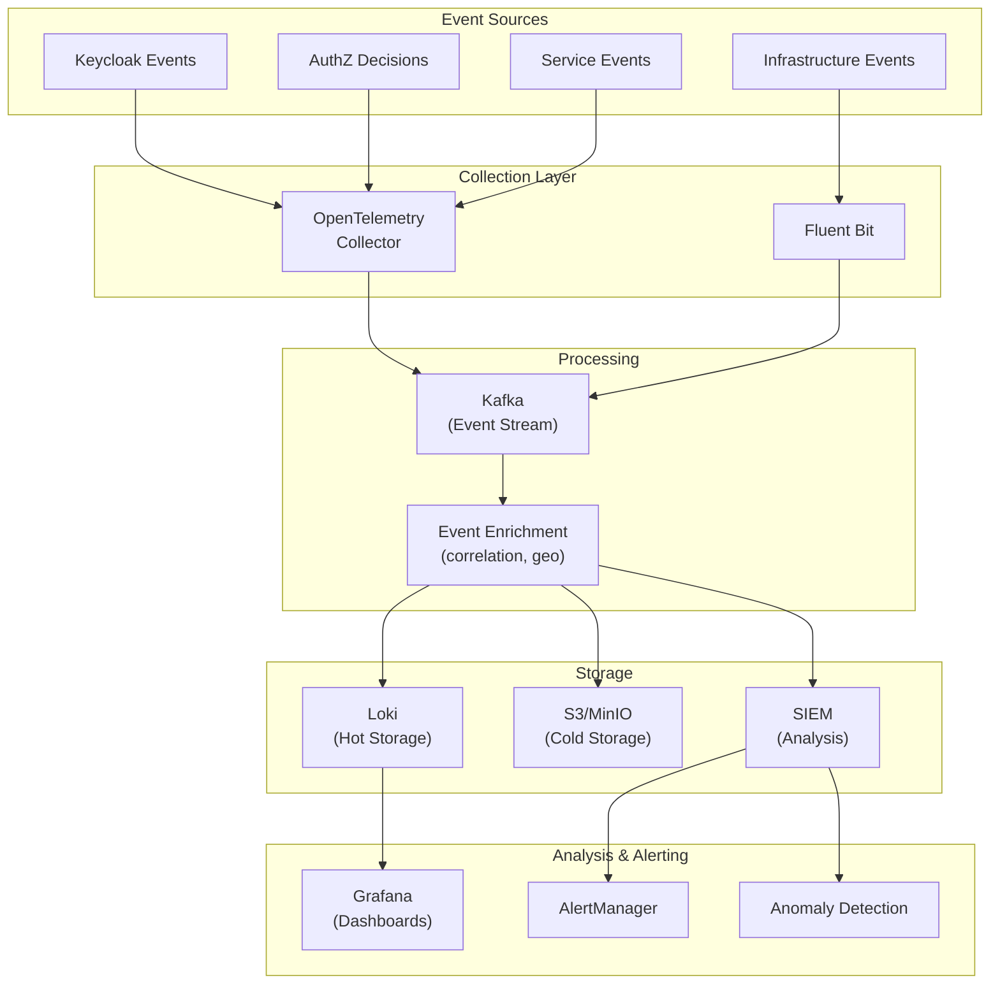
```mermaid
flowchart TB
    subgraph Sources["Event Sources"]
        KC_Events["Keycloak Events"]
        AuthZ_Events["AuthZ Decisions"]
        Service_Events["Service Events"]
        Infra_Events["Infrastructure Events"]
    end

    subgraph Collection["Collection Layer"]
        OTelCol["OpenTelemetry<br/>Collector"]
        FluentBit["Fluent Bit"]
    end

    subgraph Processing["Processing"]
        Kafka["Kafka<br/>(Event Stream)"]
        Enrichment["Event Enrichment<br/>(correlation, geo)"]
    end

    subgraph Storage["Storage"]
        Loki2["Loki<br/>(Hot Storage)"]
        S3["S3/MinIO<br/>(Cold Storage)"]
        SIEM2["SIEM<br/>(Analysis)"]
    end

    subgraph Analysis["Analysis & Alerting"]
        Grafana2["Grafana<br/>(Dashboards)"]
        AlertManager["AlertManager"]
        Anomaly["Anomaly Detection"]
    end

    KC_Events --> OTelCol
    AuthZ_Events --> OTelCol
    Service_Events --> OTelCol
    Infra_Events --> FluentBit

    OTelCol --> Kafka
    FluentBit --> Kafka
    Kafka --> Enrichment

    Enrichment --> Loki2
    Enrichment --> S3
    Enrichment --> SIEM2

    Loki2 --> Grafana2
    SIEM2 --> AlertManager
    SIEM2 --> Anomaly
```

### 9.2. Audit Event Schema

```json
{
  "timestamp": "2024-12-17T10:30:00.123456Z",
  "event_id": "evt_abc123",
  "event_type": "AUTHZ_DECISION",
  "event_category": "authorization",
  "severity": "INFO",

  "subject": {
    "type": "user",
    "id": "user-uuid",
    "username": "john.doe",
    "email": "john.doe@example.com",
    "roles": ["user", "developer"],
    "groups": ["engineering"]
  },

  "actor": {
    "type": "service",
    "id": "spiffe://trust.domain/ns/prod/sa/service-a",
    "service_name": "service-a"
  },

  "resource": {
    "type": "http_endpoint",
    "service": "service-b",
    "method": "POST",
    "path": "/api/v1/orders",
    "namespace": "prod"
  },

  "action": "create",

  "decision": {
    "allowed": true,
    "policy": "allow-authenticated-users",
    "reason": "User has required role",
    "duration_ms": 2.5
  },

  "context": {
    "request_id": "req-xyz789",
    "trace_id": "trace-abc",
    "span_id": "span-def",
    "client_ip": "192.168.1.100",
    "user_agent": "Mozilla/5.0...",
    "geo_country": "RU",
    "session_id": "sess-123"
  },

  "metadata": {
    "policy_version": "v23",
    "authz_layer_version": "1.5.0",
    "cache_hit": false
  }
}
```

### 9.3. Типы аудируемых событий

| Категория | Event Type | Severity | Retention |
|-----------|------------|----------|-----------|
| **Authentication** | AUTH_SUCCESS | INFO | 90 дней |
| | AUTH_FAILURE | WARN | 1 год |
| | AUTH_LOCKOUT | HIGH | 1 год |
| | MFA_SUCCESS | INFO | 90 дней |
| | MFA_FAILURE | WARN | 1 год |
| | SESSION_START | INFO | 90 дней |
| | SESSION_END | INFO | 90 дней |
| | TOKEN_ISSUED | INFO | 90 дней |
| | TOKEN_REFRESHED | INFO | 30 дней |
| | TOKEN_REVOKED | INFO | 1 год |
| | TOKEN_EXCHANGED | INFO | 90 дней |
| **Authorization** | AUTHZ_PERMIT | INFO | 30 дней |
| | AUTHZ_DENY | WARN | 1 год |
| | POLICY_VIOLATION | HIGH | 1 год |
| **Administration** | USER_CREATED | INFO | 1 год |
| | USER_MODIFIED | INFO | 1 год |
| | USER_DELETED | HIGH | 5 лет |
| | ROLE_ASSIGNED | INFO | 1 год |
| | ROLE_REVOKED | INFO | 1 год |
| | POLICY_CHANGED | HIGH | 5 лет |
| | CONFIG_CHANGED | HIGH | 5 лет |

### 9.4. Log Interception Requirements

| Требование | Описание |
|------------|----------|
| Structured Format | JSON with consistent schema |
| Correlation | trace_id, span_id, request_id across all logs |
| Immutability | Append-only storage, cryptographic integrity |
| Encryption | At-rest encryption (AES-256) |
| Access Control | RBAC for log access |
| Tamper Detection | Digital signatures on audit records |
| Compliance | GDPR, PCI-DSS compatible retention |

---

## 10. Метрики и мониторинг

### 10.1. Metrics Architecture

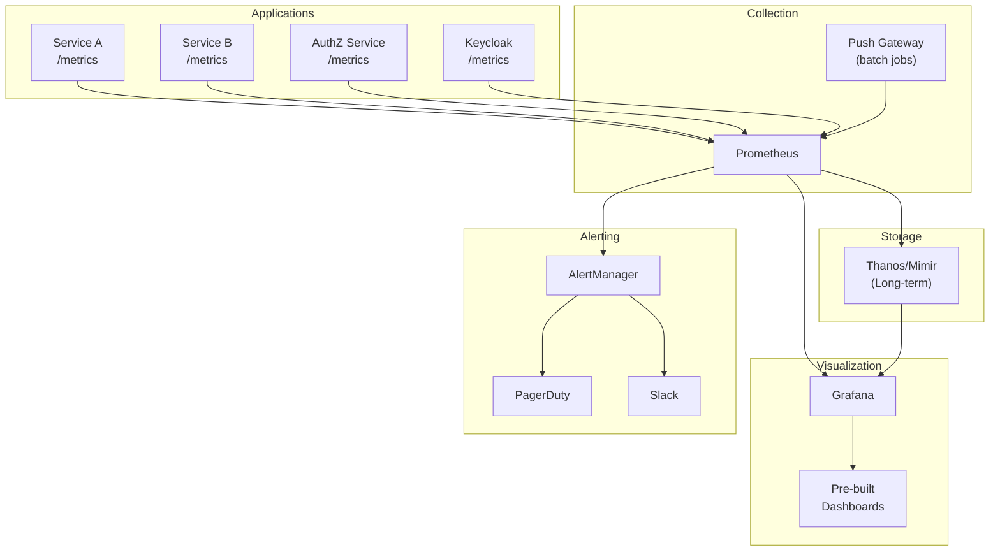
```mermaid
flowchart TB
    subgraph Apps["Applications"]
        App1["Service A<br/>/metrics"]
        App2["Service B<br/>/metrics"]
        AuthZSvc["AuthZ Service<br/>/metrics"]
        KC_Metrics["Keycloak<br/>/metrics"]
    end

    subgraph Collection2["Collection"]
        Prom["Prometheus"]
        PushGW["Push Gateway<br/>(batch jobs)"]
    end

    subgraph Storage2["Storage"]
        Thanos["Thanos/Mimir<br/>(Long-term)"]
    end

    subgraph Visualization["Visualization"]
        Grafana3["Grafana"]
        Dashboards["Pre-built<br/>Dashboards"]
    end

    subgraph Alerting["Alerting"]
        AlertMgr["AlertManager"]
        PagerDuty["PagerDuty"]
        Slack["Slack"]
    end

    App1 --> Prom
    App2 --> Prom
    AuthZSvc --> Prom
    KC_Metrics --> Prom
    PushGW --> Prom

    Prom --> Thanos
    Prom --> Grafana3
    Thanos --> Grafana3
    Grafana3 --> Dashboards

    Prom --> AlertMgr
    AlertMgr --> PagerDuty
    AlertMgr --> Slack
```

### 10.2. Инфраструктурные метрики

| Метрика | Тип | Labels | Описание |
|---------|-----|--------|----------|
| `authz_request_duration_seconds` | Histogram | service, method, decision | Latency авторизации |
| `authz_requests_total` | Counter | service, method, decision, cached | Количество запросов |
| `authz_cache_hits_total` | Counter | cache_type | Cache hit count |
| `authz_cache_misses_total` | Counter | cache_type | Cache miss count |
| `authz_policy_evaluation_duration_seconds` | Histogram | policy | OPA evaluation time |
| `auth_login_attempts_total` | Counter | method, status, realm | Попытки входа |
| `auth_active_sessions` | Gauge | realm, client | Активные сессии |
| `auth_token_issued_total` | Counter | type, client | Выданные токены |
| `token_exchange_duration_seconds` | Histogram | source, target | Token exchange latency |
| `token_exchange_requests_total` | Counter | source, target, status | Token exchange count |

### 10.3. Бизнес-метрики

| Метрика | Тип | Описание |
|---------|-----|----------|
| `business_unique_users_daily` | Gauge | Уникальные пользователи за день |
| `business_auth_by_method` | Counter | Аутентификации по методу |
| `business_mfa_adoption_rate` | Gauge | % пользователей с MFA |
| `business_failed_logins_by_user` | Counter | Неудачные входы (anomaly detection) |
| `business_privileged_access_usage` | Counter | Использование привилегированного доступа |
| `business_service_dependencies` | Gauge | Граф зависимостей сервисов |
| `business_most_accessed_resources` | Counter | Топ запрашиваемых ресурсов |

### 10.4. SLA/SLO Targets

| Компонент | SLI | SLO | Error Budget |
|-----------|-----|-----|--------------|
| Authentication | Login success rate | 99.9% | 43.8 min/month |
| Authentication | Login latency p99 | < 500ms | - |
| Authorization | Decision latency p99 | < 10ms | - |
| Authorization | Availability | 99.99% | 4.38 min/month |
| Token Exchange | Success rate | 99.9% | 43.8 min/month |
| Token Exchange | Latency p99 | < 100ms | - |
| Cache | Hit rate | > 80% | - |

### 10.5. Alerting Rules

| Alert | Condition | Severity | Action |
|-------|-----------|----------|--------|
| HighAuthFailureRate | failure_rate > 10% for 5m | Critical | Page on-call |
| AuthZLatencyHigh | p99 > 50ms for 10m | Warning | Slack notification |
| CacheHitRateLow | hit_rate < 50% for 15m | Warning | Investigation |
| KeycloakDown | up == 0 for 1m | Critical | Page on-call |
| TokenExchangeErrors | error_rate > 5% for 5m | High | Slack + ticket |
| AnomalousLoginPattern | ML anomaly score > threshold | High | Security review |
| PolicyViolationSpike | violations > baseline * 3 | High | Security review |

---

## 11. Distributed Tracing

### 11.1. Trace Context Propagation

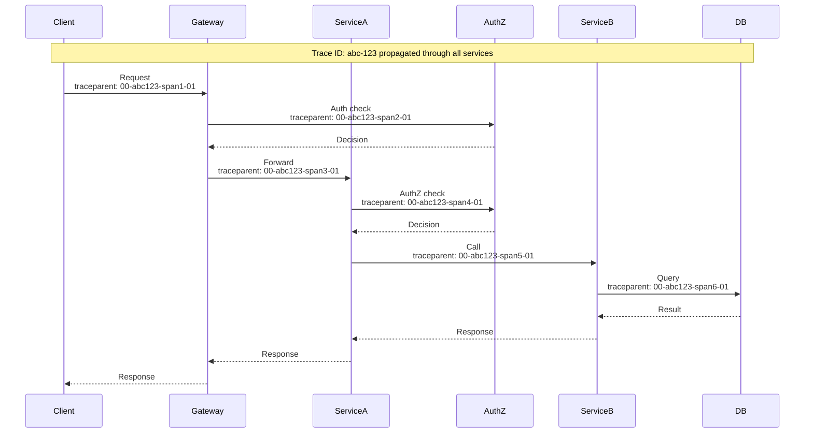
```mermaid
sequenceDiagram
    participant Client
    participant Gateway
    participant ServiceA
    participant AuthZ
    participant ServiceB
    participant DB

    Note over Client,DB: Trace ID: abc-123 propagated through all services

    Client->>Gateway: Request<br/>traceparent: 00-abc123-span1-01
    Gateway->>AuthZ: Auth check<br/>traceparent: 00-abc123-span2-01
    AuthZ-->>Gateway: Decision
    Gateway->>ServiceA: Forward<br/>traceparent: 00-abc123-span3-01
    ServiceA->>AuthZ: AuthZ check<br/>traceparent: 00-abc123-span4-01
    AuthZ-->>ServiceA: Decision
    ServiceA->>ServiceB: Call<br/>traceparent: 00-abc123-span5-01
    ServiceB->>DB: Query<br/>traceparent: 00-abc123-span6-01
    DB-->>ServiceB: Result
    ServiceB-->>ServiceA: Response
    ServiceA-->>Gateway: Response
    Gateway-->>Client: Response
```

### 11.2. Span Attributes for Security

| Attribute | Type | Description |
|-----------|------|-------------|
| `security.auth.method` | string | Authentication method used |
| `security.auth.user_id` | string | Authenticated user ID |
| `security.authz.decision` | string | allow/deny |
| `security.authz.policy` | string | Policy that made decision |
| `security.authz.cached` | bool | Was decision cached |
| `security.token.type` | string | access/refresh/exchanged |
| `security.delegation.depth` | int | Token exchange chain depth |
| `security.delegation.actors` | string[] | Actor chain |

---

## 12. Disaster Recovery и High Availability

### 12.1. HA Architecture

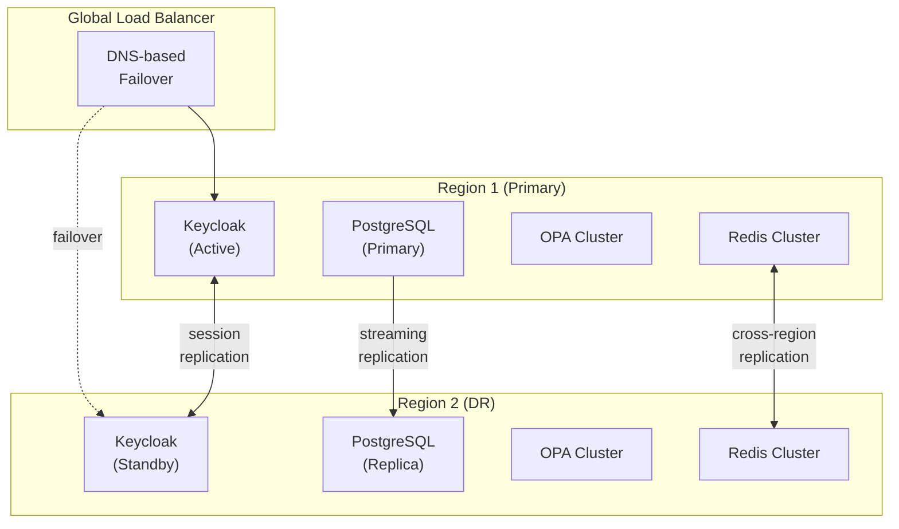
```mermaid
flowchart TB
    subgraph Region1["Region 1 (Primary)"]
        KC1["Keycloak<br/>(Active)"]
        DB1["PostgreSQL<br/>(Primary)"]
        OPA1["OPA Cluster"]
        Redis1["Redis Cluster"]
    end

    subgraph Region2["Region 2 (DR)"]
        KC2["Keycloak<br/>(Standby)"]
        DB2["PostgreSQL<br/>(Replica)"]
        OPA2["OPA Cluster"]
        Redis2["Redis Cluster"]
    end

    subgraph GlobalLB["Global Load Balancer"]
        GLB["DNS-based<br/>Failover"]
    end

    GLB --> KC1
    GLB -.->|failover| KC2

    DB1 -->|streaming<br/>replication| DB2
    KC1 <-->|session<br/>replication| KC2
    Redis1 <-->|cross-region<br/>replication| Redis2
```

### 12.2. RTO/RPO Targets

| Компонент | RTO | RPO | Strategy |
|-----------|-----|-----|----------|
| Keycloak | 5 min | 0 (sync) | Active-Standby + DB replication |
| PostgreSQL | 5 min | < 1 min | Streaming replication |
| OPA Policies | 1 min | 0 | GitOps, local cache |
| Redis Cache | 2 min | N/A | Rebuild from source |
| AuthZ Service | 1 min | N/A | Stateless, multi-replica |

### 12.3. Backup Requirements

| Data | Frequency | Retention | Method |
|------|-----------|-----------|--------|
| Keycloak DB | Continuous + Daily full | 30 days | pg_dump + WAL archiving |
| Policies (Git) | Every commit | Forever | Git history |
| Audit Logs | Continuous | Per policy | S3 lifecycle |
| Secrets (Vault) | Daily | 90 days | Vault snapshots |

---

## 13. Ротация ключей и сертификатов

### 13.1. Key Lifecycle

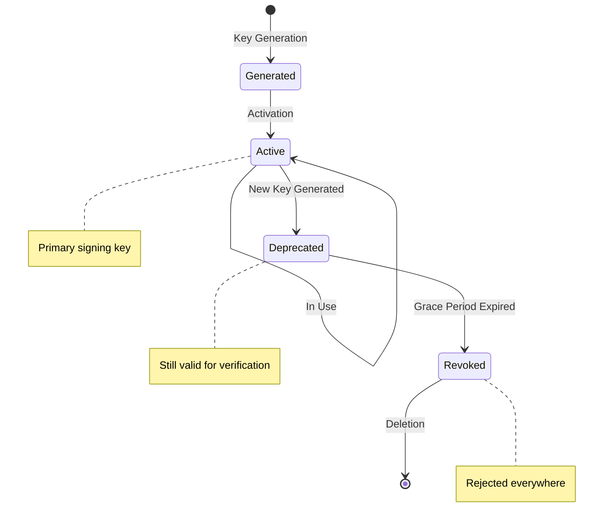
```mermaid
stateDiagram-v2
    [*] --> Generated: Key Generation
    Generated --> Active: Activation
    Active --> Active: In Use
    Active --> Deprecated: New Key Generated
    Deprecated --> Revoked: Grace Period Expired
    Revoked --> [*]: Deletion

    note right of Active: Primary signing key
    note right of Deprecated: Still valid for verification
    note right of Revoked: Rejected everywhere
```

### 13.2. Rotation Schedule

| Asset | Rotation Period | Overlap Period | Automation |
|-------|-----------------|----------------|------------|
| JWT Signing Keys (RS256) | 90 days | 7 days | Keycloak auto |
| mTLS Certificates (SVID) | 1 hour | 5 min | SPIRE auto |
| Service Account Tokens | 24 hours | 1 hour | K8s auto |
| Database Credentials | 30 days | 1 day | Vault auto |
| API Keys | 180 days | 14 days | Manual + alert |

---

## 14. Нефункциональные требования

### 14.1. Безопасность

| Требование | Стандарт/Практика |
|------------|-------------------|
| OAuth 2.0 Security | [OAuth 2.0 Security BCP](https://datatracker.ietf.org/doc/html/draft-ietf-oauth-security-topics) |
| Token Validation | Обязательная проверка `iss`, `aud`, `exp`, `nbf` |
| Token Lifetime | Access: 5-15 min, Refresh: 8-24h |
| Least Privilege | Минимальные scopes, обязательный downscoping |
| Defense in Depth | Multiple PEPs (Gateway + Sidecar + App) |
| Zero Trust | Never trust, always verify |

### 14.2. Производительность

| Метрика | Target | Measurement |
|---------|--------|-------------|
| Auth latency (p50) | < 100ms | Login flow |
| Auth latency (p99) | < 500ms | Login flow |
| AuthZ latency (p50) | < 2ms | Policy decision |
| AuthZ latency (p99) | < 10ms | Policy decision |
| Token Exchange (p99) | < 100ms | Full exchange |
| Throughput | 10,000 RPS | Per AuthZ instance |

### 14.3. Масштабируемость

| Компонент | Scaling Strategy | Max Scale |
|-----------|------------------|-----------|
| Keycloak | Horizontal (stateless mode) | 10+ replicas |
| OPA | Horizontal | Unlimited |
| AuthZ Service | Horizontal (stateless) | Unlimited |
| Redis | Cluster mode | 6+ nodes |
| PostgreSQL | Read replicas | 1 primary + 5 replicas |

### 14.4. Rate Limiting

| Endpoint | Limit | Window | Action |
|----------|-------|--------|--------|
| /token (login) | 10 req | 1 min | per IP |
| /token (refresh) | 60 req | 1 min | per user |
| /token-exchange | 100 req | 1 min | per service |
| /userinfo | 60 req | 1 min | per token |
| Admin API | 100 req | 1 min | per admin |

---

## 15. Референсные документы

### 15.1. Стандарты и RFC

| Документ | Описание |
|----------|----------|
| [RFC 6749](https://datatracker.ietf.org/doc/html/rfc6749) | OAuth 2.0 Authorization Framework |
| [RFC 6750](https://datatracker.ietf.org/doc/html/rfc6750) | OAuth 2.0 Bearer Token Usage |
| [RFC 7519](https://datatracker.ietf.org/doc/html/rfc7519) | JSON Web Token (JWT) |
| [RFC 7636](https://datatracker.ietf.org/doc/html/rfc7636) | PKCE for OAuth 2.0 |
| [RFC 8693](https://datatracker.ietf.org/doc/html/rfc8693) | OAuth 2.0 Token Exchange |
| [RFC 9068](https://datatracker.ietf.org/doc/html/rfc9068) | JWT Profile for OAuth 2.0 Access Tokens |
| [RFC 9449](https://datatracker.ietf.org/doc/html/rfc9449) | OAuth 2.0 DPoP |
| [OpenID Connect Core 1.0](https://openid.net/specs/openid-connect-core-1_0.html) | OIDC Specification |
| [OAuth 2.0 Security BCP](https://datatracker.ietf.org/doc/html/draft-ietf-oauth-security-topics) | Security Best Practices |

### 15.2. Документация компонентов

| Компонент | Документация |
|-----------|--------------|
| Keycloak | https://www.keycloak.org/documentation |
| OPA | https://www.openpolicyagent.org/docs/latest/ |
| SPIFFE/SPIRE | https://spiffe.io/docs/latest/ |
| Istio | https://istio.io/latest/docs/ |
| FreeIPA | https://freeipa.org/page/Documentation |

### 15.3. Go Libraries

| Library | Purpose | Version |
|---------|---------|---------|
| `github.com/open-policy-agent/opa` | Policy engine | v0.60+ |
| `github.com/coreos/go-oidc/v3` | OIDC client | v3.9+ |
| `github.com/golang-jwt/jwt/v5` | JWT handling | v5.2+ |
| `github.com/spiffe/go-spiffe/v2` | SPIFFE workload API | v2.1+ |
| `go.opentelemetry.io/otel` | Observability | v1.21+ |
| `github.com/prometheus/client_golang` | Metrics | v1.18+ |
| `github.com/redis/go-redis/v9` | Redis client | v9.3+ |
| `github.com/grpc-ecosystem/go-grpc-middleware` | gRPC interceptors | v2.0+ |

---

## 16. Глоссарий

| Термин | Определение |
|--------|-------------|
| **IdP** | Identity Provider - сервис аутентификации |
| **PDP** | Policy Decision Point - компонент принятия решений |
| **PEP** | Policy Enforcement Point - точка применения политик |
| **PIP** | Policy Information Point - источник данных для политик |
| **SVID** | SPIFFE Verifiable Identity Document |
| **mTLS** | Mutual TLS - двусторонняя аутентификация |
| **RBAC** | Role-Based Access Control |
| **ABAC** | Attribute-Based Access Control |
| **Token Exchange** | Обмен токенов для delegation scenarios |
| **Downscoping** | Ограничение прав при token exchange |

---

## 17. Готовые решения и альтернативы

### 17.1. Сравнение Open Source Authorization Solutions

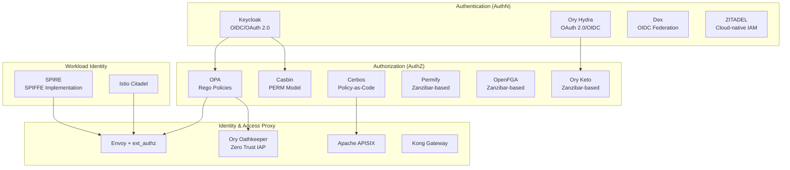
```mermaid
flowchart TB
    subgraph AuthN["Authentication (AuthN)"]
        Keycloak3["Keycloak<br/>OIDC/OAuth 2.0"]
        Ory_Hydra["Ory Hydra<br/>OAuth 2.0/OIDC"]
        Dex["Dex<br/>OIDC Federation"]
        ZITADEL["ZITADEL<br/>Cloud-native IAM"]
    end

    subgraph AuthZ["Authorization (AuthZ)"]
        OPA2["OPA<br/>Rego Policies"]
        Casbin2["Casbin<br/>PERM Model"]
        Cerbos["Cerbos<br/>Policy-as-Code"]
        Permify["Permify<br/>Zanzibar-based"]
        OpenFGA["OpenFGA<br/>Zanzibar-based"]
        Ory_Keto["Ory Keto<br/>Zanzibar-based"]
    end

    subgraph Proxy["Identity & Access Proxy"]
        Oathkeeper["Ory Oathkeeper<br/>Zero Trust IAP"]
        Envoy["Envoy + ext_authz"]
        APISIX["Apache APISIX"]
        Kong["Kong Gateway"]
    end

    subgraph Identity["Workload Identity"]
        SPIRE2["SPIRE<br/>SPIFFE Implementation"]
        Istio_CA["Istio Citadel"]
    end

    Keycloak3 --> OPA2
    Keycloak3 --> Casbin2
    Ory_Hydra --> Ory_Keto

    OPA2 --> Envoy
    OPA2 --> Oathkeeper
    Cerbos --> APISIX

    SPIRE2 --> Envoy
    Istio_CA --> Envoy
```

### 17.2. Рекомендуемые Open Source решения

#### Identity Providers (AuthN)

| Решение | Описание | Плюсы | Минусы | GitHub |
|---------|----------|-------|--------|--------|
| **Keycloak** | Enterprise IdP от Red Hat | Feature-rich, Token Exchange, Admin UI | Сложность, ресурсоёмкость | [keycloak/keycloak](https://github.com/keycloak/keycloak) |
| **Ory Hydra** | OAuth 2.0/OIDC Provider | Лёгкий, headless, Go-based | Требует отдельный UI | [ory/hydra](https://github.com/ory/hydra) |
| **Dex** | OIDC Federation | CNCF project, мультипровайдер | Только federation | [dexidp/dex](https://github.com/dexidp/dex) |
| **ZITADEL** | Cloud-native IAM | Modern UI, multi-tenancy | Менее зрелый | [zitadel/zitadel](https://github.com/zitadel/zitadel) |

#### Policy Engines (AuthZ)

| Решение | Модель | Язык политик | Плюсы | Минусы | GitHub |
|---------|--------|--------------|-------|--------|--------|
| **OPA** | ABAC/RBAC | Rego | Стандарт де-факто, Envoy интеграция | Rego learning curve | [open-policy-agent/opa](https://github.com/open-policy-agent/opa) |
| **Casbin** | Multi-model | CONF + Policy | Гибкость, multi-language | Не для распределённых систем | [casbin/casbin](https://github.com/casbin/casbin) |
| **Cerbos** | ABAC | YAML | Простота, stateless | Слабый ReBAC | [cerbos/cerbos](https://github.com/cerbos/cerbos) |
| **Permify** | ReBAC (Zanzibar) | DSL | Масштабируемость, ABAC extension | Молодой проект | [Permify/permify](https://github.com/Permify/permify) |
| **OpenFGA** | ReBAC (Zanzibar) | DSL | CNCF sandbox, Auth0 backing | Limited ABAC | [openfga/openfga](https://github.com/openfga/openfga) |
| **Ory Keto** | ReBAC (Zanzibar) | Relations | Часть Ory ecosystem | Сложность настройки | [ory/keto](https://github.com/ory/keto) |

#### Access Proxies (PEP)

| Решение | Тип | Плюсы | Минусы | GitHub |
|---------|-----|-------|--------|--------|
| **Ory Oathkeeper** | Zero Trust IAP | BeyondCorp model, Go-based | Требует интеграцию | [ory/oathkeeper](https://github.com/ory/oathkeeper) |
| **Envoy + ext_authz** | Service Mesh Sidecar | Production-proven, Istio native | Сложность конфигурации | [envoyproxy/envoy](https://github.com/envoyproxy/envoy) |
| **Apache APISIX** | API Gateway | Plugins ecosystem, Lua-based | Менее Go-friendly | [apache/apisix](https://github.com/apache/apisix) |
| **Kong** | API Gateway | Enterprise features, plugins | Коммерческие features | [Kong/kong](https://github.com/Kong/kong) |

### 17.3. Существующие интеграции Keycloak + OPA

| Проект | Описание | Ссылка |
|--------|----------|--------|
| **keycloak-opa-authz-demo** | Demo интеграции Keycloak с OPA | [thomasdarimont/keycloak-opa-authz-demo](https://github.com/thomasdarimont/keycloak-opa-authz-demo) |
| **keycloak-opa-plugin** | Keycloak Policy SPI для OPA | [EOEPCA/keycloak-opa-plugin](https://github.com/EOEPCA/keycloak-opa-plugin) |
| **authorization-with-opa** | REST API authorization с OPA и Keycloak | [mouton0815/authorization-with-open-policy-agent](https://github.com/mouton0815/authorization-with-open-policy-agent) |

### 17.4. SPIFFE/SPIRE интеграции

| Проект | Описание | Ссылка |
|--------|----------|--------|
| **spire-tutorials** | Официальные туториалы SPIRE | [spiffe/spire-tutorials](https://github.com/spiffe/spire-tutorials) |
| **spire-envoy-opa** | SPIRE + Envoy + OPA integration | [spiffe/spire-tutorials/envoy-jwt-opa](https://spiffe.io/docs/latest/microservices/envoy-jwt-opa/) |
| **istio-spire** | Istio + SPIRE integration | [istio/istio](https://istio.io/latest/docs/ops/integrations/spire/) |

### 17.5. Рекомендуемый стек для данного ТЗ

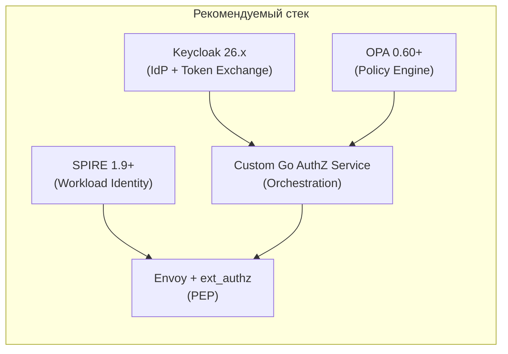
```mermaid
flowchart LR
    subgraph Recommended["Рекомендуемый стек"]
        KC["Keycloak 26.x<br/>(IdP + Token Exchange)"]
        OPA3["OPA 0.60+<br/>(Policy Engine)"]
        SPIRE3["SPIRE 1.9+<br/>(Workload Identity)"]
        Envoy2["Envoy + ext_authz<br/>(PEP)"]
        Custom["Custom Go AuthZ Service<br/>(Orchestration)"]
    end

    KC --> Custom
    OPA3 --> Custom
    SPIRE3 --> Envoy2
    Custom --> Envoy2
```

**Обоснование выбора:**

| Компонент | Причина выбора |
|-----------|----------------|
| **Keycloak** | Полная поддержка Token Exchange (RFC 8693), FreeIPA интеграция, enterprise-ready |
| **OPA** | Стандарт для cloud-native authorization, native Envoy интеграция, Rego flexibility |
| **SPIRE** | Production-proven SPIFFE implementation, Envoy SDS поддержка |
| **Custom Go Service** | Полный контроль над orchestration, caching, metrics |

### 17.6. Альтернативные архитектуры

#### Вариант A: Ory Stack

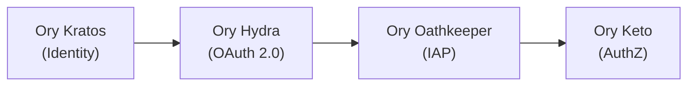
```mermaid
flowchart LR
    Hydra["Ory Hydra<br/>(OAuth 2.0)"] --> Oathkeeper2["Ory Oathkeeper<br/>(IAP)"]
    Oathkeeper2 --> Keto["Ory Keto<br/>(AuthZ)"]
    Kratos["Ory Kratos<br/>(Identity)"] --> Hydra
```

**Плюсы:** Единая экосистема, Go-based, cloud-native
**Минусы:** Нет Token Exchange из коробки, требует FreeIPA интеграцию

#### Вариант B: Permify + Keycloak

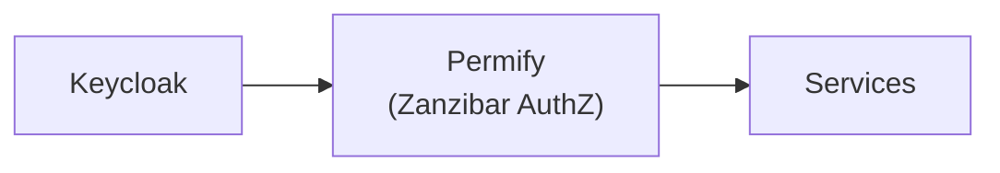
```mermaid
flowchart LR
    KC2["Keycloak"] --> Permify2["Permify<br/>(Zanzibar AuthZ)"]
    Permify2 --> Services["Services"]
```

**Плюсы:** Современный ReBAC, масштабируемость
**Минусы:** Молодой проект, меньше production опыта

#### Вариант C: Managed Services

| Service | Provider | Описание |
|---------|----------|----------|
| **Auth0** | Okta | Managed IdP + FGA |
| **AWS Cognito** | AWS | Managed IdP |
| **Google Cloud IAM** | GCP | Managed IAM |
| **Ory Network** | Ory | Managed Ory stack |

**Плюсы:** Нет operational overhead
**Минусы:** Vendor lock-in, compliance concerns, стоимость

---

## История изменений

| Версия | Дата | Автор | Изменения |
|--------|------|-------|-----------|
| 1.0 | - | - | Исходный документ |
| 2.0 | 2024-12-17 | Claude | Добавлены: аудит, метрики, диаграммы, уточнения, референсы |
| 2.1 | 2024-12-17 | Claude | Добавлен раздел 17: Готовые решения и альтернативы |
